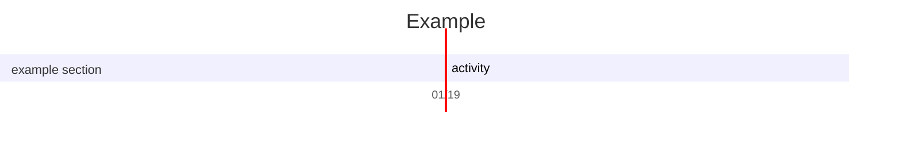
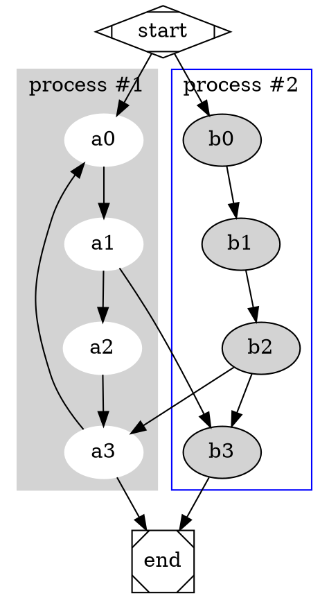

# Personal WIKI
Here resides all information gandered through the ages concerning software development. This include knowledge about web development, linux, information security and other topics. The material is composed by notes that are scattered in an directory tree that is organized by subject. 


All files are in `MarkDown` format which is a lightweight markup language that allows plain text formating. The reason for it was that these plain text files are easily searchable with fuzzy finders and grep commands, which makes information queries really easy.

An example for this was made when configuring rofi to search for these notes. This was made with a simple `bash` command:

```bash
ls -R ~/notes | grep -v README | grep .md | sed "s/;/ /g" | rofi -dmenu -p "Open"
```

Which open the chosen note in `Neovim` for editing or reading. And it's possible to convert these notes to `PDF` as well if required with `Pandoc`:


The dot files are located in this [Repo](https://github.com/felipejoribeiro/my-dev-environment).

## Table of contents
Here goes all subjects and files that are present in the repo:

- Arch linux
- React
- Node
- Redux
- Git
- Nvim
- PostgreSQL
- html
- css

## Authorship
All words here were written by myself and were based in a multitude of fonts that range from `Youtube` videos to `books` and academic `articles`. But, as these notes are intended for personal usage, rarely these fonts are mentioned in the text, only when strictly necessary for future research.

@startuml
Bob -> Alice : hello
@enduml

``` plantuml
Bob -> Alice : hello
```



``` sequence-diagrams
Andrew->China: Says
Note right of China: China thinks\nabout it
China-->Andrew: How are you?
Andrew->>China: I am good thanks!
```

``` chart
{
  "type": "pie",
  "data": {
    "labels": [
      "Red",
      "Blue",
      "Yellow"
    ],
    "datasets": [
      {
        "data": [
          300,
          50,
          100
        ],
        "backgroundColor": [
          "#FF6384",
          "#36A2EB",
          "#FFCE56"
        ],
        "hoverBackgroundColor": [
          "#FF6384",
          "#36A2EB",
          "#FFCE56"
        ]
      }
    ]
  },
  "options": {}
}
```
## Contributing
If you which to contribute fell free to send a pull request. New information, revisions or corrections are welcome and it will be a pleasure having you in the contributors page.

## Licenses
[MIT](https://github.com/felipejoribeiro/this-person-docs/blob/main/LICENSE)
