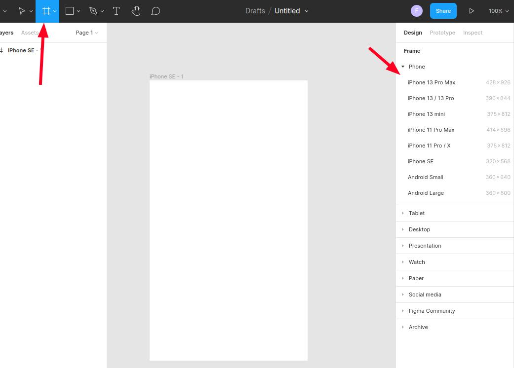

# Basic figma tools
Here we will discuss the basic tools that one have available to create user interfaces on figma.

- **Frame**: Basically they are screens, or pages. So if you create an app **UI**, you will create a frame of the size of the chosen phone screen. There are some premade sizes when you click on the frame tool, they are divided on various categories. You can determine the size in pixels as well if you prefer.

- **Text**: This is the text tool and it can be used by clicking or clicking and dragging. The first one creates a box that lets you write for ever without boundary limitations, and th drag option will try to contain the text on the determined area. You can put **zero** on the value to set the font size to **auto**, and change the value with the arrows keys or clicking and dragging with the mouse.
