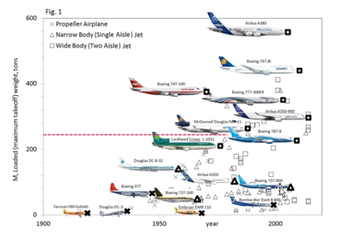

## Aula inaugural
As aulas teóricas serão ofertadas pelo Francisco, enquanto as práticas serão feitas pelo professor Odenir.
O foco estará nos fundamentos da aerodinâmica e do arrasto em aerofólio. Queremos saber as forças e momentos sobre os componentes da aeronave.
A teoria é aplicável a qualquer componente. A asa é muito boa. Mas se temos superfícies rombudas as teorias começam a falhar um pouco, mas elas tem mais de 50 anos e continuaremos usando por muito tempo.
Nosso objetivo é que tenhamos a capacidade de analisar essas forças em situação de projeto e perícia.
Podemos usar muitos dos conceitos aqui no automobilismo.

Nessa primeira aula olharemos a ementa. Depois disso revisaremos mecânica dos fluidos e então iremos aos fundamentos da aerodinâmica. Veremos vorticidade, corrente, centro de pressão, Bernoulli e depois veremos os conceitos que não foram apresentados em mecânica dos fluidos. 

Então começaremos a analisar aerofólios, veremos as famílias de aerofólios e ferramentas para análise de aerofólios. A aerodinâmica assa - fuselagem é bem complicado e é um problema enfrentado pela indústria. Veremos o motivo.

Passaremos então pelos estabilitadores super sustentadores.

São 5 aulas práticas. Veremos a calibração do túnel de vento, depois veremos a distribuição de pressão sobre um cilindro circular. Veremos o arrasto de corpos rombudos. Depois avaliação das forças aerodinâmicas e concluiremos com um ensaio aerodinâmico completo.

Teremos listas para fazer pela semana e na sexta será sorteado uma pessoa para resolver alguns exercícios.
A organização será feita pelo moodle.

Teremos atividades assíncronas que terá metade da carga horária. Teremos aula toda quarta. Na sexta se sugere que façamos os exercícios. Teremos duas semanas para fazer cada lista. Semana sim, semana teremos atividade avaliativa onde serão sorteados alunos para resolver a atividade.
Cada aluno acabará sendo sorteado duas vezes e isso será a avaliação da matéria. Essas duas questões resultarão em 80 pontos para o aluno. A cada 15 dias haverá aula experimental. Será dado 20 pontos para esses relatórios. Será um relatório em grupo.

## Introdução a aerodinâmica aplicada
Com o tempo o aumento do peso dos aviões cresceu exponencialmente.
Hoje em dia tempos o A380 que decola com mais de 580 toneladas.

Esse avião foi criado para voos longos e para muitos passageiros.
Só foram vendidos 250 aviões destes tornando esse empreendimento não muito lucrativo.
Nesse meio tempo tivemos uma evolução muito rápida dos materiais, motores e capacidade computacional para desenvolvimento do projeto.
Hoje em dia se fala muito em se usar asa laminares.
Gostaríamos que o fluido fique laminar pois o turbulento suga muita energia.
A ideia é criar asas que não perturbem o fluido ao redor ao ponto de torná-lo turbulento.
Apesar de ser uma tecnologia mt boa é muito cara. Assim, a eficiência ganha deve justificar o custo de desenvolvimento e implementação da nova tecnologia.

Mais um exemplo da evolução. Víamos velocidades de $370 km/h$ a $8500 ft$ e hoje vemos $954 km/h$ a $35000 ft$. Uma evolução surpreendente de altura e velocidade. Dentre as causas dessa evolução, de um ponto de vista aerodinâmico podemos observar a evolução das asas. O surgimento das asas elípticas foi algo determinante e possibilitado pelas novas técnicas de produção.

Outra área muito importante é a ecoacústica. Isso também é muito importante na questão dos drones. O ruído incomoda muito as pessoas. Mas vimos também trabalhos relacionados a isso nos motores de aviões mais modernos. Existem geometrias cerrilhadas no motor projetadas para atenuar o barulho dele.

A aerodinâmica também está no ramo da produção de energia no desenvolvimento de turbinas eólicas. Apesar de serem um método de produção de energia muito limpa ainda vemos a poluição sonora ser um aspecto notável da tecnologia.

Na construção civil também tamos a aerodinâmica como um fator determinante na altura máxima possível que um prédio pode ter dado o material de construção.

Dentre as novas tendências nós vemos asas adaptativas, morphing wings, aerodinâmica de rotores (e-vtol), Dispositivos hipersustentadores para baixa e alta velocidade, integração propulsiva (supersônico e hipersônico), validação de códigos CFD e controle de escoamento laminar.
