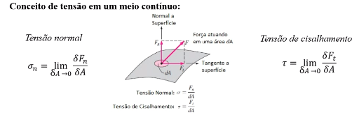
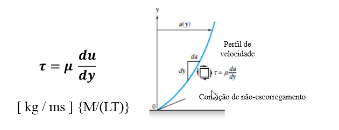
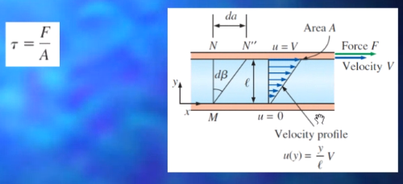
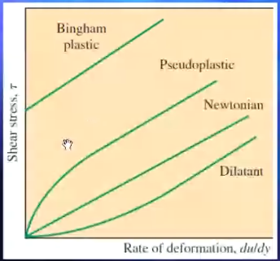
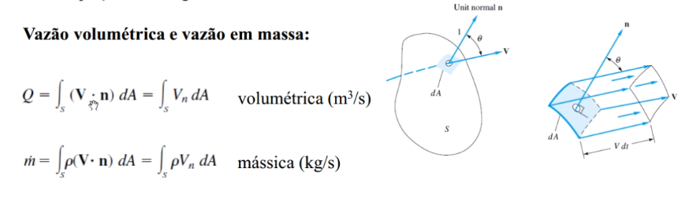

# Revisão de mecânica dos fluidos
O campo de velocidade $V$ interage com as propriedades termodinâmicas do fluido. As três mais comuns dessas propriedades são:

- Pressão, $p$
- Massa específica, $\rho$
- Temperatura, $T$

Quatro outras propriedades termodinâmicas tornam-se importantes quando balanços de trabalho, calor e energia são tratados:

- Energia interna, $u$
- Entalpia, $h = u + p/\rho$
- Entropia, $S$
- Calores específicos, $C_p$ e $C_V$

Efeitos de condução de calor e atrito são regidos pelas duas propriedades chamadas propriedades de transporte.

- Coeficiente de viscosidade
- Condutividade térmica

Num fluido em movimento (escoamento), cada partícula pode sofrer a ação de:

- forças de superfícies (pressão, atrito), que são geradas pelo contato com outras partículas ou com superfícies sólidas.
- forças de campo ou de corpo, tais como forças da gravidade e eletromagnética, que agem através do espaço.

Podemos entender as forças de superfície da seguinte forma:

Um fluido em contato direto com um sólido gruda na superfície devido aos efeitos viscosos e não há escorregamento. Tal fato é conhecido como condição de não-escorregamento (no-slip condition).

A consequência é que o fluido quanto mais se aproxima da superfície sólida mais se aproxima da velocidade da superfície sólida.

Há três modos básicos de atacar um problema de escoamento de um fluido:

- Volume de controle, ou análise integral
- Sistema infinitesimal, ou análise diferencial
- Estudo experimental, ou análise dimensional

Em todos os casos, o escoamento deve satisfazer às três leis básicas da mecânica mais a relação de estado termodinâmico e as condições de contorno associadas:

- Conservação de massa (lei da continuidade)
- Quantidade de movimento linear (segunda lei de Newton)
- Primeira lei da termodinâmica (conservação de energia)
- Relação de estado como $\rho = \rho(p,T)$
- Condições de contorno apropriadas nas superfícies sólidas, nas interfaces, nas entradas e saídas.

## Classificações do escoamento
Podemos classificas os fluidos seguindo os seguintes quesitos:
- Permanente ou não permanente (transiente)
- Viscoso ou não viscoso
- Compressível ou incompressível
- Gás vs Líquido

Para um fluido viscoso pode-se caracterizar um escoamento como laminar ou turbulento. E além de tudo isso, escoamentos viscosos ou não viscosos podem ainda ser caracterizados como internos (confinados) ou externos.

Adiante podemos ver conceito da velocidade e viscosidade:

Existem alguns comportamentos associados à viscosidade.

A viscosidade cinemática não é medida com unidade de força, por isso é definida como cinemática.

## Quatro leis básicas para os nossos estudos

- Conservação da massa
- A relação de quantidade de movimento linear
- A relação de quantidade de movimento angular
- A equação da energia

