# Resolução da quarta lista
Aluno: Felipe J. O. Ribeiro

### Questão 1
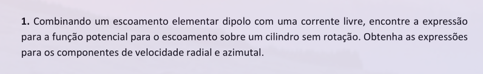

### Questão 2

### Questão 3
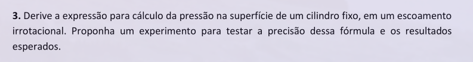

### Questão 4
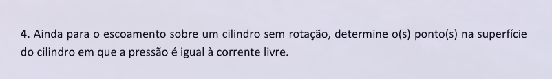

### Questão 5
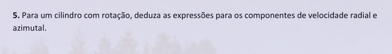

### Questão 6
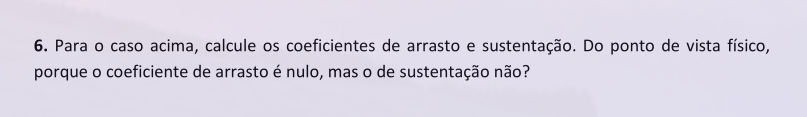

### Questão 7
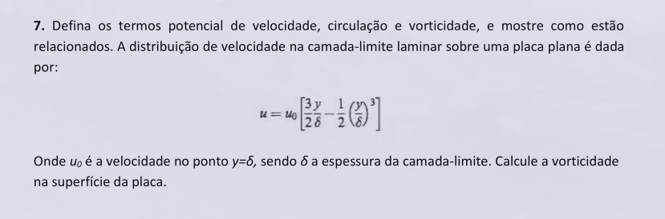

- Potencial de velocidade: É uma escalar potencial usada na teoria do escoamento potencial. Matematicamente pode ser descrita como:

$
u = \nabla \Phi = \frac{\partial \Psi}{\partial x} \vec{i} +  \frac{\partial \Psi}{\partial y} \vec{j} +  \frac{\partial \Psi}{\partial z} \vec{k}
$

- Circulação: É definido como a integral de linha no sentido antihorário ao redor de uma curva $C$ multiplicado pela velocidade tangente à curva. Também, pelo teorema de Stokes, pode ser definido como o fluxo de vorticidade pela estremidade da curva. Matematicamente pode ser descrito como:

$
\Gamma = \oint_{\partial s} V . dl = \int \int_S \nabla x V . dS = \int \int_S w. dS
$

- Vorticidade: Descreve a movimentação giratória local.

$
w = curl V = \frac{\partial^2 \psi}{\partial x^2} + \frac{\partial^2 \psi}{\partial y^2} + \frac{\partial^2 \psi}{\partial z^2}
$

O escoamento sobre a placa só possui velocidade em uma direção $x$ e ele só varia na direção $y$. Dessa forma, podemos definir a vorticidade como segue:

$
Curl \vec{V} = (\frac{\partial w}{\partial y} - \frac{\partial v}{\partial z})\vec{i} + (\frac{\partial u}{\partial z} - \frac{\partial w}{\partial x})\vec{j} + (\frac{\partial v}{\partial x} - \frac{\partial u}{\partial y})\vec{k}
$

$
Curl \vec{V} = \frac{\partial u}{\partial z}\vec{j} - \frac{\partial u}{\partial y}\vec{k}
$

$
Curl \vec{V} = - \frac{\partial u}{\partial y}\vec{k}
$

Assim, podemos definir a vorticidade para esse caso como $\frac{\partial u}{\partial y}$. Assim, usando da expressão fornecida na questão para definir a velocidade em função de y, temos:

$
u = u_0 [\frac{3}{2}\frac{y}{\delta} - \frac{1}{2} (\frac{y}{\partial})^3]
$

Assim, aplicando a expressão da vorticidade:

$
curl V = \frac{\partial}{\partial y}( u_0 [\frac{3}{2}\frac{y}{\delta} - \frac{1}{2} (\frac{y}{\partial})^3])
$

$
curl V = \frac{3 u_0}{2\delta} - \frac{3 u_0 y^2}{2 \partial^3}
$

Que na parede temos $y = 0$ o que nos leva a um valor de vorticidade de:

$
curl V|_{y=0} = \frac{3 u_0}{2\delta}
$

### Questão 8
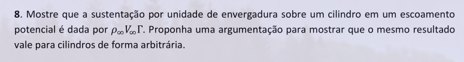

### Questão 9
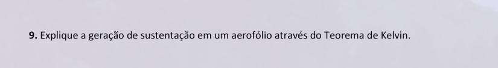

### Questão 10
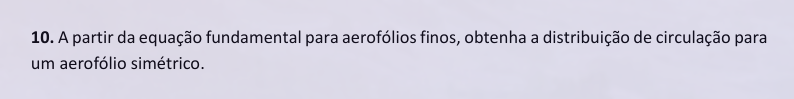

### Questão 11
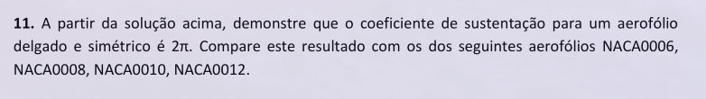

### Questão 12
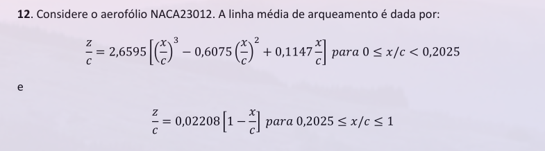
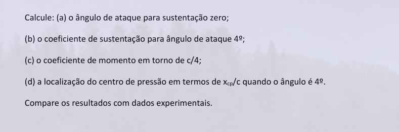
