## Segunda lista de exercícios de aerodinâmica aplicada

### 1 - Primeira questão
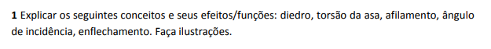

- Diedro: Rotação da asa ($\theta$) ao redor do eixo longitudinal da aeronave. Este valor é igual a zero quando as asas encontram-se na horizontal. Sua função é alterar a estabilidade da aeronave, de modo que quando $\theta$ é positivo tem-se uma aeronave mais estável e quando $\theta$ é negativo tem-se uma aeronave menos estável. Além das asas isso pode ser feito coma empenagem também.

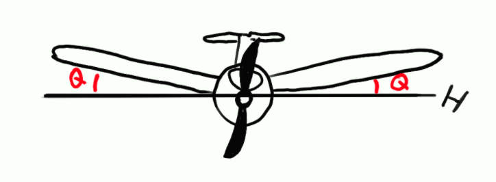

- Torção da asa: Parâmetro da asa que descreve a rotação da corda do perfil aerodinâmico ao redor do eixo da asa. Existem duas formas de torção da asa, sendo _wash in_ a condição em que a ponta da asa gira no sentido horário ($\theta$ positivo) em relação à base, e a _wash out_ em que ela gira no sentido anti horário ($\theta$ negativo).

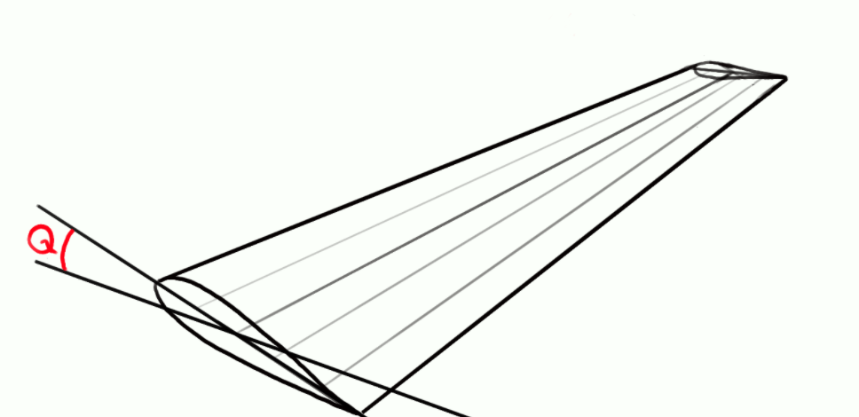

- Afilamento: Redução no tamanho da corda da asa. Essa redução causa uma diminuição no coeficiente de arrasto que diminui o vortex de ponta de asa.

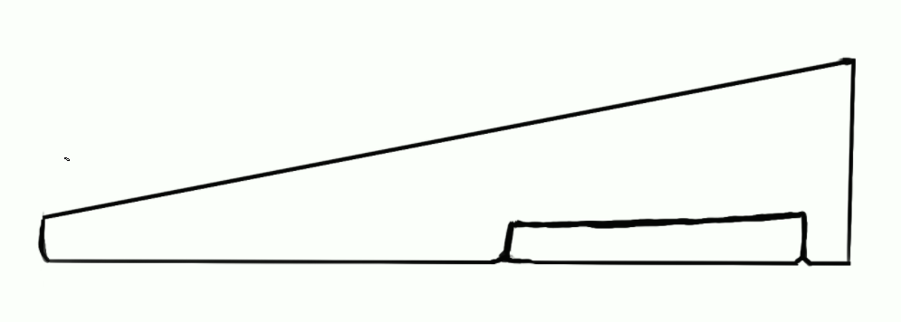

- Ângulo de inclinação: Estabelece o ângulo entre a corda da asa e o eixo longitudinal da aeronave.

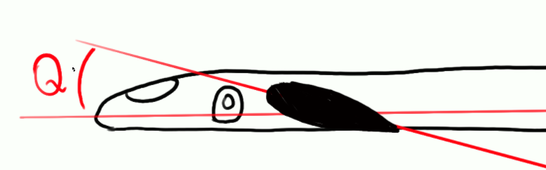

- Enflechamento: Angulo entre o a linha do bordo de ataque da asa e o eixo lateral do avião (perpendicular ao longitudinal).

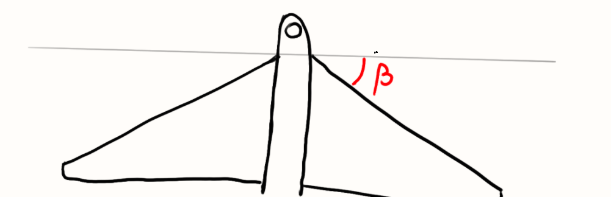

### 2 - Segunda questão

Uma vez que as superfícies de controle de rolagem (ailerons) encontram-se nas pontas das asas, é importante que elas entrem em stall depois da raiz da asa, o que possibilita manobras mesmo em situações parciais de stall. Para esse fim, torção da asa é utilizada para que o stall ocorra de forma progressiva pela asa e possibilite reações frente a situações de stall.

### 3 - Terceira questão

O mais utilizado são os lemes, que possibilitam curvas ho sentido horizontal de voo. Mas os ailerons também são usados uma vez que manobras de rolagem também podem resultar em curvas.

### 4 - Quarta questão

Este ângulo de incidência costuma ser negativo. O motivo para tal é para que o estabilizado horizontal entre em regime de stall após as asas. Isso é importante um vez que cria uma tendência de embicar a aeronave em situações de stall uma vez que a sustentação na parte traseira da aeronave demora mais para cair. Isso torna o processo de recuperação do stall mais plausível.

### 5 - Quinta questão

A guinada adversa é a tendencia natural da aeronave de guinar na direção contrária da rolagem. Isso ocorre devido às diferenças de arrasto causadas nas asas devido às deflexões ascendentes e descendentes dos ailerons. Tal tendência deve ser combatida com o leme da aeronave.

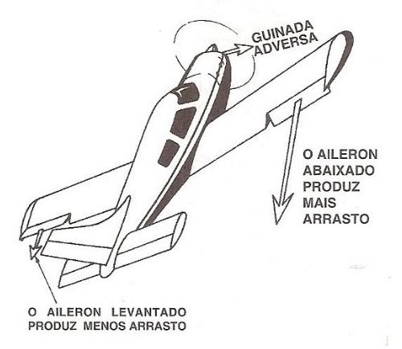

### 6 - Sexta questão

O diedro é usado para criar o "efeito diedro". Esse efeito causa uma movimentação lateral no momento que em que uma aeronave realiza uma operação de roll. Essa movimentação lateral causa uma mudança de direção no vento relativo que, devido ao diedro positivo, tem um maior ângulo de incidência na asa que está mais baixa, causando um roll no sentido contrário. Essa resposta sempre aponta para o posicionamento natural da aeronave, tornando ela mais estável.

### 7 - Sétima questão

Os motores costumam ser posicionados no intradorso. Isso é feito para diminuir o arrasto e melhorar a performance, uma vez que quando colocada no extradorso, ele cria uma esteira que afeta as superfícies de controle da aeronave. Outro motivo é o de diminuir o centro de gravidade da aeronave, uma vez que os motores são componentes muito pesados e tê-los mais para baixo significa uma aeronave mais estável.

### 8 - Oitava questão
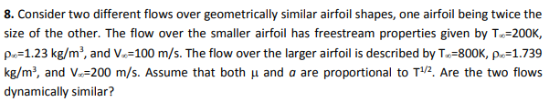

Para o aerofólio 1 temos:

- $T_\infin = 200K$
- $\rho_{\infin} = 1,23 kg/m^3$
- $V_\infin = 100 m/s$
- L

Enquanto que para o aerofólio 2 temos:

- $T_\infin = 800K$
- $\rho_{\infin} = 1,739 kg/m^3$
- $V_\infin = 200 m/s$
- 2 * L

Assim, aplicando a definição do número de Reynolds:

$
Re = \frac{V_\infin \rho_\infin L}{\mu}
$

Que aplicando nos dois aerofólios nos dá:

$
Re_1 = \frac{100 * 1,23 L}{c * 200^{1/2}} = 8,697 L/c
$

$
Re_2 = \frac{200 * 1,739 * 2 L}{c * 800^{1/2}} = 24,593 L/c
$

Assim vemos que os números de Reynolds dão diferentes. Ou seja, são dinamicamente diferentes.

### 9 - Nona questão
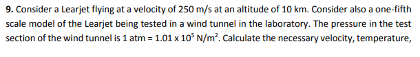

Temos que :
- $T_\infin = 223,25 k $
- $P_\infin = 26,52 KPa$
- $\rho_\infin = \frac{P_\infin}{0,2864 T_\infin} = 0,414 kg/m^3$
- $P_T = 26,52 KPa$
- $\rho_T = \frac{P_T}{0,2864 T_T}= 365,85kg/m^3$
- $L_\infin = 5 L_T$

Considerando que a situação dinâmica é parecida, podemos igualar os números de Reynolds:

$
Re_\infin = \frac{250 * 0,414 * 5 L}{c * 223,25^{1/2}} = 34,64 L_T/c
$

$
Re_T = \frac{V_T * \rho_T * L}{c * \sqrt{T_T}} = 34,64 L_T/c
$

Assim, igualando ambos, temos a seguinte relação:

$
V_T \rho_T = 34,64 \sqrt{T_T}
$

Como $M_T = M_\infin$:

$
\frac{V_T}{\sqrt{K R T_T}} = \frac{V_\infin}{\sqrt{K R T_\infin}} \rightarrow V_T = V_\infin \frac{\sqrt{T_T}}{\sqrt{T_\infin}} \rightarrow \frac{V_T}{\sqrt{T_T}} = 16,7
$

Com isso, podemos concluir que:

$
\rho_T = \frac{34,64}{16,7} = 2,074 kg/m^3
$

$
T_T = \frac{365,85}{\rho_T} = 176,4 K
$

$
V_T = \frac{250 \sqrt{T_T}}{\sqrt{223,25}} = 222,22 m/s
$

### 10 - Décima questão
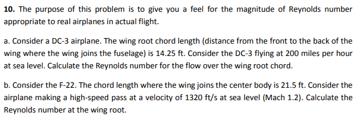
Para a primeira pergunta temos:

- $Cr = 14,25 ft = 4,34 m$
- $V = 200 miles/h = 89,41 m/s$
- $h = 0$, ou seja, $1,225 kg/m^3$ e $\mu = 17,2 * 10^{-6} N/m^2s$

Assim, calculando o Reynolds:

$Re = \frac{V * cr * \rho}{\mu} = 2,76 * 10^7$

Para a segunda pergunta temos:

- $Cr = 21,5 ft = 6,55 m$
- $V = 1320 ft/s = 402,34 m/s$
- $h = 0$, ou seja, $1,225 kg/m^3$ e $\mu = 17,2 * 10^{-6} N/m^2s$

Assim, calculando o Reynolds:

$Re = \frac{V * cr * \rho}{\mu} = 1,88 * 10^8$

### 11 - Décima primeira questão
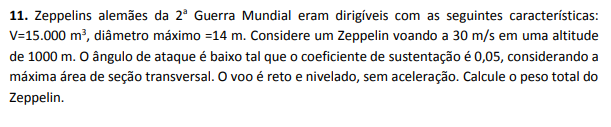

Temos as seguintes informações:

- $V = 15000 m^3$
- $D_{máx} = 14m$
- $v = 30 m/s$
- $h = 1000m$ que nos dá $T_\infin = 281,7K$, $P_\infin = 90,04KPa$ e $\rho_\infin = 1,114 Kg/m^3$

A partir da ilustração vemos que podemos fazer um balanço de forças, uma vez que a aceleração na direção das forças é igual a zero. 

$P = L + B$

Para calcular o lift temos:

$L = C_L \rho/2 A V^2 = 3,86*10^3 N$

$B = \rho g V = 1,114 * 9,81 * 15000 = 1,64 * 10^5 N$

$P = 167860N$
