# Terceira lista de exercícios
Aqui está a resolução da terceira lista de exercícios.

## 1 - Primeira questão
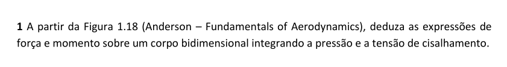

A partir da imagem:

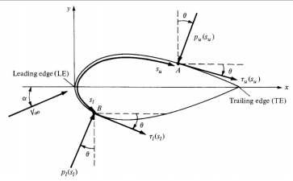

Podemos ver as componentes de força:

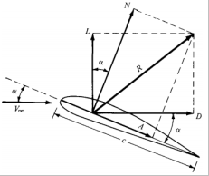

Assim, temos R como a força resultante, sustentação $L$, arrasto $D$, força normal $N$ e axial $A$.

Como a sustentação é definida como perpendicular e o arrasto paralelo ao vento relativo, pode-se relacionar com as forças normal e axial:

$
L = N \cos(\alpha) - A \sin(\alpha)
$

$
D = N \sin(\alpha) + A \sin(\alpha)
$

Para encontrar o momento e a força é necessário integrar a distribuição de pressão e tensão de cisalhamento al longo do perfil. A força e momento de um elemento pode ser definido como segue.

Para a parte superior do perfil, sendo $p_u$ do elemento superior e $t_u$, tensão de cisalhamento superior. A força é uma função da área elementar(dS), para o perfil 2D é definido para uma unidade de envergadura, sendo $dS = ds * (1)$;

$
dN^\prime_u = -p_uds_u\cos\theta - \tau_uds_u\sin\theta
$

$
dA^\prime_u = -p_uds_u\sin\theta + \tau_uds_u\cos\theta
$

Para a parte inferior do perfil a contribuição da pressão é positiva, para seguir a convenção do sentido horário:

$
dN^\prime_l = p_lds_l\cos\theta - \tau_lds_l\sin\theta
$

$
dA^\prime_l = p_lds_l\sin\theta + \tau_lds_l\cos\theta
$

As forças normal e axial total é obtida integrando do bordo de ataque ao bordo de fuga.

$
N^\prime = - \int^{TE}_{LE}(p_u \cos\theta + \tau_u \sin\theta)ds_u + \int^{TE}_{LE}(p_l \cos\theta - \tau_l \sin\theta)ds_l 
$

$
A^\prime = \int^{TE}_{LE}(- p_u \sin\theta + \tau_u \cos\theta)ds_u + \int^{TE}_{LE}(p_l \sin\theta + \tau_l \cos\theta)ds_l 
$

A sustentação e arrasto total pode ser obtida inserindo as relações das primeiras equações nessas últimas. O momento exercido sobre um corpo depende do ponto onde o momento está sendo considerado. Considerando esse ponto como o bordo de ataque o elemento de momento por unidade de envergadura fica:

$
dM^\prime_u = (p_u \cos\theta + \tau_u\sin\theta)x ds_u + (-p_u \sin\theta + \tau_u \cos\theta)y ds_u
$

$
dM^\prime_l = ( - p_l \cos\theta + \tau_l\sin\theta)x ds_l + (p_l \sin\theta + \tau_l \cos\theta)y ds_l
$

Sendo a primeira equação para a parte superior e a segunda para a parte inferior do perfil aerodinâmico. De modo similar para as forças, o momento total é obtido integrando do bordo de ataque ao do fuga.

$
M^\prime_{LE} = \int^{TE}_{LE} [(p_u \cos\theta + \tau_u \sin\theta)x - (p_u \sin\theta - \tau_u \cos\theta)y]ds_u +\int^{TE}_{LE} [(-p_l \cos\theta + \tau_l \sin\theta)x + (p_l \sin\theta + \tau_l \cos\theta)y]ds_l 
$

Nas equações anteriores $\theta$, $x$ e $y$ são obtidos a partir do formato do perfil a ser analisado.

## 2 - Segunda questão

Podemos definir os coeficientes como segue:

- Coeficiente de lift: $C_l = \frac{L}{q_\infin S}$
- Coeficiente de drag: $C_d = \frac{D}{q_\infin S}$
- Coeficiente de normal: $C_n = \frac{N}{q_\infin S}$
- Coeficiente de axial: $C_a = \frac{A}{q_\infin S}$
- Coeficiente de momento: $C_m = \frac{M}{q_\infin S}$

Como nosso escoamento é bidimensional, os coeficientes podem ser definidos em função da corda:

- $C_l = \frac{L^\prime}{q_\infin c}$

- $C_d = \frac{D^\prime}{q_\infin c}$

- $C_m = \frac{M^\prime}{q_\infin c^2}$

Onde a pressão dinâmica pode ser definida como:

$
q_\infin \equiv \frac{1}{2} \rho_\infin V^2_\infin
$

## 3 - Terceira questão
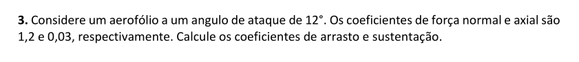

Podemos definir $cl$ e $cd$ nos eixos aerodinâmicos como segue:

$
C_l = C_n \cos(\alpha) - C_a \sin(\alpha)
$

$
C_d = C_n \sin(\alpha) + C_a \cos(\alpha)
$

Bastar substituir os valores fornecidos para encontrar os coeficientes de arrasto e sustentação:

$
cl = 1,2 \cos(12^o) - 0,03 \sin(12^o) = 1,1675
$

$
cd = 1,2 \sin(12^o) + 0,03 \cos(12^o) = 0,2788
$

## 4 - Quarta questão
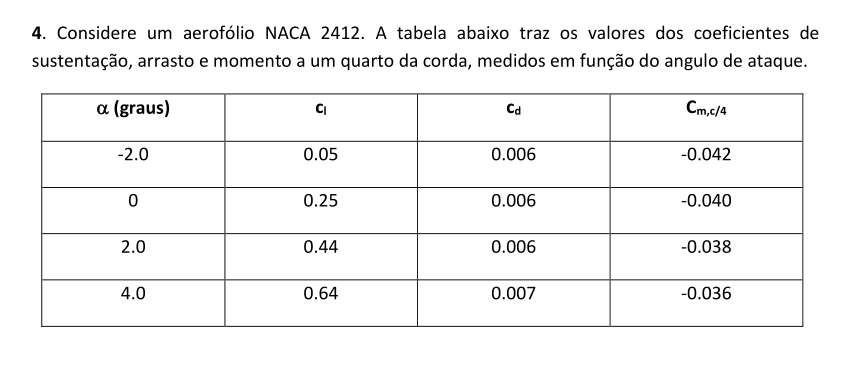
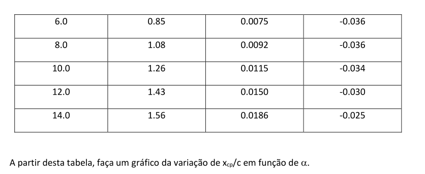

Para achar o centro de pressão podemos somente aplicar a fórmula:

$
\frac{X_{cp}}{c} = \frac{1}{4} - \frac{c_{m,c/4}}{cl}
$

Dessa forma, conseguimos a localização em $X_{cp}/c$.

Plotando-se esses resultados:

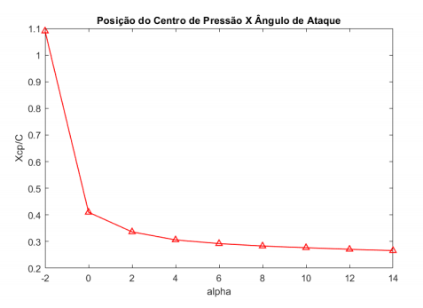

## 5 - Quinta questão
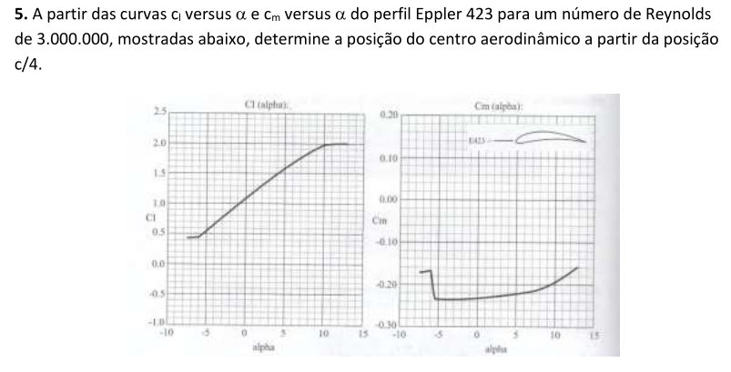

Podemos calcular a posição do centro aerodinâmico usando:

$
\frac{x_{ac}}{c} = \frac{\frac{d*c_{mc/4}}{d\alpha}}{\frac{d_{cl}}{d\alpha}} = - \frac{m_o}{a_o}
$

Onde:

$
a_o = \frac{d_{cl}}{d_\alpha} = \frac{c_{l2} - c_{l1}}{\alpha_{2} - \alpha_{1}} = \frac{1,6 - 0,55}{5^o + 5^o} = 6/rad
$

$
m_o = \frac{c_{m2} - c_{m1}}{\alpha_{2} - \alpha_{1}} = \frac{-0,21 + 0,23}{7^o - 2^o} = 0,229/rad
$

Assim sendo, podemos achar a posição do centro aerodinâmico com:

$
\frac{x_{ac}}{c} = - \frac{m_o}{a_o} = - \frac{0,229}{6} = -0,038
$

Então, podemos dizer que, de forma percentual temos: $0,38 \%$ a frente do ponto de um quarto de corda.

 6 - Sexta questão
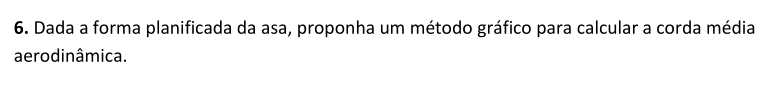

Podemos fazer isso com o seguinte diagrama:

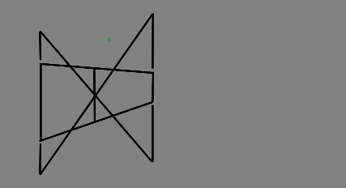

## 7 - Sétima questão

As forças aerodinâmicas que atuam sobre um corpo insidem sobre o centro de pressão. Um componente muito importante é o da força de arrasto que sempre aponta no sentido contrário ao do movimento. Dessa forma, quando temos um centro de pressão na traseira do corpo, a força de arrasto cria componentes que restauram. Por outro lado, se o centro de pressão está no fronte, qualquer inclinação faz a força de arrasto gerar componentes no mesmo sentido dessa rotação. Equilibrar um movimento assim é como equilibrar um pêndulo invertido. Seguem as imagens:

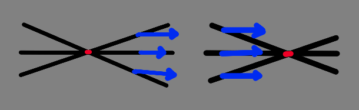

## 8 - Oitava questão

Considera-se um regime irrotacional e incompressível.

- $u = \frac{\partial\psi}{\partial y}$
- $v = - \frac{\partial \psi}{\partial x}$

Assim, substituindo na equação da continuidade:

$
\frac{\partial u}{\partial x} + \frac{\partial v}{\partial y} = 0
$

$
\frac{\partial^2 \psi}{\partial x\partial y} - \frac{\partial^2 \psi}{\partial y\partial x} = 0
$

Enquanto nas coordenadas cilíndricas temos:

- $u_r = \frac{1}{r}\frac{\partial\psi}{\partial \theta}$
- $u_\theta = - \frac{\partial \psi}{\partial r}$

E observando a continuidade:

$
\frac{1}{r}\frac{\partial r u_r}{\partial r} + \frac{1}{r} \frac{\partial u_\theta}{\partial \theta} = 0
$

E substituido:

$
\frac{1}{r}\frac{\partial(r \frac{1}{r} \frac{\partial \psi}{\partial \theta})}{\partial r} + \frac{1}{r} \frac{\partial - \frac{\partial \psi}{\partial r}}{\partial \theta} = 0
$

$
\frac{1}{r}\frac{\partial^2\psi}{\partial \theta\partial r} - \frac{1}{r} \frac{\partial^2 \psi}{\partial r \partial \theta} = 0
$

## 9 - Nona questão
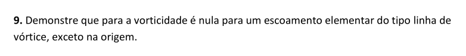

A velocidade induzida por um vortex é igual a:

$
\vec{V} = 0 \vec{e}_r + u_\theta + 0 \vec{e}_z
$

Em um escoamento bidimensional irrotacional $\nabla X V = 0$ e $u_z = 0$:

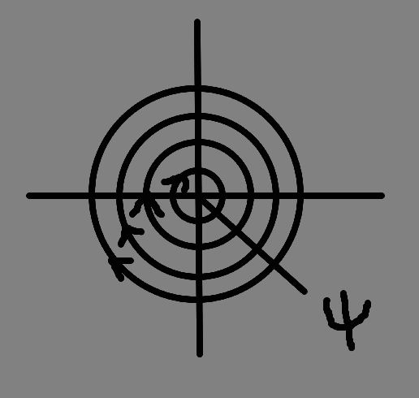

considerando um escoamento bidimensional:

$
\nabla X \vec{V} = (\frac{1}{r}\frac{\partial u_z}{\partial \theta} - \frac{\partial u_\theta}{\partial z})\vec{e}_r + (\frac{\partial u_r}{\partial z} - \frac{\partial u_z}{\partial r})\vec{e}_q + (\frac{1}{r}\frac{\partial (r u_\theta)}{\partial r} - \frac{1}{r}\frac{\partial u_r}{\partial \theta})\vec{e}_z
$

Por ser bidimensional e $u_z = 0$:

$
\nabla X \vec{V} =\frac{\partial (r u_\theta)}{\partial r} - \frac{\partial u_r}{\partial \theta}
$

Como temos um escoamento de simetria radial podemos dizer que $\frac{\partial u_r}{\partial \theta} = 0$, o que nos deixa com:

$
\nabla X \vec{V} =\frac{\partial (r u_\theta)}{\partial r}
$

Assim, sabemos que $r u_\theta$ deve ser constante para que se satisfaça a condição de irrotacionalidade. Pela definição da velocidade de vortex sabemos:

- $u_\theta = \frac{c}{r}$ 

O que nos diz que isso é uma constante em todo o domínio. Porém isso não ocorre na origem, pois lá a velocidade radial tende a infinito.

## 10 - Décima questão
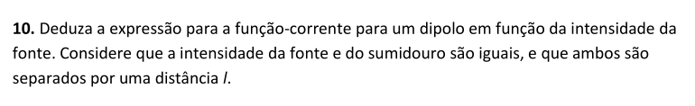

## 11 - Décima primeira questão

## 12 - Décima segunda questão
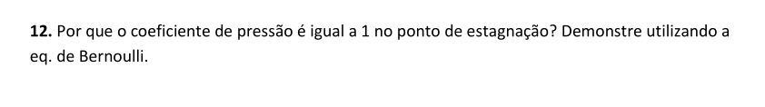

Podemos definir o coeficiente de pressão como:

$
C_p = \frac{p - p_\infin}{\frac{1}{2} \rho U^2}
$

onde:
- $p_\infin$ é a pressão em um ponto remoto do corpo.
- $p$ é a pressão no ponto de análise.

Segundo a equação de Bernoulli, desprezando-se os efeitos da gravidade, temos:

$
\frac{v_1^2}{2} +  \frac{p_1}{\rho} = ctt
$

A velocidade no ponto de estagnação é igual a zero sendo o ponto de maior pressão, assim podemos dizer:

$
p = \rho * ctt
$

Assim, calculando-se para um ponto no infinito, obtemos:

$
p_\infin = \rho * ctt - \frac{\rho U^2}{2}
$

E substituindo na expressão do coeficiente de pressão:

$
C_p = \frac{\rho * ctt - \rho * ctt + \frac{\rho U^2}{2}}{\frac{\rho U^2}{2}}
$

$
C_p = 1
$

## 13 - Décima terceira questão
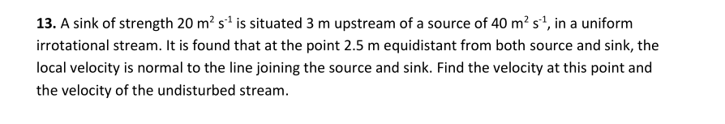

## 14 - Décima quarta questão
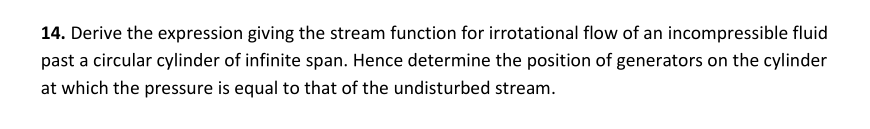

Sabemos que o escoamento é:

- Irrotacional.
- Incompressível.
- Bidimensional.

Isso nos garante que existe uma função corrente. Também nos possibilita usar a equação da continuidade.

Assim, consideramos um cilindro de centro sobre a origem do sistema cartesiano e de raio $R$. O fluido que encontra-se sobre ele possui velocidade, no infinito, horizontal igual a $U$ e flui no sentido positivo de $X$. E podemos ver que existem dois pontos de estagnação que se encontram encostados no cilindro sobre o eixo cartesiano $X$, conforme a figura:

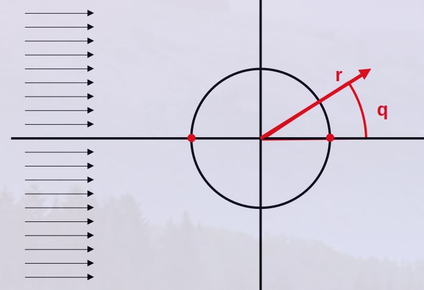

É possível observar que essa função pode ser descrita como a superposição de um escoamento livre horizontal com um escoamento dipolo, isso nos permite escrever:

$
\psi = \psi_{\text{corrente uniforme}} + \psi_{\text{fonte cavidade}}
$

$
\psi = U_\infin * r * \sin(\theta) -\frac{K}{2\pi} \frac{  \sin(\theta) 
}{r}
$

Podemos definir, a partir do caso dipolo $K = R^2 2 \pi U_\infin$, assim:

$
\psi = U_\infin * r * \sin(\theta) - U_\infin R^2 \frac{  \sin(\theta) 
}{r}
$

Que nos dá a equação de corrente para o cilindro:

$
\psi = U_\infin \sin(\theta)\left(r - \frac{R^2}{r}\right)
$

Para acharmos o local no sistema cartesiano cuja a pressão é igual ao do fluido não perturbado, basta igualarmos as funções correntes da corrente livre com a do cilindro:

$
U_\infin \sin(\theta)\left(r - \frac{R^2}{r}\right) = U_\infin * r * \sin(\theta)
$

se considerarmos que a velocidade no infinito não é nula e que o seno de theta também não é nulo, temos:

$
r - \frac{R^2}{r} = r
$

$
\frac{R^2}{r} = 0
$

Que nos diz que isso só ocorre quando o r tende a infinito. Mas outra solução é com $\theta = 0$ ou $\theta = \pi$, ou seja, sobre o eixo $X$.

