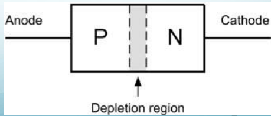
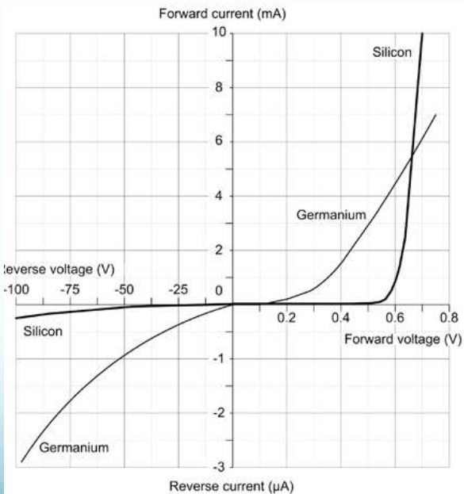
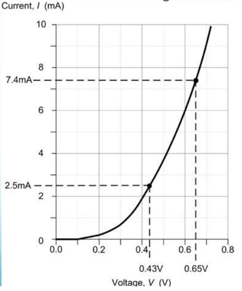

## Semicondutores, resistores e transistors
Nessa aula começaremos a estudar os componentes básicos da eletrônica. A partir desses conhecimentos poderemos aprender sobre circuitos com diodos retificadores. Elas podem ser de meia onda, de onda completa em trafo com tap central, e retificador de onda completa em ponte. Depois falaremos de transistors bipolares, que são diodos controlados. São chaves de liga/desliga, mas são chaves de semi-condutores, isso torna suas vidas úteis muito longas uma vez que não partes móveis, em torno de 15000 horas de alta frequência. Saberemos sobre sua operação, características. Veremos que ele pode dar ganho de corrente. Podemos ligar ele de duas formas: Emissor comum(bolarização pela base) ou polarização do emissor. Também estudaremos dissipação de calor.

Veremos fototransistores também e acopladores ópticos. Veremos amplificadores de tensão e amplificadores de potência. Também temos JFET, Funcionamento, Circuitos de JFET e MOSFET. Como curiosidade, há muitas análises sendo feitas para substituir os atuadores de profundores e lemes de aviões que hoje são feitos de forma hidráulica por motores elétricos. A maior diferença entre transistor e MOSFET é a potência envolvida, que no mosfet é muito maior.

Isso é a primeira parte da disciplina, que consiste em um terço deste curso.

# Introdução
A tradução de sinais analógicos em digitais e vice-versa é algo muito importante, além disso temos ganho e filtragem do sinal. Foram dados dois exemplos de um carro controlando sua bomba de combustível e um avião no controle de um profundor com atuador elétrico. A maior diferença entre sinal analógico e digital é que o analógico passa informação pelo nível de voltagem da corrente contínua, enquanto sinal digital apresenta informações em binário.

Um material pode ser de três tipos quando falamos de condutividade elétrica:

- *Isolante* : Apresentam a última camada de valência inteiramente preenchida. Não há como deslocar elétrons entre os átomos, assim a corrente elétrica nesse tipo de material é limitada. Mesmo em materiais isolantes é possível que haja corrente, se a diferença de potencial e o campo elétrico resultante for suficientemente grande.
- *Condutores* : A última camada não está completamente preenchida e elétrons podem transitar livremente no chamado mar de elétrons que é uma 'camada' compartilhada entre todos os átomos.
- *Semicondutores* : Estes elementos possuem 4 elétrons na última camada de valência. Assim, preenchendo esses elétrons é possível tornar esse material um isolante. Quando inserimos um outro elemento nesse material, processo chamado de (dopagem), isso desequilibra a ligação e permite que o movimento eletrônico ocorra na presença de um campo elétrico. Pode-se usar boro, fósforo, etc... Como base podemos usar silício e germânio.

Quando mais distante estão os elétrons do núcleo mais fácil tirar o elétron. No caso do germânio é maior que a do silício como semicondutor. Apesar disso usamos o silício por ser muito mais abundante no mundo. Componentes eletrônicos a base de silício são muito baratos. Outro exemplo dessa questão de custos é o uso do cobre para ligações elétricas. Usamos porque é barato. Se qualidade é necessária e justificável, pode-se usar ouro.

## Diodos
As impurezas inseridas podem ser trivalentes (tipo P, com excesso de lacunas) ou pentavalentes (tipo N, com excesso de cargas negativas). A junção desses dois tipos de materiais cria o *diodo*.
Esse elemento permite a passagem de corrente somente em um sentido (polarização direta, de p para n) ao oferecer baixíssima resistência nessa direção, enquanto que no sentido contrário há alta resistência com baixa corrente de fuga.

Quando conseguimos fazer a polarização reversa acima da capacidade dele (forçamos a corrente no sentido contrário) isso pode danificar o diodo. Outra coisa que pode danificar ele é o excesso de corrente e consequente efeito joule. Assim temos um limite de corrente de operação e um limite de voltagem que o diodo é capaz de barrar.

Além disso, mesmo no sentido correto, existe uma voltagem mínima necessária para que se crie corrente no diodo, uma convenção internacional que determina que é necessário uma voltagem inicial de $0.7$ volts. Tal voltagem é necessária para que a corrente vença a camada de depleção e se inicie a condução de corrente. 

Mesmo após iniciada a corrente elétrica no diodo, o "custo" de $0.7$ volts para silício continua existindo para se manter a corrente. Assim há uma queda de potencial dessa magnitude na corrente quando ela passa pelo diodo. 

No sentido contrário a barreira cresce para o seu valor máximo (tensão de breakdown). Isso é uma determinação do fabricante. O P é chamado de Ânodo e o N é chamado de Cátodo.

O seguinte gráfico mostra o comportamento do elemento eletrônico diante diferença de potencial em uma "curva característica":

A partir dessa curva é possível calcular a resistência série-equivalente do diodo ($R_D$) para diferentes condições de condução de corrente ($I_F$). A corrente inversa ($I_R$) também é obtida e sempre apresenta valor muito inferior a ($I_F$). A dissipação térmica também nunca pode ultrapassar as especificações técnicas do fabricante.

Semi condutores não são lineares. Diante disso, olhe o seguinte exemplo de cálculo da resistência que é dependente da voltagem e corrente:

Resistência equivalente quando exposta a corrente de $I_F = 2.5mA$:

$R = \frac{V_F}{I_F} = \frac{0.65 V}{2.5 mA} = 172$

A potência dissipada quando $V_F = 0.65V$.

$R = \frac{V_F}{I_F} = \frac{0.65V}{7.4mA} = 88$

$P_W = R * I_F^2 = 88*0.0074^2 = 4.82mW$

Próxima aula veremos montagem de circuitos.
