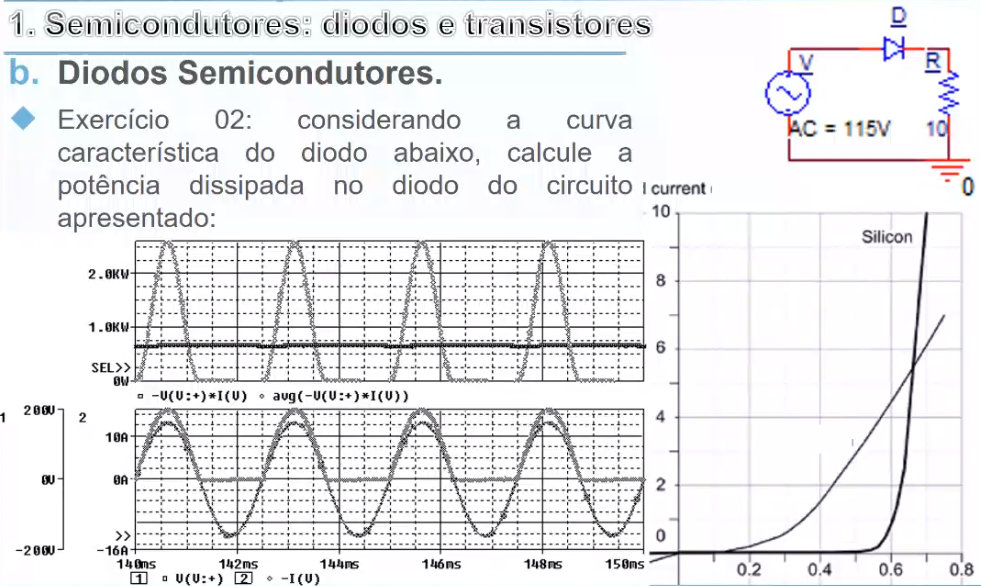
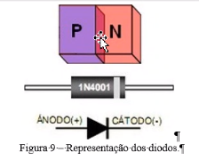
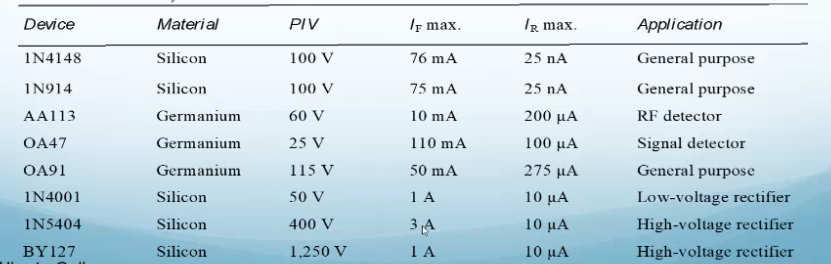
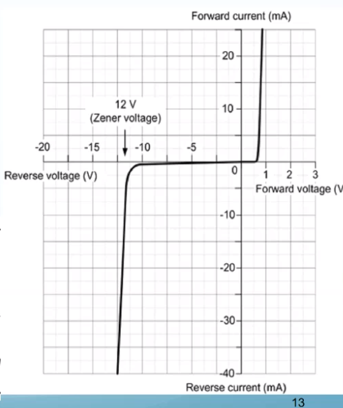
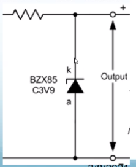
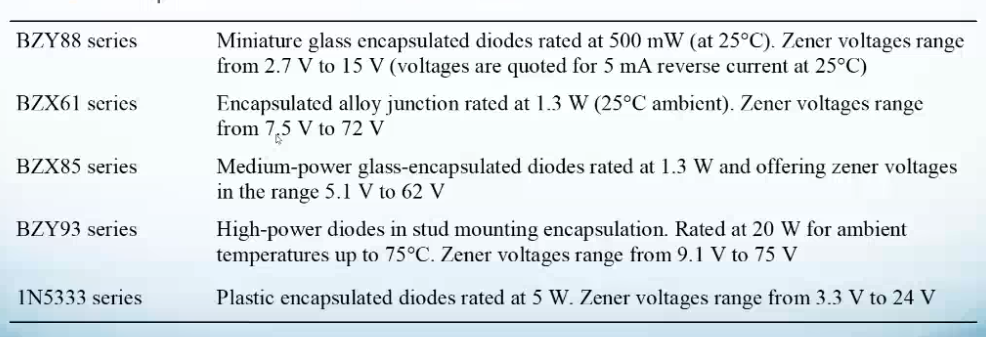
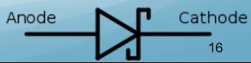
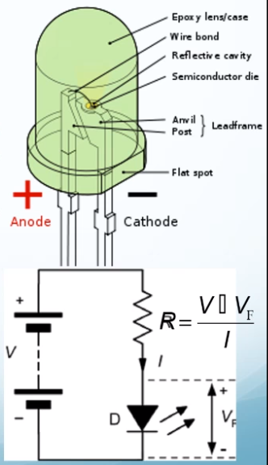
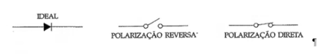
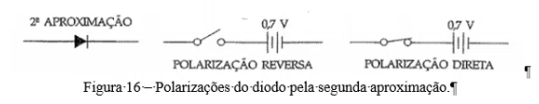

# Continuação da aula sobre diodos
Olhando agora para diodos e transistores em circuitos, podemos ver a seguinte simulação:

É muito comum usarmos corrente alternada para transportar energia elétrica, mas contínua no momento de aproveitamento (circuitos lógicos). Pra isso, usamos retificadores de tensão para converter corrente contínua em corrente alternada. Diodos são utilizados neste tipo de conversor. Em seguida podemos ver como é um diodo real:

Barrando os sentidos invertidos, o diodo permite somente a passagem da corrente em um sentido. Um conversor de ponte completa, possui diodos que aproveitam os dois sentidos da corrente contínua.
A retificação com um diodo é somente didática. Ela não tem aplicações práticas, uma vez que perdemos a parte negativa da corrente alternada. Isso é o desbalanço de energia. Isso causa um componente de corrente contínua no transformador, que causa calor e a temperatura aumenta.

## Diodo de sinal e retificadores
Representam os tipos mais comuns.

Tipo sinal: usados em circuitos eletrônicos. Operam em altas frequências (até centenas de KHz) e corrente de condução (I_f) da ordem de milésimos de ampére(mA). V_rrm da ordem de algmas dezenas de volts.

Tipo retificador: usados em circuitos de potência operam em baixas frequências (centenas de Hz) e altas correntes e tensões reversas. Seguem alguns tipo:

Tipo ZENER: Ele é feito para trabalhar em uma condição de tensão reversa. A dopagem dele torna ele capaz de operar em uma condição de tensão específica. Ele é muito usado para proteção de circuitos. Permitindo corrente somente a uma voltagem específica. Ele bloqueia a corrente a determinada voltagem. Eles tem tensão de break down baixa e definidas em diversos valores de forma deliberada. A corrente precisa ser limitada por um resistor. Toda tensão a mais que o valor de barramento do zener ele dissipa na forma de calor. Na hora que ele queima ele também protege o circuito uma vez que corta a corrente. Ele é criado para operar em condições de tensão reversa.

É interessante estudar o diodo 1N4001. Pois ele é comumente usado em prova. Isso fornece a voltagem que ele bloqueia e a corrente máxima que ele suporta. Seguem alguns diodos com especificações:

Observamos também que a representação gráfica do diodo zener é um pouco diferente.

Tipo Varicap: Muito utilizado no passado em rádios, mas caindo em desuso. A camada de depleção de um diodo apesenta uma capacitância dependente de sua largura.  Como a largura também é dependente da tensão reversa aplicada, podemos usar o diodo como um dispositivo apresenta capacitância controlada por voltagem.

Os diodos Varicaps são especialmente produzidos para se beneficiar do efeito mencionado em aplicações de telecomunicações por radio frequência.

Tipo Schottky: É potencializado ainda mais a razão anion cation, com otimização química. Assim é possível aproximar o comportamento de um diodo de silício ao do germânio. Ele também consegue operar a frequências bem mais altas. A representação gráfica também é um pouco diferente:

Isso não costuma cair em prova. Somente perguntas teóricas comparando ele aos comuns.

Tipo Led: Outro tipo muito interessante de diodo que emite luz. Ele são usados como dispositivos de sinalização de alta eficiência em bixas potências. A corrente deve ser contida com um resistor conforme o circuito adiante. É comum assumir V_f = 2V.

No caso da cor, o diodo é construído para cada plicação. Diodos de cor azul tem seu cristal diferente dos diodos de cor vermelha. Led capaz de emitir várias cores podem ter vários cristais. Seguem algumas especificações técnicas.

Quando n for passada a queda de tensão, é pra usar 0.7V, mas a resistência não é considerada.

Diodos, de um modo geral, funcionam como uma chave. Essa chave pode funcionar com três tipos de aproximação.

Primeira aproximação: O diodo é ideal. Não há queda de tensão e não ocorre condução reversa. Ele tem a representação padrão, que segue adiante.

Segunda aproximação: Na segunda aproximação temos algo muito similar à anterior, mas existe uma barreira de 0,7 V que deve ser quebrada e isso causa uma queda dessa magnitude no potencial da corrente ao passar por esse componente. A representação dela segue a diante.

Terceira aproximação: Somada à segunda aproximação vemos uma resistividade à corrente. Assim temos uma resistência associada ao diodo também, além da queda de potência.

Na matéria sempre usaremos a segunda aproximação, levando em consideração somente a queda de tensão.
Segue uma tabela com todas as aproximações.

## Circuitos com diodos retificadores
Será dado na próxima aula (slide 18).
