# Circuitos com Diodos retificadores
A aplicação mais comum para diodos retificadores seriam em fontes de energia de circuitos eletrônicos.
O objetivo de um PS (Power Supply) é converter a energia de uma fonte AC em uma voltagem DC (tipicamente entre 3.3V e 30V) mantendo a saída regulada independente de variações na entrada AC ou na carga conectada na saída da fonte.

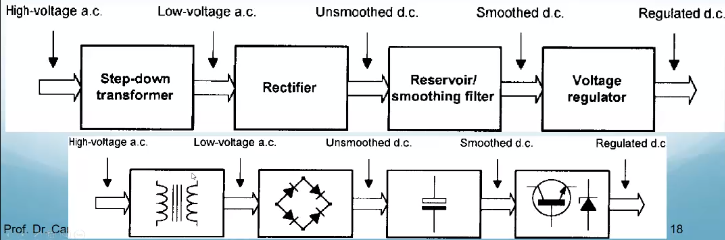

Os equipamentos que funcionam em corrente contínua tem a premissa de funcionar a base de baterias, assim precisamos aproximar ao máximo o output do retificador a uma corrente contínuo.

Uma placa de circuito típica para uma PS:

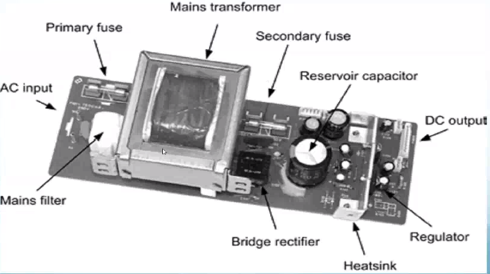

Temos fusíveis para proteger a entrada do conversor e temos também um para proteger a saída. Tempos um retificador ponte que executa a transformação. Componente regulador para certificar a voltagem de saída.

## O transformador de entrada
A voltagem do barramento AC de uma aeronave varia de 115$V_{RMS}$ a 200$V_{RMS}$. É necessário reduzir, e em muitos casos isolar, a tensão obtida do barramento usando-se um transformador abaixador. O enrolamento de saída pode ou não apresentar um tap ou vários enrolamentos para permitir siferentes tipos de ligações. As relações básicas são vistas abaixo:

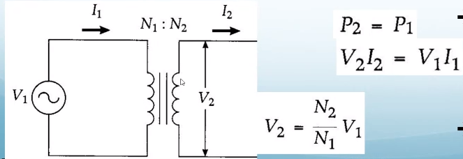

Tudo isso é somente válido se desconsiderarmos as perdas devido às resistências dos condutores e indutâncias de dispersão dos enrolamentos. Deve-se considerar que P1 é maior que P2. Podemos considerar que são iguais uma vez que a eficiência desses equipamentos é muito alta.
Importante frisar que somente corrente alternada deve passar pelo transformador. Então nossa voltagem é sempre um valor eficaz. Para achar isso precisamos tirar a raiz da senoide da corrente alternada, para isso multiplique pela raiz de 2 para achar valor de pico.

## Circuitos com diodos retificadores

### Retificador de meia onda

Usando um diodo, este retificador permite a passagem apenas do semiciclo positivo da tensão de saída do trafo. O diodo age como uma chave, habilitando (diretamente polarizado) ou não (reversamente polarizado) a passagem de corrente para a saída do retificador.

Observa-se uma forma de onda pulsante na saída do retificador. Esta forma de onda ão é adequada para circuitos eletrônicos e necessitando de filtragem (na mesma forma como vemos no caderno passado, com retificador de um diodo).

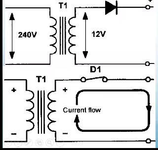
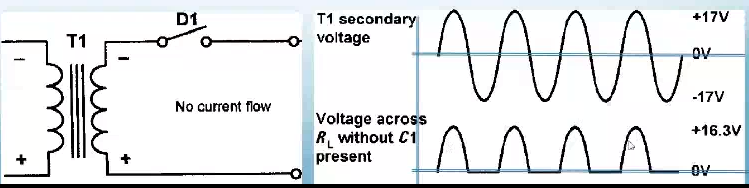

Temos uma norma que diz que a variação máxima que podemos ter na saída é de 5%. Assim se a saída for 100V, só é permitido oscilações de 5V pra cima e pra baixo.

É necessário "alisar" a tensão de saída do retificador, caso contrário os circuitos eletrônicos alimentados por essa PS ficarão instáveis. Isso pode ser feito incluindo-se um capacitor (polarizado) em paralelo com a saída. O máximo de tensão reversa aplicada ao diodo, com o capacitor é $V_{RPM} = V_2 * \sqrt{2} + (V_2 * \sqrt{2} - V_F)$.

A saída apresentará um pequeno ripple próximo de $V_{PK}$

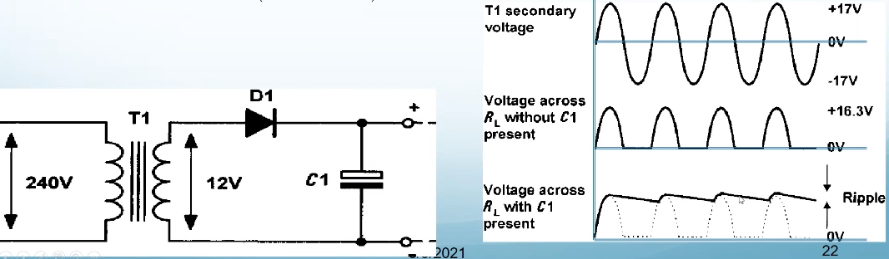

O nível de ripple na saída do regificador está diretamente relacionado com o nível de corrente drenada pela carga conectada e plo tamanho do capacitor de foltro. A fórmula abaixo estabelece a relação entre essas grandezas e outras mais.

$
    V_R = \frac{I}{f C}
$

Onde I é a corrente drenada da PS, f é a frequência do ripple de voltagem (da saída. Nem sempre é a mesma da entrada), C é o valor da capacitância e $V_R$ é o valor de pico a pico do ripple. 3V max por norma.

Por se tratar de uma a proximação/simplificação, essa equação só é válida para $V_R < 0,2 V_{PK}$.

EXEMPLO: projete, e simule no OrCAD, um retificador de meia onda para alimentar uma carga eletrônica aeronáutica de 200W. A voltagem de entrada será de 100 V_rms obtida do barramento AC (Fase-neutro) da aeronave.

Resolução:

Com base no enunciado podemos complementar os dados:

- Voltagem de saída : Vo = 28 $V_{DC}$
- Frequência da aeronave: 400 HZ
- Potência do transformador deve ser maior que a potênica da saída do retificador devido às perdas, ou seja, $S_{trafo} >= 210 VA$.
- Ripple -> a norma Mil Std 704 (Aircraft Electric Power Characteristics) define um valor pico máximo de 1.5V ou 3.0V pico a pico. Independente do valor de tenção que eu estiver fornecendo o valor máximo de pico deve ser de 3V.

A voltagem no secundário do trafo deve ser suficientemente alta para que o seu valor médio atinja 28V_dc, esperados. Devemos então considerar metade da queda de tensão em condução do diodo retificado(V_f) e o pico da voltagem de ripple na voltagem de saída (V_R). Sabendo que V_r = 3,0V e que V_F = 2,5V para uso com filtro capacitivo, temos:

$
    V_2 = \frac{V_o + \frac{V_R}{2} + V_F}{\sqrt{2}} = \frac{28 + \frac{3,0}{2} + 2,5}{\sqrt{2}} = 22,63 V_{AC}
$

Quanto ao diodo retificador, a máxima voltagem reversa a que ficará submetido (V_rrm) será equivalente ao pico de V_2 somado ao pico da voltagem no capacitor.

$
    V_{RRM} = V_1\sqrt{2} + (V_2 \sqrt{2} - V_F) = 22,63 \sqrt{2} + (22,63 \sqrt{2} - 2,5) ~= 61,5 V_{AC}
$

Como cada diodo conduz um dos semiciclos, a corrente média e total drenada é dividida entre eles:

$
    I_{FD1} = I_{FD2} = \frac{P_o}{2 V_0} = \frac{200}{56} = 3,57A
$

É recomendado escolher um diodo com V_rrm superior em 20\% - 50\%  do valor calculado.

A corrente média no diodo será: $I_F = \frac{P_o}{V_0} = \frac{200}{28} =~ 7,15A$

Calculo do capacitor é feito assim: $C = \frac{I_F}{f V_R} = \frac{7,15}{40 * 3,0} =~ 5960 \mu F$

Calculada a capacitância, vamos lá no na tabela de capacitores e pegamos o menor capaz de atender às especificações. 

Temos a seguir a simulação do circuito abordado:

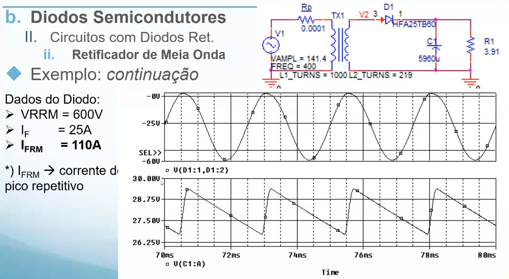

O pico da corrente de "irush" que é a corrente de carga do capacitor é 4 vezes maior que o pico da corrente de regime. Essa corrente de entrada apresenta alta distorção harmônica e níveis médios que comprometem o gerador da aeronave.

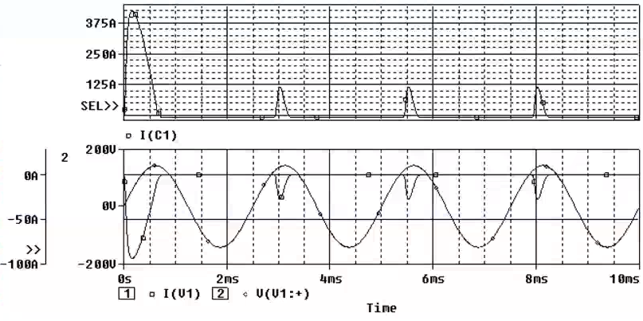

Um capacitor descarregado funciona como um curto circuito, e no momento de seu carregamento vemos essas altas amperagens.

Assim vemos que precisamos entregar a energia de acordo com as normas. Pra isso precisamos usar capacitores para controlar o ripple. Mas a retificação a meia onda ainda apresenta o desbalanceamento de carga que o torna impraticável em situações reais.

### Retificador a dois diodos
Para esse retificador temos a desvantagem de que é necessário o tap central, isso torna ele mais complexo e mais caro. Além disso, temos mais cobre usado, que é pesado e volumoso. Assim o transformador com tap central é inviável. Faz uso dos dois semiciclos para retificar a voltagem. Isso requer menos capacitores e transfere o dobro da energia por período. Dois diodos são necessários, operando alternadamente para cada semiciclo.

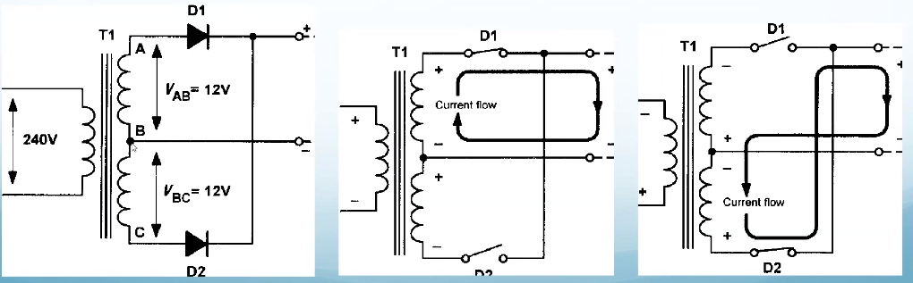

Esse mecanismo é interessante por resolver o problema do desbalanceamento de carga. Mas só metade do barramento do transformador é usado por vez fazendo que seja necessário o dobro de cobre.

Os dois semiciclos são usados para compor o valor DC no secundário. Porém, assim como no retificador de meia onde, é necessário usar um filtro capacitivo. O ripple na saída passa a ter o dobro a frequência da rede AC.

Com a frequência maior, espera-se usar um valor menor de capacitância.

Mas o principal ponto positivo é a não existência de valor médio de corrente e uma redução considerável na distorção harmônica na entrada da PS.

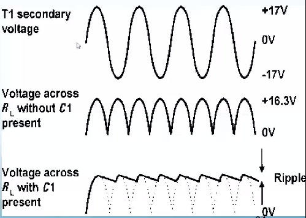

Exemplo: continuação

O Calculo da capacitância segue os mesmos parâmetros usados no outro projeto ($V_R = 3,0V, I = 7,15A$), porém $f = 800Hz$ devido à retificação de onda completa.

$
    C = \frac{I_F}{f V_R} = \frac{7,15}{800*3} = 2980 \mu F
$

O Circuito abaixo foi usado para a simulação e comprovação dos cálculos:

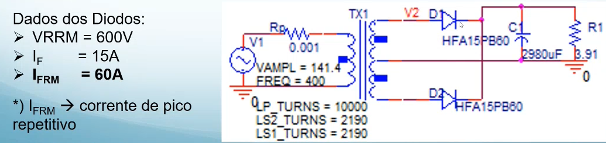

A distorção harmônica é reduzida.
Na solução podemos ver que o capacitor pode ser diminuído de forma significativa.

### Retificador a onda completa.
A primeira coisa que notamos é que não é necessário um transformador com tap central. É uma ótima alternativa em aplicações onde um trafo central não está disponível.

Quatro diodos são usados em arranjo de ponte, sendo que a cada semiciclo um para é responsável pela condução. Mas o diodo é muito barato, assim seu maior número é algo mais barato que um transformador maior.

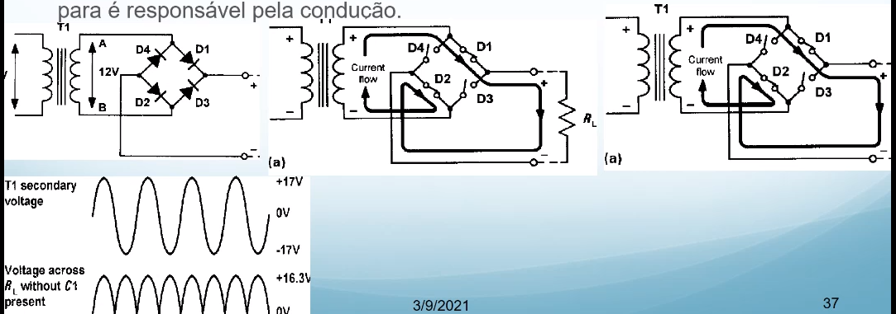

Ciclo inverso: 

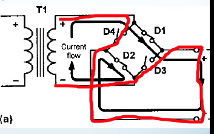

No gráfico de saída podemos ver que o comportamento é igual à da retificação a dois diodos. A frequência de saída dobra. É importante lembrar que a carga passa por dois diodos, havendo as quedas de tensão cabíveis (0,7v x 2).

Assim temos o cálculo abaixo para a voltagem final:

$
    V_2 = \frac{V_o + V_R/2 + 2*V_F}{\sqrt{2}}
$

Assim os cálculos ficam bem parecidos com o exemplo anterior, mas com dois diodos tendo de ser considerados na queda de tensão.

## Fim de aula

Os exercícios pra estudar pra prova serão feitos no próprio livro do malvino.

