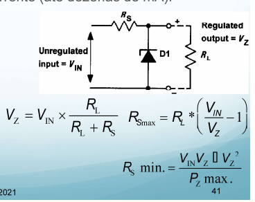
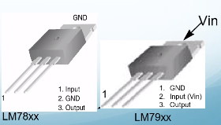
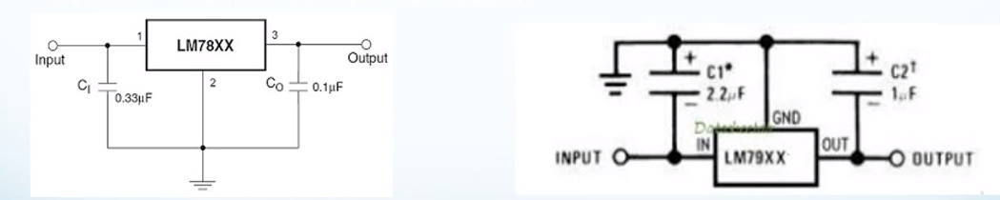
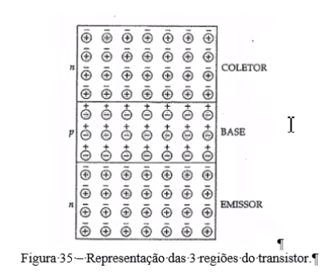
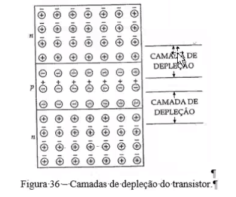
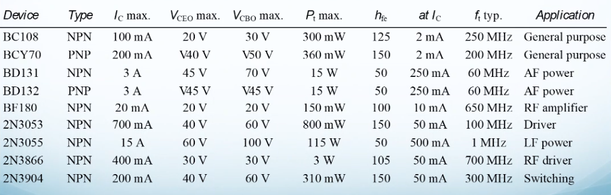
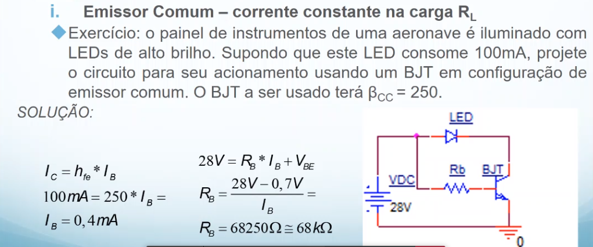

# Diodos semicondutores: Circuitos com Diodos retificadores

## Regulação da voltagem de saída
A voltagem de saída do regificador é altamente dependente tanto da corrente drenada em uma saída quanto da variação do voltagem em sua entrada.

Se estivermos usando filtros LC na saída e a corrente de saída for inferior ao mínimo esperado, a voltagem de saída pode alcançar valores bem maiores (até duas vezes) do que o projetado para a operação nominal.

A melhor forma de se resolver este problema seria usar um circuito regulador de voltagem para mantê-la sempre próxima do valor de referência. A regulação da fonte será definida por:

$
    Regulation = \frac{change in output voltage}{ change in line (input) voltage } * 100\%
$

Quanto menor melhor.

Capacitores são usados para regular o variância na saída do transformador.

### Diodo ZENER para regulação
O primeiro tipo de regulador é baseado em diodos zener e só é plicável em circuitos eletrônicos de baixa corrente (até dezenas de mA).

- A voltagem na saída é limitada pelo zener em qualquer situação de baixo consumo de corrente.
- A corrente no zener deve ser limitada por $R_S$, o que também irá limitar a resistência da carga $R_L$.
- Os valores mínimo e máximo de $R_S$, devem observar a máxima dissipação de potência no zener e a máxima corrente drenada pela carga.

Exemplo: projete um regulador zener com entrada de 9V, saída de 5V, dissipação máxima de 5mW sobre o diodo e carga alimentada de 400$\Omega$. 
Solução: O primeiro passo calcular o máximo valor de R_s de modo a garantir a voltagem regulada sobre a carga definida.

$
    R_{max} = 400 * (\frac{9}{5} - 1) = 400 (1.8 - 1) = 320 \Omega
$

O segundo passo é determinar o mínimo valor de R_s de forma a se garantir que o zener não dissipe mais do que 500mW.

$
    R_{min} = frac{9*5 - 5^2}{0.5} = \frac{45 - 25}{0.5} = 40 \Omega
$

Então ... TTTTTODO

- Quando a corrente a ser drenada da fonte é da ordem de centenas [mA] a poucos [A], devemos pensar em usar algum circuito dedicado para regulação.
- Para correntes da ordem de alguns [A] podemos circuitos usando transistores de potência, que serão estudados em seções futuras.
- Para correntes de até 1A a 1.5A, podemos usar as famílias de reguladores LM78xx e LM79xx que disponibilizam circuitos integrados dedicados para a regulação de voltagens positivas e negativas.
- A regulação de voltagem de saída é 2\% ou 4\% (conforme versão do regulador) e apresentam reguladores para as seguintes voltagens: 5V, 6V, 8V, 9V, 10V, 12V, 15V, 18V e 24V.

O integrado apresenta encapsulamento de apenas três pinos, com identificação conforme figuras abaixo.

A série LM78xx possui o pino 2 (GND) eletricamente conectado ao encapsulamento metálico externo.

Já para a série LM79xx, o pino 2 (Input/vin) é que está eletricamente ligado ao encapsulamento metálico do C.I.

Deve-se tomar especial cuidado na hora da instalação do dissipador de calor nestes componentes para evitar curto circuitos.

Estes reguladores podem ser colocados na saída de quaisquer fontess já estudadas, observando a inclusão dos capacitores de filtro extras em suas entradas e saídas. Vide circuitos abaixo.

Também é necessário observar o valor mínimo de V_in, para garantir a regulação. É recomendável que este valor seja, pelo menos 3V maior do que a voltagem de regulação (v_reg) do C.I.

O valor máximo de V_in é estabelecido no datasheet e, em geral, não ultrapassa os 35V. É recomendada a leitura desses documentos.

Pode-se encontrar o PDF destes datasheets deretamente na internet usando a palavra chave do nome dos componentes ou seus códigos.

Ao se projetar o retificador usando um regulador dessas famílias, deve-se garantir que V_in, já incluído o ripple, não seja inferior a V_reg + 3V. Dessa forma, o retificador apresentará ripple nulo na saída.

Exercício reverso: Considere a placa de fonte simétrica que vocês construíram em laboratório. Como os valores de capacitores, transformdor e reguladores de voltagem que já foram previamente especificados, solicita-se: 
- V_rrm dos diodos.
- Máxima corrente média de saída para cada uma das voltagens de saída.
- Máximo Ripple de voltagem logo antes de cada regulador.
- Efetue a simulação da fonte no OrCAD.

### Transistors bipolares
Após 1951 substituímos as válvulas além disso tem função de amplificar sinais de corrente elétrica e de amplificar a corrente. 

#### Introdução
O transistor possui 3 regiões dopadas (NPN ou PNP), como pode ser observado na figura:

Como observado, o transistor é feito de dois diodos, o diodo emissor e o diodo coletor. Pode-se observar as camadas de depleção:

Dessa forma ele funciona como uma torneira de corrente, onde, quando você eletrifica o centro, isso permite a passagem de corrente.

É importante decorar a fórmula da relação de ganho, da corrente que entra e da corrente que sai.

#### Ganho de corrente e outros parâmetros
Seguem parâmetros de transistores bipolares. Tais dados podem ser usados para a solução de exercícios.

Exemplo de exercício:

#### Polarização do emissor 
Podemos sair da condição de ganho variável. Resistor na saída é responsável por controlar o fluxo de corrente do transistor. Assim, pode-se ligar a fonte diretamente na base do transistor.
