# Primeira lista de exercícios

Aluno: Felipe J. O. Ribeiro - 11711EAR012

Questão 1:
---
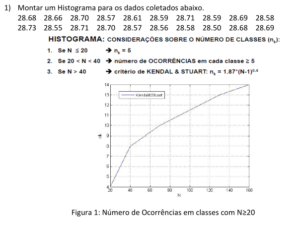

Para montar o histograma, utilizando python, foi utilizado o seguinte código:

```python

import numpy as np
import pandas as pd

# Dados da primeira questão
data=[28.68, 28.66, 28.70, 28.57, 28.61, 28.59, 28.71, 28.59, 28.69, 28.58,
        28.73, 28.55, 28.71, 28.70, 28.57, 28.56, 28.58, 28.50, 28.68, 28.69]

# Declarando uma série pandas
data_pd = pd.Series(data)

# Plot dos dados
data_pd.plot.hist(grid=True, bins=5)
plt.title("Histograma")
plt.show()

```

O histograma resultante foi:

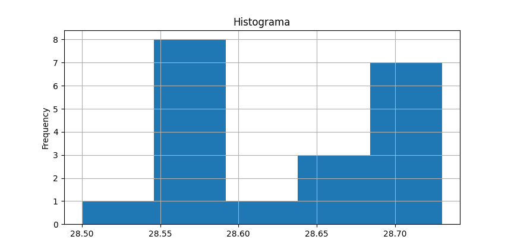


Questão 2:
---

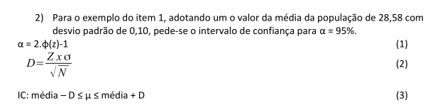

Sabemos que:
- $\overline{x} = 28.58$
- $S_x = 0.10$
- $N_x = 20$
- $\alpha = 0.95$

A partir do intervalo de confiança requisitado, podemos calcular:
- $0.95 \rightarrow 2 \phi(z_1) - 1$
- $2 \phi(z_1) - 1 = 0.95 \rightarrow \phi(z_1) = 0.975$

Procurando esse valor na tabela da função de probabilidade podemos achar o valor $z_1$:
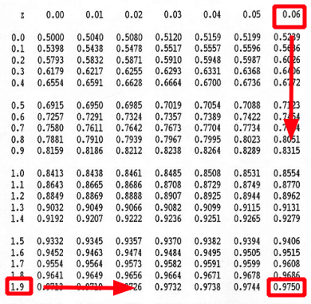

Dessa forma temos que $z_1 = 1.96$.

Assim, podemos calcular o intervalo $D$ na confiabilidade de $95\%$

- $D = \frac{z_1 \alpha}{\sqrt{N}}$
- $D = \frac{1.96 * 0.10}{\sqrt{20}} = 0.04383$

O que nos dá o intervalo de confiança:

$
        IC : \overline{x} - D \le \mu \le \overline{x} + D \rightarrow 28.536173 \le \mu \le 28.623827
$

Questão 3:
---

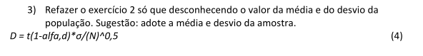

Para calcular a média e o desvio padrão da amostra utilizando python, temos:

```python
import numpy as np

# Dados da primeira questão
data=[28.68, 28.66, 28.70, 28.57, 28.61, 28.59, 28.71, 28.59, 28.69, 28.58,
        28.73, 28.55, 28.71, 28.70, 28.57, 28.56, 28.58, 28.50, 28.68, 28.69]

# Calculando valores estatísticos
# Para achar o valor médio
MEAN_X = np.mean(data)
# Para achar o desvio padrão
STAND_DEV_X = np.std(data)
```


Adotando a média e o desvio padrão da amostra temos:

- $\overline{x} = 28.6325$
- $S_x = 0.066923$
- $N_x = 20$
- $\alpha = 0.95$

Calculando as entradas para a tabela t-Student:

- $\frac{\alpha + 1}{2} = \frac{0.95 + 1}{2} =0.975$
- $d = N - 1 = 20 - 1 = 19$

Procuramos na tabela o valor correspondente nas coordenadas $(0.975, 19)$:

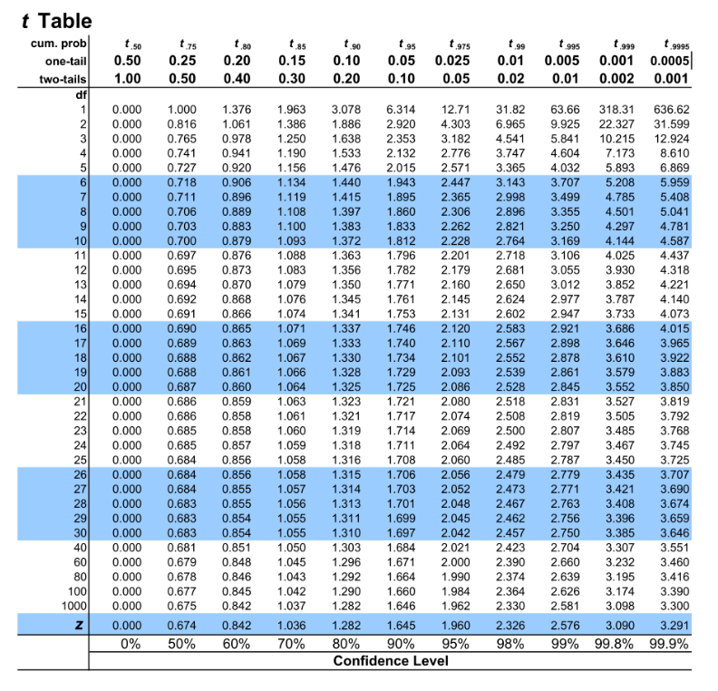

Podemos obter nosso $z = 2.093$. Isso nos permite:

- $D = \frac{2.093 * 0.066923}{\sqrt{20}} = 0.0313206$

O que nos dá o intervalo de confiança:

$
        IC : \overline{x} - D \le \mu \le \overline{x} + D \rightarrow 28.601179 \le \mu \le 28.663821 
$

Questão 4:
---

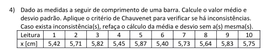

Inicialmente, devemos achar a taxa de dispersão para o nosso número de amostras. Para isso usamos a tabela com os valores determinados por Chauvenet:

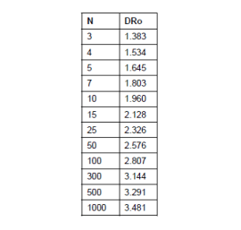

Como nosso número de amostras é 10, tamos $DR_o = 1.960$. 

Calculando o desvio padrão da amostra foi obtido $S_x = 0.168452$.

Com isso, temos que calcular a taxa de dispersão de cada amostra e remover as que não atendem ao critério de Chauvenet:

$
        DR(x_i) = \frac{|x_i - \overline{x}|}{S_x} 
$

$
        DR(x_i) > DR_o \rightarrow  descartar
$

Importante lembrar que para isso é feita a hipótese de fdp (função de distribuição de probabilidade) NORMAL. E além disso, o critério só pode ser aplicado uma vês. 

Para fazer a checagem o seguinte código em python foi desenvolvido:


```python
import numpy as np
from scipy import stats

DATA_4 = [5.42, 5.71, 5.82, 5.45, 5.87, 5.40, 5.73, 5.64, 5.83, 5.75]

DATA_4_PD = np.array(DATA_4)
STD = DATA_4_PD.std()
MEAN = DATA_4_PD.mean()

# Valor conseguido da tabela
DRO = stats.norm.ppf(1-(1/(4*len(DATA_4))))

NOVOS_DADOS = []
for elemento in DATA_4:

    # Calculo da dispersão para esse valor
    DRX = abs(elemento - MEAN)/STD

    # Checa se atende ao critério
    if DRX < DRO:
        print("{} --> atende".format(elemento))
        NOVOS_DADOS.append(elemento)
    else:
        print("{} --> não atende".format(elemento))
print("----------------------------")

print("Valor médio : {}".format(np.mean(NOVOS_DADOS)))
print("Desvio padrão : {:.3f}".format(np.std(NOVOS_DADOS)))
```
Segue o resultado:

        5.42 --> atende
        5.71 --> atende
        5.82 --> atende
        5.45 --> atende
        5.87 --> atende
        5.4 --> atende
        5.73 --> atende
        5.64 --> atende
        5.83 --> atende
        5.75 --> atende
        ----------------------------
        Valor médio : 5.662
        Desvio padrão : 0.168


Dessa forma, concluímos que todos os valores atendem ao critério de Chauvenet.

Questão 5:
---
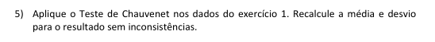

        28.68 --> atende
        28.66 --> atende
        28.7 --> atende
        28.57 --> atende
        28.61 --> atende
        28.59 --> atende
        28.71 --> atende
        28.59 --> atende
        28.69 --> atende
        28.58 --> atende
        28.73 --> atende
        28.55 --> atende
        28.71 --> atende
        28.7 --> atende
        28.57 --> atende
        28.56 --> atende
        28.58 --> atende
        28.5 --> atende
        28.68 --> atende
        28.69 --> atende
        ----------------------------
        Valor médio : 28.6325
        Desvio padrão : 0.067

Questão 6:
---
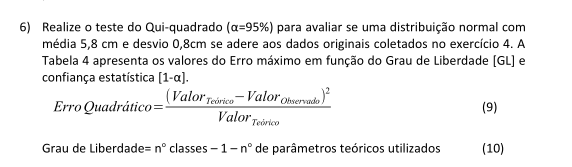

Sabemos:
- Distribuição normal.
- $\overline{x} = 5.8$
- $S_x = 0.8$
- $\alpha = 0.95$

Para acharmos o número de graus de liberdade, utilizamos a fórmula fornecida:

$
        GL = 5 - 1 - 2 = 2
$

Segue o código em python para o desenvolvimento do teste do Qui-quadrado:


```python

import numpy as np
import pandas as pd
from scipy import stats

def teste_qui_quadrado(dados, classes, media, std, plotar):
    '''
        Realisa o teste do qui-quadrado nos dados de entrada
    '''
    # Quantidade de valores
    x_n = len(dados)

    # Valores estatísticos
    mean = media
    sig_x = std

    # Monta-se o histograma, se consegue os integrantes e os limites
    n_o, lik= np.histogram(dados, classes)

    # Achan-se os valores esperados para a distribuição
    n_e = []
    n_e.append(stats.norm.cdf(lik[1], mean, sig_x)*x_n)
    for i in range(2, len(lik)):
        n_e.append((stats.norm.cdf(lik[i], mean, sig_x)
                   - stats.norm.cdf(lik[i - 1], mean, sig_x) )*x_n)

    # Achando as diferenças normalizadas
    soma = 0
    soma_i = []
    for i, n_ol in enumerate(n_o):
        soma = soma + ((n_e[i] - n_ol)**2)/n_e[i]
        soma_i.append(((n_e[i] - n_ol)**2)/n_e[i])

    # print(soma)
    # Número de parâmetros da gaussiana
    n_p = 2

    # graus de liberdade
    g_l = classes - 1 - n_p

    # cálculo da confiança
    alpha = 1 - stats.chi2.cdf(soma, g_l)


    if plotar:
        # Amostra no console
        for i, elemento in enumerate(n_o):
            print(elemento, n_e[i], soma_i[i])

        # Mostra resultado
        print ("alpha = ", alpha)
        # Amostra gráfica
        plt.plot(n_e, label="esperado")
        plt.plot(n_o, label="adquirido")
        plt.legend()
        plt.show()

```

Como resultado foi obtido:

        3 0.4250772572300461 15.597699049906481
        0 0.4445946645845439 0.4445946645845439
        1 0.4586395895730594 0.6390008639473121
        3 0.4666483672113525 13.753118935582068
        3 0.46829430697828134 13.686977656074397
        alpha =  2.625195616445808e-10

É possível fazer esse exercício somente com a tabela da FDP normal $\phi(z)$. Basta pegar os valores correspondentes aos limites do histograma e conseguir a probabilidade deles a partir da tabela.

Houveram erros maiores que os presentes na tabela para confiança de 0.95 e 2 graus de liberdade, logo a função normal não é representativa.

Questão 7:
---
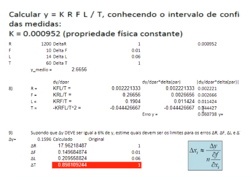
