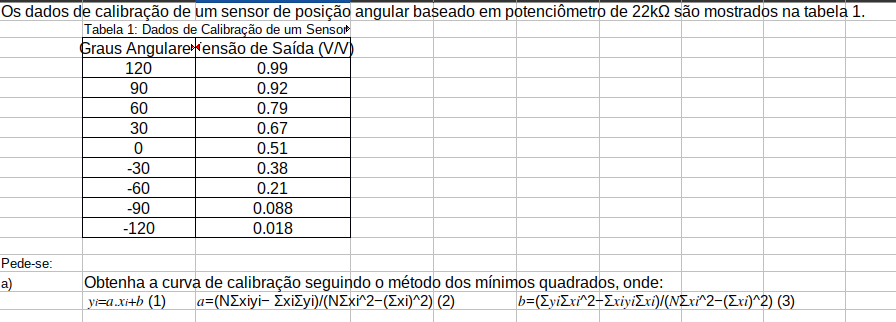
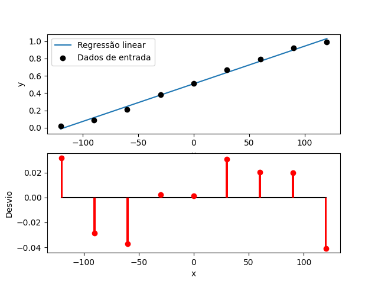
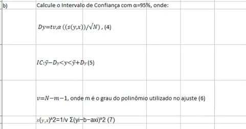
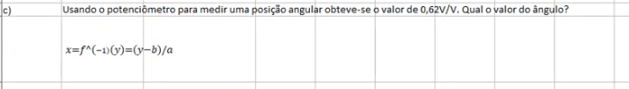
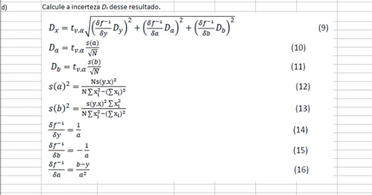
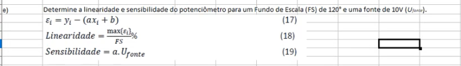
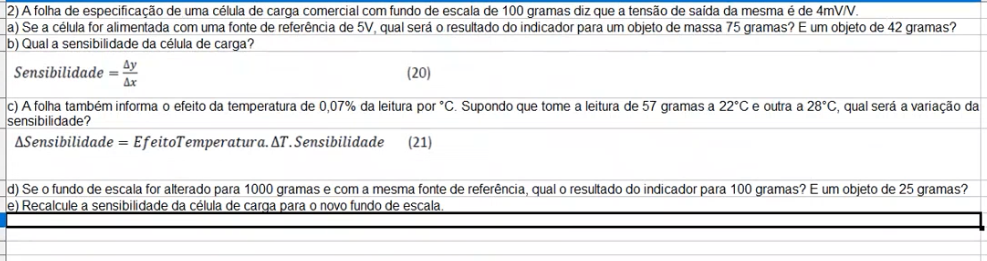
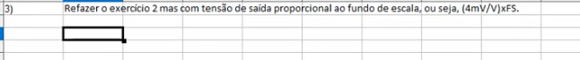
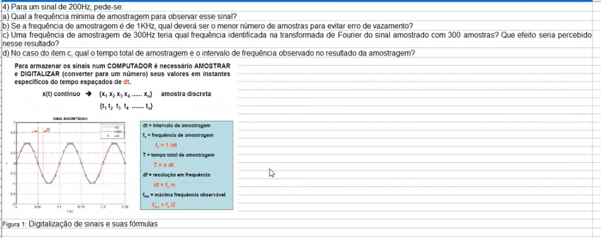
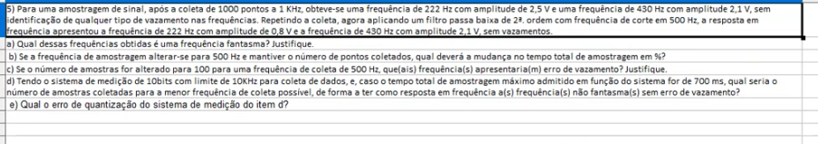

# Segunda lista de exercícios

Author: Felipe J. O. Ribeiro   (11711EAR012)


#### **1** - Primeira questão


Foi implementado em python o código para fazer o ajuste linear como requisitado. Este código segue:

```python 
import matplotlib.pyplot as plt
import numpy as np

def less_square_linear_reduction(vector_x, vector_y, show_graph):
    '''
    Executa a regreção linear em mínimos quadrados dos dois vetores de entrada
    '''

    # Initializing some local variables
    x_sum = 0
    y_sum = 0
    square_x_sum = 0
    square_y_sum = 0
    x_prod = 1
    y_prod = 1
    cros_prod_sum = 0
    length = len(vector_x)

    # Checking length from both input vectors
    if len(vector_y) != length :
        print("[ERROR] - Vectors must have same length")
        return

    # Calculating some usefull measures
    for i in enumerate(vector_x):
        x_sum += vector_x[i[0]]
        y_sum += vector_y[i[0]]
        square_x_sum += vector_x[i[0]]**2
        square_y_sum += vector_y[i[0]]**2
        x_prod = x_prod * vector_x[i[0]]
        y_prod = y_prod * vector_y[i[0]]
        cros_prod_sum += vector_x[i[0]] * vector_y[i[0]]

    # Determining angular and scallar constants for the linear regression.
    a_constant = (length * cros_prod_sum - x_sum * y_sum)/(length * square_x_sum -
                                                  x_sum**2)
    b_constant = (y_sum * square_x_sum - cros_prod_sum * x_sum)/(length * square_x_sum -
                                                        x_sum**2)

    # Generating graph of the linear regression
    x_result = np.linspace(vector_x[0], vector_x[length - 1], 100)
    y_result = a_constant * x_result + b_constant

    # calculating losses
    losses = [vector_y[i] - (a_constant * vector_x[i] + b_constant) for i
              in range(length)]

    # Ploting results if convenient
    if show_graph:
        plt.figure()
        plt.subplot(211)
        plt.plot(x_result, y_result)
        plt.scatter(vector_x, vector_y)
        plt.subplot(212)
        plt.bar(vector_x, losses, width=4)
        plt.show()

    # Returning important measures
    return a_constant, b_constant, losses


```

Dessa forma, chamando essa função, com os dois vetores de entrada apresentados na questão com `less_square_linear_reduction(data_x, data_y, True)`:



Assim, temos o ajuste, os pontos dos vetores de entrada e os erros associados a cada ponto.

Isso nos deu a equação de regressão de:

$
f(x) = 0,004 x + 0,508
$


#### **1.2** - Primeira questão - b


Para achar a incerteza em y, como dito na questão, usamos:

$
D_y = t_{v,a} \frac{s(y,x)}{\sqrt{N}}
$

Onde precisamos tirar o t student do valor encontrado, com $\alpha = 95\%$.
Temos um ajuste linear, logo:

$
v = N - 1 - 1 = 9 - 1 - 1 = 7
$

Procurando na tabela temos $t_{v,\alpha} = 2,365$.

$
s(y,x) = \sqrt{ \frac{1}{7} \sum{(y_i - b - ax_i)^2}} = 0,03086 
$

E isso nos dá o seguinte intervalo de confiança:

$
0.485 \le y \le 0.532
$


#### **1.3** - Primeira questão - c


Basta inverter a equação achada na primeira questão. Assim temos:

$
f(x)^{-1} = \frac{y - 0,508}{0,004} = \frac{0,62 - 0,508}{0,004} = 30 
$

#### **1.4** - Primeira questão - d


A questão foi desenvolvida em código, na solução das equações algébricas:

```python

def questao_1_d():
    '''
    Primeira questão - d
    '''
    data_x = [120, 90, 60, 30, 0, -30, -60, -90, -120]
    data_y = [0.99, 0.92, 0.79, 0.67, 0.51, 0.38, 0.21, 0.088, 0.018]

    a_fit, b_fit, loss_fit = less_square_linear_reduction(data_x, data_y, False)

    print("primeira questão - d")

    loss_fit_sum = 0
    for element in loss_fit:
        loss_fit_sum += element**2
    v_fit = len(loss_fit) - 2
    s_fit = mt.sqrt(loss_fit_sum/v_fit)
    t_stu = 2.262
    d_y = t_stu * s_fit/mt.sqrt(len(loss_fit))

    # Initializing some local variables
    x_sum = 0
    y_sum = 0
    square_x_sum = 0
    square_y_sum = 0
    x_prod = 1
    y_prod = 1
    cros_prod_sum = 0
    n_data = len(data_x)

    # Calculating some usefull measures
    for i in enumerate(data_x):
        x_sum += data_x[i[0]]
        y_sum += data_y[i[0]]
        square_x_sum += data_x[i[0]]**2
        square_y_sum += data_y[i[0]]**2
        x_prod = x_prod * data_x[i[0]]
        y_prod = y_prod * data_y[i[0]]
        cros_prod_sum += data_x[i[0]] * data_y[i[0]]

    s_a = mt.sqrt(n_data * s_fit**2/(n_data * square_x_sum - x_sum**2))
    s_b = mt.sqrt((s_fit**2)*square_x_sum /(n_data * square_x_sum - (x_sum)**2) )

    d_a = t_stu * s_a/mt.sqrt(len(loss_fit))
    d_b = t_stu * s_b/mt.sqrt(len(loss_fit))

    y_case = 0.62

    d_result = t_stu * mt.sqrt((d_y/a_fit)**2 + (d_b/a_fit)**2 +
                               (d_a * (b_fit - y_case)/(a_fit**2))**2)

    print(d_result) # 12,817732
```
Assim o resultado obtido foi de $12,8177^\circ$.


#### **1.5** - Primeira questão - e


Temos um fundo de escala de $FS = 120$ e uma fonte de $10V$

Para achar a sensibilidade usamos a fórmula provida na questão:

Podemos pegar o valor máximo de desvio do código das últimas questões aplicando uma função de máximo ao vetor de erros do ajuste linear.

$
Lin = \frac{max(\epsilon_i)}{FS}\% = 0,026\% 
$

Para calcular a sensibilidade, multiplicamos a voltagem da fonte pelo coeficiente angular de nosso ajuste. Isso nos dá:

$
Sen = a * 10 = 0,0435
$

#### **2** - Segunda questão


#### **3** - Terceira questão


#### **4** - Quarta questão


#### **5** - Quinta questão


