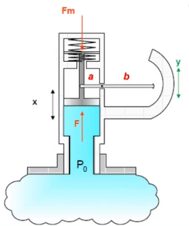
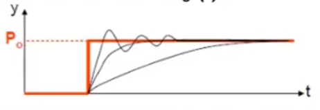
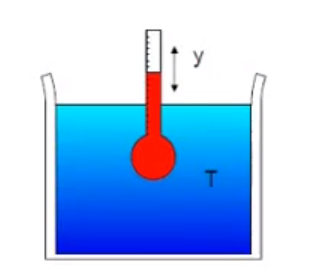
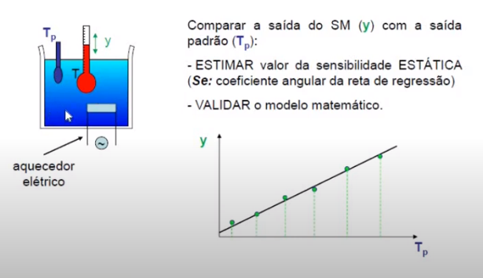
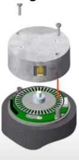
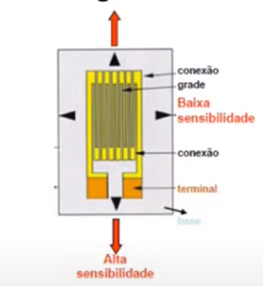
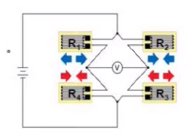
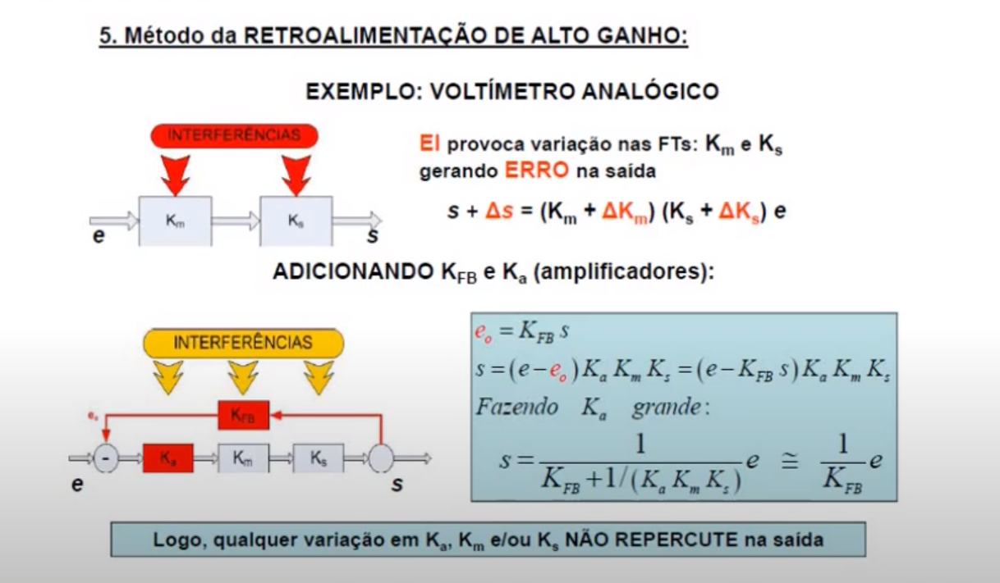

# Aula inaugural
Foi apresentada a proposta da matéria.

Haverá listas de exercícios e provas (questionários). Há aulas no YouTube. Há aulas síncronas, assíncronas. Também há aulas de dúvidas e exercícios. As aulas das 7:10 é para tirar dúvidas e fazer questões. Assíncronas serão para passar conteúdo. Há síncrona práticas para apresentar experimentos e há assíncronas práticas também.

As aulas práticas são alternadas.
Nas aulas práticas teremos que processar dados. De início revisaremos a estatística.
São 2 questionários (provas), 7 relatórios e 5 listas. 
Presença é feita pela entrega de questionários(35), relatórios(4) e listas(0.4).
Cada relatório tem 15 dias para ser entregue.

Será possível fazer as aulas em python, mas algumas coisas terão de ser desenvolvidas, como a interface entre o python e o arduino. Filtros são importantes e saberemos como tratar os dados de todo tipo de sensor. Os slides são baseados no livro de referência. Mas ele é um tanto antigo.

Propagação de erros, métodos estatísticos, métodos de aquisição.

# Introdução à disciplina de instrumentação
Essa é uma aula mais ampla, que veremos de forma geral o que será tratado na disciplina. Existe um método clássico de desenvolvimento de projetos que segue o template:

    Análise de requisitos >> Especificação de solução >> Implementação >> Testes e ensaios

Quando se inicia um projeto é necessário o levantamento dos sensores necessários para o controle de um maquinário. Além disso, o a criação de um perfil de atuação também depende de sensores.

De uma análise teórica, geramos um modelo físico, que a partir dele podemos criar uma solução teórica para um problema. Do modelo físico é possível se gerar um modelo Experimental. Do modelo matemático se consegue as especificações técnicas da instrumentação. Das necessidades de sensores se cria os ensaios experimentais e a partir da análise estatística dos sinais se consegue um resultado experimental que pode ser então confrontado com o teórico a título de validação do estudo como um todo. 

Um sistema dimensão é um conjunto de diversos dispositivos (sensores e atuadores e antenas e cabos e software), cujo objetivo é fornecer informações sobre a grandeza física que se deseja. 
Normalmente se converte a grandeza escolhida em um sinal elétrico, normalmente de 0 a 10 volts. 
- Potenciais: Força, torque, voltagem, pressão e temperatura.
- Cinéticos: Velocidade, Rotação, corrente, vazão e quantidade de calor.

*Nomenclatura*:
- Transdutor: Transforma uma forma de energia em outra.
- Sensor: É uma classe de transdutor. 
- Atuador: É outra classe de transdutor. Transforma sinal elétrico em força ou movimento.
- Instrumento: É um sistema sensor que processa seu sinal de saída.
- Medida: É o valor instantâneo de uma grandeza medida.
- Resultado de medição: É o valor da grandeza física obtido a partir de várias medições e do procedimento estatístico. Desvio padrão costuma ser menor que o erro estatístico.
- Incerteza: É o intervalo de confiança que contém o resultado da medição.
- Resolução: Menor diferença de grandeza física que se pode notar com o SM.
- Limiar: Menor valor de grandeza física que pode ser indicado pelo SM.
- Faixa de operação: Limites inferior e superior admissíveis pelo SM, mantendo comportamento típico.

*O objetivo principal* de um sistema de instrumentação:
- Sistema de medição de malha aberta: Termômetro - boas características estáticas.
- Sistema de medição de malha fechada: Regulador de abertura de válvula - boas características dinâmicas e propriedades estáticas aceitáveis.

A principal diferença é que o sistema de malha fechada regula a grandeza que está sendo analisada.

*Os componentes básicos* de um sistema de medição:

                                    interferência
                                         \ /
                                          V
                                 +-----------------+
            grandeza física -->  |  sis. medição   | --> Medidas
                                 +-----------------+
                                          A
                                         / \
                     _------------------"   "---------------------_
                    /    Sensor --> Condicionador --> Indicador    \

Sensor:
- Converte a grandeza física analisada em sinal inteligível para o condicionador

Condicionador:
- Amplifica o sinal
- Filtra o sinal
- Modula o sinal

Indicador:
- Armazena os dados em um banco de dados, ou os imprime
- Comunica esses valores a outros sistemas

Na quarta revolução industrial a comunicação com o output é feita pela nuvem. 
No passado os processos internos das empresas eram visto como algo secreto. Hoje em dia essa confidencialidade foi atenuada. 

## *Exemplo* 1 - Medidor analógico de pressão:
A mola torna o deslocamento da alavanca diretamente proporcional à força exercida sobre a superfície do medidor.

Temos as forças envolvidas:

$F_i = M . a_p = M . x^{\prime\prime}$

Não se considera a massa da mola, assim, temos a lei de Hook: $F_m = K . x$

Alavanca sem inércia: obedece à relação cinemática: $y = \frac{b}{a} x$

De interferência temos os atritos por se tratar de um sistema mecânico: $F_a = C x^\prime$

O equilíbrio dinâmico pode ser calculado com a resultante nula das forças em uma equação diferencial, onde A é a área do êmbolo:

$M \left( \frac{a}{b} \right) y^\prime + C \left( \frac{a}{b} \right) y^\prime + K \left( \frac{a}{b} \right) y = A P_o$

Assim, quando temos a pressão $P_o$ como constante, isso nos garante que $y = \frac{b A}{a K}P_o$, o que nos dá a sensibilidade estática $S_e = \frac{bA}{aK}$.

Para uma pressão não constante ($P_o = P_o(t)$) temos $y(t)=y_h(t)+y_p(t)$ em que $y(t)$ é a solução de uma equação diferencial ordinária de segunda ordem, composta pela solução da Homogênea e pela solução da particular.

É importante estudar os efeitos dos parâmetros K, A, a e b no resposta dinâmica, além das interferências do sistema e deferentes valores de entrada de pressão dinâmicos, como degrau, rampa e outros.

Para validar nosso sensor, comparamos o valor dele com o valor resultante de um sensor de aquisição padrão.

## *Exemplo* 2 - Medidor analógico de temperatura
Se observa o nível até onde se chega o mercúrio no background graduado. Assim ele converte temperatura em mudança de volume do mercúrio.

Temos algumas considerações, como a de que não há transferência d energia térmica pela haste do termômetro. U, C e $\rho$ do fluido são constantes por toda a etapa de medição e são conhecidos.

$\left(\tau \frac{d}{dt} +1 \right)y = KT$

Sendo $K = S_e \triangleq \frac{K_{ex}V_b}{A_c}$ e $\tau \triangleq \frac{\rho C V_b}{U A_b}$. Podemos ver que existe um atraso na medição acrescido de 1. Isso se deve à inércia térmica.

Modelo físico e matemático:

- $K_{ex}$ = coeficiente de expansão térmica volumétrica (bulbo - fluido interno)
- $V_b$ = volume do bulbo
- $A_b$ = Área da superfície lateral do bulbo 
- $A_c$ = Área transversal do capilar 
- $U$ = Coeficiente de troca de calor através da superfície do bulbo
- $C$ = Calor específico do fluido interno 
- $\rho$ = densidade do fluido interno

Para verificar o comportamento do sistema, se coloca um aquecedor e usa-se um sensor padrão de temperatura como referência. Mas é um experimento complicado devido às perdas de calor e ao fato de que dificilmente o aumento de temperatura é homogêneo.

## *Exemplo* 3 - Medidor digital de deslocamento
Esse sensor é um encoder rotativo. Ele tem uma fonte de luz que chega a um sensor através de um disco com ranhuras. Ele é usado para se observar a rotação. Assim, o sensor é capaz de observar cada vez que um furo passa pelo detector.

Ele solta um sinal digital para descrever a rotação. O número de pulsos determina os graus de rotação. Quanto maior o número de ranhuras maior a resolução.

## *Exemplo* 4 - Strain Gate
São elementos que ao serem deformados eles variam suas resistências internas. Dessa forma, medindo-se essa resistência é possível quantificar a deformação. Isso pode ser feito com $R=\frac{\rho L}{A}$ onde $\rho$ é a resistividade do material.

A variação de R devido à variação de L e A pode ser calculada com $dR = \frac{\rho}{A}dL - \frac{\rho L}{A^2} dA = \frac{\rho L}{A} \frac{d L}{L} - \frac{\rho L}{A} \frac{d A}{A}$ e isso leva a $\frac{\Delta R}{R} = \frac{\Delta L}{L} - \frac{\Delta A}{A}$.

Dessa forma usando $\frac{\Delta L}{L} = \epsilon_L$, $\frac{\Delta A}{A} = -2\nu \frac{\Delta L}{L} = -2\nu \epsilon_L$.

E isso resulta em $\frac{\Delta R}{R} = (1+2\nu)\epsilon_L$.

Sobre a sensibilidade do sensor temos o GF podemos fazer esse calculo com a seguinte equação:

$S_e = \frac{\Delta R / R}{\epsilon_L} = 1+2\nu = G_F$

Onde $S_e = GF$ (Gage Factor) que depende apenas do material do strain gate. A Faixa de operação linear é limitada pela máxima deformação elástica admissível. A variação da resistência pode ser feita com a lei de Ohm ou com um circuito de Ponte de Wheatstone.

A ponte de Wheatstone pode ser vista adiante:

Nela, a voltagem central pode ser determinada com a seguinte equação:

$V = \frac{R_1 R_3 - R_2 R_4}{(R_1+R_4)(R_2+R_3)} V_{exc}$

Se $R_1 R_3 - R_2 R_4$ e vemos V = 0 medido no centro, quer dizer que temos uma ponte balanceada. Com alterações $\Delta R$ veríamos um desbalanceamento nessa ponte. E voltagem seria detectada no centro:

$\frac{\Delta V}{V_{exc}} = \frac {R_1 R_4}{(R_1 + R_4)^2} \left[ \frac{\Delta R_1}{R_1} - \frac{\Delta R_4}{R_4} \right] + \frac {R_2 R_3}{(R_2 + R_3)^2} \left[  \frac{\Delta R_3}{R_3} - \frac{\Delta R_2}{R_2} \right]$

Admitindo todas as resistências como um só valor nós acabamos com a equação:

$\frac{\Delta V}{V_{exc}} = \frac{1}{4 R} \left[ \Delta R_1 - \Delta R_2 + \Delta R_3  - \Delta R_4   \right]$

## Fontes de erros
Dessa forma estudamos como são sensores analógicos e digitais alem de sensores mistos, onde pelo menos um dos elementos no sistema de medição é digital. Existem dois modos de operação, como o de deflexão onde a grandeza física é usada para produzir diretamente a medida, como os sistemas mostrados anteriormente. O outro é a de compensação, que é o caso da balança, onde vamos colocando o uma massa de um lado e comparando com a massa do outro lado. No caso, a ponte de Wheatstone é um exemplo destes.

## Técnicas de correção de erro
A fonte de erro pode vir de muitos fatores. O próprio modelo físico impõe um simplificação do sistema que deixa muitos fatores reais de lado. Tais fatores podem interferir em um experimento e causar deviações no observado do predito. Minimizar esses fatores não considerados é muito importante. Coisas como atrito, campos eletromagnéticos e outros são fatores de natural interferência em qualquer experimento físico. 

- Uma forma de mitigar isso é com insensibilidade inerente. Um exemplo é como a temperatura pode interferir no experimento com a ponte de Wheatstone pois ela causa a dilatação do strain Gate. Mas isso pode ser combatido tornando todas as outras resistências strain gates. Dessa forma, se a temperatura causar esse efeito em um ela causa em todas não alterando a leitura. Assim tornamos o sistema inerentemente insensível aos efeitos da temperatura. 

- Outro método para mitigar erros são métodos de filtragem. É possível que se espere a chegada de dados em certa frequência, assim, pode-se filtrar entradas de outras frequências em certa banda, como os causados por campos eletromagnéticos situação onde vemos muito ruído em altas frequências.

- Outra forma é com a correção da saída. Isso pode ser feito com ensaios controlados onde se sabe o valor medido. Assim as medidas podem ser feitas e a diferença entre os dois sinais demonstra o desvio do método do sistema de medição. Dessa forma, subtraindo-se essa diferença em medições de experimentos reais pode-se chegar em medidas acuradas sem a necessidade de modificar o sistema sensor.

- Outra forma é adicionar ao sistema sensor um mecanismo que dê o efeito contrário na medição ao desvio que se quer evitar, dessa forma ele compensa esse desvio e exporta valores acurados.

- Método de retroalimentação de alto ganho eu não entendi mt bem, então colocarei o slide na íntegra:

Quando colocamos ks e kfb, a fórmula resultante, com ka muito grande, a saída não sofrerá efeito da transferência de km e ks. Funciona como um filtro. Colocaremos um sinal, vindo da saída do sistema, com uma impedância muito alta. Isso vai fazer com que não haja interferência na saída e colocando isso na entrada do sistema e isso faz com que as interferências seja minimizadas.
Estamos retroalimentando o sistema com a saída dele, de forma que a interferência presente na saída cancele a interferência da entrada.

## Encerramento da aula
Ele encerra a aula fazendo o exemplo de medições com um paquímetro onde se tiram 5 medidas e se calcula a média e o desvio padrão.

