# Técnicas estatísticas para a análise de sinais
O professor enviou a primeira lista de exercícios, com algumas perguntas. Na primeira pergunta ele pede pra criar um histograma de cinco classes. Para saber o número de classes usar os itens presentes na lista. Determinado o número de classes vemos quais membros estão em cada classe.

Temos até as 7:10 da segunda da próxima semana para responder para entregar essa lista. A aula já está disponível e explica todos os métodos citados no exercício.

Quando desenvolvemos um instrumento, precisamos falar qual é o erro desse instrumento. Por padrão queremos a confiança por volta de $95\%$, mas cada aplicação pede uma confiança.

Não temos aula prática hoje, mas a experimental da semana passada deve ser entregue semana que vem.

## Aula assíncrona: Fundamentos estatísticos para análise estática de instrumentos - Pt.1
Veremos os testes estatísticos mais comuns na calibração de sistemas de medição.

As principais fontes de erro em sistemas de medição pode vir de entradas modificantes como temperatura, umidade, pressão e vibração, ou de entradas de interferência, como atritos, campos eletromagnéticos e tensões galvanométricas.

Caracterização estática de instrumentos:

- Desempenho em estado estacionário
- Relação entre a grandeza a ser medida e o sinal de saída y(t) do sensor
- Incertezas inerentes ao resultado:
    - Efeito sistemático: Desvio na média das medições. Altera de forma sistemática e consistente os valores medido. 
    - Efeito aleatório: Aumento no desvio padrão das medidas. Altera de forma aleatória os resultados causando uma dispersão nos resultados para uma mesma entrada.

O objetivo de uma medição é determinar os valores do mesurando, ou seja, da grandeza a ser medida. Isso inclui um procedimento de medição e o resultado é apenas uma estimativa do valor do mesurando e, portanto, o resultado da medição deve incluir uma declarqação da incerteza associada.

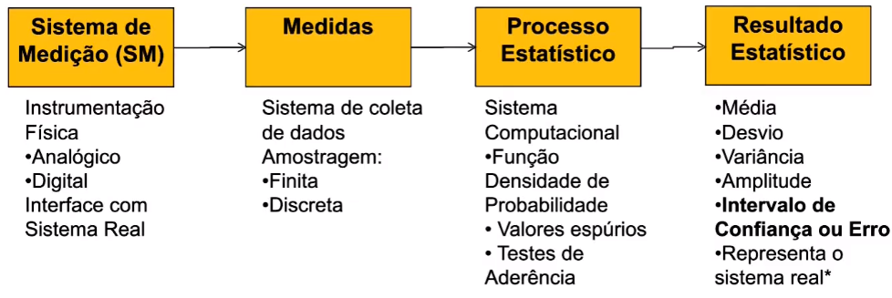

### Fundamentos da estatística
Uma característica desejável do instrumento é não ser tendencioso, ou seja, não polarizado e sem viés.

Um instrumento não tendencioso ou não polarizado tem a mesma probabilidade de indicar valores inferiores ou superiores.

Matematicamente, a função densidade de probabilidade (FDP) de um instrumento não tendencioso pode ser escrita como:

$
    P(y < y_0) = \int_{-\infty}^{y_0} f_p(y)dy = \int^\infty_{y_0} f_p(y)dy = P(y_0 < y)
$

Podemos ver isso claramente em uma curva de Gaus. A partir da função de densidade de probabilidade:

$
    p(x)= \frac{d P(x)}{dx} \leftrightarrow P(x) = \int^x_{-\infty} p(x)dx
$

$
    p(x) \epsilon [0 , \infty] ,  \int^x_{-\infty} p(x)dx = 1
$

A função de densidade de probabilidade informa a probabilidade da variável X assumir um valor dentro e um determinado intervalo. A cuva pode ser vista adiante:

A função de distribuição de probabilidade pode ser descrita como:

- $P(x) = PROB(x =< X)$
- Se $a<=b \rightarrow P(a) <=P(b)$
- $P(-\infty)=0$ e $P(\infty)=1$

Se eu pegar um valor específico em x e calcular a probabilidade para ele, essa probabilidade tende a zero. É necessário se trabalhar com intervalos.

Uma coisa importante de se fazer é normalizar a curva. Ou seja, temos que trazer a média para zero e o transformar o desvio para 1.

A Gaussiana pode ser definida por:

$
    p(x) = \frac{1}{\sigma_x \sqrt{2 \pi} }e^\frac{- (x - \mu_x)^2}{2 \sigma_x^2}
$

Onde temos:

$
    \mu_x = E[x] = \int^\infty_{-\infty} x p(x) dx
$

$
    \sigma_x^2 = E[(x - \mu_x)^2] = \int^\infty_{-\infty} (x - \mu_x)^2 p(x) dx
$

Normal reduzida : $z = \frac{x - \mu_x}{\sigma_x}$

$
    p(z) = \frac{1}{\sqrt{2 \pi}} e^\frac{- z^2}{2} \rightarrow \mu_z = 0 | \sigma_z^2 = 1
$

Assim, subtraímos a média de todos os valores e dividimos eles pelo desvio padrão.

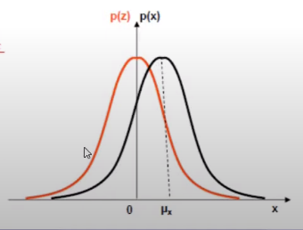

Assim, podemos começar a trabalhar com as tabelas.

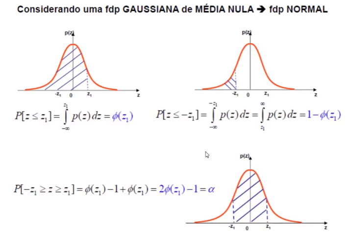

Os valores de $\phi(x)$

Há outras formas de função de distribuição de probabilidade. Por exemplo temos a FDP uniforme:

$
    P(x) = (b-a)^{-1} | \text{para a<=x<=b}
$

$
    P(x) = 0 | \text{para x fora}
$

ou

$
    P(x) = 0 | \text{para x < a}
$

$
    P(x) = (x-a)^/(b-a) | \text{para a<=x<=b}
$

$
    P(x) = 1 | \text{para x > b}
$

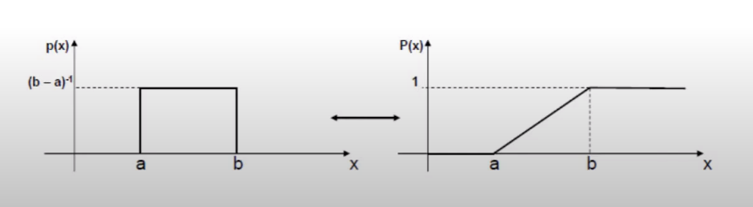

Uma das características mencionadas no conceito de densidade de probabilidade e distribuição de probabilidade estão relacionadas às características de precisão e exatidão do instrumento.

Seguem as funções de Matlab que podem ser úteis:

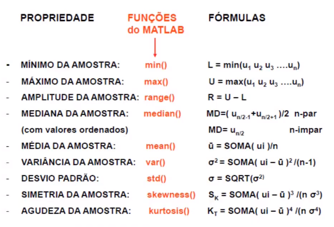

Pode-se usar também a função $normpdf$ para gerar a função de distribuição de probabilidades, mas para isso é necessário prover a média e o desvio padrão.

Quando temos a curva, o intervalo correspondente a 99% da probabilidade ao redor da média, nós chamamos de intervalo de confiança.

#### Histogramas

Histograma é um estimador da FDP (função de distribuição de probabilidades). Seja $u = {u_1, u_2 ... u_N}$ uma amostra finita e discreta das medidas obtidas num experimento.

O histograma da amostra pode ser construído para estimar a fdp das medidas u, de acordo com as seguintes etapas:

- Ordenar u e determinar a amplitude da amostra ( R ).
- Agrupar as medidas em k classes (bins) de amplitudes calculadas por um critério estatístico. (ver adiante).
- Determinar o número ($n_{ok}$) de ocorrências das medidas na classe k.
- Calcular a frequência relativa em cada classe: $f_k = n_{ok}/N$.
- Calcular a frequência acumulada $f_a$ até cada classe k.
- Fazer os gráficos: $n_{ok}$ x $k$, $f_k$ x $k$, $f_a$ x $k$.
- Testar a fdp teórica que melhor se ajusta ao histograma.

Dependendo do número de pontos para a análise, temos diferentes métodos para determinar o número de classes no histograma.
 
- Se $N <= 20 \rightarrow$ n_k = 5
- Se $20 < N < 40 \rightarrow$ número de ocorrências em cada classe >=5
- Se $N > 40 \rightarrow$ Critério de Kendal & Stuart: $n_k = 1,87(N-1)^{0,4}$

Segue um exemplo:

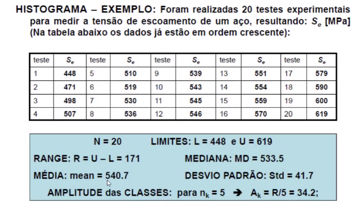

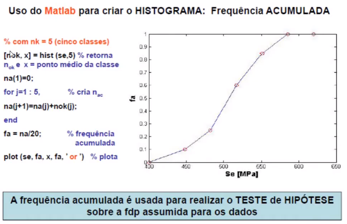

Além de trabalhar só com um conjunto de amostras, também podemos trabalhar com várias entradas. Assim, cada entrada terá seu conjunto de estimadores estatísticos. A questão é se a média das médias amostrais é um bom estimador da média de x.

#### Quanto à interpretação de muitos valores temos dois casos

- Caso 1: Se x é uma variável com fdp desconhecida tal que $E[x]= \mu$ e $VAR[x]=\sigma^2$ são conhecidas. Colhidas amostras discretas e finitas {x} de tamanho N, e calculados os estimadores das médias amostrais $\overline{x}$ tem-se:

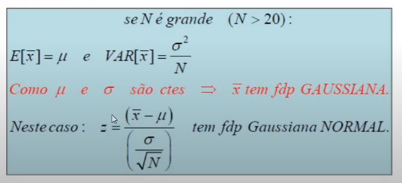

Esse fato permite calcular o intervalo (D) de $\overline{x}$ que contém $\mu$ com um determinado nível de probabilidade (Confiança = $\alpha$).

EXEMPLO:

Um componente elétrico tem duração (vida) cujo valor tem desvio padrão $\sigma = 4 horas$. Montou-se uma amostra com N = 100 componentes que foram ensaiados para determinar suas durações. A média amostral da vida do componente resultou $\overline{x} = 501,2 horas$. Qual é o intervalo de confiança para a média com confiança de 95\%.

Solução:

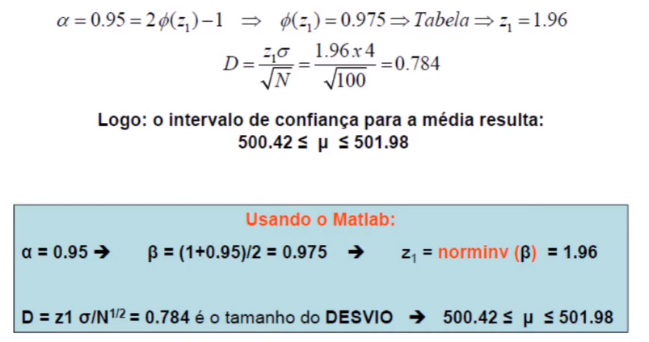

- Caso 2: Não se conhece previamente o valor do desvio padrão. Ele pode ser estimado pela variância Amostral:

$
    S^2 = \frac{1}{N - 1} \sum^N_{i = 1} (x_i - \overline{x})^2 \neq \sigma^2
$

É bom deixar claro que este valor é diferente do desvio padrão da população, pois esse é somente o desvio padrão da amostra.

A média amostral não tem fdp gaussiana, mesmo se N é grande. Mas tem fdp t-Student:

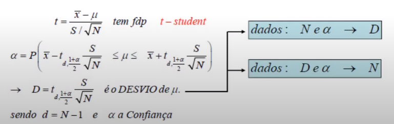

Podemos ver que se tivermos o número de amostras e a probabilidade, conseguimos achar o intervalo. Ou se nos dão o intervalo e a probabilidade podemos achar o número de amostras.

EXEMPLO:

Foram realizadas 10 medidas da resistência elétrica de um componente elétrico resultando: Média amostral = 10,48 $\Omega$ e desvio padrão Amostral = 1,36 $\Omega$. (o desvio padrão é desconhecido)
Qual é o intervalo de confiança para a média com probabilidade de $\alpha = 90\%$?

#### Critério de Chauvenet
Objetivo: Remover da amostra os valores que tenham despersão em relação à média superior a um valor padrão.

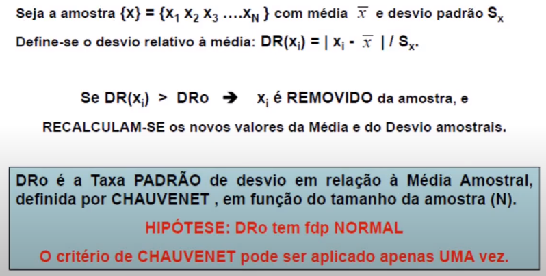

Esse critério só pode ser aplicado uma vez.

A taxa padrão de chauvenet é tabelada em função do número de amostras:

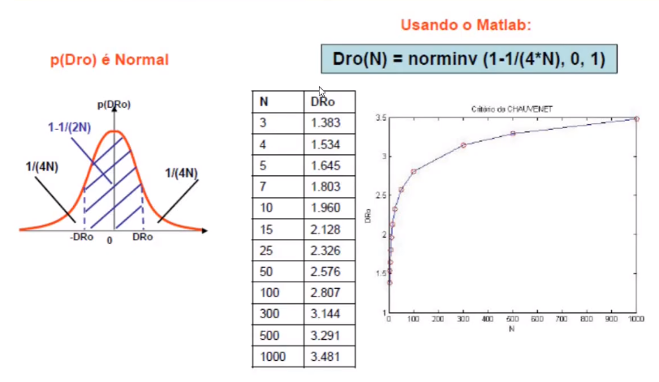

#### Teste do Qui-quadrado
Objetivo: Verificar a hip'otese feita sobre a fdp adotada para uma variável, a partir de uma amostra finita e discreta (tamanho N).

Técnica: Construir o histograma com $n_k$ classes e comparar o número de ocorrências observado com aquele obtido com a fdp assumida. A varável $X^2$ definida abaixo tem fdp Qui-quadrado.

$
    X^2 = \sum_{k = 1}^{n_k} \frac{(n_o - n_e)^2_k}{n_{e}}
$

$n_o$ - número observado de ocorrências na classe k

$n_e$ - número de ocorrências esperado na classe k, para a fdp sob teste.

$X_n^2$ - variável com fdp Qui-quadrado 

$n$ - número de graus de liberdade estatísticos

$
    n = n_k - 1 - n_p
$

$n_k$ - número de classes 

$n_p$ - número de parâmetros da fdp testada. No caso dessa matéria, esse valor sempre é igual a 2 pois só trataremos das funções de distribuição de probabilidade normal e gaussiana, que só tem 2 parâmetros.

Dados $X^2$ e n -> tabela -> $\alpha =$ confiança do teste de hipótese

EXEMPLO:

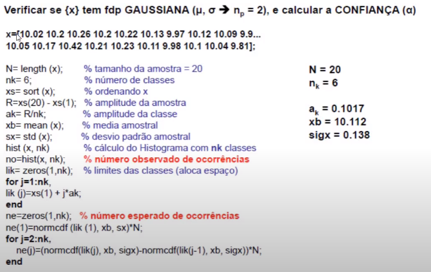

OBS: Na linha 4 (de baixo pra cima) temos que subtrair também o valor da FDP em xs(1). E o desvio padrão deve ser o sigx.

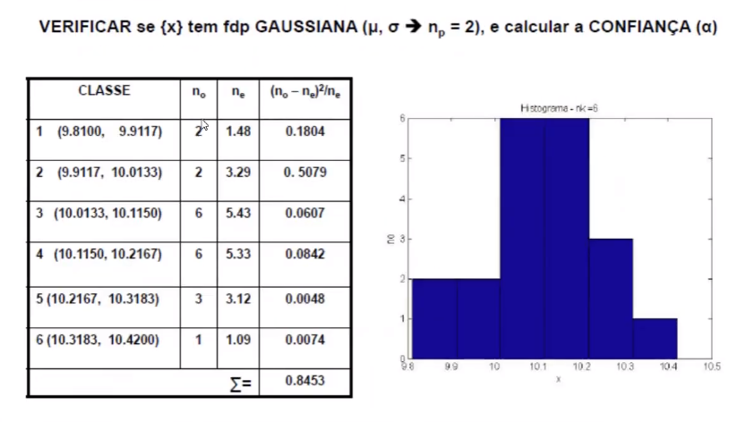

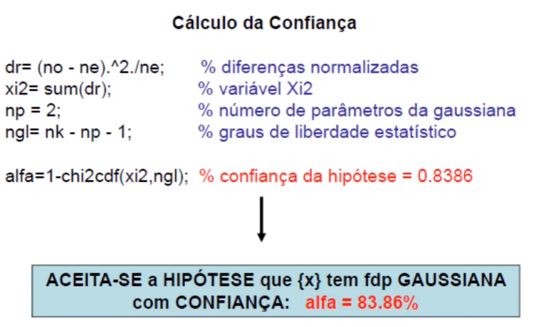

O mercado geralmente trabalha com uma confiança de 95\%. Quanto maior esse alpha, maior vai ser o intervalo. Se a confiança aqui é de 83 significa que o erro dela é menor do que se fosse pra 95\%

Observações:

- O nível de confiança da variável Qui - quadrado pode ser calculada pela função chi2cdf(xi2, ngl) que fornece a probabilidade acumulada $P(chi2 < xi2) = 1- \alpha$.
- A função [h,P,stats] = chi2gof(x) fornece:
    - h = 0 -> hipótese aceita com 95\% de confiança (=1 rejeitada)
    - P: valor da probabilidade ou confiança do resultado 
    - stats: informações adicionais...

#### Análise de regressão
Objetivo: Criar um modelo matemático (f) que representa a relação entre pelo menos dois conjuntos de dados.
- {x} é uma amostra da entrada do SM
- {y} uma amostra da saída do SM

Determinar $y =f(x)$, tal que $|y_{medido} - y|$ seja mínimo.

Funções do MATLAB: ajuste polinomial

EXEMPLO:

Num ensaio de calibração estática foi medida a saída {y} do SM para entradas padrão {x}. Neste caso os valores y são contaminados por ruído, porém têm valores crescentes nos limites da faixa de operação do SM(tendência).

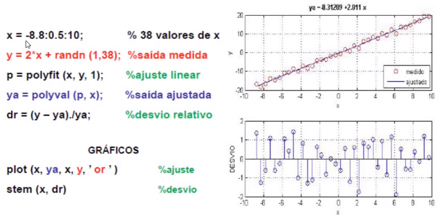

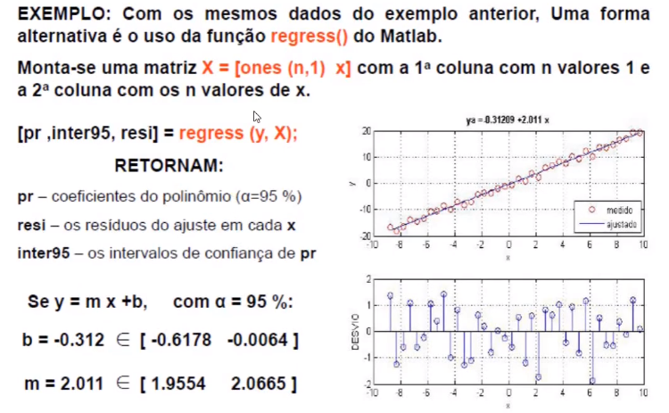

Temos também formas de fazer regressão de vários argumentos de entrada, como segue:

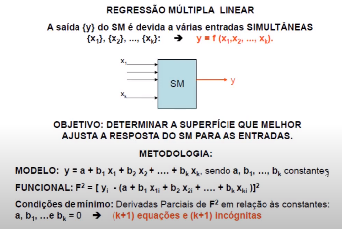

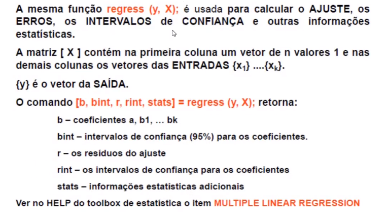

Mas isso não será cobrado na disciplina.

#### Propagação de erros
Podemos estudar como erros são propagados. Temos dois casos:
- Caso A: Os erros de um processo de medição podem estar distribuídos em cada um dos componentes do SM: Conhecidos o erro no sensor, o erro no condicionador e o erro no indicador, calcular o erro do resultado da medição feita com o SM.
- Caso B: Várias medições independentes de grandezas físicas são combinadas para calcular o resultado de um experimento: Medição do diâmetro d com incerteza $\Delta d$ e medição da altura h com incerteza $\Delta h$. Calcular a incerteza $\Delta V$ do volume V calculado a partir da expressão $V = \pi d^2 h/4$.

Esses dois problemas podem ser formulados considerando:
- Se a incerteza de cada componente (ou medida) for conhecida, como calcular a incerteza global do SM?
- Se a incerteza total desejada for especificada, como determinar os limites das incertezas de cada componente do SM(ou de cada medida)?

Seja erro de medidor de cada elemento na medição é possível calcular o erro consequente na medida final. O oposto também é possível. Sabendo-se o erro na saída podemos estimar o erro máximo de cada elemento da entrada.

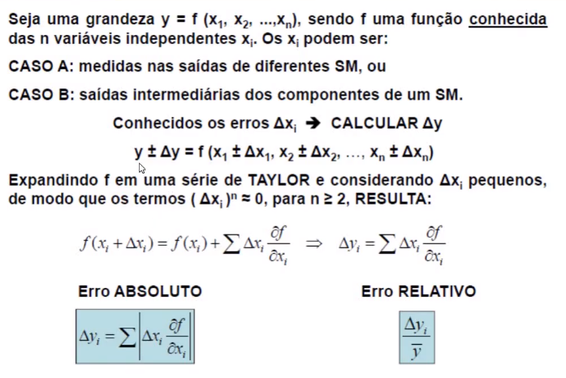

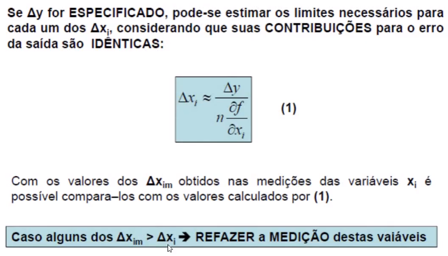

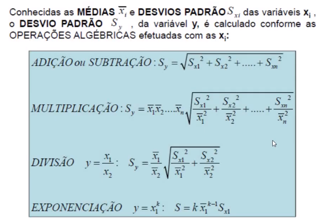

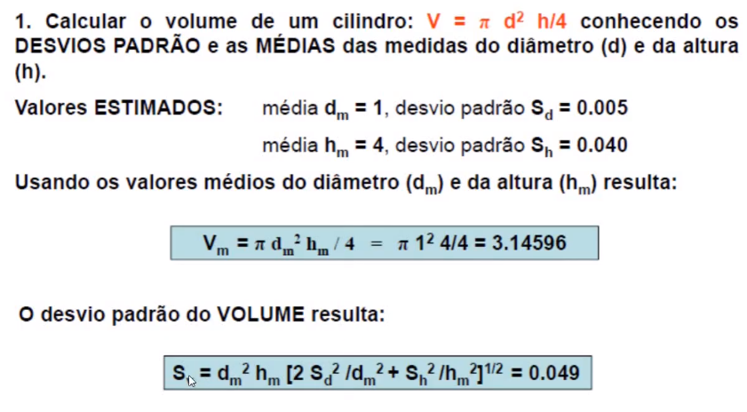

## Aula assíncrona: Fundamentos estatísticos para análise estática de instrumentos - Pt.2
Falaremos da sensibilidade, resolução, incerteza, linearidade estatística, limiar e histerese. Também veremos a calibração de instrumentos.

A caracterização estática de um instrumento descreve o desempenho dele em estado estacionário. A análise estabelece relação entre a grandeza a ser medida e o sinal de saída do sensor. Essas especificações são importantes uma vez que indicam se é possível usar determinado instrumento em determinada aplicação.

Como exemplo, temos o sensor LM35, usado no último laboratório:

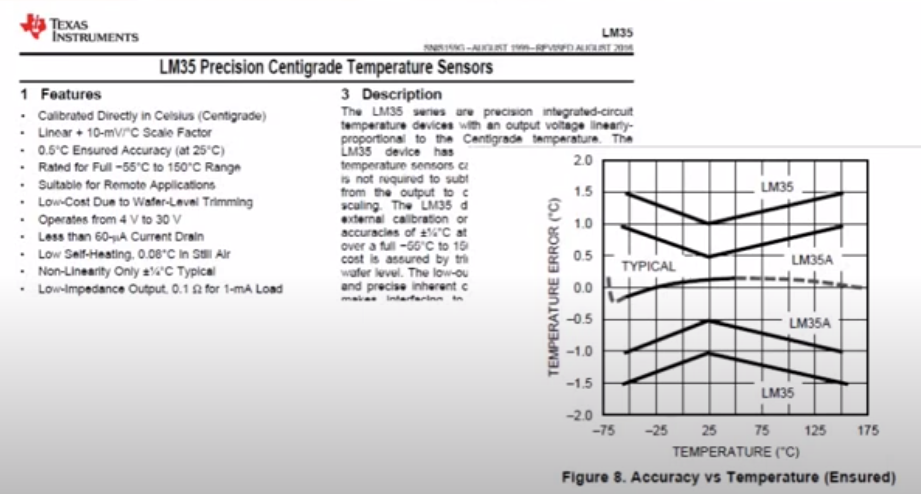

### Sensibilidade
A sensibilidade $S_e$ de um instrumento é a variação do valor da saída em um estado estacionário $q_o$ provocado por uma variação da variável de entrada $q_i$, também em estado estacionário. Temos:

$
    Se = \frac{q_o}{q_i}
$

Se independente de $q_i \rightarrow$ Comportamento estático Linear. 

Se dependente de $q_i \rightarrow$ Comportamento estático não Linear, como é o caso do LM35. 

Dessa forma a sensibilidade será a razão entre a entrada e a saída do sistema:

$
    S_e(q_i) = \frac{dq_o}{dq_i} = lim_{\Delta q_i \rightarrow 0} \left( \frac{\Delta q_o}{\Delta q_i} \right)
$

Entradas de interferência e modificadoras (EI, EM) alteram a sensibilidade $S_e$:

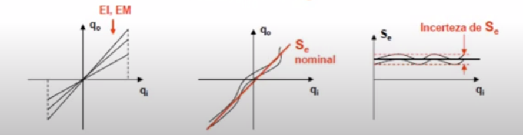

**EXEMPLO:**
Como exemplo podemos ver o sistema de medição de pressão a seguir.

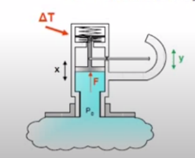

Além da pressão outros fatores causam mudança no valor medido. Neste sensor, temos como entrada a pressão ($P_0$) e como saída a medida dela ($Y$).
Assim temos:

$
    S_e = \frac{y}{P_0} = \frac{a}{bKA}
$

Assim, estudando a influência da variação da temperatura ambiente, podemos observar que ela causa uma dilatação no material tanto da haste de medição quanto na mola. 
Com $P_0 = 0$ podemos ter valores medidos diferentes de zero devido a essa dilatação ($y \neq 0$). Além disso a sensibilidade também é alterada devido à dilatação da alavanca, assim temos $S_e \neq 0$.

Assim será necessário o desenvolvimento de ensaios, de forma que possamos verificar a influência da temperatura no valor medido e na sensibilidade. Assim, mantemos a pressão igual a zero, variamos a temperatura $[T_{max}, T_{min}]$ dentro do intervalo de operação previsto para o equipamento.

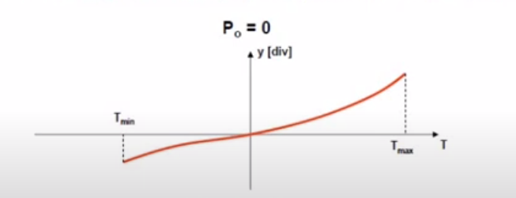

Para corrigir o problema, podemos dividir a escala de acordo com essa variação. E podemos aplicar algoritmos de correção na saída.

Outra coisa que podemos fazer é para cada valor de $P_0$ variar a temperatura, como foi feito no teste anterior. Os ensaios são realizados para cada valor de pressão em uma câmara de temperatura controlada. Isso resultará em famílias de curvas $y(T) = S_e (T) . P_0(T) \rightarrow S_e(T)$. Assim, a sensibilidade nominal pode ser estimada estatisticamente com o intervalo de confiança especificado para o SM.

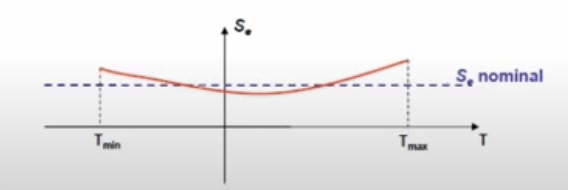

Para que a gente possa trabalhar com sensores no que diz respeito à sensibilidade, temos que conhecer algumas questões operacionais. Entre elas:

- Faixa de operação (range): intervalo definido para o qual o SM mantém suas especificações de funcionamento(sensibilidade estática, linearidade, incertezas, etc...). Se o módulo dos limites do range são iguais eles são denominados fundo de escala ($\pm FS$).

- Resolução: menor variação da entrada($q_i$) capaz de ser observada na saída ($q_o$).

- Um sistema de medição analógico tem teoricamente resolução igual a zero. Porém, interferências (atritos, folgas, induções eletromagnéticas, etc..) tornam a medição imprecisa dependendo da ordem do valor medido.

- Um sistema de medição digital tem resolução finita, correspondente ao mentor incremento digital que o sensor é capaz de externar.

Um Arduino trabalha com 10 bits. Nesse caso as entradas tem resolução de $1/2^{10}$. Se o sensor te temperatura avlia uma faixa de operação de 0 a 100 graus célcios, qual seria a variação de entrada mínima para obter uma alteração da temperatura do sensor? Para obter a resposta, basta dividir o intervalo por 1024 que resulta em $0,097C^o$.

- Faixa linear de operação: É um subintervalo da faixa de operação onde a sensibilidade pode ser admitida constante (um $S_e$ nominal). Tudo isso dentro de uma tolerância admitida nas especificações do SM.

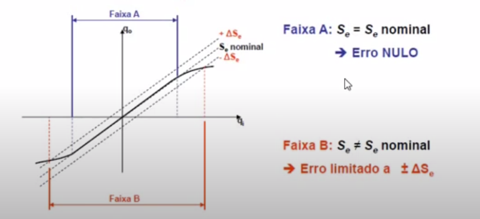

- Não linearidade terminal: Incerteza máxima calculada na faixa de operação do SM. Construímos ela da seguinte forma:

- Não linearidade relativa à reta de regressão: Incerteza máxima calculada na faixa de operação d SM. Construir as retas a e b paralelas à reta de regressão obtida a partir das medições de $q_i$ e $q_o$, passando pelos pontos que resultam o máximo $\Delta$.

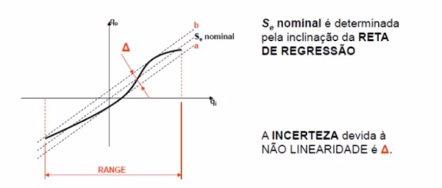

- Incerteza no valor de entrada: É calculado por uma porcentagem do funco de escala e uma porcentagem do valor de entrada. Usa-se o valor da incerteza que for maior para cada valor de $q_i$ no range do sistema de medição. Alguns sistemas de medição comerciais utilizam a especificação da incerteza por uma superposição dos dois critérios:

$
    \Delta (q_i) = B\% FS \pm A\% q_i
$

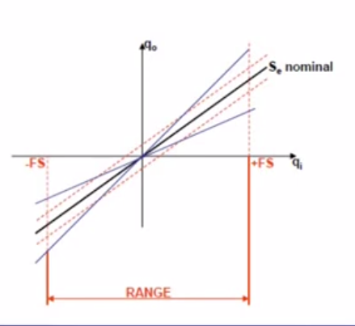

- A resolução do sistema de medição pode ter valores diferentes para cada nível da entrada ($R = R(q_i)$). Esta característica é determinada em ensaios realizados fixando valores de $q_i$ e aplicando variações $\Delta q_i$. O menor valor de $\Delta q_i$ que gera $\Delta q_o$ é a resolução. Alguns fabricantes fornecem o valor da resolução expresso em porcentagem do fundo de escala ($\% FS$). EXEMPLO: Célula de carga de FS = 500N com resolução melhor que 1\% de FS $\rightarrow$ a resolução é igual a 5 N.

- A incerteza de um sistema de medição expressa os limites do intervalo de confiança (95%) para a medida indicada. O valor depende do fundo de escala e das características construtivas do SM. EXEMPLO: Voltímetro HP 3456A de 6 DÍGITOS: para FS = 1 V, a incerteza = $\pm 0.0012\%$ da leitura + 5 contagens (do LSD = sexto dígito) $\rightarrow$ Até 1V DC: I = 0.000012 V + 0.000005 = 0.000017 V.

- LIMIAR (threshold): Menor valor de $q_i$ a partir do zero que ode ser detectado na saída do SM. Este é o valor da RESOLUÇÃO para $q_i = 0$. Limiar é uma resolução específica.

- HISTERESE: Diferença entre a saída $q_o$ do SM para cada entrada $q_i$ quando esta é atingida de forma crescente ou decrescente. Esta característica produz uma incerteza no valor de $q_o$, sendo provocadas por deformações, atritos viscosos e secos, amortecimento interno ou propriedades elétricas e magnéticas dos componentes do SM.

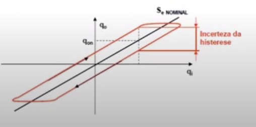

Trabalharemos com histerese no módulo 5, com taco geradores. E também com módulo 7 com o potenciômetro.

## Calibração estática
Procedimento experimental para determinar a função de transferência efetiva do SM, comparando a medida $q_o$ com os valores padrões da entrada $q_i$. Os resultados obtidos permitem determinar $S_e$.

Esta operação é realizada nas seguintes situações:

- Quando um novo SM é projetado.
- Em intervalos de tempo regulares para garantir que o SM está operando dentro de suas especificações. O intervalo de temo entre calibrações é estabelecido por norma técnica específica para cada categoria do SM, sendo em média igual a 1 ano.
- Para verificação de erros sistemáticos ou aleatórios antes de usar o SM num experimento.

Podemos fazer esse processo colocando padrões da grandeza física na entrada do SM.

Os padrões devem ter incertezas pelo menos 5 vezes menores que a desejada no SM. 

Outra forma é usar um sistema de medição padrão (SMP) cujas saídas são comparadas com o SM analisado quando submetida a mesma entrada de forma simultânea. Mais uma vez, o SMP deve ter incertezas pelo menos 5 vezes menores que a desejada para o SM analisado.

Quanto ao procedimento nós precisamos ter:

- Espaçamento entre as medidas: Caso o SM tenha comportamento linear, o intervalo de entrada ($\pm FS$) deve ser dividido em subintervalos iguais. O número de subintervalos é determinado por um critério estatístico (mínimo de 10). Caso o comportamento seja não linear o tamanho dos subintervalos pode ser variável, sendo menor na faixa em que o gradiente ($\frac{d q_o}{d q_i}$) é mais elevado.

- Número de medidas por entrada: O número de experimentos deve ser definido em função da característica estatística dos dados para determinar o intervalo de confiança com o nível de probabilidade desejado (a confiança deve ser a mesma para todos os níveis de entrada: 95\% é usual).
- Histerese: as entradas $q_i$ são aplicadas de forma crescente e decrescente e são medidas as saídas $q_o$ para os dois casos.
- Resolução e limiar: para cada valor de entrada determinar o menor valor de entrada capaz de produzir variação na saída. Estes ensaios devem ser realizados após a obtenção da função de transferência do SM.

Existem várias etapas de análise, como a definição do objetivo do estudo, identificação do sistema de medição, seleção dos padrões, preparação do experimento, execução do ensaio, processamento e análise dos resultados e relatório técnico. Vamos focar no processamento e na análise dos dados uma vez que estamos tendo somente aulas remotas.

**EXEMPLO**: Calibração de uma célula de carga KRATOS

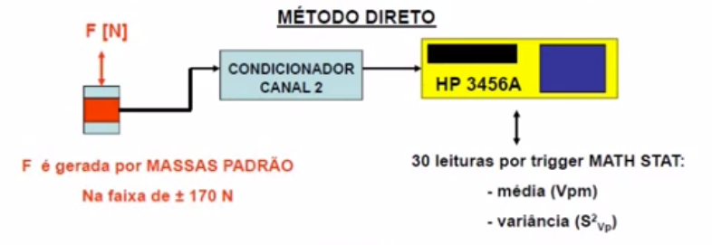

Dentre os procedimentos, temos:

- Tipos de ensaios: compressão, tração em carga e descarga
- Seleção das massas padrão (Kg), (incerteza de $\pm$ 1 grama)
    - para o ensaio de compressão: mc = [0.996, 1.092, 3.062, 6.480, 11.442, 16.478]
    - para o ensaio de tração: mt = [0.594, 1.578, 2.564, 4.544, 7.062, 12.024, 17.060]

Os ensaios são realizados com adição e retirada das massa. Temos então vetores que representam a sequência de colocação das massas, resultando nas forças padrão aplicadas:

Fpc = [-9.7708, -19.4434, -38.8672, -63.5688, -112.2460, -161.6492] [N]

Fpt = [5.8271, 15.4802, 25.1528, 44.5766, 69.2782, 117.9554, 167.3586] [N]

Temos 30 leituras de cada carga colocada. Temos então a média de compressão a tração na carga e na descarga. Intervalos com 95\% de intervalo de confiança. Assim, seguem os resultados:

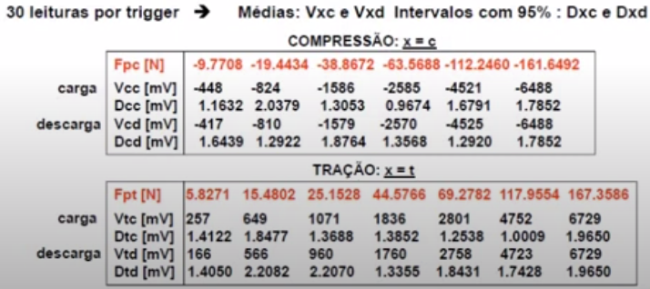

Agora podemos fazer a análise dos resultados. Para isso fazemos uma regressão linear com uma função especial do Matlab que já fornece tudo para nós. Ele nos dá o OFFSET e a sensibilidade estática, os intervalos de confiança e os resíduos em cada valor de força.

