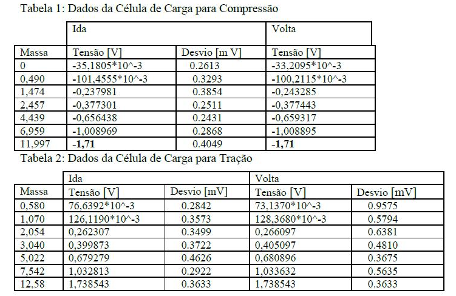
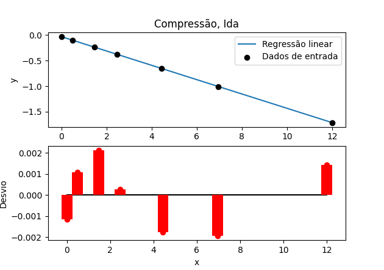
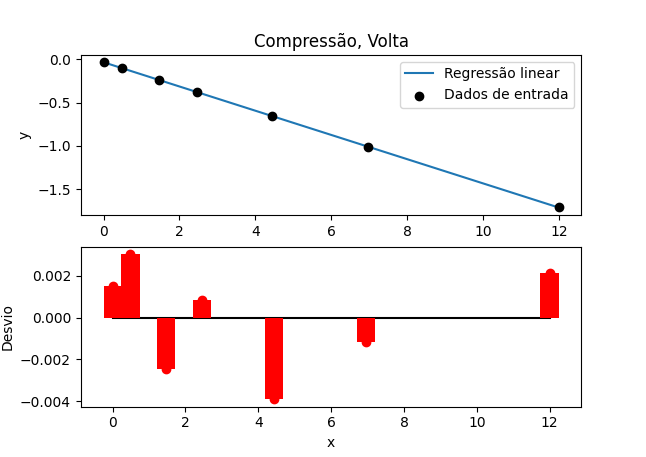
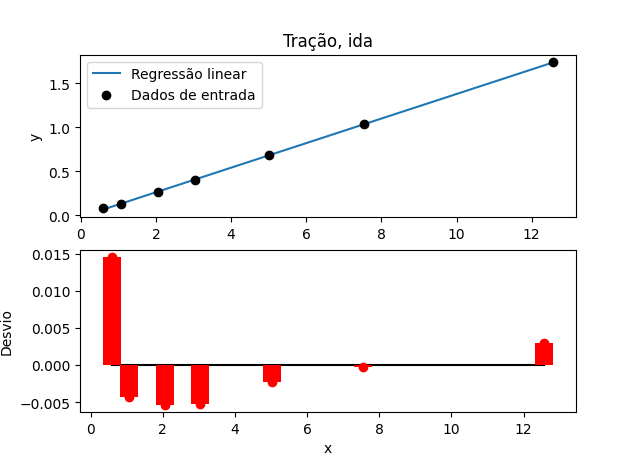
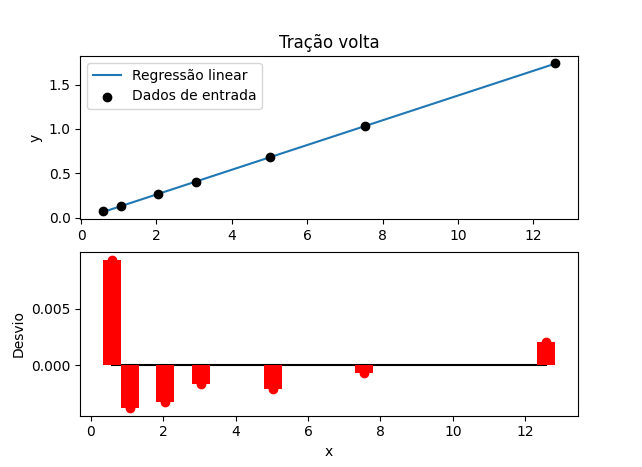
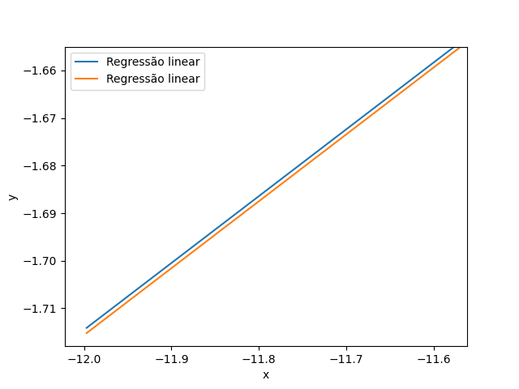

# Questão 1


A calibração direta do sistema de medição piezoresistivo Kratos utiliza um conjunto de massas padrão. A célula de carga foi ligada no condicionador de sinais, a fonte DC foi ajustada e ligada no condicionador de sinais (para a alimentação dos strain gages da célula de carga) e o sinal do condicionador foi conectado no multímetro HP. A célula de carga foi calibrada para compressão e tração, de forma a verificar sua histerese. Os dados de compressão estão apresentados na Tabela 1 enquanto os dados de tração estão na Tabela 2. Pede-se:

## a) Apresentar os resultado da regressão linear para dos dados de carga e descarga; (5 pontos)
Usou-se o método de regressão linear em mínimos quadrados implementado em python para cada caso:
```python
def less_square_linear_reduction(vector_x, vector_y, show_graph):
    '''
    Executa a regressão linear em mínimos quadrados dos dois vetores de entrada
    '''

    # Initializing some local variables
    x_sum = 0
    y_sum = 0
    square_x_sum = 0
    square_y_sum = 0
    x_prod = 1
    y_prod = 1
    cross_prod_sum = 0
    length = len(vector_x)

    # Checking length from both input vectors
    if len(vector_y) != length :
        print("[ERROR] - Vectors must have same length")
        return

    # Calculating some usefull measures
    for i in enumerate(vector_x):
        x_sum += vector_x[i[0]]
        y_sum += vector_y[i[0]]
        square_x_sum += vector_x[i[0]]**2
        square_y_sum += vector_y[i[0]]**2
        x_prod = x_prod * vector_x[i[0]]
        y_prod = y_prod * vector_y[i[0]]
        cross_prod_sum += vector_x[i[0]] * vector_y[i[0]]

    # Determining angular and scalar constants for the linear regression.
    a_constant = (length * cross_prod_sum - x_sum * y_sum)/(length * square_x_sum -
                                                  x_sum**2)
    b_constant = (y_sum * square_x_sum - cross_prod_sum * x_sum)/(length * square_x_sum -
                                                        x_sum**2)

    # Generating graph of the linear regression
    x_result = np.linspace(vector_x[0], vector_x[length - 1], 100)
    y_result = a_constant * x_result + b_constant

    # calculating losses
    losses = [vector_y[i] - (a_constant * vector_x[i] + b_constant) for i
              in range(length)]

    # Ploting results if convenient
    if show_graph:
        plt.figure()
        plt.subplot(211)
        plt.plot(x_result, y_result, label ="Regressão linear")
        plt.scatter(vector_x, vector_y, c="black", label = "Dados de entrada",
                    zorder=10)
        plt.xlabel("x")
        plt.ylabel("y")
        plt.legend()
        plt.subplot(212)
        plt.plot([vector_x[0], vector_x[len(vector_x) - 1]], [0, 0], c="black",
                 zorder = -1)
        plt.bar(vector_x, losses, width=2, color="red")
        plt.scatter(vector_x, losses, c="red")
        plt.xlabel("x")
        plt.ylabel("Desvio")
        plt.show()
        print("Linear regrecion ==> f(x) = {:.3f} x + {:.3f}".format(a_constant, b_constant))
    return [a_constant, b_constant, losses]

```

Os resultados seguem:










## b) Mostrar graficamente a histerese da célula de carga; (5 pontos)
Como podemos ver no gráfico adiante, a regressão linear da ida e da vinda possui um offset que pode ser visto pela diferença no coeficiente linear de ambas as curvas:

- $-0.02744$
- $-0.02711$





## c) Qual é a sensibilidade estática da célula de carga para tração, compressão e média? (5 pontos)
A sensibilidade é igual ao coeficiente linear da equação de ajuste.

- Para o caso da compressão, foi obtido um valor de $0.140$.
- Para o caso da tração, foi obtido um valor de $0.139$.
- Assim, obteve-se o valor médio de $0.1395$
