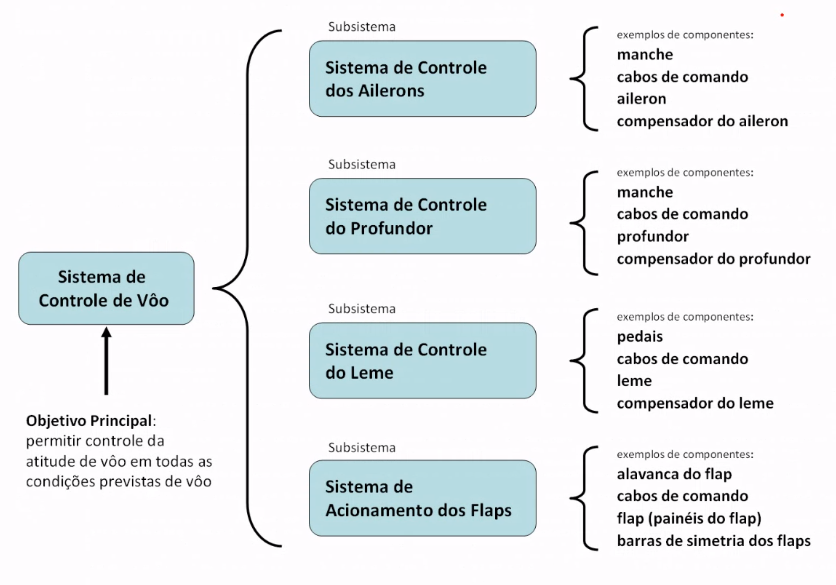
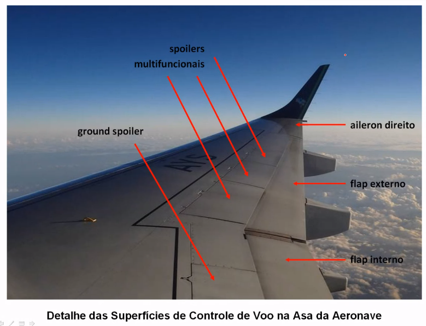
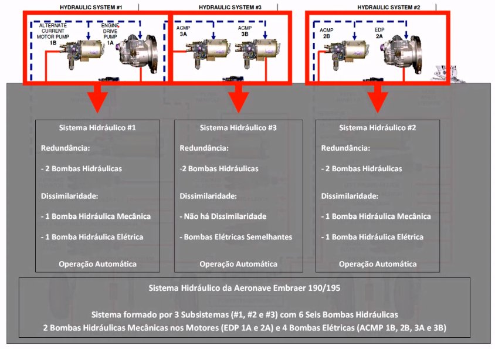
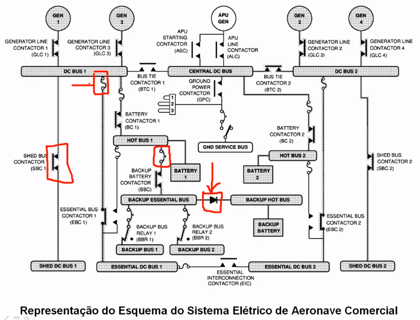
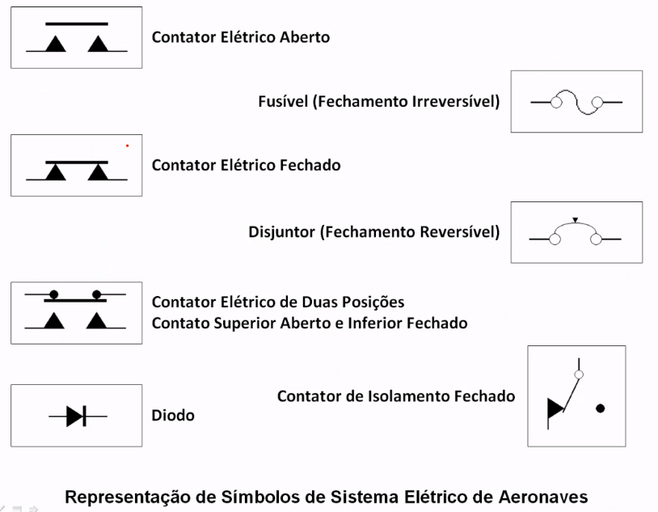
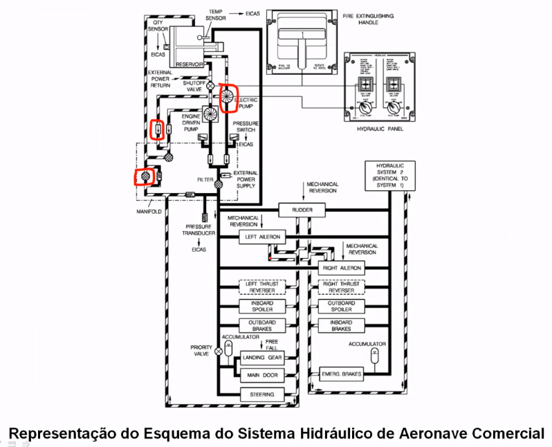

# Aula de introdução a sistemas aeronáuticos
Hoje veremos aluns fundamentos dos sistemas. Interação e padronização de identificação dos sistemas.
Vamos entender o que é um sistema aeronáutico, e o que são subsistemas, isto é, o conceito formal.
Estudaremos também redundância e dissimilaridade em sistemas.
Detalhes das aeronaves de estudo para sistemas aeronáuticos.

# O que é um sistema aeronáutico?
Capacidade de vários componentes da aeronave de interagirem entre si a fim de atingir objetivos operacionais a garantir condições de voo.
Todo sistema possui um objetivo primário, podendo ter outros objetivos secundários.
O conjunto de itens dentro de um sistema com interação para atingir objetivos secundários é chamado de subsistema.

Ao longo dessa disciplina abordaremos 12 sistemas principais de aeronaves. Em especial para os motores, os sistemas foram separados em dois grupos: sistema de motores a pistão e sistemas de turbina a gás. O motor é o grande fornecedor de energia para todos os outros sistemas. Ele manda energia elétrica para o sistema elétrico, ar comprimido para o sistema pneumático e pressão hidráulica para o sistema hidráulico.

Em termos regulamentares, para projeto de sistemas aeronáuticos temos o **CFR 14 Part 25 Subpart F** e a norma **SAE ARP 4761 (Aeronautic Recommended Practices)**, que estabelece que a probabilidade de falha em $10^{-9}$.

# Redundância e Dissimilaridade

Em termos operacionais duas características em especial são comumente encontradas em sistemas aeronáuticos:
- **redundância**: Vários componentes que realizam a mesma função operacional, sem a obrigatoriedade de estarem ambas em operação de forma simultânea. Ex: sistemas hidráulicos com duas bombas hidráulicas.
- **Dissimilaridade**: Característica de um sistema aeronáutico em possuir componentes que realizam a mesma função, mas com modos de operação diferentes. Assim, podemos ter redundância com ou sem dissimilaridade. Sistemas dissimilares podem ser mais seguros. Ex: bomba hidráulica mecânica e bomba hidráulica elétrica.

# Interação entre sistemas aeronáuticos
A interação entre sistemas sempre deve ser feita de forma a aumentar a segurança operacional da aeronave. Com exceção dos motores sistema nem um da aeronave pode ser exclusivamente dependente de outro sistema, ou mesmo indispensável para a aeronave. Mesmo em aeronaves históricas a pistão que não possuem nem sistema pneumático baseado em ar comprimido obedecem a esse princípio.

Essas relações muitas vezes estabelecem elos de redundância entre si. Segue um exemplo de diagrama elétrico de uma aeronave:

O fusível rompe quando a corrente passando por ele é muito alta. O disjuntor dispara, e pode ser reconstituído.

Segue um exemplo de um sistema hidráulico:

# Ata spec 100
Em um manual é possível checar cada sistema da aeronave ao checar essa tabela.
Ela estabelece cada capítulo dedicado a cada sistema aeronáutico.

