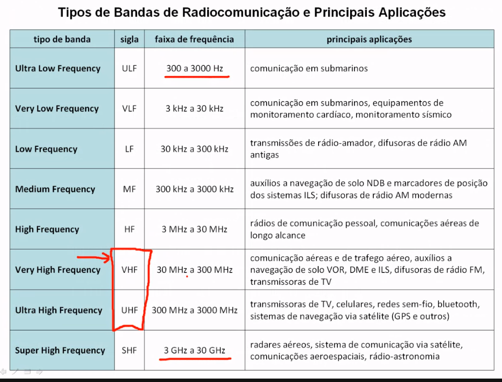

# Sistemas de comunicação e Navegação de aeronaves
Esse sistema estabelece a comunicação da aeronave, com sistemas de auxilio à navegação aérea e tráfego aéreo.

## Sistemas de comunicação de aeronaves

Dentro da central de controles o piloto em acesso a um sistema de radio frequência onde ele pode acessar as frequências de comunicação com a torre e outras aeronaves. Em vermelho vemos as frequências comumente usados por aeronaves.

## Sistema de controle do espaço aéreo
O sistema de controle do espaço aéreo brasileiro do comando da aeronáutica é o conjunto de órgãos responsáveis por gerenciar todas as operações aéreas no domínio 

Já foi disponibilizado o link do google drive para acessarmos o material da aula.
