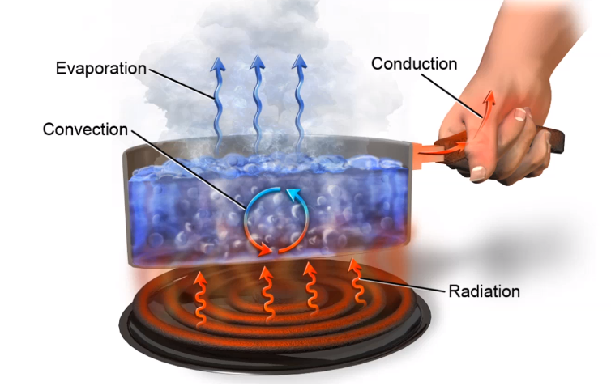
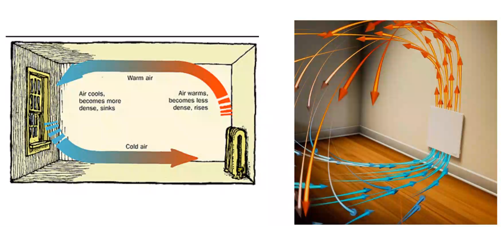
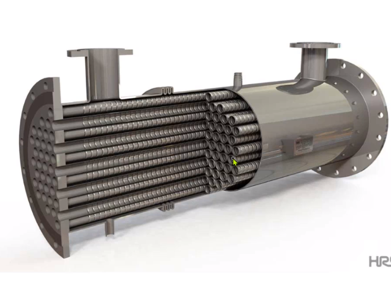
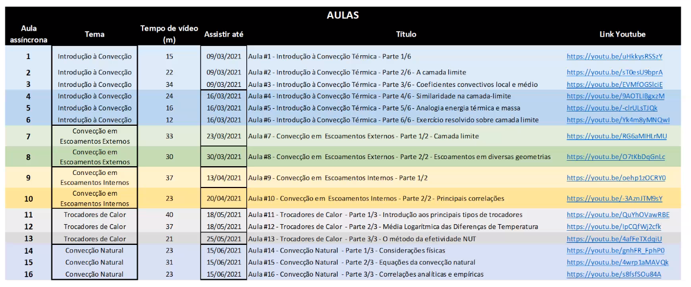

# Aula inaugural 
Começamos com uma revisão do nome da matéria uma vez que calor não se transfere, o próprio calor é a transferência de energia térmica. Logo a transferência da transferência de energia é algo que não faz mt sentido. 

Vemos na seguinte imagem as principais formas de calor. Vemos três mecanismos principais, como condução, radiação e convecção:

Ondas eletromagnéticas são capazes de levar energia até a panela. Essa energia é transferida via condução da superfície exterior da panela até o fluido através de condução. Quando transferido ao fluido essa energia faz a massa específica do fluido mudar o que resulta na movimentação desse fluido dentro da panela causando convecção. Parte da água pode mudar de fase com a temperatura e encaminhar essa energia para a atmosfera. Além disso a energia pode ser transferida via condução pelo cabo da panela até a mão presente na imagem.

## Convecção

A convecção é o tema principal dessa disciplina. Veremos a diferença entre convecção e advecção. A diferença de temperatura resulta em uma diferença de massa específica o que causa movimentação passiva do ar. Isso é convecção:

Tudo que conhecemos na atmosfera ocorre devido a dois mecanismos principais: a rotação da terra, com a força de Coriolis e também devido às diferenças de temperatura resultantes das diferentes formas de como a radiação do sol afeta a superfície terrestre.

Convecção natural versus forçada (advecção) depende muito da escala de observação. Ao analisarmos um ambiente pequeno como uma os movimentos de uma arvore encaramos o vento como um processo forçado, uma vez que ele já entra no sistema considerado em movimento, mas se analisarmos a terra como um todo, esse vento faz parte de um processo de convecção natural.

## Introdução
A disciplina aborda tanto a parte mais prática da dinâmica dos fluidos quanto a parte mais teórica.
Um trocador de calor do tipo casca e tubo é um dos mais comuns e flexíveis. Ele resiste a baixas e altas pressões e todo tipo de fluido interno. Temos vários tubos onde algum fluido passa internamente, e um container externo onde por fora um segundo fluido passa. Dessa forma energia térmica passa entre as duas substância por condução. Mas sem misturar os fluido, mantendo os sistemas isolados de um ponto de vista de massa.

Apesar de ser muito flexível ele é muito grande e as vezes não é muito aplicado em algumas situações. Pra isso outros trocadores de calor são usados.

Um exemplo de trocador de calor pequeno são veículos de uma forma geral. Pois não queremos muita massa armazenada no sistema de troca de energia térmica. Pra isso utilizam-se trocadores de calor do tipo compacto. Uma das limitações desse tipo de sistema é não aguentar grandes diferenças de pressão. Assim, cada tipo de trocador de calor tem sua aplicação, custo de instalação e manutenção e todo projeto de engenharia precisa levar esses fatores em conta. 

Como um exemplo de aplicação foi uma pessoa que decidiu por um trocador de calor no ralo do chuveiro pra aproveitar a energia elétrica gasta no aquecimento da água. Mas a manutenção era muito cara devido a dejetos que se impregnavam no equipamento. Além disso entrou o fator psicológico, que as pessoas da casa acharam que podiam passar mais tempo no banho devido ao trocador, acarretando um maior gasto com energia.

## Sobre a ementa
O objetivo da matéria é explicar os fenômenos da transferência de calor por convecção. Analisar e aplicar os conhecimentos básicos da convecção de calor em problemas térmicos. Aplicar os conhecimentos em transferência de calor na analise de projetos de trocadores de calor. 

Na ementa temos:

- Leis básicas de convecção térmica.
- Transferência de calor por convecção natural.
- Convecção em escoamentos externos.
- Convecção em escoamento no interior de dutos.
- Trocadores de calor.

Teremos aulas assíncronas serão feitas para passar o conteúdo e aulas síncronas para tirar dúvidas e fazer tarefas.

Teremos duas provas (11/05 - 20 pontos) e (15/06 - 30 pontos). São 24 horas pra resolver questões. A prova é dada 10:40. Ele passa a atividade e anexamos nossas respostas na tarefa.

Teremos um trabalho final também. Está estimada a entrega para 25/05 até 20/06. Ela tem um cunho bem prático e será feita em grupo. Com foco em troca de calor.

Estudantes que responderem provas e trabalhos na língua inglesa receberão acréscimos no ponto da avaliação. O mesmo vale para a apresentação do trabalho. O trabalho terá um vídeo gravado apresentado e um relatório.

Para a bibliografia base temos çengel e incropera. Como leitura adicional temos "Convection and heat transfer".

As aulas são disponibilizadas pelo Youtube:

https://www.youtube.com/playlist?list=PLoj8bKE80RQKCjqA5DIgdautBKRxOyq38

Os materiais do curso estão no Microsoft Teams.

Temos site com informações adicionais.
https://sites.google.com/view/joaorodrigoandrade
