# Introdução a convecção térmica
Veremos a introdução ao fenômeno da convecção térmica. Veremos como e porquê ele ocorre e suas consequências.

Podemos ver um ventilador empurrando o ar de encontro a uma parede aquecida (temperatura maior que a do ar incidente). O ar retirará energia térmica da superfície. Quanto menor a temperatura do fluido ou maior o fluxo de ar mais energia será retirada da placa mais rápido pelo ar passante. Isso é chamado de convecção forçada.

Em um outro caso, temos novamente uma placa aquecida em contato com ar relativamente frio. A medida que o ar frio se aproxima da placa e entra em contato com ela, ele recebe energia da placa se aquecendo. O ar, sendo um gás perfeito, tem sua massa específica diminuída o que causa sua ascensão. A subida desse ar abre espaço para mais ar quente se aproximar da placa. Isso causa um ciclo que podemos chamar de convecção natural onde a própria variação de temperatura causa movimento no fluido.

Por último temos ar parado, ou seja, sem o fenômeno da convecção. Ou seja, temos a placa aquecida e o ar estático em cima o que resulta em calor somente por condução. Essa situação não é puramente teórica, pois isso ocorre onde não há espaço para o ar circular no movimento convectivo. Como no caso em que há duas placas de vidro próximas um da outra com ar entre as duas.

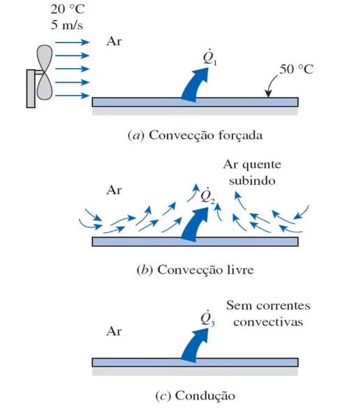

Um exemplo do dia a dia é quando sopramos uma colher de sopa quente para esfriá-la. Isso é um clássico caso de convecção forçada.

## Definição formal da convecção:
Convecção é a transferência de energia que ocorre entre uma superfície e um fluido em movimento, devido ao movimento deste fluido. A energia pode migrar nos dois sentidos, indo do fluido à superfície. A convecção ocorre divido à advecção. O termo responsável pela movimentação do fluido é o termo advectivo ele se refere ao transporte de energia via transporte de massa. Assim temos a convecção dividida em duas formas de transferência de energia: Condução mais advecção, onde a advecção se relaciona com a transferência de massa enquanto a condução se relaciona com o trasporte de energia que ocorre sem movimentação de massa.

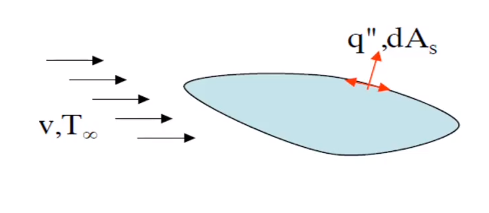

## As camadas limite da convecção
Este fenômeno é governado por algo que ocorre na fronteiro entre o sólido e o fluido. Toda essa transferência depende dessa região de contato. Vale a pena lembrar algumas coisas sobre esse tópico.

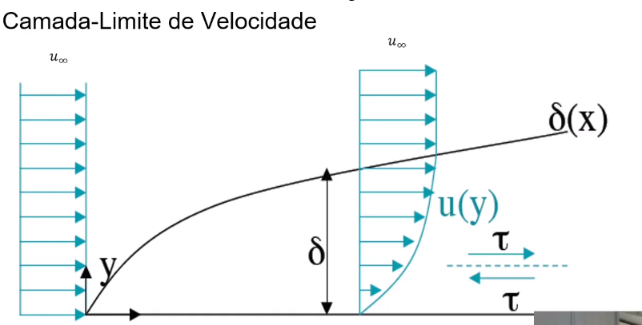

Podemos ver que em $y = 0$ a velocidade é nula. Ou seja, o fluido que toca a placa está parado. Este elemento de volume de fluido afeta um outro elemento a partir de forças viscosas cisalhantes que afeta fluido que corre na direção paralela à placa. Essa força é proporcional à diferença de velocidade entre os dois elementos de fluido. Conforme nos afastamos da placa a velocidade do elemento de volume aproxima-se de $u_\infty$ e o gradiente diminui, tendendo a zero no fim da camada limite. O ponto de maior gradiente de velocidade é o ponto de contato com o meio sólido e consequentemente esse é o ponto de maior força cisalhante.

Outra coisa que podemos observar é que ela evole conforme o escoamento avança sobre a superfície. E é importante frisar que esta curva representa um escoamento laminar. Tal organização, com movimentação de fluido somente paralela à placa sólida depende dessa hipótese. Com escoamentos turbulentos as forças inerciais criam padrões caóticos e desordenados de movimentação em todas as direções.

As camadas limite da convecção fornecem a base para o coeficiente de atrito local $C_f$ que é um parâmetro adimensional chave para a determinação do arrasto:

$
    C_f = \frac{\tau_s}{\rho u_\infty^2/2}
$

A tensão cisalhante na superfície do sólido pode ser vista adiante:

$
    \tau_s = \mu \frac{\partial u}{\partial y} |_{y=0}
$

Assim vemos que tanto a velocidade quanto a viscosidade são grandezas muito importantes nessa análise.
É interessante notar que a viscosidade de varia com a temperatura. Isso pode ser visto adiante:

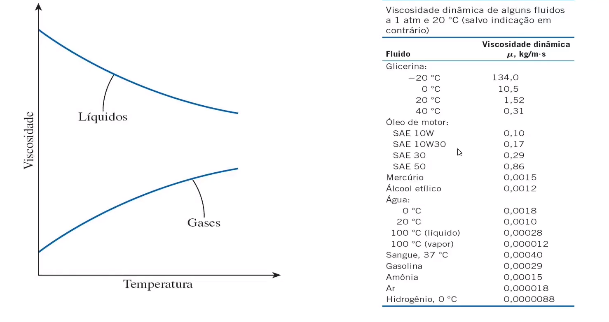

Além da camada limite de velocidade também temos a camada limite térmica. Ela, assim como a velocidade, abrange a área de transição entre o meio fluido em certa temperatura e o meio sólido em outra. Seu comportamento é parecido com a da velocidade. Temos também um $T_\infty$ global do fluido e a temperatura do fluido em contato direto com a placa também é igual à temperatura dela.

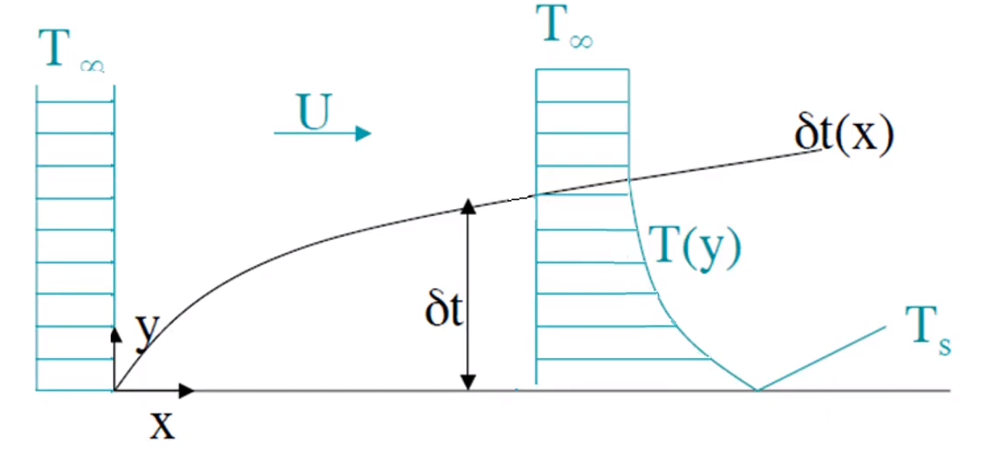

Neste caso, para determinar o tamanho da camada limite térmica usamos da seguinte expressão:

$
    \frac{\theta}{\theta_s} = \frac{T_s - T(y)}{T_s - T_\infty} = 0.99
$

O gradiente de temperatura também cria um fluxo térmico, da mesma forma como o gradiente de velocidade cria a força viscosa. Para qualquer distância x da aresta frontal, o floxo térmico na superfície local pode ser obtido pela lei de Fourier no fluido em $y = 0$.

$
    q_s^{\prime\prime} = -k_f \frac{\partial T}{\partial y}|_{y=0}
$

A partir da lei de resfriamento de Newton podemos dizer que:

$
    q_s^{\prime\prime} = h (T_s - T_\infty)
$

Onde h é um coeficiente chamado de coeficiente de convecção que engloba todos os efeitos da camada limite.
Um dos objetivos dessa disciplina é determinar essa constante:

$
    h = \frac{- k_f \frac{\partial T}{\partial y}|_{y = 0}}{T_s - T_\infty} 
$

Onde $k_f$ é o coeficiente de condução térmica do fluido. As propriedades do material sólido não entram nesse tipo de estudo. Podemos ver que o perfil de temperatura também é importante. Se formos capazes de deduzir o valor de h, podemos calcular o calor na superfície de estudo.

Também temos a camada limite de concentração que estabelece a presença de certa substância no fluido. Um exemplo é quando você passa perfume, onde sua pele começa a emitir essas partículas com cheiro e a forma como se passa esses componente está descrito adiante.

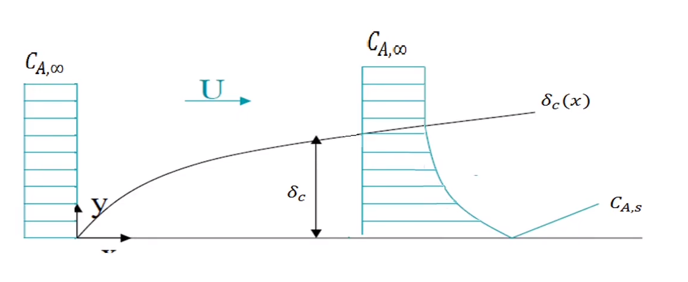

Ainda temos uma camada limite com espessura que pode ser determinada de forma similar a da camada limite térmica.

$
    \frac{C_{A,s} - C_A(y)}{C_{A,s} - C_{A,\infty}} = 0.99
$

Também podemos ver como as equações são similares, a partir da lei de Fick:

$
    N_A^{\prime\prime} = -D_{AB} \frac{\partial C}{\partial y}|_{y=0}
$

Assim, analogamente à lei de resfriamento de Newton:

$
    N_A^{\prime\prime} = h_m (C_{A,s} - C_{A,\infty})
$

$
    h_m = \frac{- D_{AB} \frac{\partial C_A}{\partial y}|_{y = 0}}{C_{A,s} - C_{A,\infty}} 
$

Podemos dizer que a camada limite hidrodinâmica existe em qualquer escoamento sobre qualquer superfície. Grandes gradientes de velocidade causam grandes tensões cisalhantes.

A camada limite térmica existirá sempre que houver uma diferença de temperatura entre o fluido e a superfície sólida. Isso estabelece um gradiente de temperatura que resulta em calor.

## Coeficiente de convecção local e o coeficiente de convecção total.
Ele pode ser usado para a modelagem e a previsão de uma determinada quantidade de energia térmica sendo transportada.

O fluxo de energia térmica local é determinado pela quantidade de energia que deixa aplaca em um elemento de área dela. Esse fluxo local pode variar ao longo da superfície e a soma de todas fornece o fluxo de energia térmica total.

$
    q = \int_{A_s} q^{\prime\prime} d A_s
$

Para calcular o calor total precisamos estabelecer um elemento de área, calculando o produto dessa área pelo fluxo de calor local e integrando para toda a área.

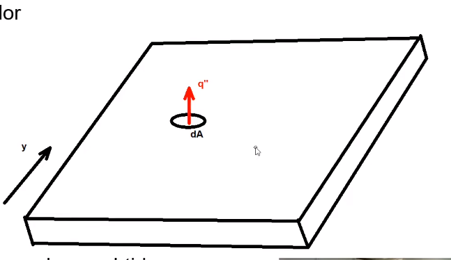

Como vimos anteriormente, a lei de resfriamento de newton pode estabelecer o fluxo de calor. A fórmula pode ser usada na determinação de variáveis locais também.

Dessa forma, integrando $q^{\prime\prime} = h (T_s - T_\infty)$ temos:

$
    q = (T_s - T_\infty) \int_{A_s} h d A_s
$

O que define o um coeficiente convectivo médio. Também se assume que a temperatura da superfície é uma temperatura de superfície média e constante por toda a placa. Já o h é uma propriedade local do elemento de área.

Porém também podemos definir um valor médio para o coeficiente $h$ resultando em um $\overline{h}$. O que nos dá uma equação de calor total de (resolvendo a integral):

$
    q = \overline{h} A_s (T_s - T_\infty) 
$

O coeficiente convectivo local e médio tem a seguinte relação:

$
    \overline{h} = \frac{1}{A_s} \int_{A_s} h d A_s
$

Para uma placa plana, h varia apenas com a distância x da aresta frontal, logo:

$
    \overline{h} = \frac{1}{L} \int_{0}^1 h dx
$

O fluxo local e a taxa de transferência total de calor e massa são de grande importância em problemas de convecção. As equações para determinação do fluxo e da taxa dependem dos coeficientes convectivos local e médio. A transferência por convecção é influenciada pela camada-limite. Os coeficientes convectivos dependem de várias propriedades dos fluidos como, densidade, viscosidade, condutividade térmica e valor específico. Os coeficientes convectivos são funções, também, da geometria da superfície e das condições do escoamento.

A determinação desse coeficiente é o problema da convecção. Nosso principal alvo.

## Escoamento laminar e turbulento
Como podemos quantificar a turbulência? Isso é importante uma vez que a turbulência altera de forma dramática a natureza e a geometria da camada limite.

Para quantificar a turbulência usamos o coeficiente de Reynolds. Ele pode ser descrito pelos seguintes equacionamentos:

$
    Re = \frac{Forças_{inerciais}}{Forças_{viscosas}} = \frac{\rho V^2_{med} L^2}{\mu V_{med} L} = \frac{\rho V_{med} L}{\mu} = \frac{V_{med} L}{\nu}
$

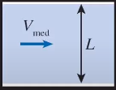

Ao aumentar a velocidade de um objeto aumentamos sua inércia. Assim, quanto maiores as forças inerciais, menos significativas são as forças viscosas, que são os amortecedores do sistema. Assim, forças inerciais aumentam a complexidade do fluido ao aumentar o número de graus de liberdade do sistema, enquanto as forças viscosas diminuem a complexidade do fluido ao amortecer e restringir a movimentação diminuindo o número de graus de liberdade.

Na equação final podemos ver que o número de Reynolds é igual á razão do produto entre a velocidade média e o comprimento característico e a viscosidade cinemática.

No caso de um tubo, o diâmetro é o comprimento característico, por exemplo.

O efeito da turbulência na camada limite pode ser descrito brevemente por uma palavra: desorganização. Não temos a movimentação normal à placa dividida em camadas. Ocorre constantes trocas de massa em direções normais à placa.

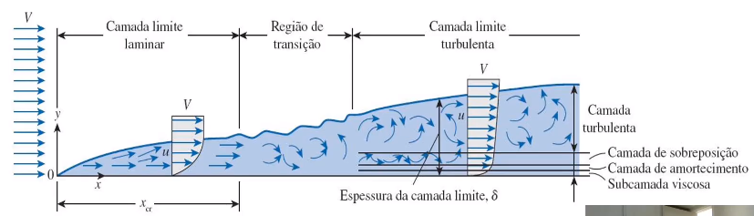

Podemos notar que o número de Reynolds aumenta com o desenvolvimento do escoamento, estando então em função de x. Podemos ver também que o perfil de velocidade média turbulenta tem um gradiente de velocidade muito mais acentuado próximo à superfície sólida, o que aumenta as forças cisalhante e aumenta a força de atrito viscosa.

O mesmo ocorre com o perfil da energia térmica, o que aumenta o fluxo de energia térmica.

- A camada limite laminar é organizada, ordenada e assume um comportamento de regime permanente.
- A zona de transição do escoamento tem comportamento hora laminar, hora turbulento.
- Camada limite turbulenta tem uma movimentação desorganizada e desordenada.

O número de Reynolds também é uma medida relativa. Muitos estudos experimentais nos deram descrições detalhadas de muitos sistemas e de como a turbulência afeta esses sistemas, cada qual com seus efeitos específicos a dados números de Reynolds.
Temos também mecanismos de gatilho que ocorrem nas faixas de transição entre o escoamento turbulento e laminar. Isto pode ser flutuações na corrente, rugosidade de superfície e vibrações na superfície.

Com um escoamento turbulento temos a dinâmica das estruturas turbilhonares afetando a dinâmica do fluido, tais movimentos causam uma ampliação das estabilidades que resulta em um regime caótico em um fluido turbulento completamente desenvolvido.

Como exemplo, para placas, temos: $Re_{x,c} = \frac{\rho u_\infty x_c}{\mu} = 5 * 10^5$ em camadas limite planas.

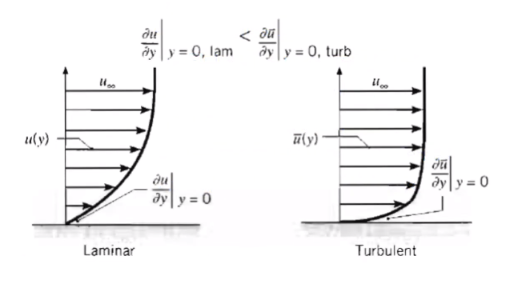

Vemos que o escoamento laminar assume um perfil de velocidade parabólico e em regime permanente. Enquanto o perfil de velocidade turbulento tem um maior gradiente e não assume um regime permanente, só em sua média.

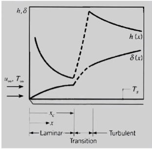

Podemos ver o comportamento da camada limite térmica também. Ele resulta em um calor maior entre o fluido e a placa sólida. O comportamento é similar ao da camada limite dinâmica. Tudo isso é profundamente alterado pela natureza do escoamento.

## Exercícios da aula

Experiments have shown that, for aiflow at $T_\infty = 35^oC$ and $V_1 = 100 m/s$, the rate of heat transfer from a turbine blade of characteristic length $L_1 = 0.15 m$ and surface temperature $T_{s,1} = 300^oC$ is $q_1 = 1500 W$. What would be the heat transfer rate from a second turbine blade of characteristic length $L_2 = 0.3 m$ operating at $T_{s,2} = 400^oC$ in airflow of $T_\infty = 35^oC$ and $V_2 = 50 m/s$? The surface area of the blade may be assumed to be directly proportional to its characteristic length.

Inicialmente é interessante fazer algumas hipóteses:
- Escoamento permanente.
- Propriedades constantes.
- Mesma forma geométrica das pás.
- Radiação desprezível.
- Fluido newtoniano.

Temos o seguinte esquema do problema:

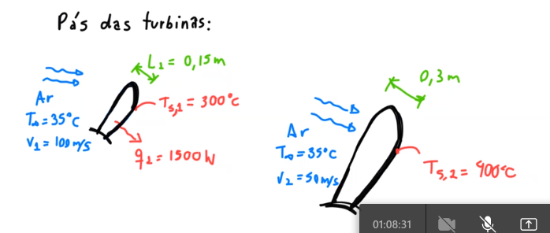

Temos o número de Nusselt definido como:

$
    \overline{Nu} = \frac{\overline{h} L}{k} = f(Re,Pr)
$

O número de Reynolds também pode ser calculado com:

$
    Re_1 = \frac{V_1 L_1}{\nu} = \frac{100 * 0,15}{\nu} = \frac{15}{\nu}
$

$
    Re_2 = \frac{V_2 L_2}{\nu} = \frac{50 * 0,3}{\nu} = \frac{15}{\nu}
$

Assim temos que $Re_1 = Re_2$.

Os números de Nusselt médios são:

$
    \overline{Nu}_1 = \frac{\overline{h}_1 L_1}{k} = f(Re_1,Pr_1)
$

$
    \overline{Nu}_2 = \frac{\overline{h}_2 L_2}{k} = f(Re_2,Pr_2)
$

Uma vez que or números de Reynolds são iguais e os números de Prandtl também são iguais, podemos dizer que os número de Nusselt são iguais. Isso nos permite concluir que:

$
    \frac{\overline{h}_1 L_1}{k} = \frac{\overline{h}_2 L_2}{k} \rightarrow   \frac{\overline{h}_2}{\overline{h}_1} = \frac{L_1}{L_2}
$

Assim, para as pás 1 temos:

$
    q_1 = A_1 \overline{h}_1 (T_1 - T_\infty) \rightarrow \overline{h}_1 = \frac{q_1}{A_1 (T_1 - T_\infty)}
$

Enquanto para as pás 2 temos:

$
    q_1 = A_2 \overline{h}_2 (T_2 - T_\infty) \rightarrow q_2 = A_2 (\frac{\overline{h}_1 L_1}{L_2}) (T_2 - T_\infty) 
$

Assim, substituindo em $h_1$ a equação da pá 1 temos:

$
    q_2 = A_2 \frac{L_1}{L_2} [\frac{q_1}{A_1 (T_1 - T_\infty)}](T_2 - T_\infty) \rightarrow q_2 = \frac{A_1}{A_2} \frac{L_1}{L_2} \frac{(T_2 - t_\infty)}{(T_1 - t_\infty)} * q_1
$

Observando no enunciado que há uma proporção entre a área e o comprimento ($\frac{A_2}{A_1} = \frac{L_1}{L_2}$) temos:

$
    q_2 = \frac{t_2 - T_\infty}{T_1 - t_\infty} q_1 = 2066W
$

---
Mais exercícios estão disponíveis nos arquivos do Teams.

