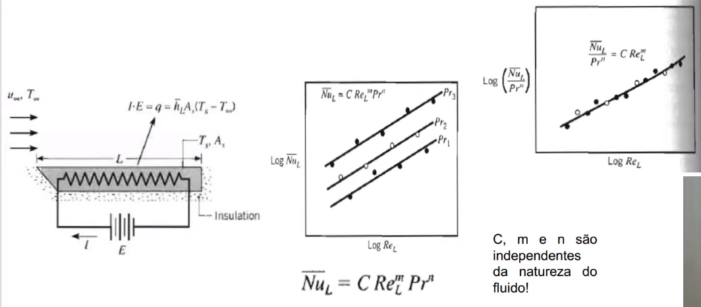
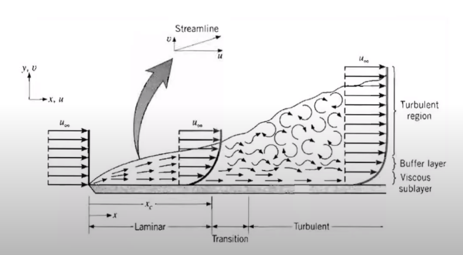
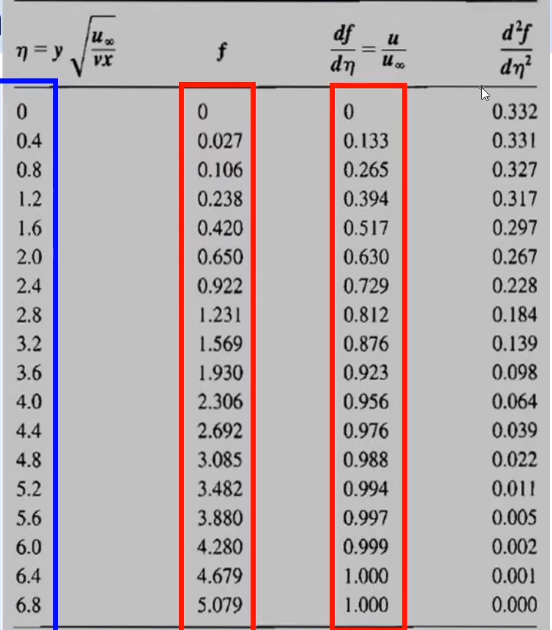
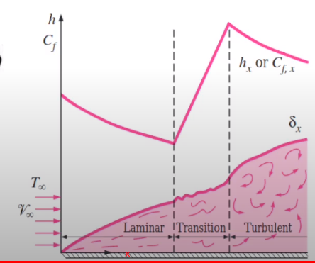

# Escoamentos externos
Iremos tratar de escoamentos externos. Nesse assunto estudamos corpos imersos em fluidos.

Como exemplo podemos ver esse caminhão:

Ele é um caminhão frigorífico que é mais frio que o escoamento ao redor. Dessa forma, o escoamento leva energia ao objeto e tem a velocidade do veículo acrescido da velocidade do ar local.

Para esse tipo de análise algumas grandezas adimensionais são importantes. Dentre elas:

Referente a transferência de energia:
- $Nu_x = f(x^\ast,Re_x, Pr)$
- $\overline{Nu_x} = f(Re_x, Pr)$

Referente a transferência de massa:
- $Sh_x = f(x^\ast, Re_x, Sc)$
- $\overline{Sh_x} = f(Re_x, Sc)$

Essas relações vem de análises empíricas, teóricas e numéricas.

#### O método empírico
O método empírico envolve a execução de medidas de calor ou de transferência de massa sob condições controladas envolvendo correlação de dados em termos de parâmetros adimensionais.

Como esses parâmetros são independentes da natureza do fluido isso nos garante ampla aplicabilidade.

#### O método teórico
Outra forma de se conseguir os parâmetros da análise é de forma teórica. Isso se dá a partir das equações diferenciais que descrevem o comportamento do fluido e das simplificações que podemos fazer sobre o sistema.

Analisaremos somente o trecho laminar desse escoamento.

Neste estudo utiliza-se a solução por similaridade, também conhecida como método de Blasius. Onde podemos definir as funções corrente:

$
u = \frac{\partial \Psi}{\partial y}
$

$
v =- \frac{\partial \Psi}{\partial x}
$

Assim, conseguimos uma nova variável dependente:

$
f(\eta) = \frac{\Psi}{u_\infin \sqrt{\frac{\nu x}{u_\infin}}}
$

$
\eta = y \sqrt{\frac{u_\infin}{\nu x}}
$

Assim, tínhamos as funções $u$ e $v$ e variáveis $x$ e $y$, mas agora só temos $\eta$ e $\Psi$. Isso é conveniente para os cálculos.

Assim, aplicando essas novas variáveis nas equações iniciais nos dá:

$
u = \frac{\partial \Psi}{\partial y} = \frac{\partial \Psi}{\partial \eta} \frac{\partial \eta}{\partial y}=u_\infin \sqrt{\frac{\nu x}{u_\infin}} \frac{df}{d\eta} \sqrt{\frac{u_\infin}{\nu x}} = u_\infin \frac{df}{d \eta}
$

$
v = - \frac{\partial \Psi}{\partial x} = -(u_\infin \sqrt{\frac{\nu x}{u_\infin}}\frac{\partial f}{\partial x} + \frac{u_\infin}{2}\sqrt{\frac{\nu}{u_\infin x}}f)
$

Também podemos desenvolver as derivadas:

$
\frac{\partial u}{\partial x} = -\frac{u_\infin}{2x} \eta \frac{d^2 f}{d \eta^2}
$

$
\frac{\partial u}{\partial y} = u_\infin \sqrt{\frac{u_\infin}{\nu x}} \frac{d^2 f}{d \eta^2} 
$

$
\frac{\partial^2 u}{\partial y^2} = \frac{u_\infin^2}{\nu x} \frac{d^3 f}{d \eta^3}
$

Assim substituindo na equação do movimento, podemos trocar o cálculo multi variável por uma equação diferencial ordinária não linear:

$
u \frac{\partial u}{\partial x} + v \frac{\partial u}{\partial y} = \nu \frac{\partial^2 u}{\partial y^2}
$

Que resulta em: 

$
2 \frac{d^3 f}{d \eta^3} + f \frac{d^2f}{d\eta^2} = 0
$

Com as condições de contorno iguais a:

- $u(x,0) = \nu(x,0)=0$
- $u(x,\infin) = u_\infin$

Que resultam em:

- $\frac{df}{d\eta}|_{\eta = 0} = f(0) = 0$
- $\frac{df}{d\eta}|_{\eta \rightarrow \infin} = 1$

Essa equação pode ser resolvida e temos a seguinte solução:

Além disso isso pode nos dar a solução teórica para a tensão de cisalhamento:

$
\tau_s = \mu \frac{\partial u}{\partial y}|_{y = 0}
$

$
\tau_s = \mu u_\infin \sqrt{\frac{u_\infin}{\nu x}}\frac{\partial^2 f}{\partial \eta^2}|_{\eta = 0}
$

Que aplicando as condições de contorne apropriadas nos dá $\tau_s = 0,332u_\infin \sqrt{\frac{\rho \mu u_\infin}{x} }$.

O que pode nos dar um coeficiente de atrito em função somente do número de Reynolds: $C_{f,x}\equiv \frac{\tau_{s,x}}{\rho u_\infin^2/2} = 0,664Re_x^{-1/2}$

Quando falamos da equação da energia, podemos fazer a resolução da mesma forma. E resulta em:

$
\frac{d T^\ast}{d\eta}|_{\eta = 0} = 0,332 Pr^{1/3} \textrm{     (Para valores de Prandtl maiores ou iguais a 0,6)}
$

Isso nos permite calcular também o coeficiente de convecção local:

$
h_x = k(\frac{u_\infin}{\nu x})^{1/2} \frac{d T^\ast}{d \eta}|_{\eta = 0}
$

E isso nos permite calcular o numero de Nusselt para valores de Prandtl maiores ou iguais a $0,6$:

$
Nu_X \equiv \frac{h_x x}{k} = 0,332 Re_x^{1/2} Pr^{1/3}
$

Assim temos bons dados sobre escoamentos newtonianos, laminar, incompressível sobre uma placa plana perfeita horizontal. Assim temos muitas simplificações, mas ainda sim a análise nos dá boa noção sobre escoamentos.

Assim, também podemos calcular a razão entre a espessura da camada limite dinâmica e térmica:

$
\frac{\delta}{\delta_t} \approx Pr^{1/3}
$

E para alguns parâmetros médios, nós temos:

$
\overline{C}_{f,x} \equiv \frac{\overline{\tau}_{s,x}}{\rho u_\infin^2/2}
$

$
\overline{\tau}_{s,x} \equiv \frac{1}{x} \int^x_0 \tau_{s,x}dx 
$

Como sabemos que $\tau_x = 0,332u_\infin\sqrt{\rho\mu u_\infin/x}$, o coeficiente médio se torna uma função do número de Reynolds:

$
\overline{C}_{f,x} = 1,328Re_x^{-1/2}
$

E para a análise térmica temos (para valores de número de Prandtl maiores ou iguais a 0,6):

$
\overline{Nu_x} \equiv \frac{\overline{h}_x s}{k} = 0,664Re_x^{1/2}Pr^{1/3}
$

$
\overline{Nu_x} = 2 Nu_x
$

É interessante a gente analisar o significado físico de valores médios e locais. O valor local é relativo àquele ponto no local de análise e o fluxo de calor. E o médio representa uma média da placa daquela posição para trás (valor médio até aquele ponto x). 

#### Escoamento turbulento

Para um ecoamento turbulento a coisa é bem mais complexa. Dessa forma, nos baseamos em análises numéricas e empíricas que foram validadas com o tempo.

Para o coeficiente de atrito local temos: 

$
C_{f,x} = 0,0592Re_x^{-1/5}
$
, Considerando que 
$
Re_{x,c} \lesssim Re_x \lesssim 10^8
$

Onde o $Re_{x,c}$ é o número de Reynolds crítico.

Podemos ver que o decaimento é mais lento que o do escoamento laminar.

Para a espessura da camada limite temos:

$
\delta = 0,37xRe_x^{-1/5}
$

Aumenta mais rápido que o do escoamento laminar.

E também podemos dizer que a espessura da camada limite térmica é igual à espessura da camada limite dinâmica e independe dos valores de Prandtl.

Quanto ao número de Nusselt local temos, para valores de Prandtl maiores ou iguais a 0,6 e menores ou iguais a 60:

$
Nu_x = St Re_x Pr = 0,0296Re_x^{4/5} Pr^{1/3}
$

#### Para escoamentos mistos
Existem casos em que parte do escoamento é laminar e parte é turbulento. Para esses casos precisamos considerar o efeito de cada parte. Para isso, usamos para o número de Nusselt:

$
\overline{Nu}_L = (0,0037 Re_L^{4/5} - A)Pr^{1/3}
$

Onde:

$
A = 0,037Re_{x,c}^{4/5} -0,664Re_{x,c}^{1/2}
$

E para o coeficiente de atrito:

$
\overline{C_{f,L}} = 0,074Re_L^{-1/5} - \frac{2A}{Re_L}  
$
, considerando que
$
Re_{x,c} \lesssim Re_L \lesssim 10^8
$

E que

$
A = 0,037Re_{x,c}^{4/5} - 0,664Re_{x,c}^{1/2}
$

