# Camada limite e a convecção
Nesta etapa estudaremos os efeitos da camada limite sobre a convecção.

A camada limite estabelece a interação do meio fluido com a superfície sólida. Isso se dá por meio das diversas camadas limites que se formam:

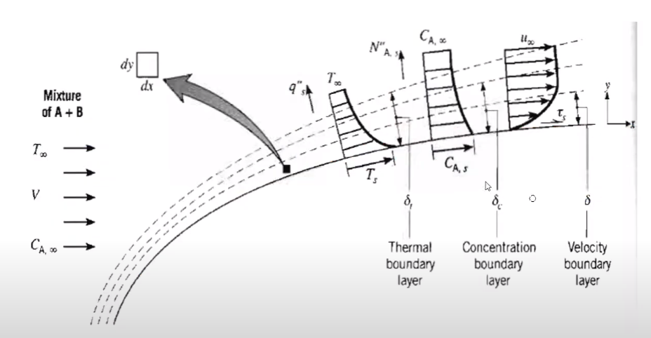

Trabalharemos com as equações diferenciais dessa camada limite:

$
\frac{\partial u}{\partial x} + \frac{\partial v}{\partial y} = 0
$

$
u \frac{\partial u}{\partial x} + v \frac{\partial u}{\partial y} = - \frac{1}{\rho} \frac{\partial p_{\infin}}{\partial x} + \nu \frac{\partial^2 u}{\partial y ^2}
$

$
u \frac{\partial T}{\partial x} + v \frac{\partial T}{\partial y} = \alpha \frac{\partial^2 T}{\partial y ^2} + \frac{v}{c_p} (\frac{\partial u}{\partial y})^2
$

Nessas equações temos alguns parâmetros de similaridade ($Re = \frac{VL}{\nu}$ , $Pr$) com as quais podemos adimensionalizar estas dimensões:

- $L$
- $V$
- $T_\infin$
- $T_s$
- $v$
- $\alpha$

Entre as variáveis adimensionalizadas temos:

- $x^\ast = \frac{x}{L}$
- $y^\ast = \frac{y}{L}$
- $u^\ast = \frac{u}{V}$
- $v^\ast = \frac{v}{V}$
- $T^\ast = \frac{T - T_s}{T_\infin - T_s}$
- $p^\ast = \frac{p}{\rho V^2}$

Dessa forma, substituindo essas na equação do movimento:

$
u^\ast V \frac{\partial u^\ast V}{\partial x^\ast L} + v^\ast V \frac{\partial u^\ast V}{\partial y^\ast L} = - \frac{1}{\rho} \frac{\partial p^\ast \rho V^2}{\partial x^\ast L} + \nu \frac{\partial^2 u^\ast V}{\partial {y^\ast}^2 L^2}
$

$
\frac{V^2}{L} u^\ast \frac{\partial u^\ast}{\partial x^\ast} + \frac{V^2}{L} v^\ast \frac{\partial u^\ast}{\partial y^\ast} = - \frac{V^2}{L} \frac{\partial p^\ast}{\partial x^\ast} + \nu \frac{V}{L^2} \frac{\partial^2 u^\ast }{\partial {y^\ast}^2}
$

Podemos também substituir Reynolds e simplificar:

$
u^\ast \frac{\partial u^\ast}{\partial x^\ast} +  v^\ast \frac{\partial u^\ast}{\partial y^\ast} = - \frac{\partial p^\ast}{\partial x^\ast} + \frac{\nu}{VL} \frac{\partial^2 u^\ast }{\partial {y^\ast}^2}
$

$
u^\ast \frac{\partial u^\ast}{\partial x^\ast} +  v^\ast \frac{\partial u^\ast}{\partial y^\ast} = - \frac{\partial p^\ast}{\partial x^\ast} + \frac{1}{Re} \frac{\partial^2 u^\ast }{\partial {y^\ast}^2}
$

Fazendo o mesmo processo para a energia térmica, nos dá:

$
u^\ast \frac{\partial T^\ast}{\partial x^\ast} +  v^\ast \frac{\partial T^\ast}{\partial y^\ast} =  \frac{1}{Re_L Pr} \frac{\partial^2 T^\ast }{\partial {y^\ast}^2}
$

Dessa forma notamos que o número de Reynolds representa a razão entre as forças inerciais e as forças viscosas. Isso pode ser visto da seguinte forma:

$
Re_L = \frac{u \frac{\partial u}{\partial x}}{\frac{\mu}{\rho}\frac{\partial^2 u}{\partial y^2}} = \frac{\frac{V^2}{L}}{\frac{\mu}{\rho} \frac{V}{L^2}} = \frac{V^2 \rho L^2}{\mu V L} = \frac{\rho V L}{\mu}
$

A definição do número de Prandtl pode ser feita como a razão entre a difusividade de quantidade de movimento linear e a difusividade térmica e pode ser vista adiante:

$
Pr = \frac{\nu}{\alpha}
$

Nos gases esse valor é próximo de $1$, nos óleos é muito maior que 1 enquanto nos metais líquidos é muito menor que 1. A consequência física pode ser vista adiante:

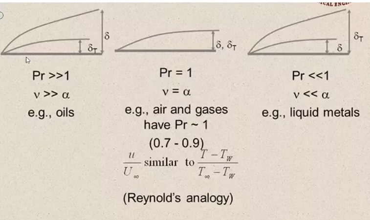

Dessa forma temos que a solução da equação da energia adimensional tem a seguinte forma:

$
T^\ast = f(x^\ast, y^\ast, Re_L, Pr, \frac{\partial p^\ast}{\partial x^\ast})
$

Dessa forma, considerando as seguintes equações:
- $h = \frac{-k_f \frac{\partial T}{\partial y}|_{y = 0}}{T_s - T_\infin}$
- $T^\ast = \frac{T - T_s}{T_\infin - T_s}$
- $y^\ast = \frac{y}{L}$

Podemos adimensionalizar o coeficiente de convecção da superfície:

$
h = - \frac{k_f}{L} \frac{T_\infin - T_S}{T_S - T_\infin} \frac{\partial T^\ast}{\partial y^\ast}|_{y^\ast = 0} =\frac{k_f}{L} \frac{\partial T^\ast}{\partial y^\ast}|_{y^\ast = 0}  
$

Isso nos leva à definição do número de Nusselt:

$
Nu = \frac{h L}{k_f} = \frac{\partial T^\ast}{\partial y^\ast}|_{y^\ast = 0}
$

Existem algumas formas do número de Nusselt, o local, médio e comum:

- Local : $Nu_x = f(x^\ast, Re_L, Pr)$
- Médio : $Nu = f(Re_L, Pr)$
- Comum : $Nu = C * Re_L^m * Pr^m$

O comum é muito utilizado para se achar um valor experimental para o número de Nusselt.
O significado físico da constante é a razão da transferência de calor por convecção e da transferência de calor por condução. Isso pode ser visto com a seguinte expressão:

$
Nu = \frac{h L}{k} = \frac{h L \Delta T}{k \Delta T} =  \frac{h \Delta T}{k \frac{\Delta T}{L}} 
$

Ou seja, quanto maior o número de Nusselt maior é a transferência de calor via convecção.

A partir do número de Nusselt podemos descobrir qual é o valor de $h$. Ele é muitas vezes encontrado de forma experimental.

Dessa forma vemos que alguns coeficientes podem nos ajudar muito no desenvolvimento das atividades de engenharia. Como exemplos podemos sitar o coeficiente de atrito, número de Nusselt e o número de Sherwood. O número de Sherwood é o análogo da transferência de massa ao número de Nusselt Assim ele diz qual é a relação da transferência de massa que ocorre por advecção. 

#### Analogia entre as camadas limite de velocidade e térmica e de concentração molar.
A analogia de Reynolds pode ser vista como uma relação entre o coeficiente de atrito com o número de Nusselt, estabelecendo uma relação que une estes termos. Isso nos permite calcular um quando não tivermos o outro($C_f, Nu$).

Podemos ver que as equações térmica e dinâmica dos fluidos são muito similares ao se tirar o termo de pressão da equação dinâmica:

$
u^\ast \frac{\partial u^\ast}{\partial x^\ast} +  v^\ast \frac{\partial u^\ast}{\partial y^\ast} = - \frac{\partial p^\ast}{\partial x^\ast} + \frac{1}{Re} \frac{\partial^2 u^\ast }{\partial {y^\ast}^2}
$

$
u^\ast \frac{\partial T^\ast}{\partial x^\ast} +  v^\ast \frac{\partial T^\ast}{\partial y^\ast} =  \frac{1}{Re_L Pr} \frac{\partial^2 T^\ast }{\partial {y^\ast}^2}
$

Quando temos um número de Prandtl igual a um, as  derivadas adimensionalizadas da velocidade e da temperatura no contato do fluido com a superfície sólida são iguais:

$
\frac{\partial u^\ast}{\partial y^\ast}|_{y^\ast = 0} = \frac{\partial T^\ast}{\partial y^\ast}|_{y^\ast = 0}
$

Além disso é importante lembrar da definição da tensão de cisalhamento (para podermos ver o valor do atrito) e do número de Nusselt:

$
\tau_s = \mu \frac{\partial u}{\partial y}|_{y = 0} = \frac{\mu V}{L} \frac{\partial u^\ast}{\partial y^\ast}|_{y^\ast = 0} 
$

$
C_f = \frac{\tau_s}{\frac{\rho V^2}{2}} = \frac{2}{Re_L} \frac{\partial u^\ast}{\partial y^\ast}|_{y^\ast = 0} 
$

$
Nu = \frac{h L}{k_f} = \frac{\partial T^\ast}{\partial y^\ast}|_{y^\ast = 0}
$

Assim, quando o número de Prandtl é igual a 1 podemos fazer a seguinte analogia:

$
C_{f,x} \frac{Re_L}{2} = Nu_x
$

ou:

$
\frac{C_{f,x}}{2} = St_x
$

Onde descobrimos uma nova grandeza adimensional chamada numero de Stanton. Ele é definido como segue:

$
St = \frac{h}{\rho c_p V} = \frac{Nu}{Re_L Pr}
$

Também podemos traçar uma analogia entre a transferência de calor e a transferência de massa. As equações diferenciais são idênticas, somente trocando o número de Prandtl pelo número de Schmidt, como podemos ver adiante:

$
u^\ast \frac{\partial T^\ast}{\partial x^\ast} +  v^\ast \frac{\partial T^\ast}{\partial y^\ast} =  \frac{1}{Re_L Pr} \frac{\partial^2 T^\ast }{\partial {y^\ast}^2}
$

$
u^\ast \frac{\partial C_a^\ast}{\partial x^\ast} +  v^\ast \frac{\partial C_a^\ast}{\partial y^\ast} =  \frac{1}{Re_L Sc} \frac{\partial^2 C_a^\ast }{\partial {y^\ast}^2}
$

Onde definimos o número de Schmidt como $Sc = \frac{\nu}{D} = \frac{\mu}{\rho D}$. Que é a razão entre a taxa de mudança da difusividade viscosa e a taxa de mudança da difusividade molecular.

Assim, a partir dessa semelhança podemos traçar da mesma forma os resultados:

$
Nu = f(x^\ast, Re_L) Pr^n
$

$
Sh = f(x^\ast, Re_L) Sc^n
$

Onde definimos o análogo ao número de Nusselt da análise térmica na análise de transferência de massa: O número de Sherwood, que pode ser definido como:

$
\overline{Sh_L} = \frac{\overline{h_m} L}{D_{AB}}
$

Observamos que temos um novo $h_m$, para a análise de transferência de massa. Assim, dividindo as duas equações chegamos em:

$
\frac{Nu}{Pr^n} = \frac{Sh}{Sc^n}
$

E também (substituindo as definições dos números de Nusselt e Sherwood):

$
\frac{h}{h_m} = \frac{k}{D_{AB}Le^n} = \rho C_p Le^{1 - n}
$

Temos também o fluxo molar de massa (kmol/sm^2): $n_A^{\prime\prime} = h_m(\rho_{A,s} - \rho_{A,\infin})$. 

Isso introduz $h_m$ que é o coeficiente de massa por convecção.

Além disso, vemos a introdução de uma nova grandeza, o número de Lewis: $Le = \frac{\alpha}{D_{AB}}$, onde $D_{AB}$ é o coeficiente de difusão binária.

Assim, se conhecemos o comportamento da camada limite térmica, sabemos a molecular, e vice versa.

Um exemplo de utilização da camada limite molecular é no resfriamento evaporativo:

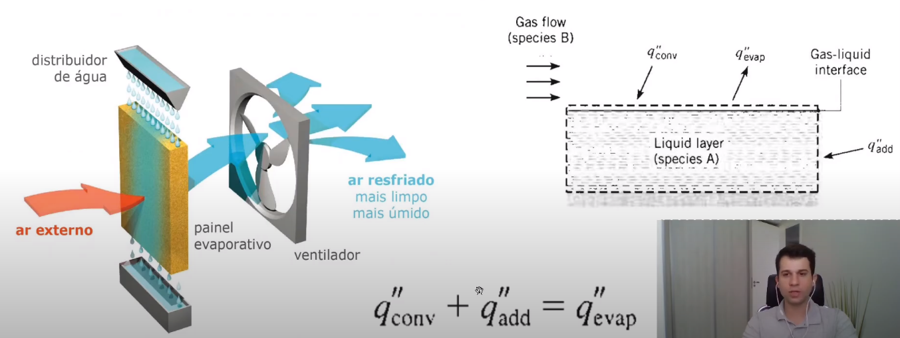

Ele é aplicado em muitas coisas do dia a dia, como ginásios e galpões.

Para saber a quantidade de calor que deixa o corpo devido à evaporação precisamos saber o valor do fluxo de massa evaporada:

$
q_{evap}^{\prime\prime} = n_A^{\prime\prime} h_{fg}
$

Onde $h_{fg}$ é o calor latente de evaporação.

Um tipo de atividade comum é onde consideramos que o calor devido à convecção e o calor devido à evaporação são iguais. Ou seja, se desconsidera o calor de condução na superfície sólida e se assume que toda energia absorvida pela evaporação deve vir do fluido.

A equação resultante é a que segue:

$
h(T_\infin - T_S) = h_{fg}h_m[\rho_{A,sat}(T_s) - \rho_{A,\infin}]
$

Assim, isolando a temperatura, podemos ver a diferença de temperatura entre a superfície e o meio externo no regime permanente:

$
T_\infin - T_s = h_{fg}(\frac{h_m}{h})[\rho_{A,sat}(T_s) - \rho_{A,\infin}]
$

Seguem alguns exercícios resolvidos sobre essa matéria:

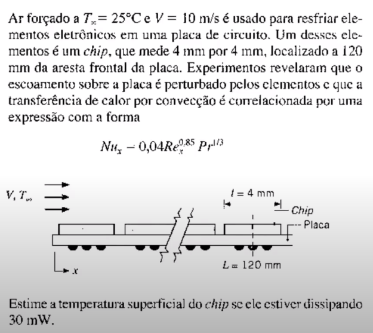

Solução:

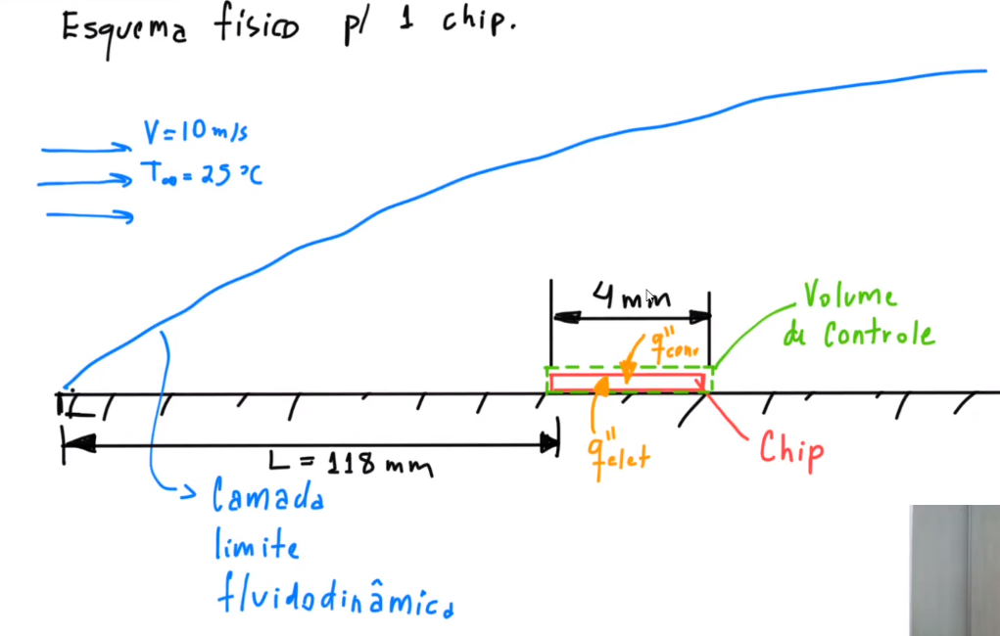

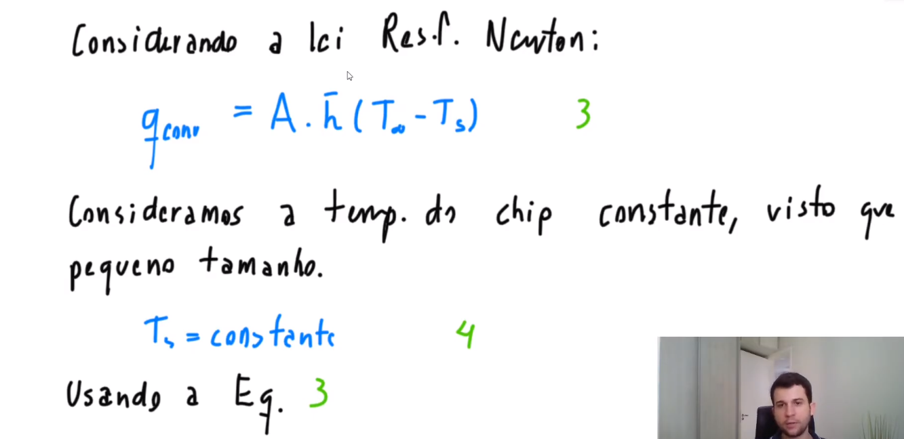

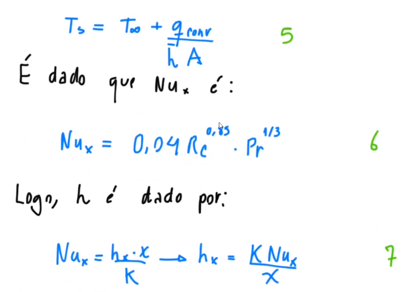

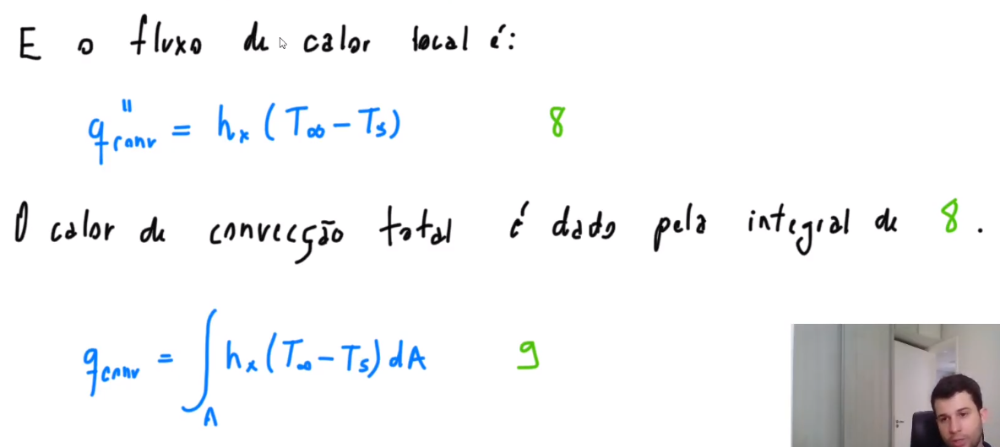

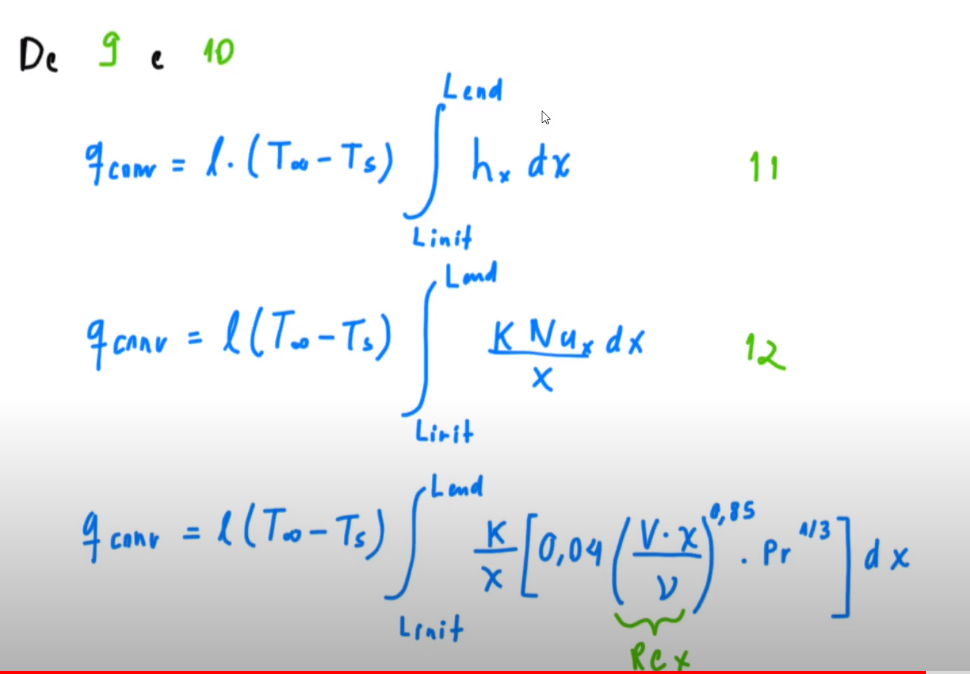

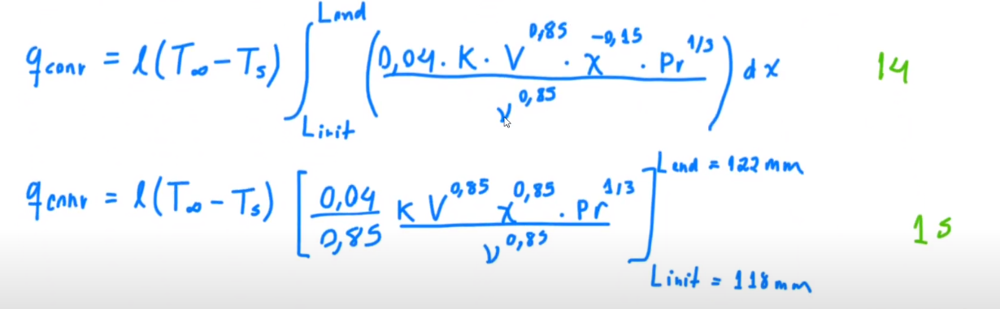

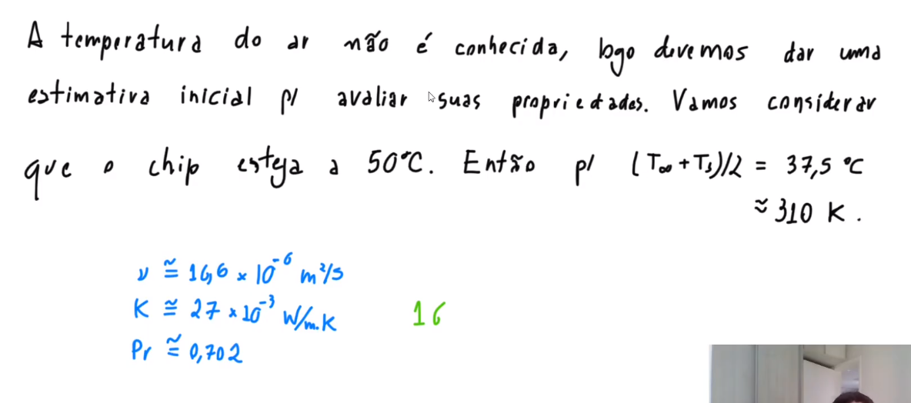

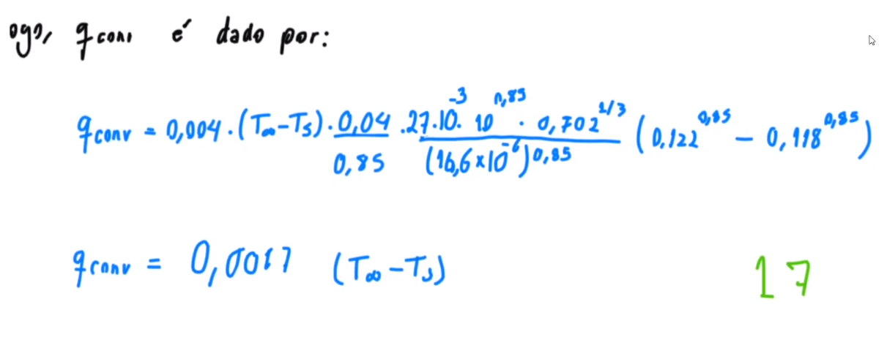

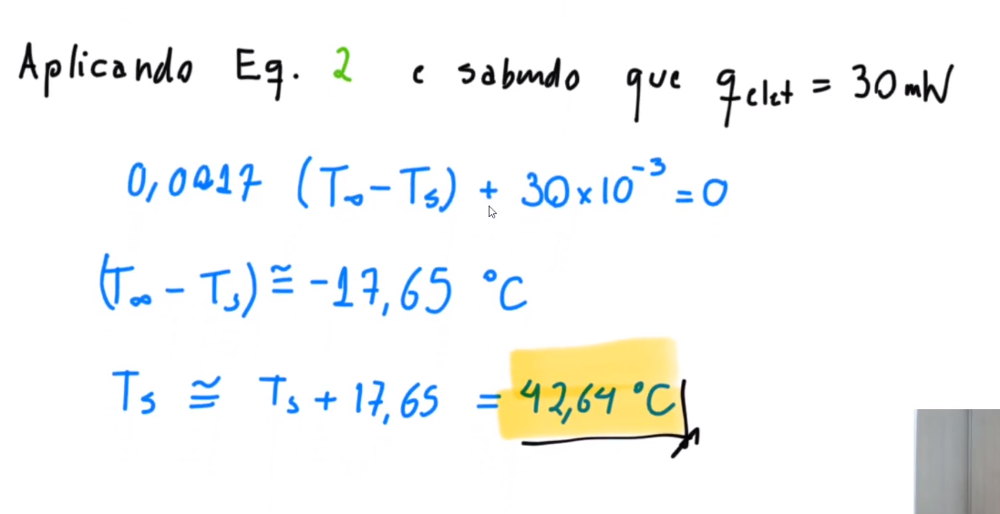

Observa-se a necessidade de implementar um processo iterativo uma vez que não tínhamos as temperaturas inicias. Assim deve-se criar um programa que executa esses cálculos sucessivamente até se atingir o resultado.
