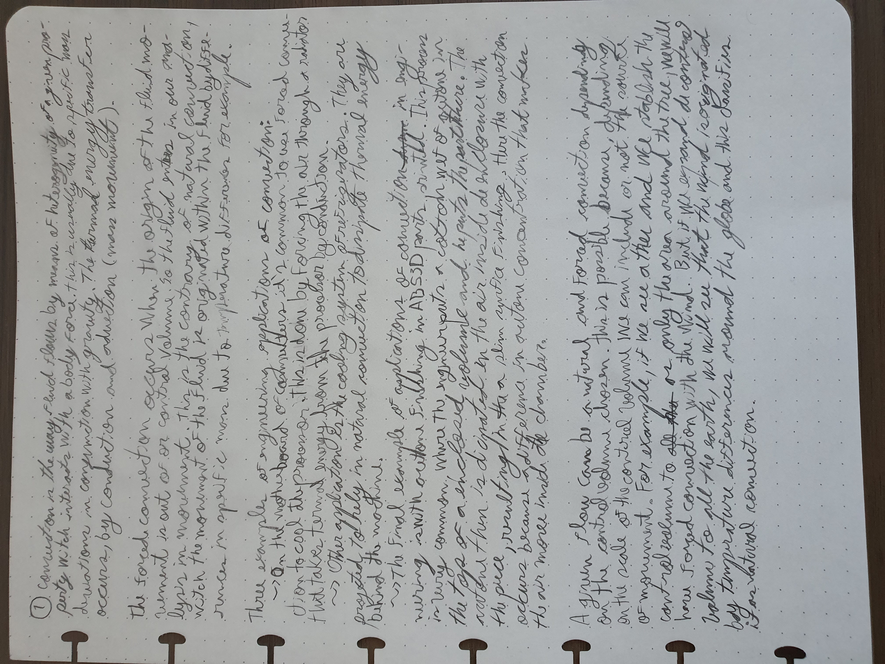
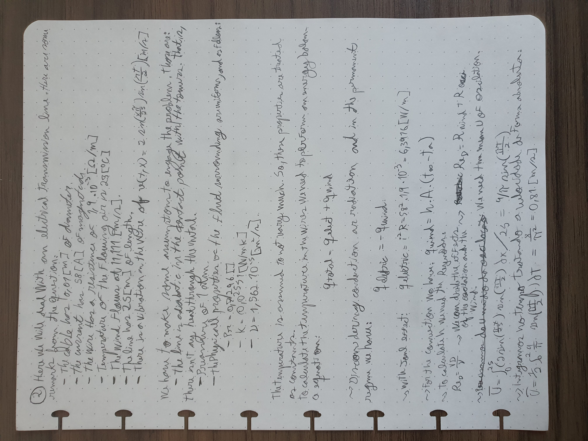
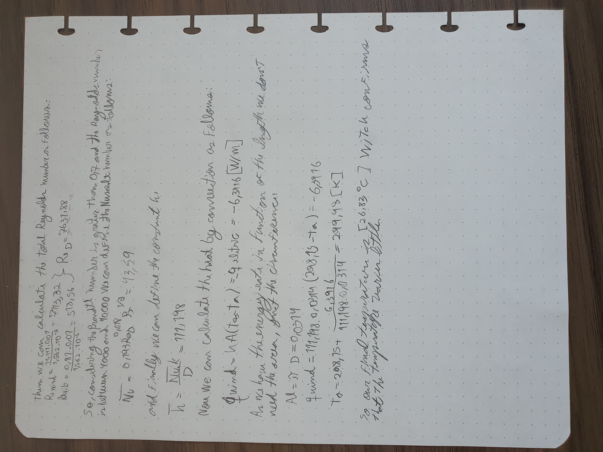

# Responses of TEST 1
Alune: Felipe J. O. Ribeiro (11711EAR012)

Professor: João R. Andrade

Date: 11/05/2021

**The manuscript version is on the end of the document.**

## Question 1
Convection is the way a fluid flows by means of heterogeneity of a given property witch interacts with a body force. This is usually due to specific mass deviations in conjunction with gravity. The thermal energy tranfer occurs, then, by conduction and advection (mass movement).

The forced convection occurs when the origin of the fluid movement is out of our control volume. So the fluid enters in our analysis in movement. This is the contrary of natural convection, witch the movement of the fluid is originated within the fluid by differences in specific mass due to temperature differences, for example.

Three examples of engineering applications of convection:
- In the motherboard of computers it's common to use forced convection to cool the processor. This is done by forcing air through a radiator that takes thermal energy from the processor by conduction.
- Other application is the cooling system of refrigerators. They are projected to rely in natural convection to dissipate thermal energy behind the machine.
- The final example of applications of convection in engineering is with acetone finishing in ABS 3D printed parts. This process is very common, where the engineer puts a cotton wet of acetone in the top of a enclosed volume and he puts the part there. The acetone then is dissipated in the air inside the enclosure with the piece, resulting in a slim surfice finishing. Here the convection occurs because of a difference in acetone concentration that makes the air move inside the chamber.

A given flow can be a natural and forced convection depending on the control volume chosen. This is possible because, depending in the scale of the control volume we can include or not the source of movement. For example, if we see a tree and we stablish the control volume as only the area around the tree, we will have forced convection with the wind. But if we expand the control volume to all the earth, we will see that the wind is originated by temperature differences around the globe and this classifies it as natural convection.

## Question 2
Here we will deal with an eletrical transmission line. Here are some remarks from the question description:
- The cable has $0,01[m]$ of diameter.
- The current has $58[A]$ of magnitude.
- The wire has a resistance of $1,9 * 10^{-3} [\Omega/m]$.
- Temperature of the flowing air is $25[^oC]$.
- The wind flows at $11,111 [m/s]$.
- The line has $25 [m]$ of length.
- There is a vibration in the wire of $v(t,x) = 2 \sin(\frac{\pi x}{25}) \sin(\frac{\pi t}{2}) [m/s]$.

We have to make some assumptions to engage the problem. Those are:
- The line is adiabatic in the contact point with the towers. That is, there isn't any heat through conduction on the metal.
- Pressure of 1 atm.
- The physicall properties of the surrounding fluid are uniform, and as follows:
    - $Pr = 0,7296 []$.
    - $K = 0,02551 [W/mK]$.
    - $\nu = 1,562 * 10^{-5} [m^2/s]$.

(parameters from https://www.engineersedge.com/physics/viscosity_of_air_dynamic_and_kinematic_14483.htm)

The temperature is assumed to not change much. So, these properties are treated as contants.

To calculate the temperature in the wires we need to performe an energy balance equation. But the thermal energy transfer by radiance is treated as negligible:

$
q_{total} = q_{electric} + q_{wind}
$

We consider the permanent regime where the temperature is constante in time, so the equation above is equal to zero. This gives us the following:

$
q_{electric} = - q_{wind}
$

The thermal energy from the electricity can be calculated with the Joule effect:

$
q_{electric} = i^2 * R = 58^2 * 1,9*10^{-3} = 6,3916 [W/m]
$

And, for the convection thermal energy transfer we have:

$
q_{wind} = h * A * (T_\infty - T_a)
$

To calculate $h$ we need the Nusselt number. But first we need the Reynolds number. So:

$
Re_D = \frac{V D}{\nu}
$

With the sum of the flow mean velocity with the oscilative motion of the wire, we have the relative fluid motion:

$
U_\infty (t,x) =11,111 + 2 \sin(\frac{\pi x}{25}) \sin(\frac{\pi t}{2})
$

We can finde the Reynolds number by composing the oscillatory effect with the air mean velocity effect as follows:

$
Re_D(t,x) = Re_{wind} + Re_{vib}(t,x)
$

Notice that the Reynolds number from the oscillatory motion varies with time, as the velocity varies as defined priviously. To address that we need to find the Mean velocity of the oscillatory motion.

$
U_{vib}(t) =\frac{1}{25} \int^{25}_0 (2 \sin(\frac{\pi x}{25}) \sin(\frac{\pi t}{2})) dx
$

$
U_{vib}(t) = \frac{2}{25} \sin(\frac{\pi t}{2}) \int^{25}_0 ( \sin(\frac{\pi x}{25}) ) dx
$

$
U_{vib}(t) = \frac{2}{25} \sin(\frac{\pi t}{2}) | - \frac{25}{\pi} \cos(\frac{\pi x}{25})|^{25}_0
$

$
U_{vib}(t) = \frac{2}{25} \sin(\frac{\pi t}{2})[\frac{25}{\pi}(-\cos(\frac{\pi 25}{25}) + \cos(\frac{\pi 0}{25})) ]
$

$
U_{vib}(t) = \frac{2}{25} \sin(\frac{\pi t}{2})\frac{50}{\pi}
$

$
U_{vib}(t) = \frac{4}{\pi} \sin(\frac{\pi t}{2})
$

To calculate the mean velocity in time we must integrate in half a period. This is due to the fact that in both directions the relative velocity increases with motion, when analysed separated from the mean flow velocity. We assume that both effects will be summed linearly in the final result. So we proceed with:

$
U_{vib} = \frac{1}{2} \int^{2}_0 (\frac{4}{\pi} \sin(\frac{\pi t}{2})) dt
$

$
U_{vib} = \frac{2}{\pi} \int^{2}_0 \sin(\frac{\pi t}{2}) dt
$

$
U_{vib} = \frac{2}{\pi} |-\frac{2}{\pi}\cos(\frac{\pi t}{2})|^2_0
$

$
U_{vib} = \frac{4}{\pi^2} [-\cos(\frac{\pi 2}{2}) + \cos(\frac{\pi 0}{2})]
$

$
U_{vib} = \frac{8}{\pi^2} = 0,81 [m/s] 
$

Then we can calculate both Reynold number components as follows:

$
Re_{wind} = \frac{11,111 * 0,01}{1,562 * 10^{-5}} = 7113,32
$

$
Re_{vib} = \frac{0,81 * 0,01}{1,562 * 10^{-5}} = 518,56
$

$
Re_D(t,x) = Re_{wind} + Re_{vib} = 7631,88
$

So considering that the Prandtl number is grater than $0,7$ and that the Reynolds number is between $4000$ and $40000$ we can define the Nusselt number as follows:

$
\overline{Nu} = 0,193 Re_D^{0,618} Pr^{1/3}
$

$
\overline{Nu} = 0,193 * 7631,88^{0,618} 0,7296^{1/3} = 43,59
$

And, finally we can define the constant $h$:

$
\overline{h} = \frac{\overline{Nu} K}{D}
$

$
\overline{h} = \frac{43,59 * 0,02551}{0,01} = 111,198
$

Now we can calculate the heat by convection as follows:

$
q_{wind} = h * A * (T_\infty - T_a) = - q_{electric} = -6,3916 [W/m] 
$

We will not calculate the area, as our energy rate is in function of the length. In it's place we will calculate the circumference and leave in function of the length too:

$
A_l = \pi * D = 0,0314
$

$
q_{wind} = 111,198 * 0,0314 * (298,15 - T_a) = - q_{ele} = -6,3916 [W/m] 
$

$
T_a = 298,15 + \frac{6,3916}{111,198 * 0,0314} = 299,98 [K]
$

So we see that the final temperature was $ 26.83 [^ o c] $. Comparing with the initial temperature we see that there was a variation of $ 1.83 [^ o c] $ which confirms our initial hypothesis of small variations in temperature. You can update the initial parameter values. But the result will change very slightly.

# Manuscript version

