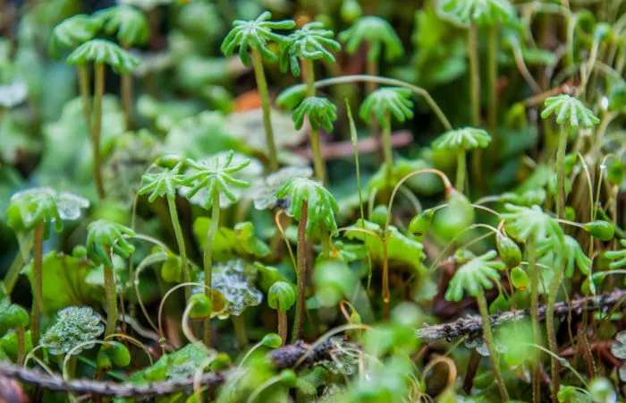
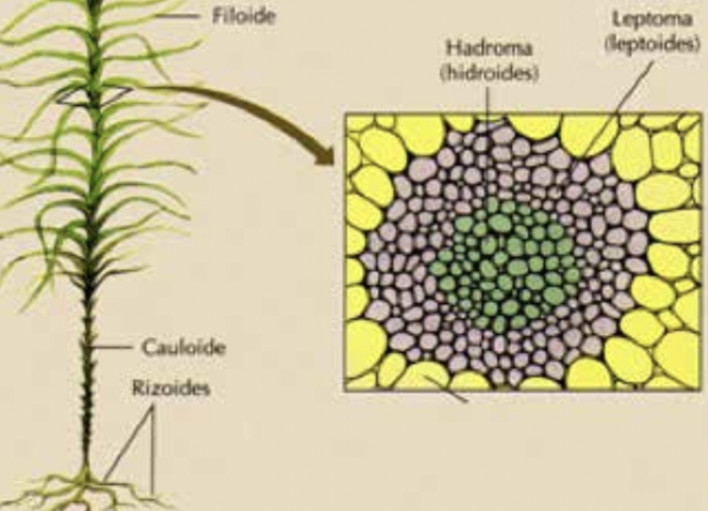
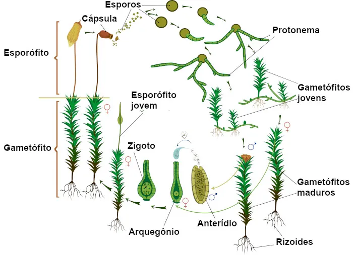

# botanica briofitas basics

São os musgos, hepáticas e antóceros. Pequenas plantas que dependem de ambientes úmidos para sobreviver. São as primeiras plantas a colonizar ambientes terrestres.

## Morfologia

Essas plantas tem uma morfologia muito simples, com raízes, caules e folhas pouco diferenciadas.

> São divididas em três filos: Marchantiophyta (hepáticas), Anthocerotophyta (antóceros) e Bryophyta (musgos).

- Apresentam alternância de gerações;
- São avasculares (mas algumas apresentam tecidos condutores de substâncias);
- São pequenas pois não possuem vasos condutores;
- Necessitam de um meio aquoso para a reprodução, pois os anterozoides nadam até a oosfera;

> As células responsáveis por conduzir água são chamadas de hidroides e as células responsáveis por tranportar substâncias nutritivas são chamadas de leptoides.

> Os rizoides são responsáveis pela fixação da planta no substrato, não sendo responsáveis pela absorção de nutrientes ou água.

## Ciclo de vida

A seguir vemos o ciclo de vida do musgo (Bryophyta):

- O esporófito é diploide, formado pela união de gametas (zigoto) e subsequente mitose;
- Os esporos são haploides. Eles surgem por meiose;
- Os esporos germinam e formam os gametófitos de cada gênero;
- O Anterídio (gameta masculino) e o arquegônio (gameta feminino, onde forma-se somente uma oosfera) são formados;
- Após a germinação, o zigoto se desenvolve em cima do gametófito, formando o esporófito.

> Pela maior parte da vida as briófitas são haploides, pois o esporófito (elemento diploide) é muito pequeno e dependente do gametófito.
