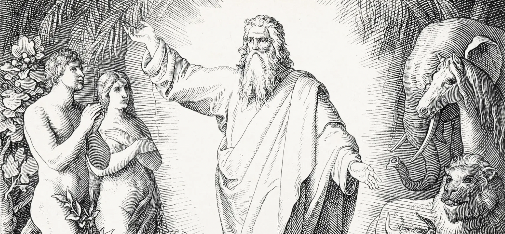
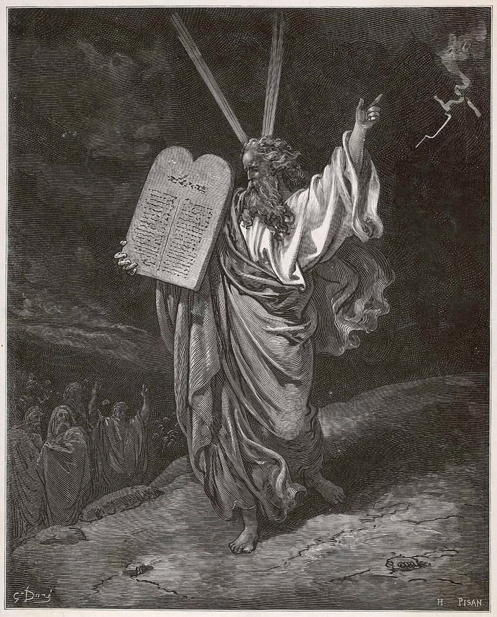
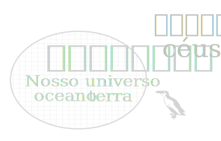
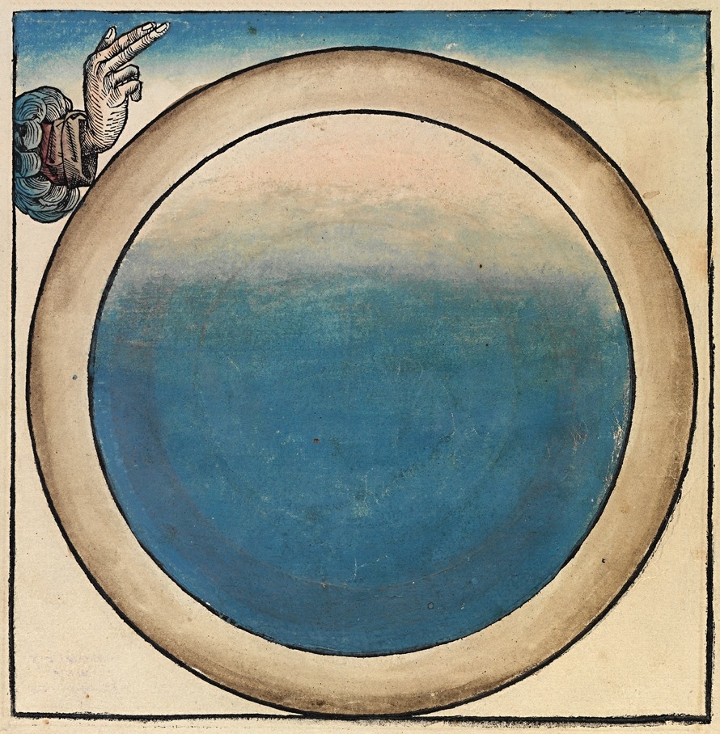
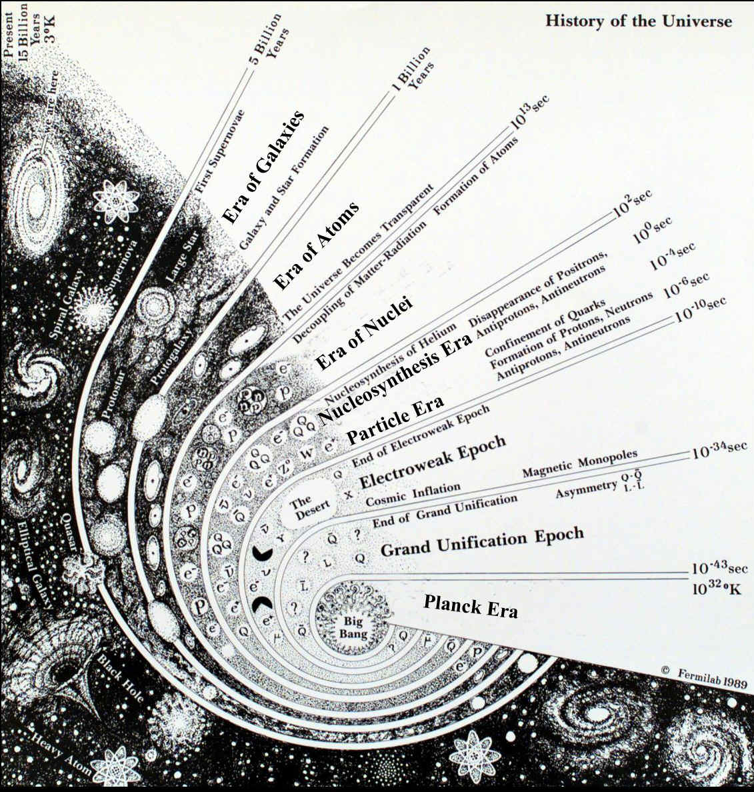
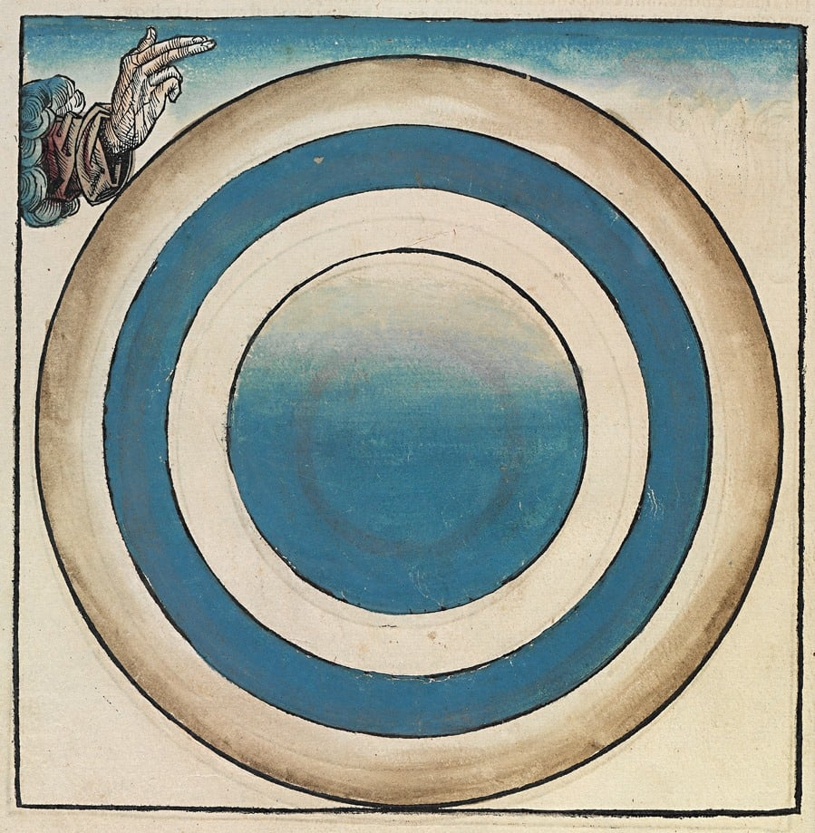

# O LIVRO DE GENESIS

Síntese da leitura do livro de gênesis. Idéias, conceitos, interpretações e opiniões.
As passagens em Hebreu são do codex de leningrado. **Atenção: Em texto puro aparecerá invertido**.

---

    בְּרֵאשִׁ֖ית בָּרָ֣א אֱלֹהִ֑ים אֵ֥ת הַשָּׁמַ֖יִם וְאֵ֥ת הָאָֽרֶץ׃

 

O livro de **genesis** representa o princípio da antiga aliança. Chamado de livro das origens, ele reúne um quinto do pentateuco - **Torah** -. Ademais, é uma coletânea de narrativas que abordam a história da humanidade desde seu princípio até a morte de José, filho de Jacó. Ele é entendido como um mosaico de algumas das histórias mais antigas concebidas pela humanidade e não pode ser lido de forma literal, uma vez que retrata culturas de tempos imemoriais. Apesar disso ele traz consigo a verdade de **Deus** em uma linguagem que foi capaz de instruir e inspirar pessoas da idade do bronze à modernidade. Sua autoria é de **Moisés** segundo a tradição cristã, mas esse é um campo muito debatido na esfera secular.

---

## Cap 1 : A metafórica criação do universo

É fascinante que haja um recorte do início dos tempos nas palavras do **Criador**. Não se pode interpretar o texto de forma literal, mas podemos analisar a palavra para chegarmos em diferentes interpretações sobre o tópico em um exercício de contemplação.

### ✾ Dia 0: versos 1 e 2

Leitura da passagem original:

- 1:1 : **בְּרֵאשִׁ֖ית בָּרָ֣א אֱלֹהִ֑ים** | No princípio, criou **Deus**
- 1:1 : **אֵ֥ת הַשָּׁמַ֖יִם וְאֵ֥ת הָאָֽרֶץ׃** | os céus e a terra
- 1:2 : **וְהָאָ֗רֶץ הָיְתָ֥ה תֹ֙הוּ֙ וָבֹ֔הוּ** | A terra, porém, estava informe e vazia
- 1:2 : **וְחֹ֖שֶׁךְ עַל־פְּנֵ֣י תְהֹ֑ום** | e havia trevas sobre a superfície do _abismo_
- 1:2 : **וְר֣וּחַ אֱלֹהִ֔ים מְרַחֶ֖פֶת** | e o espírito de **Deus** pairava
- 1:2 : **עַל־פְּנֵ֥י הַמָּֽיִם׃** | sobre a superfície das águas

No primeiro verso (gen 1:1), **Deus** criou o céu e a terra; a palavra para "céu" denota o plano espiritual, enquanto a palavra "terra", denota nosso universo material, na minha visão. A palavra do hebraico **`הַשָּׁמַ֖יִם`** significa "os céus", no plural, enquanto a palavra **`הָאָֽרֶץ`** significa "a terra", no singular.

> Se referir 'aos céus' no plural reforça a idéia de algo sagrado, pois só há um céu material. A idéia de vários céus vem da concepção de "todos os céus" e refere-se ao reino do espírito.

Em seguida, fala-se que a terra estava disforme, deserta e vazia. Segue-se, então, com mais uma descrição aparentemente contraditória: A analogia de "_trevas_" sobre a "_face do abismo_":

    וְחֹ֖שֶׁךְ עַל־פְּנֵ֣י תְהֹ֑ום וְר֣וּחַ אֱלֹהִ֔ים מְרַחֶ֖פֶת עַל־פְּנֵ֥י הַמָּֽיִם׃

A palavra **`חֹ֖שֶׁךְ`** significa "escuridão" ou "trevas" -sem a partícula `וְ` que significa "e" com valor de Conjunção Coordenativa Aditiva- ; enquanto a palavra **`תְהֹ֑ום`** significa "abismo", "profundezas", "oceano".

Dessa forma ilustra-se nosso universo (plano material) na figura de linguagem de um **oceano**. A superfície do habismo pode referir-se ao leito, ou seja, no fundo deste oceano, onde impera as **trevas** ou **escuridão**, provavelmente referindo-se ao espaço. No fim completa-se que deus se move sobre a superfície das águas (acima, fora).

> Assim, minha interpretação é a de que ao se situar sobre as águas, **Deus** se situa fora do **oceano**, dessa forma, fora do universo, assim, no plano espiritual.

> Deus nos pinta uma linda metáfora, para descrever geometricamente algo que não pode ser descrito.

Outra reflexão interessante é a de que a palavra **`ר֣וּחַ`** significa "espírito", "vento", "sopro". A palavra **`מְרַחֶ֖פֶת`** significa "pairava", "agitava", "flutuava". Assim, **Deus** é um "ar" que naturalmente habita o céu, uma metáfora do plano espiritual.

Nota-se que é o dia 0, uma vez que o universo é criado neste verso. Assim, é válido considerar que o universo foi criado um dia anterior ao primeiro dia.

### ✾ Dia 1: versos 3, 4 e 5

Leitura da passagem original:

- 1:3 : **וַיֹּ֥אמֶר אֱלֹהִ֖ים** | E disse **Deus**
- 1:3 : **יְהִ֣י אֹ֑ור** | Haja luz
- 1:3 : **וַֽיְהִי־אֹֽור׃** | e houve luz
- 1:4 : **וַיַּ֧רְא אֱלֹהִ֛ים אֶת־הָאֹ֖ור כִּי־טֹ֑וב** | E viu **Deus** que a luz era boa
- 1:4 : **וַיַּבְדֵּ֣ל אֱלֹהִ֔ים בֵּ֥ין הָאֹ֖ור וּבֵ֥ין הַחֹֽשֶׁךְ׃** | e separou **Deus** a luz das trevas
- 1:5 : **וַיִּקְרָ֨א אֱלֹהִ֤ים ׀ לָאֹור֙ יֹ֔ום** | E chamou **Deus** à luz Dia
- 1:5 : **וְלַחֹ֖שֶׁךְ קָ֣רָא לָ֑יְלָה** | e às trevas chamou Noite
- 1:5 : **וַֽיְהִי־עֶ֥רֶב וַֽיְהִי־בֹ֖קֶר יֹ֥ום אֶחָֽד׃ פ** | E foi a tarde e a manhã, o dia primeiro

Aqui, **Deus** diz "haja luz" e houve luz. Interessante que o verbo para "dizer", tem o som "amar" em português- somente uma curiosidade, mas de fato, como todos os outros atos, este foi um de amor -. A palavra **`יְהִ֣י`** significa "haja" e a palavra **`אֹ֑ור`** significa "luz", tanto no sentido literal de luz de uma lâmpada, quanto luz no sentido de "conhecimento.

Ao introduzir a luz no universo, **Deus** se introduz no universo. A luz é a primeira coisa que **Deus** coloca em nosso plano, e é parte integrante dele, como todo o resto da criação. Dessa forma, antes da luz só havia ausência, ou seja, trevas, ou seja, escuridão. Deus não é a escuridão, uma vez que a escuridão não é nada, só um nome que damos à ausência de luz.

> Nessa passagem a fala denota intenção e razão. **Deus** deliberou e a luz veio a existir. Mais uma vez vemos um exemplo de abordagem que prioriza a acessibilidade da mensagem. **Deus** não podia falar, uma vez que não haviam ouvidos para ouvir, ou ar para vibrar. Mas a mensagem torna-se clara a qualquer pessoa.

O episódio da existência da luz é seguido por uma avaliação de **Deus**, que vê que a luz é boa. Interessante que **Deus** constatou que a luz era boa após sua criação- algo que **aparentemente** contraria o princípio de onisciência -. Mais uma vez vemos a importância de não se interpretar de forma literal a mensagem, mas buscarmos a intenção por trás das metáforas. Retornarei a essa questão [mais adiante](#conclusão).

Em seguida. Separa-se então a luz das trevas. Chama-se luz de **dia** e as trevas de **noite**, e isso se dá pela origem da luz, como oposto da escuridão.

> Minha interpretação é a de que a luz é inicialmente onipresente, algo que assemelha-se aos momentos iniciais do universo, de acordo com a radiação de fundo do espaço profundo.

> Em um momento inicial o universo inteiro comportou-se como um infinito sol, era tão quente que havia um plasma onipresente. Mas com a expansão e o resfriamento do espaço, a formação da matéria e a formação das primeiras estrelas, a luz separou-se das trevas, dando lugar ao vazio. Assim como a escuridão é a ausência de luz, o vazio é a ausência de matéria.

Finalmente, é dito que "houve a tarde e a manhã, o dia primeiro". O que é interessante, pois denota-se que passou uma noite ao se descrever como uma nova manhã começou, sem se dizer que houve uma noite. O período antes da tarde foi o momento em que **Deus** trabalhou, dando a ele a associação que tem com o sol.

> Há novamente uma ilustração muito interessante para dizer que o tempo passou. **Deus** descreve as consequências disso na perspectiva de um observador terrestre. Baseada em acontecimentos astronômicos dos mais básicos. Mais uma vez, a mensagem é clara e acessível, mesmo para uma pessoa da idade do bronze.

Mas, lembre-se, não há sol ou planetas ainda, que são criados mais adiante. Dessa forma, nota-se que a figura de linguagem é usada para denotar a passagem de tempo. Implicitamente vemos que foi criado o tempo simultâneamente ao espaço, no dia zero e vemos seus efeitos na forma como **Deus** criou o universo.

### ✾ Dia 2: versos 6, 7 e 8

Leitura da passagem original:

- 1:6 : **וַיֹּ֣אמֶר אֱלֹהִ֔ים** | E disse **Deus**
- 1:6 : **יְהִ֥י רָקִ֖יעַ בְּת֣וֹךְ הַמָּ֑יִם** | Haja um firmamento no meio das águas
- 1:6 : **וִיהִ֣י מַבְדִּ֔יל בֵּ֥ין מַ֖יִם לָמָֽיִם׃** | e haja separação entre águas sobre as águas
- 1:7 : **וַיַּ֣עַשׂ אֱלֹהִים֮ אֶת־הָרָקִיעַ֒** | E fez **Deus** o firmamento
- 1:7 : **וַיַּבְדֵּ֗ל בֵּ֤ין** | e **Ele** dividiu entre
- 1:7 : **הַמַּ֙יִם֙ אֲשֶׁר֙ מִתַּ֣חַת לָרָקִ֔יעַ** | as águas que estavam debaixo do firmamento
- 1:7 : **וּבֵ֣ין הַמַּ֔יִם** | e as águas
- 1:7 : **אֲשֶׁ֖ר מֵעַ֣ל לָרָקִ֑יעַ** | que estavam acima do firmamento
- 1:7 : **וַֽיְהִי־כֵֽן׃** | E foi assim
- 1:8 : **וַיִּקְרָ֧א אֱלֹהִ֛ים** | E chamou **Deus**
- 1:8 : **לָֽרָקִ֖יעַ שָׁמָ֑יִם** | ao firmamento Céu
- 1:8 : **וַֽיְהִי־עֶ֥רֶב** | E foi a tarde
- 1:8 : **וַֽיְהִי־בֹ֖קֶר** | E foi a manhã
- 1:8 : **יֹ֥ום שֵׁנִֽי׃ פ** | Dia segundo

Assim, tem-se a criação do "firmamento", `רָקִ֖יעַ`, que é definido como o espaço de separação entre as águas, também pode ser definido como **"expansão"** segundo a linguagem hebraica.

Aqui também temos que **Deus** nomeou esse firmamento, ou **expansão**, de "céu", assim como fez com o dia e a noite. Ou seja, tem-se, subentendido, que a linguagem humana, para algumas palavras, faz parte da criação divina, e não é fruto do livre arbítrio humano. Se levado de forma explícita.

> Nessa passagem, vemos a poética em **Deus** tomar novas formas. As interpretações antigas viam o firmamento como uma cúpula que separava as águas do céu das águas da terra (imaginava-se o céu como água, pois era azul, e por causa das chuvas). Mas a minha interpretação é a de que o firmamento representa a expansão do universo, e o que **Deus** chama de céu, nós chamamos hoje de espaço.

> Sob essa óptica, novamente, podemos interpretar esse segundo dia sob uma visão cosmológica. O firmamento (ou expansão) é a expansão do universo (e consequente resfriamento). Ao se dizer que separou-se as águas de cima das de baixo, subentende-se que há um cima e um baixo, ou seja, eis a criação dos planetas.

## Conclusão
