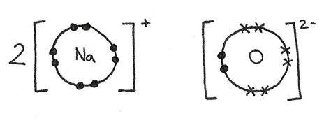
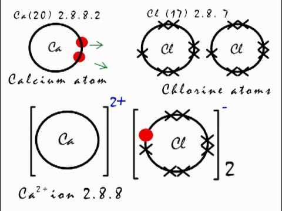
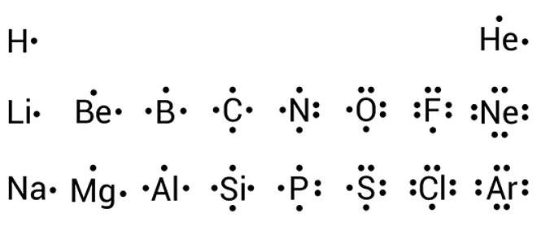
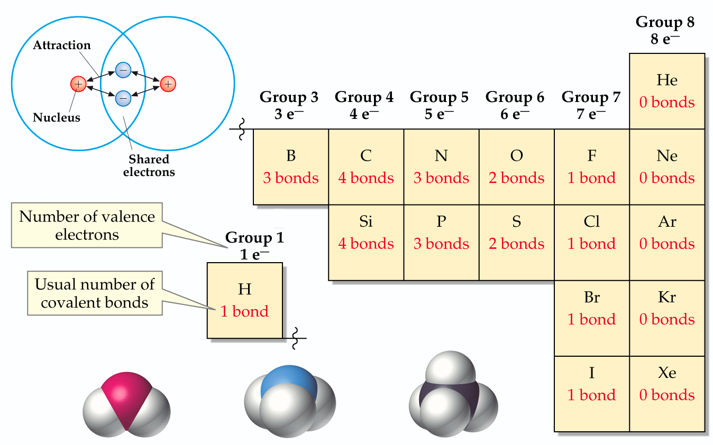

# CHEMICAL BONDS

<span style="text-align: center; width: 100%; font-size: 0.75em">

How molecules are formed? How atoms are bonded together? These are the questions that we are going to answer in this note.

There are three types of chemical bonds: ionic, covalent and metallic.

</span>


---

## ⭐️ Octet Rule

The most important rule in chemical bonding is the octet rule. This rule states that atoms tend to gain, lose, or share electrons as so to have eight electrons in their outermost eletronic shell. Observe that this electron configuration is the same as the noble gases ([periodic table](fleeting/1711394899-periodic-table.md)), and represent maximum stability. For this reason, noble gases are inert- don't react with other elements.

> There are examples to this rule, like the Hydrogen and Helium, which have only one shell and can be stable with two electrons.

> There are also exceptions to this rule, like the Boron, which can be stable with six electrons. And others like the Phosphorus and Sulfur, which can be stable with ten electrons.

## Does it lose or gain electrons?

The tendency of an atom to gain or lose electrons is determined by it's [electronegativity](fleeting/1710348733-periodic-table-basics.md#eletronegatividade-e-eletropositividade).
The classic elements who **lose** electrons are the metals:

- 1A family;
- 2A family;
- 3A family.

The classic elements who **gain** electrons are the non-metals:

- 4A family;
- 5A family;
- 6A family;
- 7A family.

## ⭐️ Ionic Bonds

This type of bond is formed by a metal and a non-metal, or metal and hydrogem. The metal loses electrons and the non-metal gains electrons. The metal becomes a cation and the non-metal becomes an anion (ânion). The bond is formed by the electrostatic attraction between the cation (cátion) and the anion.

> An example is the bond between the Sodium and the Oxygen:
> 
> $$ 2 Na + O2 -> 2 Na2O $$
> The oxygen gains two electrons from two sodium atoms, and each sodium loses one electron to the oxygen.

> Another example is the bond between the Calcium and the Chlorine:
> 
> $$ Ca + Cl2 -> CaCl2 $$
> The calcium loses two electrons to two chlorine, and each chlorine gains one electrons from the calcium.

When there is doubt about the formation of the ionic bond, it's possible to make the electron distribution of the atoms and see if the octet rule is satisfied.

## ⭐️ Covalent Bonds

The covalent bond is formed by the sharing of electrons between two non-metals. The bond is formed by the electrostatic attraction between the shared electrons and the nuclei of the atoms. The common way of representing the covalent bond is by the Lewis structure:



Each dot is a valence electron that can be shared with another atoms depending on how many electrons are necessary to acomplish the octet law. The number of dots is equal to the number of valence electrons of the atom. The bond is formed by the sharing of electrons between the atoms. These electrons are called shared pairs and are represented by a line between the atoms. Here are the number of shared pairs for each atom:



> Notice that there are some metals that can form covalent bonds, like Berillium and Boron. This is true because these metals's have few layers of electrons being the valence electrons close to the nucleus.

Here we have some examples for possible molecules:

```
NH3 H2O HCl CO2 PF3 BeH2 BF3 PCl5 XeF2 XeF4 O2
```

> Observe that we have xeno atoms in the list. This is because the xenon is a noble gas and can form covalent bonds with a sufficient electronegative atom like the Fluorine. It end's up with 10 electrons in the outer shell.

> Berillium is able to form covalent bonds, it is stable with 4 electrons in the outer shell. Boron is stable with 6 electrons in the outer shell.

> The Phosphorus is stable with 10 electrons in the outer shell as well.

Another type of covalent bond is the **coordinate covalent bond**. This bond is formed by the sharing of electrons between two atoms, but the electrons are donated by only one of the atoms. This is the case of the Ammonium ion:
