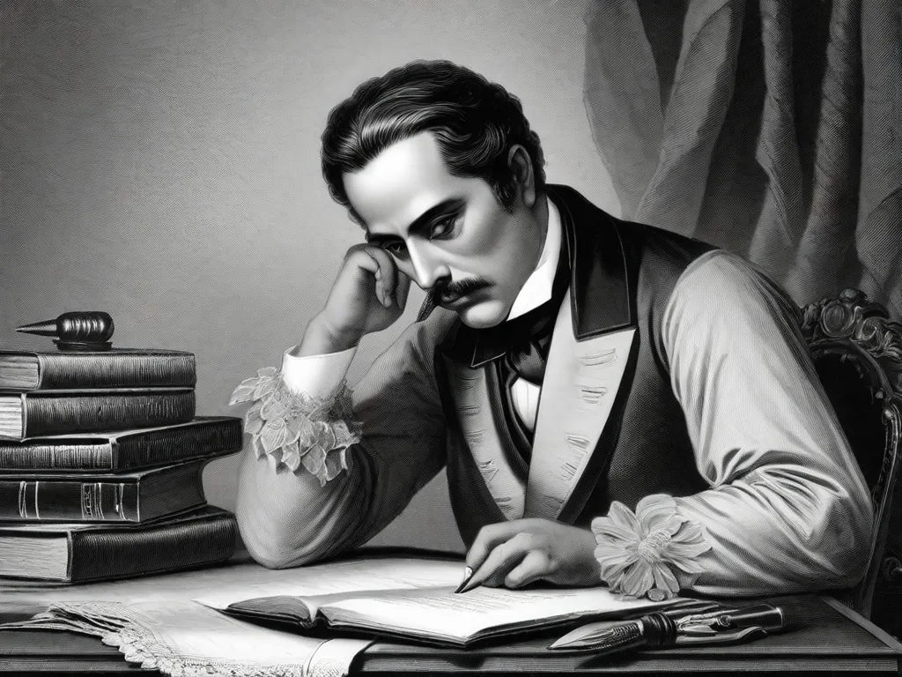

# Romantismo no Brasil

<span style="text-align: center; width: 100%; font-size: 0.75em">

Movimento literário que surgiu na Europa no final do século XVIII e início do século XIX, e que teve grande influência no Brasil. O Romantismo no Brasil foi marcado pela valorização do nacionalismo, da natureza e do sentimentalismo.

</span>



---

Teve como marco inicial a publicação do livro "**Suspiros Poéticos e Saudades**", de **Gonçalves de Magalhães**, em 1836, e como marco final a publicação de "**O Guarani**", de **José de Alencar**, em 1857. O Romantismo no Brasil foi dividido em três fases:

- **1ª Geração**: Nacionalista | Indianista | afirmação nacional;
- **2ª Geração**: Mal do Século;
- **3ª Geração**: Condoreira.

No prefácio de "Suspiros Poéticos e Saudades", Gonçalves de Magalhães defende a necessidade de uma literatura nacional, e define o Romantismo como um movimento de:

- Liberdade poética;
- Individualismo;
- Nacionalismo;

## Características da primeira fase

Nesta geração, prima-se pela valorização do nacionalismo, da natureza, do indianismo e da afirmação nacional. Destacam-se os seguintes autores:

- Autor: **Gonçalves dias**;
  - Gênero: Lírico;
  - Poesia Épica:
    - Indianismo;
  - "Bom selvagem"(Russeau);
  - 5 sílabas poéticas: Redondilha menor;
  - Poesia lírica: Saudosismo;
  - Canção, cantiga:
    - Exílio;
  - 7 sílabas poéticas: Redondilha maior;

```
-- Canção do exílio:

Minha terra tem palmeiras
Onde canta o Sabiá,
As aves, que aqui gorjeiam,
Não gorjeiam como lá.

Nosso céu tem mais estrelas,
Nossas várzeas têm mais flores,
Nossos bosques têm mais vida,
Nossa vida mais amores.

Em cismar, sozinho, à noite,
Mais prazer encontro eu lá;
Minha terra tem palmeiras,
Onde canta o Sabiá.

Minha terra tem primores,
Que tais não encontro eu cá;
Em cismar – sozinho, à noite –
Mais prazer encontro eu lá;
Minha terra tem palmeiras,
Onde canta o Sabiá.

Não permita Deus que eu morra,
Sem que eu volte para lá;
Sem que desfrute os primores
Que não encontro por cá;
Sem qu’inda aviste as palmeiras,
Onde canta o Sabiá.
```
