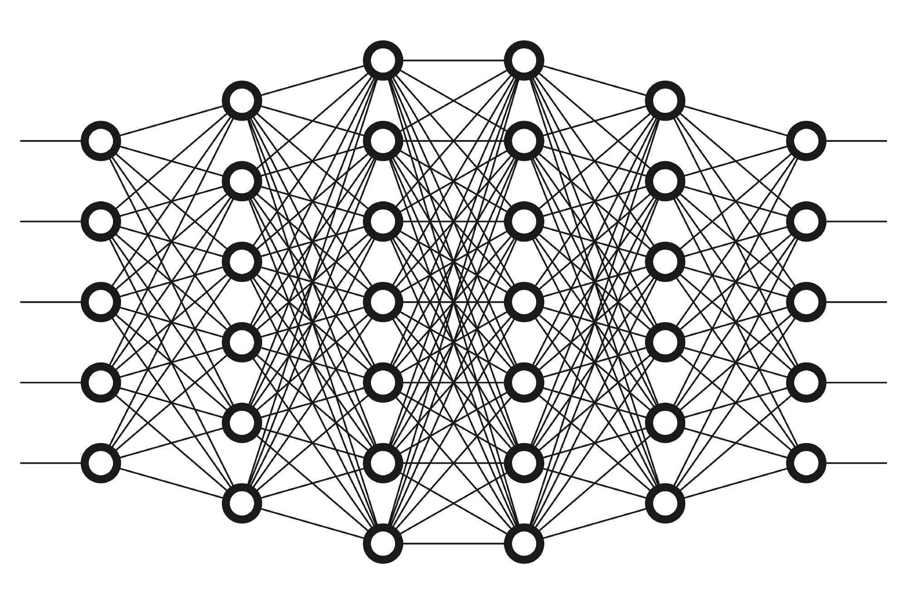
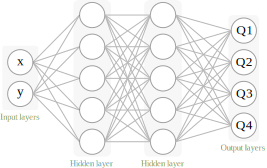
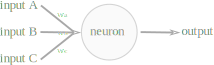

# ARTIFICIAL NEURAL NETWORKS

The concept of neural networks is inspired by our human brain structure. We have billions of neurons, which are connected to each other. These connections define the way we think and react to the world. The same concept is used in artificial neural networks, but these connections, in artificial intelligence, are references, and neurons, mathematical functions.

## ✾ Introduction

Geoffrey Hinton, a computer scientist, is one of the godfathers of artificial neural networks. He is British-Canadian and lecturer at the University of Toronto. He's most known for his work on artificial intelligence. He did research on the topic on the 1980s, and he is one of the most important figures in the field.

The human brain is an incredible learning machine. By mimicking it's inner workings, **ANNs** can learn to recognize patterns and make decisions, just like humans do. The way it works is by using a set of mathematical functions that are connected to each other. These functions are called **neurons**.

Some important concepts in artificial neural networks are:

- **Neurons**: The basic unit of a neural network. It receives inputs, processes them, and returns an output;
- **Layers**: A group of neurons that aren't connected to each other (in simple structures); There are input layers, hidden layers, and output layers;
- **Connections**: The way neurons are connected to each other, referencing the strength of the connection;
- **Weights**: The strength of the connection between two neurons;
- **Activation Function**: A function that defines the output of a neuron;

The following figure shows a simple neural network with 4 layers:

Here we can see the **Input Layer**, the **Hidden Layer**, and the **Output Layer**. The connections between the neurons are represented by the lines. The weights are the values that define the strength of the connection between two neurons and it updates during the training process.

## ✾ The Neuron

Unlike the bio-chemical neurons, whose signals are electrical and chemical, the artificial neurons are mathematical functions. They receive inputs, process them, and pass the output forward in the network.

So the **Neuron** is the basic unit of a neural network. Here is how it works:

These inputs come from other neurons and the output is passed to other neurons or represent the final output of the network. These inputs can be the input of the network which would define it as part of the input layer.

> If it is the **Input layer**, a normal practice is to normalize the data. This is done to make the training process faster and more accurate. Read [this](http://yann.lecun.com/exdb/publis/pdf/lecun-98b.pdf).

The output value can be Continuous, binary or categorical.

Inside the **Neuron** all the input is processed as follows:

$
\text{output} = \phi  (\sum_{i=1}^{n} w_i \cdot x_i)
$

This function is called the **Activation Function**.

## ✾ Activation Function

There are many activation functions that can be used in a neural network. Some of the most common are:

- **Threshold Function**: It's a function that returns 0 if the input is less than a threshold and 1 if the input is greater than the threshold;
- **Sigmoid Function**: It's a smooth function that returns a value between 0 and 1. It's used in the logistic regression model and its used a lot in the output layer.
- **Rectified Linear Unit (ReLU)**: It's a function that returns 0 if the input is less than 0 and the input if it's greater than 0. It's one of the most used activation functions in neural networks.
- **Hyperbolic Tangent Function**: It's a smooth function that returns a value between -1 and 1.

> For more information on the rectifier function, read [this](https://proceedings.mlr.press/v15/glorot11a/glorot11a.pdf).

## ✾ Deep Learning

Deep learning is a subset of machine learning that uses artificial neural networks to learn from data. It's called deep learning because it uses deep neural networks, which are neural networks with many layers. The more layers a neural network has, the more complex patterns it can learn.

## ✾ Back propagation

## Softmax-function

The softmax function is a generalization of the logistic function that transforms a **K-dimensional** vector $z$ of $K$ arbitrary real values to a K-dimensional vector **$\sigma(z)$** of real values in the range (0, 1) that add up to 1.

The function is given by:

$
\sigma(z)_i = \frac{e^{z_i}}{\sum_{j=1}^{K} e^{z_j}}
$
