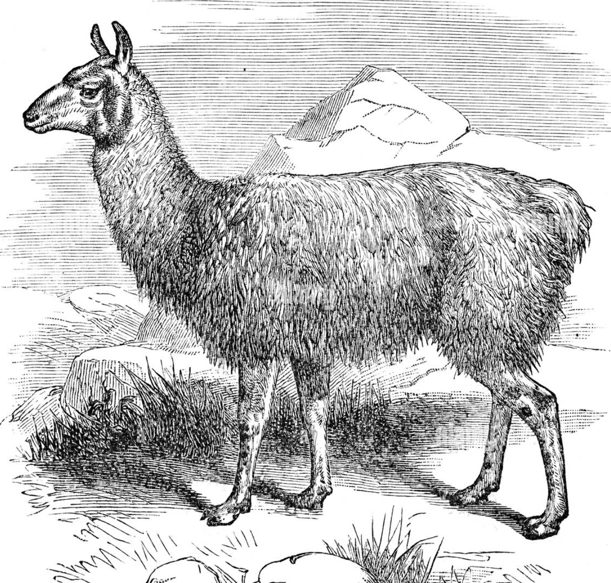

# LLAMA 2

<span style="text-align: center; width: 100%; font-size: 0.75em">

Commercial open-source [large language model](fleeting/1712254150-large-language-models.md) created by **Facebook**. It can be used to commercial use-cases and is available as a base model, which can be further fine-tuned for specific tasks.

</span>



## ✾ Introduction

## ✾ How to use it?

First step is to download a pre-trained model. You can find the model in on the internet in websites like [huggingface](https://huggingface.co/models) or [kaggle](https://www.kaggle.com/datasets). After that, you can use the model to generate texts without the need of training it from the ground up, which is a very expensive and slow process.

First, install all necessary libraries:

```bash
pip install accelerate==0.21.0 peft==0.4.0 bitsandbytes==0.40.2 transformers==4.31.0 trl==0.4.7 scipy
pip install huggingface_hub
```

Then, create a script, and inport the necessary libraries. It's advised to create a virtual environment to avoid conflicts with other system-wide libraries.

```python
import torch
from transformers import (AutoModelForCausalLM, AutoTokenizer, BitsAndBytesConfig, pipeline)
```

Then, you can load the model by using the `AutoModelForCausalLM` class, that you can find in the `transformers` library. We will use the `pretrained_model_name_or_path` parameter to load the model. We will also use the `BitsAndBytesConfig` class to quantize the model to 4 bits. This will make the model consume less memory and run faster:

```python
llama_model = AutoModelForCausalLM.from_pretrained(
  pretrained_model_name_or_path = "aboonaji/llama2finetune-v2",
    quantization_config = BitsAndBytesConfig(
      load_in_4bit = True,
      bnb_4bit_compute_dtype = getattr(torch, "float16"),
      bnb_4bit_quant_type = "nf4"
    )
  )

llama_model.config.use_cache = False
llama_model.config.pretraining_tp = 1
```

The 4-bit quantization doesn't have impact on the model's performance. The **`bnb_4bit_compute_dtype`** parameter is used to set the data type of the model to **`float16`**, which is a 16-bit floating point number. The **`bnb_4bit_quant_type`** parameter is used to set the quantization type to `nf4`, which results in a 4-bit quantization.

> For mor information about 4 bit quantization, and QLora, you can check the paper wher it was proposed [here](https://arxiv.org/abs/2305.14314).

Then, load the tokenizer:

```python
llama_tokenizer = AutoTokenizer.from_pretrained(
    pretrained_model_name_or_path = "aboonaji/llama2finetune-v2",
    trust_remote_code = True
  )

llama_tokenizer.pad_token = llama_tokenizer.eos_token
llama_tokenizer.padding_side = "right"
```

Then, you can generate text using the model:

```python
user_prompt = "Please tell me about Bursitis"
text_generation_pipeline = pipeline(
  task = "text-generation",
  model = llama_model,
  tokenizer = llama_tokenizer,
  max_length = 300
)

model_answer = text_generation_pipeline(f"<s>[INST] {user_prompt} [/INST]")
print(model_answer[0]['generated_text'])
```

This code will generate a text based on the user prompt. We downloaded the model from huggingface and used the `pipeline` function to generate the text. The `pipeline` function is a high-level API that allows you to use the model.

You can run this code on **google colab** or any other python environment.

## ✾ How to fine-tune it?

First, you need to download a pre-trained model. In this case, we are going to use [aboonaji/llama2finetune-v2](https://huggingface.co/aboonaji/llama2finetune-v2). Then you will need a dataset. The dataset must comply to the following format:

```
<s> [INST] what is your name? [/INST] my name is Julia</s>
```

Where `<s>` and `</s>` are the start and end of the sentence, respectively. The `[INST]` and `[/INST]` tags are used to indicate the start and end of the instruction. And the text outside the instruction is the answer to the question.

You can even pass instructions to the system by using the tag `<<SYS>>`:

```html
<s>
  [INST] <<SYS>> you are a good bot that will try to help the user <</SYS>> what
  is your name? [/INST] My name is Julia
</s>
```

For fine tuning, you wil. need a large number of examples. The more examples you have, the better the model will perform.

For example, you could yse this dataset from hugingface: [wiki-medical-terms-llam2-format](https://huggingface.co/datasets/aboonaji/wiki_medical_terms_llam2_format) and train the model to explain medical terms.
