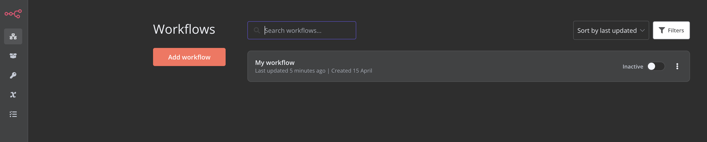
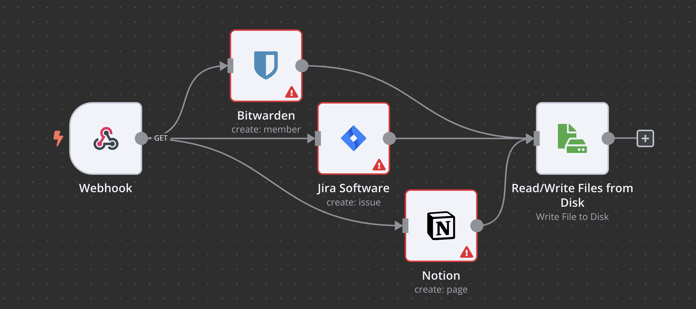
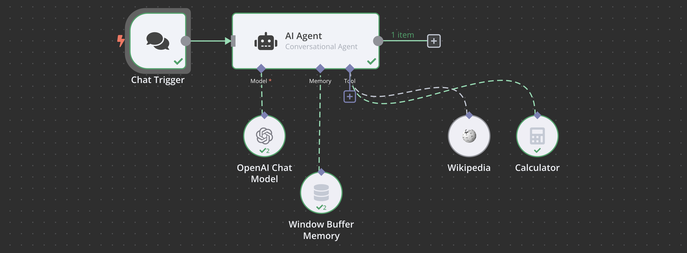

# N8N: Workflow Automation

<span style="text-align: center; width: 100%; font-size: 0.75em; margin-bottom: 20px">
    A guide to the N8N platform, a powerful tool for workflow automation, integration, and orchestration.
</span>


## ✾ Introduction

**N8N** is a service that allows the user to automate workflows. It has a no-code approach, with integration to a variaty of services and applications. The softawre is open-source and it is available for free on [github](https://github.com/n8n-io/n8n). It can be deployed and run on your own infrastructure:



Here is an example of a workflow in the **N8N** interface:



The interface is great, and the node-bsed approach is very intuitive. The user can create complex workflows with a few clicks.

## ✾ Installation

To install the tool you can use the `npx n8n` command. It will download the package if it is not already installed and it will start the service. The `node` version required to run the software is `18` or higher. After initialization, the service will be available at [http://localhost:5678/](http://localhost:5678/) and the following message will appear:

```
Editor is now accessible via:
http://localhost:5678/
```

### As a docker container

You can also run the service as a docker container. First, create a docker file as following:

```dockerfile
version: "3.7"

services:
  traefik:
    image: "traefik"
    restart: always
    command:
      - "--api=true"
      - "--api.insecure=true"
      - "--providers.docker=true"
      - "--providers.docker.exposedbydefault=false"
      - "--entrypoints.web.address=:80"
      - "--entrypoints.web.http.redirections.entryPoint.to=websecure"
      - "--entrypoints.web.http.redirections.entrypoint.scheme=https"
      - "--entrypoints.websecure.address=:443"
      - "--certificatesresolvers.mytlschallenge.acme.tlschallenge=true"
      - "--certificatesresolvers.mytlschallenge.acme.email=${SSL_EMAIL}"
      - "--certificatesresolvers.mytlschallenge.acme.storage=/letsencrypt/acme.json"
    ports:
      - "80:80"
      - "443:443"
    volumes:
      - traefik_data:/letsencrypt
      - /var/run/docker.sock:/var/run/docker.sock:ro

  n8n:
    image: docker.n8n.io/n8nio/n8n
    restart: always
    ports:
      - "127.0.0.1:5678:5678"
    labels:
      - traefik.enable=true
      - traefik.http.routers.n8n.rule=Host(`${SUBDOMAIN}.${DOMAIN_NAME}`)
      - traefik.http.routers.n8n.tls=true
      - traefik.http.routers.n8n.entrypoints=web,websecure
      - traefik.http.routers.n8n.tls.certresolver=mytlschallenge
      - traefik.http.middlewares.n8n.headers.SSLRedirect=true
      - traefik.http.middlewares.n8n.headers.STSSeconds=315360000
      - traefik.http.middlewares.n8n.headers.browserXSSFilter=true
      - traefik.http.middlewares.n8n.headers.contentTypeNosniff=true
      - traefik.http.middlewares.n8n.headers.forceSTSHeader=true
      - traefik.http.middlewares.n8n.headers.SSLHost=${DOMAIN_NAME}
      - traefik.http.middlewares.n8n.headers.STSIncludeSubdomains=true
      - traefik.http.middlewares.n8n.headers.STSPreload=true
      - traefik.http.routers.n8n.middlewares=n8n@docker
    environment:
      - N8N_HOST=${SUBDOMAIN}.${DOMAIN_NAME}
      - N8N_PORT=5678
      - N8N_PROTOCOL=https
      - NODE_ENV=production
      - WEBHOOK_URL=https://${SUBDOMAIN}.${DOMAIN_NAME}/
      - GENERIC_TIMEZONE=${GENERIC_TIMEZONE}
    volumes:
      - n8n_data:/home/node/.n8n

volumes:
  traefik_data:
    external: true
  n8n_data:
    external: true
```

If you are using local files, add `- /home/<YOUR USERNAME>/n8n-local-files:/files` to `volumes`.

Then, you must add a .env file with:

```env
# The top level domain to serve from
DOMAIN_NAME=example.com

# The subdomain to serve from
SUBDOMAIN=n8n

# DOMAIN_NAME and SUBDOMAIN combined decide where n8n will be reachable from
# above example would result in: https://n8n.example.com

# Optional timezone to set which gets used by Cron-Node by default
# If not set New York time will be used
GENERIC_TIMEZONE=Europe/Berlin

# The email address to use for the SSL certificate creation
SSL_EMAIL=user@example.com
```

Finally, run the following commands:

```bash
sudo docker volume create n8n_data
sudo docker volume create traefik_data
sudo docker compose up -d

# To stop the process run:

```

## ✾ Workflow

We can imagine the **N8N** service as a circuit board. Each node is a component that can be connected to others. These connections alongside the nodes define the workflow. The first node is the trigger, and it will make the workflow run with input data. The subsequent nodes can process this data, transform it, send it to other services and perform a variety of other actions.

Some interesting nodes are:

- **HTTP REQUEST**: It can make requests to APIs and other services.
- **CODE**: It can run custom JavaScript or python code.
- **GMAIL**: It can send emails using a Gmail account.
- **X(Formerly Twitter)**: It can send tweets and interact with the Twitter API.
- **N8N**: It can interact with the N8N API.

There are a lot of other nodes available, and you can create your own custom nodes if needed.
To create a custom node you can use the `npx n8n-node-dev` command. It will create a new node in the `packages/nodes-base/nodes` folder. You can then edit the node and add your own logic to it. Reading other nodes code can be a good way to understand how to create your own. Here is an example of a simple custom node:

```typescript
import { IExecuteFunctions } from "n8n-core";
import {
  INodeExecutionData,
  INodeType,
  INodeTypeDescription,
} from "n8n-workflow";

export class MyNode implements INodeType {
  description: INodeTypeDescription = {
    displayName: "My Node",
    name: "myNode",
    group: ["transform"],
    version: 1,
    description: 'Adds "myString" on all items to defined value.',
    defaults: {
      name: "My Node",
      color: "#772244",
    },
    inputs: ["main"],
    outputs: ["main"],
    properties: [
      {
        displayName: "My String",
        name: "myString",
        type: "string",
        default: "",
        placeholder: "Placeholder value",
        description: "The description text",
      },
    ],
  };
  async execute(this: IExecuteFunctions): Promise<INodeExecutionData[][]> {
    const items = this.getInputData();

    let item: INodeExecutionData;
    let myString: string;

    for (let itemIndex = 0; itemIndex < items.length; itemIndex++) {
      myString = this.getNodeParameter("myString", itemIndex, "") as string;
      item = items[itemIndex];

      item.json["myString"] = myString;
    }

    return this.prepareOutputData(items);
  }
}
```

After creating the node you can use it in your workflows. The node will be available in the editor and you can connect it to other nodes.

## ✾ LLM Integration

The **N8N** service has [langchain](1713196132-langchain-llm-applications.md) integration with [large-language-models](1712254150-large-language-models.md) services. You can use the **AI** node to interact with these services. Therefore, the **AI** node can be used to perform a variety of tasks, such as text generation, translation, and summarization.

Simple example of a workflow that uses the AI nodes to connect to OpenAI's **GPT-3.5** service:


Here is another example, but with an AI agent. This agent can remember the user's previous prompts, use a calculator and search for information on Wikipedia:


