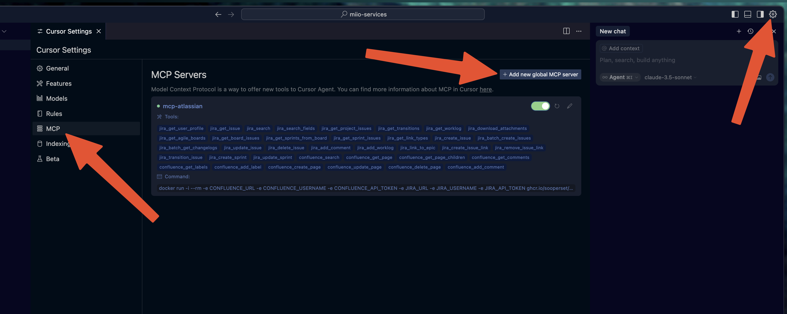
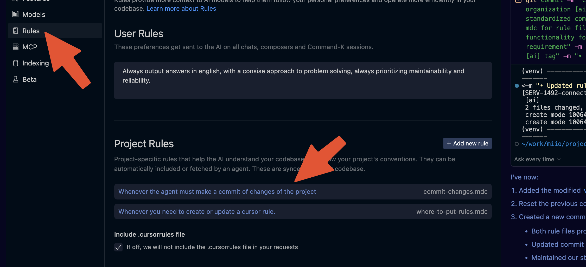
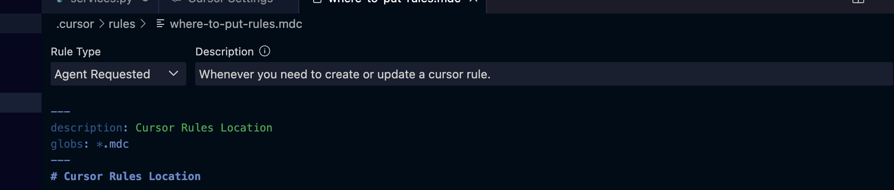
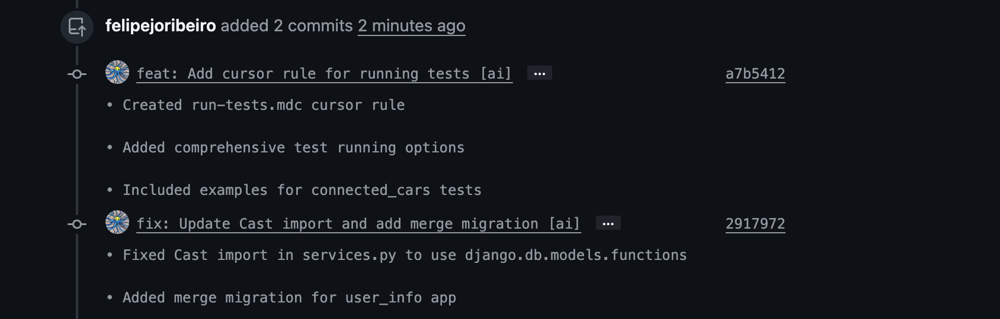
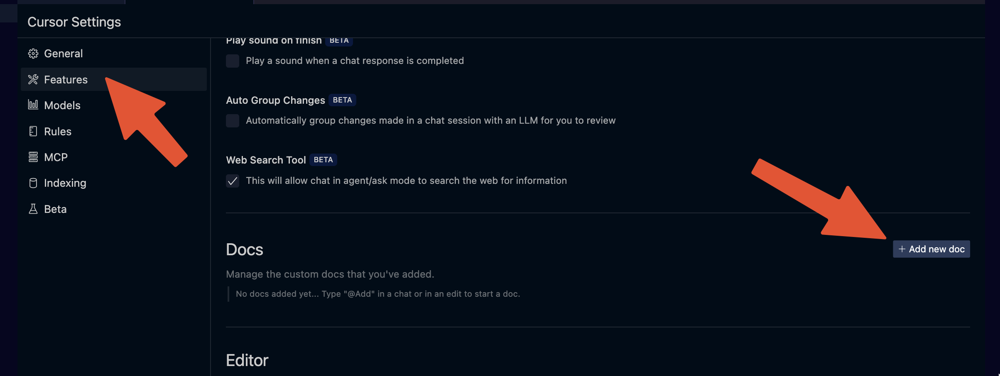
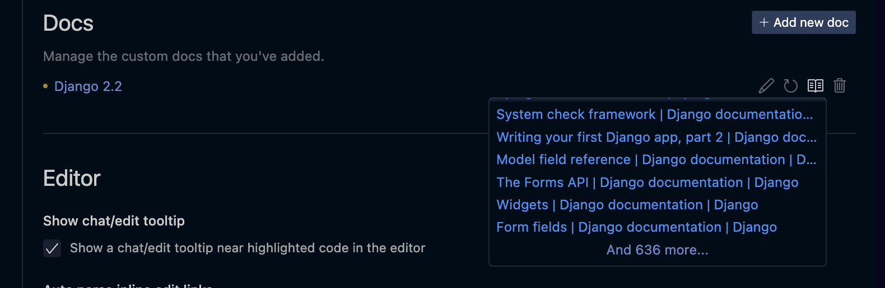
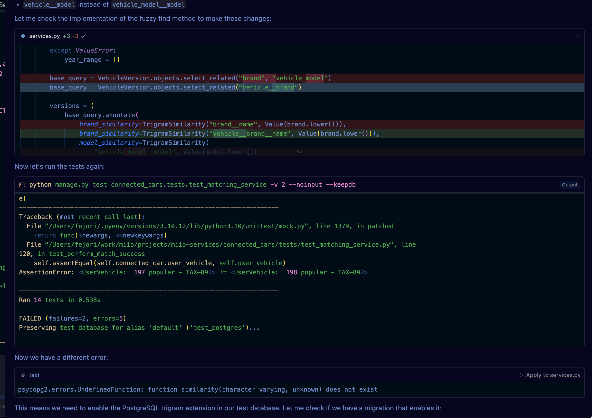

# cursor-editor-configuration

Here we will see how to configure the cursor editor for a great development experience. We will check integrations with MCP, how to add rules for automatic self improvement, how to configure docs, and we will discuss a few tips concerning prompts and the context window.

## MCP integration

MCP (Model Context Protocol) is a communication protocol that allows for **LLM-based agents** to fetch context from third-party services and resources. It exposes to the agent a series of tools that it can use to gather, process, and integrate relevant information seamlessly, enabling more efficient and intelligent workflows.

### Configure the Atlassian integration!

Configuring Atlassian as a source of context to your agents can be great to import task requirements more easily, you can simply share the ticket code and the agent will fetch all related info.

First, create a directory to store the **MCP** code in your machine. That can be easily done with a `mkdir -p ~/.mcphub/servers`. Once the directory is created, clone the MCP repository into it using `git clone https://github.com/sooperset/mcp-atlassian.git ~/.mcphub/servers/mcp-atlassian`. After cloning, navigate to the directory, you can check detailed setup instructions in the `README.md` file.

Then you can open cursor's settings and go to the MCP tab:



After clicking on create it will present to you a `.json` file with all MCP related configuration. Add the following entry to the `mcpServers` key:

```json
    "mcp-atlassian": {
      "command": "docker",
      "args": [
        "run",
        "-i",
        "--rm",
        "-e", "CONFLUENCE_URL",
        "-e", "CONFLUENCE_USERNAME",
        "-e", "CONFLUENCE_API_TOKEN",
        "-e", "JIRA_URL",
        "-e", "JIRA_USERNAME",
        "-e", "JIRA_API_TOKEN",
        "ghcr.io/sooperset/mcp-atlassian:latest"
      ],
      "env": {
        "CONFLUENCE_URL": "https://<your-company>.atlassian.net/wiki",
        "CONFLUENCE_USERNAME": "<your-login-email>",
        "CONFLUENCE_API_TOKEN": "<atlasian-api-key>",
        "JIRA_URL": "https://<your-company>.atlassian.net",
        "JIRA_USERNAME": "<your-login-email>",
        "JIRA_API_TOKEN": "<atlasian-api-key>"
      }
    }
```

> Note: You can find the **Atlassian** api token through [this link](https://id.atlassian.com/manage-profile/security/api-tokens)

After the addition to the `mcp.json` file, you will be able to make questions and include **Jira** context:


Other good options:

- [github](https://github.com/github/github-mcp-server)
- [google calendar](https://www.pulsemcp.com/servers/nspady-google-calendar)
- [python repl](https://www.pulsemcp.com/servers/tynan-daly-python-repl)

If you install too much tools, it may show a warning: "You have X tools from enabled servers. Too many tools can degrade performance, and some models may not respect more than Y tools". In this case you should change the configuration of the mcp-server to only expose the tools you will need. You can do this by clicking in the tools to disable then.

## Configuring rules

Something interesting that cursor offers is the ability to determine rules, which will be run against your prompts and will perform actions based on the content.

A great strategy is asking cursor to write its own rules. A first rule can indicate only how to create rules, like indicating that it must be created at `.cursor/rules/`, describing very well the file system and dos and donts of rule creation and update, and then, whenever cursor does something great, you can ask it to learn from that experience and edit or create new rules, making it learn as it works in your codebase. With such approach it will learn from it's fails and wins, and carry this knowledge for the next problems it might face.

By learning through experience with your codebase and your development experience, it will fine tune its behavior and enhance itself with each new rule addition.



You might need to enter the rule and configure it to auto attach as attempts to make this automatic were not successful, maybe this is not determined by the rules file which is a little cringe. So after a new rule is created, remember to enter in the rule and set its type to `Agent requested`:



And here are the results of my commits rules:



Added an `[AI]` tag to commits generated by AI to facilitate further analysis on the impact of the tool on my workflow. I may create a script to calculate the percentage of AI generated code in my total output by lines and by commit among other metrics, to better understand its impact in my work.

## Documentation support

It's recommended to add documentation to the knowledge base of cursor in the specific field you are acting upon. This can be done by going to `Cursor Settings > Docs`



Than, you can add an url for a website with the documentation you are interested in.

Here are some good ones:

- [x in y - flutter](https://learnxinyminutes.com/dart/);
- [x in y - python](https://learnxinyminutes.com/python/);
- [django 2.2](https://docs.djangoproject.com/en/2.2/)

And yeah... It goes deep in the docs:



But if its too big it might fail, Try limiting the indexing to specific pages. Not including the final slash, for example will make it include only a specific page. This is ideal for **X in Y** website pages.

In my use case, I added django 2.2 and python syntax to the context window.

## Prompt engineering

We interact with agents through prompts and, as so, we need to know how to specify our problems and list our requirements in the most effective and descriptive way. To acumplishe that the following steps are essential:

- **First step**: Describe and discuss with your agent about your requirements. I mean, talk about your problem, your objective, your proposed solution, ask what the agent thinks, respond and so on, until you fill that enough context was given about your intent and your expectations. Remember to break your problem in the smallest step possible, the more the problem is specific and objective, the better.
- **Second step**: Ask the agent to write the requirement to a file that you can reference again if needed. You can edit this file if requirements change, you can reference it if you are starting a new context window regarding the same problem.
- **Third step**: Embed a file that you might change in the implementation and ask the agent to describe it before asking to implement the feature. As well as asking the agent to describe anything that might be useful through that micro development cycle.
- **Forth step**: Ask the agent to implement the micro development cycle, as well as creating unit tests and documentation if applicable.
- **Fifth step**: Check the changes with you git diff. Run the application. Run the tests. Test the solution. Make corrections if needed.
- **Sixth step**: If you feel like something can be learned from this task resolution, ask cursor to update or create rules based on the experience acquired. It's a good thing that the rules changes are included in the same commit as the changes that motivated their creation, as this can give context and reference to why each rule bit was created with a simple diff check.
- **Seventh step**: Commit if successful before the next micro development cycle.

## Context window poisoning

Be careful with your context window. Humans can be defined by the experiences they have gone through in life. LLM agents, in the same vein, are defined by their context window. The larger the context window, the greater the probability of unexpected behavior, as there is a higher likelihood that incorrect information has poisoned your agent's knowledge.

The art of effective context window creation lies in specificity, accuracy and focus:

- Separate one context window per task. Always initiate a new context window whenever possible;
- Be mindful about **MCP** integrations and **rules**. Be certain that all info that is being shared through these tools are relevant to the task at hand and correct;
- Always;

## TDD assisted AI agents

By adding rules to run tests you can make your **AI** agent check it's implementation results and act upon errors and inconsistencies. Not only that, but, given the requirements, the first thing you can ask the agent do are the tests, then you can edit these tests and make then very specific, and then you can instruct the agent to adopt a test driven design approach, which will lead it to inspect the tests and implement based on then. And it will run the tests to get instant feedback on it's implementation.



This approach was validated and seems a great way of making the results of the agent more reliable and predictable during micro development cycles. But always remember to review the tests well so that you might correct any non-intended behavior beforehand, and feel free to iterate given a solution with new tests or test modifications.

## Final remarks

Cursor is a great tool to interact with coding ai agents in an efficient way. All the things offered by the tool are available for free with open source alternatives, but the total ensamble is really compelling from a pragmatic point of view. It being based on vscode is another great feature, as it allows for a familiar environment for most developers and it makes it simple to import pre-existing configurations. Being able to install vs-code plugins as well is a killer feature.

This new way of configuring behaviors is very interesting as well, as you end up using AI directly in the tooling configuration, like during the auto rule creation topics. This made me think that maybe we are truly entering in a new programming paradigm, as descriptive strings are substituting config files and API interfaces. But how much deterministic can we make this process be? And how eager are we to let go of reliability for the sake of it?

Truly interesting the times we live in.
