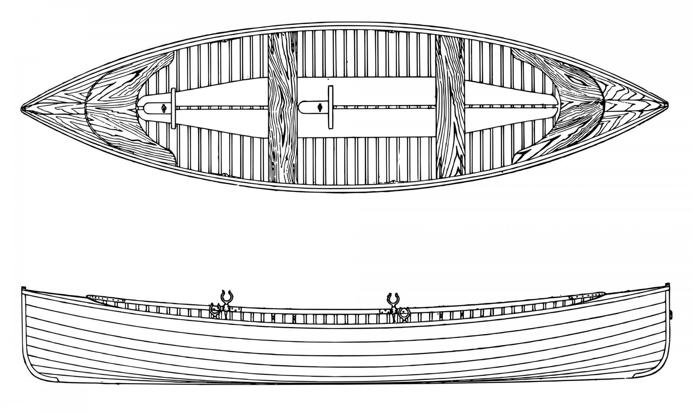
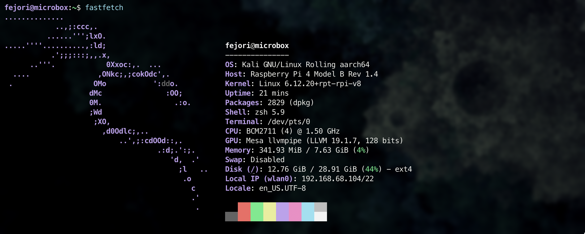
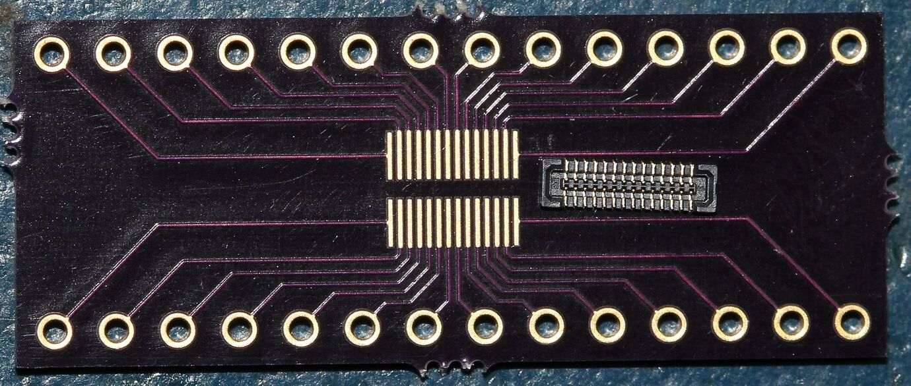
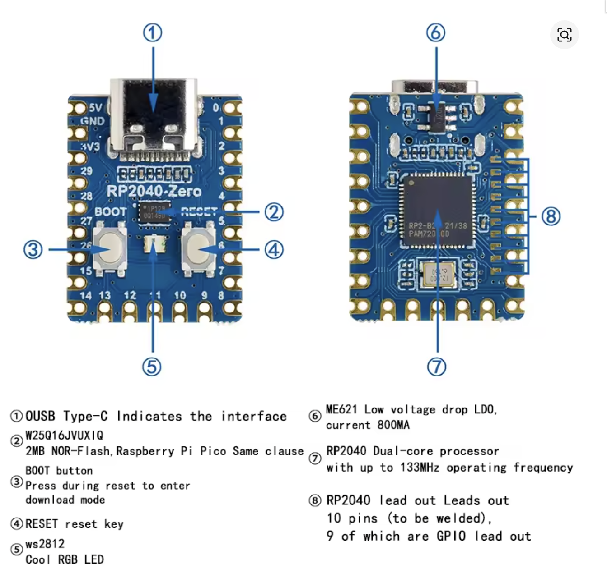

# CYBERDECK

<span style="text-align: center; width: 100%; font-size: 0.75em">
    
The **cyberdeck** project is an initiative to create a dedicated hacking machine with **pen-testing** specific tools. The chosen hardware was a **raspberry pi** with **kali-linux** installed

</span>



## Objective

The idea is having a truly portable device which is capable of running all **pen-testing** tools in a secure and contained environment. As i was learning about cyber security they kept talking about creating a **kali-linux** virtual environment and that didn't sound good.

Having a separated system with proper configuration seemed more maintainable and more useful. I had a raspberry pi laying around as well than i thought, why not.

## Initial setup

First step was to install the kali-linux image into my raspberry pi. I have a **raspberry pi model 4** as my hardware, with a `1.5GHz` processor, `8GB` of ram and `32GB` of sd memory.

I downloaded the latest **Kali Linux** `64 bit` image for **ARM** processor from the official website (link below) and fleshed it into the **pi** with the Raspberry pi imager (link below).

I performed the configuration to auto connect to my wifi with a given password. And was able to `ssh` into it without problems.

To activate the bluetooth I had to run these commands:

```bash
sudo systemctl enable --now hciuart.service
sudo systemctl enable --now bluetooth.service
```

And to activate the 3.5mm audio jack i had to run this command:

```bash
sudo amixer -c 0 set numid=3 1
```

Finally I've installed my first package which was `fastfetch` to check system info with `sudo apt install fastfetch` and did run it with `fastfetch` and here is the results:



I added `bindkey "^P" up-line-or-search` to my `.zsh` config file to make `ctrl+p` binds to go up in the history, as this is the keybind i'm most familiar.

One is able to checked my his MAC address with the ` nmcli -o device show` command and other web connectivity information.

### Useful links:

- [Raspberry pi imager](https://www.raspberrypi.com/software/)

- [kali + screen setup](https://github.com/Shlucus/ThePwnPal?tab=readme-ov-file)
- [kali linux for Raspberry pi](https://www.kali.org/docs/arm/raspberry-pi-4/)

## Screen configuration

To make my **cyberdeck** portable it was important to add a screen to it, for that I did purchase an **3.5inch RPI display**. To make it work you must download and run the driver setup which is very straight forward:

```bash
sudo rm -rf LCD-show-kali
git clone https://github.com/lcdwiki/LCD-show-kali.git
chmod -R 755 LCD-show-kali
cd LCD-show-kali/
sudo ./LCD35-show
```

After running this i moved the LCD-show-kali to a hidden `.utils` as it has useful scripts that I can use to configure the screen.

## Keyboard configuration

We will use a blackberry keyboard in our build. As it's praised and regarded as one of the best mobile phone keyboards that ever graced this earth.

To make it work we will need:

- Blackberry Q20 or Q10 keyboard (prioritize Q20, with more features);
- A `BM14B(0.8)-24DS-0.4V(53)` connector;
- A Microcontroller to convert all analog signals into a USB keyboard interface;
- A custom PCB to stitch it all together;

To connect both we will need an interface. For that, a custom pcb should be created:



With the appropriate connector. Instructions can be found in the links below.

### Useful links:

- [interfacing blackberry keyboard Q10](https://forum.arduino.cc/t/interfacing-blackberry-q10-keypad-to-arduino-and-the-oled-typewriter/342989)
- [about the blackberry Q10 keyboard](https://github.com/arturo182/BBQ10KBD)
- [HACKADAY about the blackberry keyboard](https://hackaday.com/2025/06/04/the-blackberry-keyboard-how-an-open-source-ecosystem-sprouts/)

## The keyboard microcontroller

We have some options when choosing the micro-controller for our little blackberry keyboard:

- `FP2040`: A raspberry pi zero little circuite board. This seems too much power for the objective as it can run an interface and is fairly powerful micro computer. But it's very simple to configure. One can check how to flesh it with a new firmware in `Annex A`.
- `ATMega32U4`: An Arduino based system. Much more simple to deal with and much less powerful. Which could be great for a more efficient build.
- `STM32`: Crazy efficient build, with simple setup.

All these are QMK compatible. Which will result in a fairly complete keyboard setup software-wise. The arduino based ones like the `ATMega` and the `STM32` can be configured using the arduino libraries for keyboard and mouse. Its compatible with mouse input as well. Which could enable trackpad integration as well in the same apparatus.

- [using the Mega with arduino library](https://www.youtube.com/watch?v=yTc2GLXfCOY)
- [configuring FP2040 with kmk firmware](https://www.youtube.com/watch?v=Q97bFwjQ_vQ)
- [QMK firmware documentation](https://docs.qmk.fm/porting_your_keyboard_to_qmk)

All these options are viable. I will Order the `FP2040` as well as a `ATMega32U4` to have a fallback options for if my build doesn't work. It's cheap enough for that.

## Annex A: Flashing the FP2040 board

To burn a UF2 firmware file to an RP2040 chip, press and hold the BOOTSEL button on the board, then connect it to your computer with a USB cable. The RP2040 will appear as a USB Mass Storage Device, similar to a USB drive, named rpi-rp2. Drag and drop the .uf2 file onto this drive, and the board will automatically restart and begin running the new firmware.



The firmware can be seen in the documentation in the links bellow.

After burning the image, the keyboard will be recognized when plugged via usb. You will be able to configure it via (link bellow) ;

To make the connections necessary to make the keyboard work, it's necessary a custom pcb, you can find it in the usefull links bellow.

### Useful links:

- [Configuring the board to the keyboard](https://github.com/ZitaoTech/Hackberry-Pi_Zero/blob/main/Keyboard/README.md)
- [vial](https://get.vial.today/)
- [PCB Brasil](https://pcbbrasil.com.br/?gad_source=1&gad_campaignid=8074883226)
