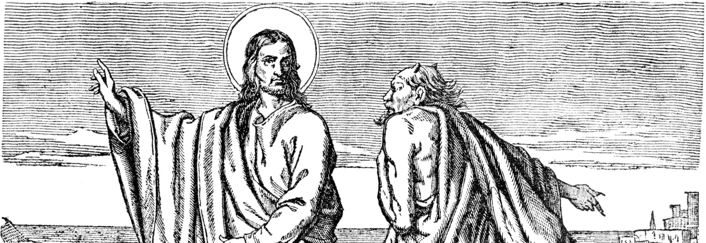

Demons and demonic things are pleasant. If they weren't, why would any one allow them into their lives? They offer great things in the material realm but at the cost your soul and infinite after-life. In this regard, they take pleasant forms, beaultiful demeanors, espetacular, even. They look good, kind and morally acceptable, even. They deceive you, but the harsh consequences of your choice aren't felt in life. So if life is all that you think is real, or all that matters, demons are good entities, in your perspective they give without asking nothing in return. And when you die you shall die eternally. So, in a sense, you will receive what you asked for and what you did believe. Maybe, in the end, people receive what they asked for. Maybe there isn't punishment, but strange gifts. Maybe God is just a father that does not know how to say 'no', the gift bringer. But what is a gift for some is doom for others. This is just how free will works. It doesn't concern choice of actions only, but how one sees the world and feel all things. And that shapes ones view of the world and of what lies beyond.

- silence is the language of the dead;
- For I am the shaper;
- zebedeu;

