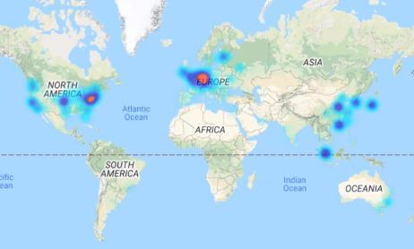
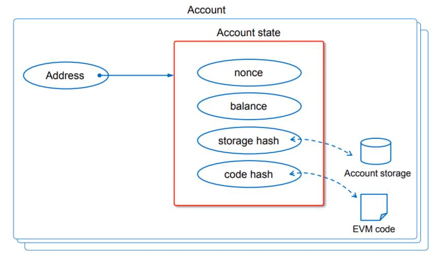

# Ethereum blockchain

Here we will start learning about ethereum and how to create smart contracts.

The ethereum network allows you to send value (Ether) which is the equivalent to Bitcoin and run smart contracts which are decentralized applications or Dapps.

The ethereum blockchain is an immutable public database that records every transaction that has ever taken place. Ethereum is **turing-complete**.

It has the following qualities:

- **Decentralized**: Theres no central entity that could control or shutdown the system;
- **Unstoppable and immutable**: Once an smartContract or transaction is deployed to the blockchain it can never be stopped or changed.
- **Censorship-free, no fraud or third-party interference**: The infraestructure is distributed and composed by it's users, and as so, isn't controlled by any entity or person. No one can stop it or controll it;

## Ethereum nodes

The ethereum nodes are pear-to-pear network computational unites. They compose the backend of the internet **3.0** and any one can run one without any prerequirements.

You can check the blockchain statistics in **ethernodes.org**:

Almost all clients are on Geth, that is short for go ethereum, created in **Go** programming language.

There are more ways for a user to interact with the ethereum blockchain besides nodes. **Web3.js** is a way of connecting a client web app to these entities with **http** protocols or **websocket**. It was designed by the core ethereum team.

Other way is through a private wallet, that is a piece of software. It has a private key and they can interact with **DAPS**. One famous example is the **Metamask** wallet. In the main ethereum web page one can find all sorts of wallets to use.

An ethereum node runs on a **Virtual machine** named **EVM** and they can run applications (EVM bytecode) based on a global consensus mechanism. This **EVM** has internal microkernel, stack, memory and storage.

There are three types of nodes:

- **Full Node**: Stores locally a copy of the entire blockchain, and participates on the block validations, verifying blocks states;
- **Light Node**: Stores only the header chains and requests everything else. Can verity validity of the data against the state on the headers;
- **Archive Node**: Stores everything in the full node.

You can run your own node, but check if you have the required resources.

Note that there are new clients in **Ethereum 2.0** based on the beacon chain that runs proof of stake and not proof of work.

## Ethereum accounts and address

There are two account types in ethereum. Both can receive, hold and send ether and both can deploy and interact with smart contracts:

- **Externally Owned Account (EOA)**: Controlled by a private key and identified by an unique address. It's managed by a human and not by a contract. Has no associated code. To interact with such account you can use a wallet.
- **Contract Account (CA)**: It can be created by an externally owned account or by another contract account. It has an external address (similar to the EOA one) but has no private key. It is controlled by the contract code only. It's an autonomous agent and it's code execution is triggered by receiving a transaction or message (call) from another contract of an EOA. It can hold **ETH** balance like an EOA.

The accounts have the following components:

- **None**: Counter that indicates the number of transactions sent from the account (it ensures that the same transaction isn't submitted twice);
- **Balance**: It is defined in **wei**. $1 ETH = 10**18 wei$;
- **Account Address**: Used as you public identifier, and necessary to stablish transactions;
- **Private Address**: The private key grants access to your balance, it enables you to send value from your balance to other accounts.;
- **Code**: Immutable EVM bytecode only present in contract accounts;
- **Storage**: Empty by default, only present in contract accounts.

An EOA address is derived from the last 20 bytes (160 bits) of the public key that are Keccak-256 hashed. It's represented in an exadecimal format, which is often indicated explicitly by appending 0x to the address, like 0xCC342234563C98b83b0b234F234B23...

The private key can be decoded with a pass phrase and it's vital to keep it secure.

The address for an Ethereum contract is deterministically computed from the address of its creator (sender) and how many transaction s the creator has sent (nonce). There is a lower-case version and a partial upper-case version that also contains a checksum.

## Wallets

There are wallets that you can use to interact with the ethereum ecosystem. The two we will study in this course are:

- **MetaMask**: It's a chrome extension that let's you interact with the Ethereum network. From it you can even interact with a self hosted localhost network if you chose so.
- **myetherwallet**: It's a web app.
