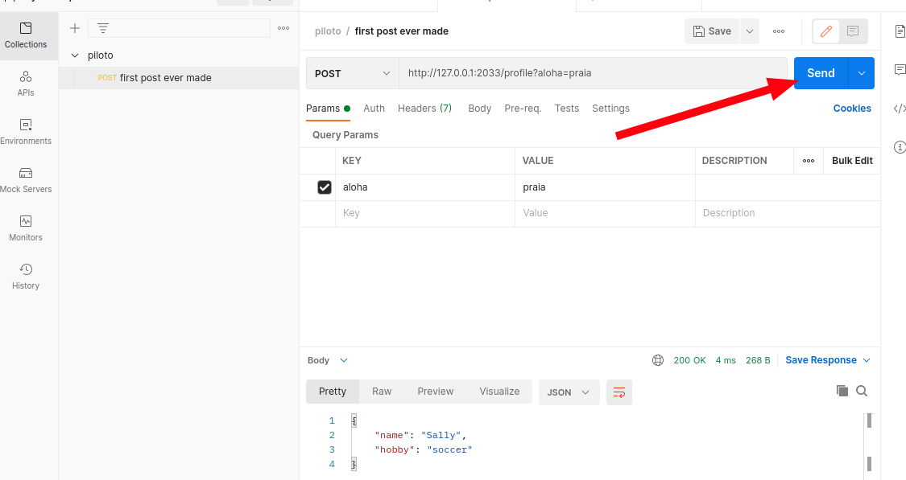

# Express, the back end tool

When we are in the Front End we can use React to enhance our lives as developers. The frame work can simplify things and really help in the development process. We have something similar for the back end. The **Express** library is a `Javascript` frame work for better development of back ends. It automates boring tasks and do a bunch of stuff for us.

## Installing Express on a project

The first thing that needs to be done is installing the library:

```bash
npm install express
```

Than we can create a basic server with the following code present in `server_2.js`:

```javascript
const express = require("express");

const app = express();

app.get("/", (req, res) => {
  const user = {
    name: "sally",
    hobby: "soccer",
  };
  res.send(user);
});

app.listen(2033);
```

Or, for a html page:

```javascript
const express = require("express");

const app = express();

app.get("/", (req, res) => {
  res.send("<h1> hello </h1>");
});

app.listen(2033);
```

Note that we don't need to specify the type of the response. That is pretty handy already.

## Middleware

Until now we just studied the `ap.get()` command, but there are others that the `http` protocol support and only the back end side needs.
One of those for the back end is the **middleware** function.

```javascript
const express = require("express");

const app = express();

console.log("1");

// Middle ware
app.use((req, res, next) => {
  console.log("4");
  next();
  console.log("6");
});

app.get("/", (req, res) => {
  res.send("<h1> hello </h1>");
  console.log("5");
});

console.log("2");
app.listen(2033);
console.log("3");
```

The objective is to execute some kind of code before the get command's response. The `next()` function calls the other proceedings. You can see that as the code above results in the logs being in order.

## Postman

Other than get information from the server, some times we would like to send some data. For that we can use the post command.

```javascript
app.post("/profile", (req, res) => {
  const user = {
    name: "Sally",
    hobby: "soccer",
  };
  res.send(user);
});
```

This will send a `json` whenever a client makes a post to the specified `url`. Interestingly enough, you can't test this with only your browser as searching for the `url` only results in `GET` requests. To create a post request some code in html must be done, or you can use the **POSTMAN** program. It is a program that tests html function protocols in a given server. Installing it can be done freely in the official tool's website. It can be installed from AUR too, with the package `postman-bin` (for arch users).

Than you can do this:



Than you will send a post request to the server with any information you can think of. This is very useful because it permits you make fast and simple tests with the `http` protocol. You can note too that we aren't using the information passed through the body of the post request. But only sending a request. For doing that you can update your code with:

```javascript
const express = require("express");

const app = express();
// Allows url encoded information and raw json too
app.use(express.urlencoded({ extended: false }));
app.use(express.json());

app.post("/profile", (req, res) => {
  console.log(req.body);
  res.send(user);
});

app.listen(2033);
```

Selecting `body` in the request options you can send raw `json` too. Or `html` or other formats. And you can receive this information in the server side. The code above just `logs` the info received and respond with 'success'.

Other commands like `put` and `delete` are very similar to `post` but they are used for changing a information or deleting it. This is, of course, programed by the back end engineer.
