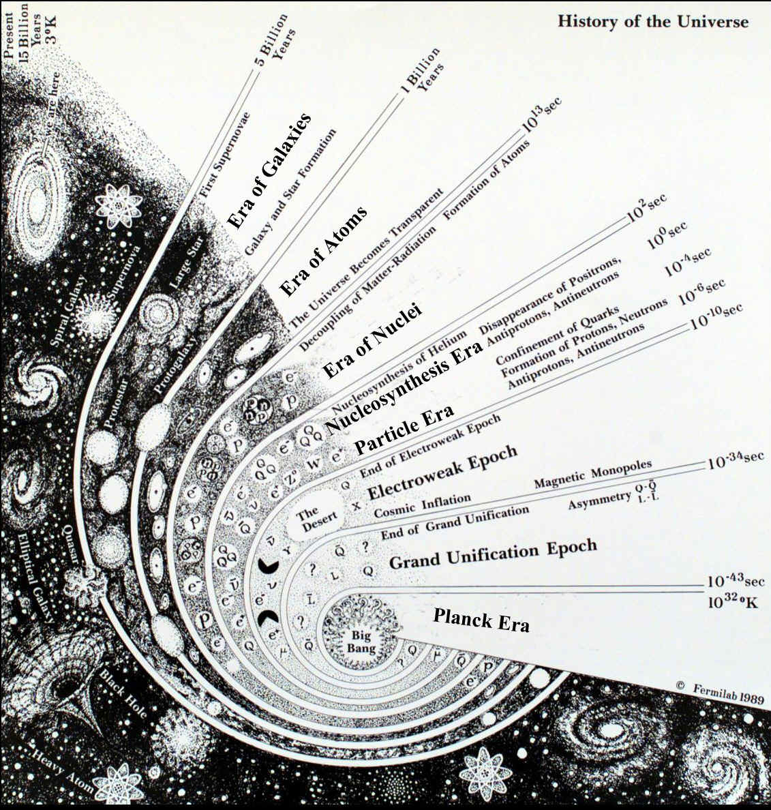

# O LIVRO DE GENESIS

Síntese da leitura do livro de gênesis. Idéias, conceitos, interpretações, opiniões e inquietações.
As passagens em Hebreu são do codex de leningrado. Atenção: Em texto puro aparecerá invertido.

---

    בְּרֵאשִׁ֖ית בָּרָ֣א אֱלֹהִ֑ים אֵ֥ת הַשָּׁמַ֖יִם וְאֵ֥ת הָאָֽרֶץ׃

 

O livro de genesis representa o princípio da antiga aliança. Chamado de livro das origens, ele reúne um quinto do pentateuco - o Torah -. Ademais, é uma coletânea de narrativas que abordam a história da humanidade desde seu princípio até a morte de José, filho de Jacó. Ele é entendido como um mosaico de contos da humanidade primitiva e não pode ser lido de forma literal, uma vez que retrata culturas de tempos imemorial. Apesar disso ele traz a verdade de deus em uma linguagem que foi capaz de instruir os de sua época e segue nos instruindo até hoje. Sua autoria é de Moisés nos círculos cristãos, mas esse é um campo muito debatido no meio acadêmico secular.

---

## Capítulo 1: As metáforas da criação do universo

Tem-se um recorte do início dos tempos nas palavras do criador. A síntese do espaço se dá no primeiro verso, finalizando-se com a criação da luz.

### ✾ Dia 1: versos 1 e 2

Leitura da passagem original:

- 1:1 : **בְּרֵאשִׁ֖ית בָּרָ֣א אֱלֹהִ֑ים** | No princípio, criou Deus
- 1:1 : **אֵ֥ת הַשָּׁמַ֖יִם וְאֵ֥ת הָאָֽרֶץ׃** | os céus e a terra
- 1:2 : **וְהָאָ֗רֶץ הָיְתָ֥ה תֹ֙הוּ֙ וָבֹ֔הוּ** | A terra, porém, estava informe e vazia
- 1:2 : **וְחֹ֖שֶׁךְ עַל־פְּנֵ֣י תְהֹ֑ום** | e havia trevas sobre a superfície do abismo
- 1:2 : **וְר֣וּחַ אֱלֹהִ֔ים מְרַחֶ֖פֶת** | e o espírito de Deus pairava
- 1:2 : **עַל־פְּנֵ֥י הַמָּֽיִם׃** | sobre a superfície das águas

No primeiro verso (gen 1:1), fala-se que Deus criou o céu e a terra; a palavra para "céu" denota o plano espiritual, enquanto a palavra "terra", denota nosso universo material. A palavra do hebraico `הַשָּׁמַ֖יִם` significa "os céus", no plural, enquanto a palavra `הָאָֽרֶץ` significa "a terra", no singular.

> Dessa forma, sou adepto da visão de que referem-se a diferentes planos de existência. O plano espiritual e o plano material.

Em seguida, fala-se que a terra estava disforme, deserta e vazia. Segue-se, então, com mais uma descrição aparentemente contraditória: A analogia de trevas sobre a face do abismo:

    וְחֹ֖שֶׁךְ עַל־פְּנֵ֣י תְהֹ֑ום וְר֣וּחַ אֱלֹהִ֔ים מְרַחֶ֖פֶת עַל־פְּנֵ֥י הַמָּֽיִם

É interessante notar que a palavra `חֹ֖שֶׁךְ` significa "escuridão" ou "trevas"- sem a partícula `וְ` que significa "e" com valor de Conjunção Coordenativa Aditiva -; enquanto a palavra `תְהֹ֑ום` significa "abismo", "profundezas", "oceano".

Dessa forma ilustra-se um universo na figura de linguagem de um oceano. A superfície do oceano é o leito, dentro, no interior. Por outro lado, no fim completa-se que deus se move sobre a superfície das águas (acima).

> Assim, minha interpretação é a de que ao se situar sobre as águas, Deus se situa fora do abismo (oceano escuro que representa o universo), dessa forma, fora do universo e no plano espiritual.

> Deus nos pinta uma linda metáfora, para descrever geometricamente algo que não pode ser descrito.

Outra reflexão interessante é a de que a palavra `ר֣וּחַ` significa "espírito", "vento", "sopro". A palavra `מְרַחֶ֖פֶת` significa "pairava", "agitava", "flutuava". Assim, Deus é um "ar" que naturalmente habita o céu, uma metáfora do plano espiritual.

### ✾ Dia 1: versos 3, 4 e 5

Leitura da passagem original:

- 1:3 : **וַיֹּ֥אמֶר אֱלֹהִ֖ים** | E disse Deus
- 1:3 : **יְהִ֣י אֹ֑ור** | Haja luz
- 1:3 : **וַֽיְהִי־אֹֽור׃** | e houve luz
- 1:4 : **וַיַּ֧רְא אֱלֹהִ֛ים אֶת־הָאֹ֖ור כִּי־טֹ֑וב** | E viu Deus que a luz era boa
- 1:4 : **וַיַּבְדֵּ֣ל אֱלֹהִ֔ים בֵּ֥ין הָאֹ֖ור וּבֵ֥ין הַחֹֽשֶׁךְ׃** | e separou Deus a luz das trevas
- 1:5 : **וַיִּקְרָ֨א אֱלֹהִ֤ים ׀ לָאֹור֙ יֹ֔ום** | E chamou Deus à luz Dia
- 1:5 : **וְלַחֹ֖שֶׁךְ קָ֣רָא לָ֑יְלָה** | e às trevas chamou Noite
- 1:5 : **וַֽיְהִי־עֶ֥רֶב וַֽיְהִי־בֹ֖קֶר יֹ֥ום אֶחָֽד׃ פ** | E foi a tarde e a manhã, o dia primeiro

Aqui, Deus diz "haja luz" e houve luz. Interessante que o verbo para "dizer", tem o som "amar", "love" em português- somente uma curiosidade -. A palavra `יְהִ֣י` significa "haja" e a palavra `אֹ֑ור` significa "luz", tanto no sentido literal de luz de uma lâmpada, quanto luz no sentido de "conhecimento.

O episódio da existência da luz é seguido por uma avaliação de Deus, que vê que a luz é boa. Interessante que Deus constatou que a luz era boa após sua criação- Algo que aparentemente contraria o princípio de onisciência -. Em seguida. Separa-se então a luz das trevas. Chama-se luz de **dia** e as trevas de **noite**.

> Minha interpretação é a de que a luz é inicialmente onipresente, algo que assemelha-se aos momentos iniciais do universo, de acordo com a radiação de fundo do espaço profundo.

> Em um momento inicial o universo inteiro comportou-se como um sol. Mas com a expansão e o resfriamento do espaço, a formação da matéria e a formação das primeiras estrelas, a luz separou-se das trevas.

Ao fim diz-se que houve a tarde e a manhã, o dia primeiro. O que é interessante, pois denota-se que passou uma noite ao se descrever como uma nova manhã começou. O período antes da tarde foi o momento em que Deus trabalhou.

> Há novamente uma ilustração muito interessante. Para dizer que o tempo passou, Deus descreve as consequências disso na perspectiva de um observador terrestre. A noite e o dia. Mostrando que ele levou a palavra provavelmente a povos que não tinham a mesma noção de tempo que temos hoje. Baseada em acontecimentos astronômicos dos mais básicos.
