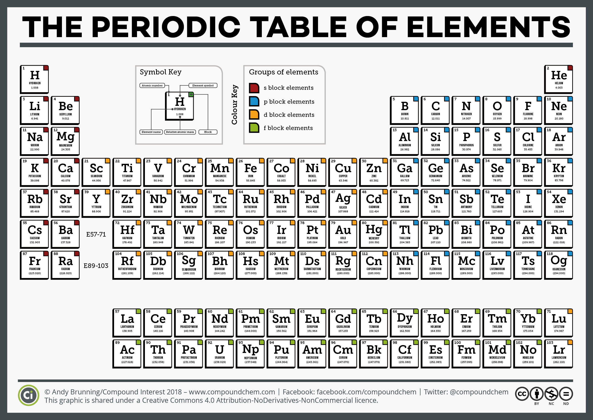

# THE PERIODIC TABLE

    Properties, relationships, and trends in the periodic table. Synthesis of the most important concepts on the matter.

---

The periodic table is a tabular arrangement of the chemical elements. These elements are ordered by their atomic number, electron configuration, and recurring chemical properties.

---

## ✾ FAMILIES AND PERIODS

The family is determined by the number of electrons in the outermost layer. The periods are determined by the number of layers:

| Family       | electronical configuration | name                  |
| ------------ | -------------------------- | --------------------- |
| $1A$ or $1$  | $ns^1$                     | Alkali metals         |
| $2A$ or $2$  | $ns^2$                     | Alkaline earth metals |
| $3A$ or $13$ | $ns^2np^1$                 | Boron family          |
| $4A$ or $14$ | $ns^2np^2$                 | Carbon family         |
| $5A$ or $15$ | $ns^2np^3$                 | Nitrogen family       |
| $6A$ or $16$ | $ns^2np^4$                 | Chalcogens            |
| $7A$ or $17$ | $ns^2np^5$                 | Halogens              |
| $8A$ or $18$ | $ns^2np^6$                 | Noble gases           |

All **A** families are called **main groups** or **representatives** which end within the sub-level **s** or **p**. The **B** families are called **transition metals** and they end within the sub-level **d** or **f** (lanthanides and actinides).

Another way of classifying the elements is by their nature, which can be metals, non-metals, semi-metals and noble gases. The non-metals are: **C**, **N**, **O**, **F**, **P**, **S**, **Cl**, **Se**, **Br**, **I**, **At**. And the semi-metals are: **B**, **Si**, **Ge**, **As**, **Sb**, **Te**, **Po**. Finally, the noble gases are: **He**, **Ne**, **Ar**, **Kr**, **Xe**, **Rn**.

> Hydrogen is a special case, as it is in the first period and has a unique position in the table. It can react with both metals and non-metals and in ambient conditions is a gas.

Metals present metallic properties, like conductivity, malleability, and ductility. Non-metals are the opposite, and semi-metals have properties of both.

## ✾ ELEMENT PROPERTIES

The properties of the elements are determined by the atomic number and molecular mass. The most important periodic properties are:

- Atomic radius;
- Ionization energy;
- Electron affinity;
- Electronegativity;
- Density;
- Atomic volume;
- `TF` and `TE`;

Now we will check one by one.

### 🚧 Atomic radius

This value is the distance between the atom's nucleus and the outermost electronic layer. Most important trends:

- It increases from right to left and from top to bottom;

> Ex1: In the family 1A we have H, Li, Na... The atomic radius increases for each element, as a new layer is added.

> Ex2: In the third period we have $Na_{11}$, $Mg_{12}$, $Al_{13}$ and the atomic radius increases from aluminum to sodium. This is because there are more protons for the same number of layers, and the higher number of protons increases the compression of the electron layer.

It's interesting to note that cations and anions also have a different atomic radius than the neutral atom. To understand the differences, it is valid to observe the difference in electronic distribution:

- The addition of electrons increases the atomic radius;
- The removal of electrons decreases the atomic radius;

### 🚧 Ionization energy (ionization potential)

Minimum energy needed to remove an electron, as in the following scheme:

$$
X(g) + E_1 \rightarrow X^+(g) + e^-
$$

The ionization energy is associated with the atomic radius in that the larger the radius, the easier it is to ionize the atom, hence, the lower the ionization energy.

Then, the ionization energy increases from left to right and from bottom to top.

The subsequent ionization energies are higher as the atom loses electrons.

> Ex1: Aluminum has a higher ionization energy than sodium, as it has more protons and fewer layers.

> Ex2: Helium has the highest ionization energy in the periodic table, as it is in the upper right corner.

### 🚧 Electron affinity

Energy released when an atom gains an electron. This can be represented by the equation:

$$
X(g) + e^- \rightarrow X^-(g) + E_1
$$

The electron affinity increases from left to right and from bottom to top, following the same pattern as the ionization energy.

> **ATTENTION**: The electron affinity of the 8A group is zero, as it already has the noble gas configuration.

### 🚧 Electronegativity and electropositivity

The **electronegativity** is the ability of an atom to attract electrons, it increases in the same way as the **electron affinity**. The **electropositivity** is the ability of an atom to lose electrons. The **most electronegative** atoms are in the upper right corner of the periodic table, and the **most electropositive** are in the lower left corner.

The atoms with the highest electronegativity are, in descending order: **F**, **O**, **N**, **Cl**, **Br**, **I**, **S**, **C**.

The atoms with the highest electropositivity are, in descending order: **Fr**, **Cs**, **Rb**, **K**, **Na**, **Li**, **Ca**, **Sr**, **Ba**, **Ra**.

### 🚧 Dencity

From experiments, it is possible to determine the density of the elements.

- In the families **1A** and **2A** the density increases from left to right.
- In the families **3A** to **8A** the density decreases from right to left.
- in the entire table, the density increases from top to bottom.

So the elements with the highest density are in the center of the table.

### 🚧 Atomic volume

The atomic volume determines the space occupied by a mole of atoms of a given element. It is calculated by the formula:

$$
V = \frac{m}{d}
$$

Where $m$ is the molar mass and $d$ is the density.

It increases from top to bottom and from the center to the edges.

### 🚧 `TF` and `TE`

The **temperature of fusion** and the **temperature of evaporation** are the temperatures at which the element changes from solid to liquid and from liquid to gas, respectively. From experiments, it is possible to determine these values for each element.

In the families **1A** and **2A** the `TF` and `TE` they increase from bottom to top and from left to right. In the families **3A** to **8A** the `TF` and `TE` they decrease from top to bottom and from right to left.
