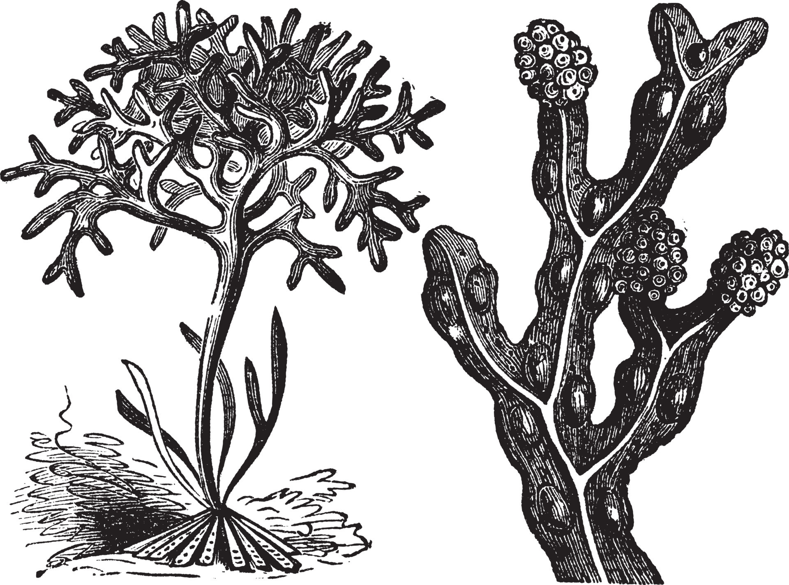

# BRIOPHYTES (BRIÓFITAS)

Little plants without specialized vascular tissues. They were the first terrestrial plants.

## Introduction

They are the mosses, liverworts (hepáticas) and hornworts (antóceros). Small plants that depend on moist environments to survive. They were the first plants to colonize terrestrial environments.

## Morphology

These plants have a very simple morphology, with roots, stems (caules) and leaves little differentiated without specialized vascular tissues:

They are divided into three phyla: Marchantiophyta (liverworts), Anthocerotophyta (hornworts) and Bryophyta (mosses).

- They present genetical alternation of generations;
- The gametophyte is the dominant phase of the life cycle;
- They are avascular (but some have tissues that conduct substances);
- They are small because they do not have conducting vessels;
- They are dependent on water for reproduction, as the antherozoids (anterozoides) swim to the oosphere (oosfera);

> The cells responsible for conducting water are called hydroids (hidroides) and the cells responsible for transporting nutrients are called leptoids (leptoides).

The rizoids (rizoides) are responsible for fixing the plant in the substrate, not being responsible for the absorption of nutrients or water.

## Life cycle

In the life cycle of bryophytes, the gametophyte is the dominant phase:

- The sporophyte (esporófito) is diploid, formed by the union of gametes (zygote) (zigoto) and subsequent mitosis;
- The spores are haploid (haploides). They arise by meiosis;
- The spores germinate and form the gametophytes of each genus;
- The Anteridium (Anterídio) (masculine gamete) and the archegonium (arquegônio) (feminine gamete, where only one oosphere is formed) are formed;
- After fertilization, the zygote develops into the sporophyte (esporófito).

> For most of their life, bryophytes (briófitas) are haploid, as the sporophyte (diploid element) is very small and dependent on the gametophyte.
