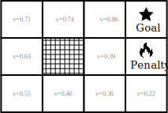

# ARTIFICIAL INTELLIGENCE

Technology behind the prospect of machines that can perform tasks that require decision making, learning and other classic human cognitive abilities. With such power, machines can learn from experience, adjust to new inputs, and perform human-like tasks.

## 

## Reinforcement Learning

Imagine a maze where a rat is trying to find a piece of cheese. The rat will interact with the maze by changing it's state (location, for example). For each state that the rat is in, it will have a different 'reward', like being closer to the cheese. By trying different states, it will learn the ones that give the best rewards.

From this analogy we can identify the most important concepts of Reinforcement Learning:

- **Environment**: The maze;
- **Agent**: The rat;
- **State**: The location of the rat;
- **Action**: The movement of the rat;
- **Reward**: The reward for each state;

The **environment** can be anything, like a city, a board game, a string of text, etc. The set of **states** are the ways in which the agent can assume a different context within the environment. The **actions** are the ways in which the agent can change it's state in the environment. And, finally, the **reward** is the feedback that the agent receives for each state.

The learning process is done by the agent trying different actions in different states and learning which ones give the best rewards.

### Additional resources:

- [Simple reinforcement learning with Tensorflow](https://medium.com/emergent-future/simple-reinforcement-learning-with-tensorflow-part-0-q-learning-with-tables-and-neural-networks-d195264329d0)
- [Reinforcement learning 1](http://citeseer.ist.psu.edu/viewdoc/summary?doi=10.1.1.32.7692)

## The Bellman Equation

Created by **Richard Ernest Bellman**, a mathematician. Created the concept of dynamic programming which is the base for reinforcement learning.

- **S**: Current state;
- **A**: Action;
- **R**: Reward;
- **$\gamma$**: Discount factor;
- **$x'$**: value x of the next state;

With these concepts, we can define the simplified Bellman equation as follows:

$
V(s) = \max_a (R(s, a) + \gamma V(s'_a))
$

So the value of a state is the maximum reward that can be obtained from that state summed with the value of the next state.

> Observe that the value is different from the reward. The reward is a property of the environment, while the value is a property perceived by the agent.

We can represent the Bellman equation idea with the following diagram, that shows an environment with $11$ states, and $4$ actions (up, down, left, right), and a $0.9$ discount factor:

So, the equation is used in each state to calculate the value of that state. The maximum value is from the state that is the closest to the state that is considered the reward.

> It is possible to create a plan of actions to reach a goal by using the gradient of the value function. The gradient is the direction of the maximum increase of the value function. By following the gradient, the agent can reach the goal.

### Additional resources:

- [The theory of dynamic programming](https://www.rand.org/content/dam/rand/pubs/papers/2008/P550.pdf)

## Markov Decision Processes (MDP)

For each state there are a set of actions that can be taken. The deterministic approach is when the next state is known, and the stochastic approach is when the next state is described by a probability distribution. The stochastic approach is used to model the uncertainty of the environment. Things that can't be controlled by the agent.

> A stochastic process has the Markov property if the conditional probability distribution of future states of the process depends only upon the present state, not on the sequence of events that preceded it. A process with this property is called a Markov process.

A way of interpreting this is by thinking of a game of chess. The agent can't control the opponent's moves, so the environment is stochastic, and each state is the current board configuration, which doesn't depend on the sequence of moves that led to that configuration.

The Markov Decision Processes (MDPs) provide a mathematical framework for modeling decision making in situations where outcomes are partly random and partly under the control of a decision maker. So the each actino will have a set of possible outcomes, and the agent will have to choose the best action to take based on these set of outcomes.

> The new equation that describes the value of a state in a Markov Decision Process is the following:
>
> $
>V(s) = \max_a (R(s, a) + \gamma \sum_{s'_a} P(s \rightarrow s'_a) V(s'_a))
>$
>
> Where $P(s \rightarrow s'_a)$ is the probability of reaching state $s'$ from state $s$ by taking action $a$.

We can do the math with this new equation to find the value of each state. A possible result would be the following updated diagram:

We can se that the penalty had a bigger impact on the states, as we had to consider the probability of the agent ending there.

### Additional resources:

- [A survey of applications of markov decision processes](http://www.cs.uml.edu/ecg/uploads/AIfall14/MDPApplications3.pdf)

## Policy vs plan

While a plan is a sequence of actions that the agent will take to reach a goal, a policy is a function that maps states to actions. The policy is a strategy that the agent will use to decide what action to take in every state.

> Plans are deterministic by nature, while policies can be stochastic. One example is following the environment's Value's gradient to select the best action, or a probability distribution for each possible action to be chosen stochastically.

## Adding a "Living Penalty"

By adding a negative reward for all states, we can make the agent take the shortest path to the goal. This is called a "living penalty". The incentive is to reach the goal with the least amount of states visited.

## Q-Learning Intuition

Q-Learning is a model-free reinforcement learning algorithm. It works from the elaboration of a function that estimates the value of taking an action in a state represented by $Q(s, a)$, where $s$ is the initial state and $a$ is the action. We call this value **"Quality"**.

The **Quality** isn't a property of the state, but of an action in a state, and represents it's perceived effectiveness towards the goal, it differs from **Value** as it is associated to an action. So the bellman equation can be rewritten as:

$
Q(s, a) = R(s, a) + \gamma \sum_{s'_a} P(s \rightarrow s'_a) V(s'_a)
$

And we can substitute $V(s'_a) = \max_{a'_a} Q(s'_a, a'_a)$ (from the belman equation and the one above) to get the following expression:

$
Q(s, a) = R(s, a) + \gamma \sum_{s'_a} P(s \rightarrow s'_a) \max_{a'_a} Q(s'_a, a'_a)
$

Where $s'_a$ is the next state, given action $a$, and $a'_a$ is the actions available in the next state given action $a$.

So, the _Quality_ of an action can be summarized as the immediate reward plus the discounted value of the next state, that is, the maximum quality of among the actions available in the next state.

### Additional resources:

- [Markov decision parocesses: concepts and algorithms](https://pdfs.semanticscholar.org/968b/ab782e52faf0f7957ca0f38b9e9078454afe.pdf)
- [Q-learning](https://en.wikipedia.org/wiki/Q-learning)
- [Reinforcement learning: An introduction](http://www.incompleteideas.net/book/RLbook2018.pdf)

## Temporal difference

The algorithm of Q-learning can be implemented with an array that stores the _Quality_ of state action pairs. We initiate the array with random values, and as the agent interacts with the environment, the values are updated according to the Bellman equation.

> Lets assume a deterministic approach, where from an action in a state, the next state is known, for simplicity sake. In this case $P(s \rightarrow s'_{a|best}) = 1$, and $P(s \rightarrow s'_{a|notbest}) = 0$, so the sum can be simplified to the maximum value of the next state resulting in the following equation:
>
> $
> Q(s, a) = R(s, a) + \gamma \max_{a'_a} Q(s'_a, a'_a)
> $

We call $R(s, a) + \gamma \max_{a'_a} Q(s'_a, a'_a)$ the **target** value, and $Q(s, a)$ the **current** value. The difference between the target and the current value is called the **Temporal Difference** ($TD(a,s)$).

Then, we can use this difference to update the current value of the state action pair by the following formula:

$
Q'(s, a) = Q(s, a) + \alpha TD(s, a)
$ ,

or

$
Q'(s, a) = Q(s, a) + \alpha (R(s, a) + \gamma \max_{a'_a} Q(s'_a, a'_a) - Q(s, a))
$ ,

or, even,

$
Q'(s, a) = (1 - \alpha) Q(s, a) + \alpha (R(s, a) + \gamma \max_{a'_a} Q(s'_a, a'_a))
$ ,

where $\alpha$ is the learning rate, which controls how much the new information will affect the current value. And $Q'(s, a)$ is the new value of the state action pair.

> Considering the stochastic approach, the sum will be the expected value of the next state, and the equation will be:
>
> $
> Q'(s, a) = Q(s, a) + \alpha (R(s, a) + \gamma \sum_{s'_a} P(s \rightarrow s'_a) \max_{a'_a} Q(s'_a, a'_a) - Q(s, a))
> $

### Additional resources:

- [Learning to Predict by the methods of temporal differences](https://link.springer.com/article/10.1007/BF00115009)

## Exploration vs Exploitation

When the agent is learning, it needs to explore the environment to find the best actions. But, when the agent has already learned the best actions, it should exploit that knowledge to get the best rewards.

To balance exploration and exploitation, we can use an $\epsilon$-greedy policy. This policy will choose a random action with probability $\epsilon$, and the best action with probability $1 - \epsilon$.

### Additional resources:

- [Exploration vs exploitation](https://en.wikipedia.org/wiki/Exploration%E2%80%93exploitation_tradeoff)

## Deep Q-Learning intuition

This method uses [artificial-neural-networks](1712240474-artificial-neural-networks.md) to approximate the Q-values. The network has the state as input and it outputs the Q-values for each action available. In this regard, the number of inputs define the number of degrees of freedom of the system where the agent is:

We no long need to store the Q-values in an array, as the network can approximate the values for any state. The network is trained by minimizing the _Loss function_ for the entire domain, by adjusting the weights of the network through [Backpropagation (stoachastic gradient descent)](1712240474-artificial-neural-networks.md#backpropagation).

The Loss function can be obtained by the L2 norm of the temporal difference:

$
Loss = \sum_{a} (R(x, y, a) + \gamma \max_{a'_a} Q(x'_a, y'_a, a'_a) - Q(x, y, a)) ^ 2
$

So it calculates the **Q-value** for the current state with the neural network, and compares with the sum of the reward and the maximum Q-value of the next state (that is calculated with the neural network as well. The difference is squared and summed for all available actions.

From the resulting Q-values, the agent can choose the best action for each state with the use of a [Softmax-function](1712240474-artificial-neural-networks.md#softmax-function) function. This function will output a probability distribution for the actions, where the best action will have the highest probability.

> Remember the concept of [Exploration vs Exploitation](1712174618-artificial-inteligence.md#exploration-vs-exploitation). In case of the Deep Q-Learning, The agent could proceed without learning anything and only using the neural network and the softmax function to choose the best action. This would be a case of pure exploitation. By calculating the loss and updating the weights of the network the agent is always validating the results of the network with new **Bellman equation** calculations. For each state visited, the **Q-values** of all actions from the current and immediate next state are calculated, and the network is updated to minimize the loss.

### Additional resources:

- [simple-reinforcement-learning-with-tensorflow](https://medium.com/@awjuliani/simple-reinforcement-learning-with-tensorflow-part-4-deep-q-networks-and-beyond-8438a3e2b8df)

## Experience replay

This is a technique that agglutinates all the perceived experiences of the agent in a buffer. The agent will sample a batch of experiences from this buffer and use it to train the neural network. It will remember the following data of each experience:

- The current state;
- The action taken;
- The state after the action;
- The reward received;

In this way it breaks the sequential bias of the data, as all states are independent of each other. And the rare occurrences are considered, but with a lower impact on the training.

> There are different methods to prioritize the experiences in the buffer. One of them is to use the temporal difference as a measure of the importance of the experience. The higher the temporal difference, the more important the experience is.

### Additional resources:

- [prioritized experience replay](https://arxiv.org/pdf/1511.05952.pdf)

## Action selection policies

Until now, we have only used the **Softmax-function** to select the best action for each state. But there are others:

- **$\epsilon$-greedy**: Randomly selects an action with probability $\epsilon$, and the best action with probability $1 - \epsilon$.
- **$\epsilon$-soft $(1-\epsilon)$**: Randomly selects an action with probability $\epsilon - 1$, and the best action with probability $\epsilon$.
- **Softmax**: Outputs a probability distribution for the actions, where the best action will have the highest probability ([artificial-neural-networks ❯ Softmax-function](1712240474-artificial-neural-networks.md#softmax-function))

So the agent will choose randomly with probability for each action according to the policy.

### Additional resources:

- [adaptive-e-greedy-exploration-in-reinforcement-learning-based-on-value-differences](http://tokic.com/www/tokicm/publikationen/papers/AdaptiveEpsilonGreedyExploration.pdf)
