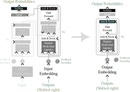

# LARGE LANGUAGE MODELS

Natural language generative models are a type of [artificial-inteligence](1712174618-artificial-inteligence.md) that can generate human like text from a given prompt. They are trained on large datasets of text, and they work by predicting the next word in a sentence given the previous words.

## ✾ Introduction

To create a large language model, you need the following ingredients:

- **Lots of data**: The more data, the better the model. You can find data in [huggenface](https://huggingface.co/datasets) or [kaggle](https://www.kaggle.com/datasets);
- **transformer architecture**: A neural network architecture that is particularly good at processing sequences of data;
- **Pre-training**: The most expensive and slow part of the process;
- **Reinforcement learning**: Learning from human feedback;
- **Fine-tuning**: The model is fine-tuned on a specific task (financial data, legal data, internal knowledge base).

Large language models were first explored in the paper **"Attention is All You Need"** by Vaswani et al. in 2017. Where the transformer architecture was introduced. It is a neural network architecture that is great at processing sequences of data.

It was initially used for translation tasks. It has an encoder and a decoder as it can be seen in the image below, in the left.

To the right we can see the changes made to the architecture to make it a generative language model. This version was first discovered by **open-AI** engineers. The encoder is removed and the decoder-only architecture is used to predict the next word in a sentence. It is the architecture used in **GPT-2**, **GPT-3**, **LLaMa** and other models.

Therefore, the **language generation models** are a decoder-only version of the transformer architecture, previously used for translation tasks.

## How do they work?

If we imagine the Language model as a function, it takes a string of a sequence of words as input and outputs a probability distribution over the next word in the sequence. After that, the model can use it's own output as input to generate the next word in the sequence, and so on until the desired length of the text is reached, or the _"end of sequence token"_ is generated, which is an output that indicates the end of the text.

- **Outputs (Shifted right)**: String of sequence of words.
- **Output Embeddings**: Converts the string of words into a sequence of vectors that represent the words.
- **Positional Encodings**: Adds information about the position of the words in the string.
- **Masked Multi-Head Attention**: The model captures contextual information about the words in the sequence.
- **Feed Forward**: Increases learning capacity by adding [artificial-neural-networks](1712240474-artificial-neural-networks.md) layers with an activation function.
- **Output module**: Consists of a linear layer and a softmax function that outputs the probability distribution over the next word in the sequence. (it get all words and outputs the probability of each one).

So, with this level understanding you can start to grasp how these algorithms work. There are other important concepts that worth exploring, such as:

- **The number of parameters**: This number defines the size of the model. The number of neurons in the model. The weights and the connections store the knowledge of the model. The more parameters, the more knowledge the model can store. The more knowledge, the better the model can generate text.
- **The context window**: The number of words the model can see at a time. The larger the context window, more context can be provided to the model. It is determined by the number of characters that can be inserted in the input string.
- **Fine-tuning**: The process of training a base model for a specific task. The training can be done with a specific dataset.

## ✾ Commercial solutions

There are a variety of commercial solutions-open source and proprietary-that can be used. Some of the most popular are:

- **GPT-2**: OpenAI's model that can generate human-like text.
- **GPT-3**: OpenAI's model that can generate human-like text.
- **LLaMa**: A base model that can generate human-like text created by Meta.
