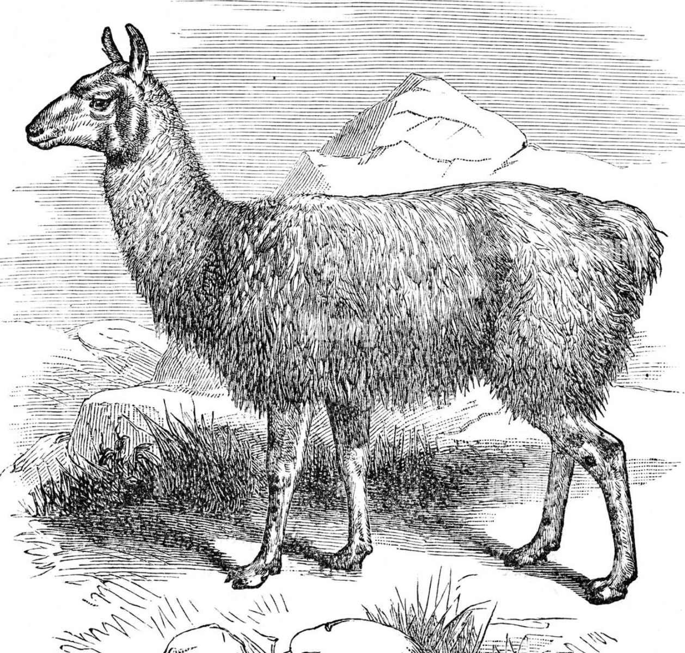

# THE LLAMA MODEL

<span style="text-align: center; width: 100%; font-size: 0.75em">

Commercial open-source [large language model](1712254150-large-language-models.md) created by **Facebook**. It can be used to commercial use-cases and is available as a base model, which can be further fine-tuned for specific tasks.

</span>



## ✾ Introduction

The **llama** foundational model was designed differently from other **[transformers architecture](1712254150-large-language-models.md#-introduction)** based models. It's structure can be summarized as follows:


## ✾ Loading pre trained model

First step is to download a pre-trained model. You can find the model in on the internet in websites like [huggingface](https://huggingface.co/models) or [kaggle](https://www.kaggle.com/datasets). After that, you can use the model to generate texts without the need of training it from the ground up, which is a very expensive and slow process.

First, install all necessary libraries:

```bash
pip install accelerate peft bitsandbytes transformers trl scipy
pip install huggingface_hub
```

Then, create a script, and inport the necessary libraries. It's advised to create a virtual environment to avoid conflicts with other system-wide libraries.

```python
import torch
from transformers import (AutoModelForCausalLM, AutoTokenizer, BitsAndBytesConfig, pipeline)
```

Then, you can load the model by using the `AutoModelForCausalLM` class, that you can find in the `transformers` library. We will use the `pretrained_model_name_or_path` parameter to load the model. We will also use the `BitsAndBytesConfig` class to quantize the model to 4 bits. This will make the model consume less memory and run faster:

```python
model = AutoModelForCausalLM.from_pretrained(
  pretrained_model_name_or_path = "aboonaji/llama2finetune-v2",
    quantization_config = BitsAndBytesConfig(
      load_in_4bit = True,
      bnb_4bit_compute_dtype = getattr(torch, "float16"),
      bnb_4bit_quant_type = "nf4"
    )
  )

model.config.use_cache = False
model.config.pretraining_tp = 1
```

The 4-bit quantization doesn't have impact on the model's performance. The **`bnb_4bit_compute_dtype`** parameter is used to set the data type of the model to **`float16`**, which is a 16-bit floating point number. The **`bnb_4bit_quant_type`** parameter is used to set the quantization type to `nf4`, which results in a 4-bit quantization in the inner linear layers ([artificial-neural-networks](1712240474-artificial-neural-networks.md)).

> For mor information about 4 bit quantization, and QLora, you can check the paper where it was proposed [here](https://arxiv.org/abs/2305.14314).

The two additional configurations bellow are to optimize the execution as well, requiring less memory to run it.

Then, after loading the model, we must load the tokenizer, which must be compatible with the model.

```python
tokenizer = AutoTokenizer.from_pretrained(
    pretrained_model_name_or_path = "aboonaji/llama2finetune-v2",
    trust_remote_code = True
  )

tokenizer.pad_token = tokenizer.eos_token
tokenizer.padding_side = "right"
```

In this code snippet, the `AutoTokenizer` class is used to load the tokenizer. The `pad_token` parameter is used to set the padding token to be equal to the end of sentence token. The `padding_side` parameter is important to set in which side the padding token will be added.

## ✾ Generating text

For text generation, a prompt is necessary. Then a pipeline must be created. The pipeline is a high-level API that allows you to use the model.

```python
user_prompt = "Please tell me about Bursitis"
text_generation_pipeline = pipeline(
  task = "text-generation",
  model = model,
  tokenizer = tokenizer,
  max_length = 300
)
```

Then, having the pipeline, you can generate text by using the following code:

```python
model_answer = text_generation_pipeline(f"<s>[INST] {user_prompt} [/INST]")
print(model_answer[0]['generated_text'])
```

This code will generate a text based on the user prompt. We downloaded the model from huggingface and used the `pipeline` function to generate the text. The `pipeline` function is a high-level API that allows you to use the model.

You can run this code on **google colab** or any other python environment.

## ✾ Fine-tuning LLAMA2 with supervised training

First, you need to download a pre-trained model. In this case, we are going to use [aboonaji/llama2finetune-v2](https://huggingface.co/aboonaji/llama2finetune-v2). Then you will need a dataset. The dataset must comply to the following format:

```html
<s>[INST] what is your name? [/INST] my name is Julia</s>
```

Where `<s>` and `</s>` are the start and end of the sentence, respectively. The `[INST]` and `[/INST]` tags are used to indicate the start and end of the instruction. And the text outside the instruction is the answer to the question.

You can even pass instructions to the system by using the tag `<<SYS>>`:

```html
<s>
  [INST] <<SYS>> you are a good bot that will try to help the user <</SYS>> what
  is your name? [/INST] My name is Julia
</s>
```

For fine tuning, you wil. need a large number of examples. The more examples you have, the better the model will perform.

For example, you could yse this dataset from hugingface: [wiki-medical-terms-llam2-format](https://huggingface.co/datasets/aboonaji/wiki_medical_terms_llam2_format) and train the model to explain medical terms.

To load the training dataset, and configure the training model, you can use the code that follows. The `SFTTrainer` class is used to train the model. The `TrainingArguments` class is used to configure the training process. The `LoraConfig` class is used to configure the training method to be more efficient. Even with this technique the training process used `11 GB` of video memory and `5 GB` of cpu memory:

```python
from transformers import Trainer, TrainingArguments

llama_sft_trainer = SFTTrainer(
  model = model,
  args = TrainingArguments(
    output_dir = "./results",
    per_device_train_batch_size = 4,
    max_steps = 100,
  ),
  train_dataset = load_dataset(path = "aboonaji/wiki_medical_terms_llam2_format", split = "train"),
  tokenizer = tokenizer,
  dataset_text_field = "text",
  peft_config = LoraConfig(
    task_type = "CAUSAL_LM",
    r = 64,
    lora_alpha = 16,
    lora_dropout = 0.1,

  ),
)

llama_sft_trainer.train()
```

The model will be tuned and it can be used to text generation the same way it was described before.

> Remember that your GPU must have enough memory, or else, you will receive this error:
>
> `torch.cuda.OutOfMemoryError: CUDA out of memory. Tried to allocate 32.00 MiB. GP`

## ✾ Fine-tuning LLAMA3 with supervised training

For fine-tuning LLama3, we used [**unsloth**](https://github.com/unslothai/unsloth?tab=readme-ov-file#-installation-instructions), which is a tool to make the training process more feasible and cheap. So, first you will need the following packages:

```bash
pip install torch datasets transformers trl
```

There are additional steps to install **unsloth**. For that follow the instructions on the [github repo](https://github.com/unslothai/unsloth?tab=readme-ov-file#-installation-instructions).

After all packages are installed, you can proceed with the following code to import the model and the tokenizer:

```python
import os

import torch
from datasets import load_dataset
from transformers import TrainingArguments
from trl import SFTTrainer
from unsloth import FastLanguageModel, is_bfloat16_supported

TOKEN = os.getenv("HUGGINGFACEHUB_API_TOKEN")
max_seq_length = 2048
dtype = None
load_in_4bit = True

model, tokenizer = FastLanguageModel.from_pretrained(
    model_name="unsloth/llama-3-8b-bnb-4bit",
    max_seq_length=max_seq_length,
    dtype=dtype,
    load_in_4bit=load_in_4bit,
    token=TOKEN,
)

model = FastLanguageModel.get_peft_model(
    model,
    r=16,
    target_modules=[
        "q_proj",
        "k_proj",
        "v_proj",
        "o_proj",
        "gate_proj",
        "up_proj",
        "down_proj",
    ],
    lora_alpha=16,
    lora_dropout=0,
    bias="none",
    use_gradient_checkpointing="unsloth",
    random_state=3407,
    use_rslora=False,
    loftq_config=None,
)
```

Then, you will need to get the training dataset and configure the training process as follows:

```python

TRAINING_PROMPT = """Below is an instruction that describes a task, paired with an input that provides further context. Write a response that appropriately completes the request.

### Instruction:
{}

### Input:
{}

### Response:
{}"""


EOS_TOKEN = tokenizer.eos_token


def formatting_prompts_func(all_examples):

    instructions = all_examples["instruction"]
    inputs = all_examples["input"]
    outputs = all_examples["output"]

    texts = []
    for instruction, input, output in zip(instructions, inputs, outputs):
        text = TRAINING_PROMPT.format(instruction, input, output) + EOS_TOKEN
        texts.append(text)

    return {"text": texts}


pass


dataset = load_dataset("yahma/alpaca-cleaned", split="train")
dataset = dataset.map(
    formatting_prompts_func,
    batched=True,
)
```

And finally, you can train the model:

```python
trainer = SFTTrainer(
    model=model,
    train_dataset=dataset,
    dataset_text_field="text",
    max_seq_length=max_seq_length,
    tokenizer=tokenizer,
    args=TrainingArguments(
        per_device_train_batch_size=2,
        gradient_accumulation_steps=4,
        warmup_steps=10,
        max_steps=60,  # set "none" for full training
        num_train_epochs=4,
        fp16=not is_bfloat16_supported(),
        bf16=is_bfloat16_supported(),
        logging_steps=1,
        output_dir="outputs",
        optim="adamw_8bit",
        seed=3407,
    ),
)

trainer.train()
```

Finally, you will be able to use the model to generate text:

```python
FastLanguageModel.for_inference(model)

inputs = tokenizer(
    [
        TRAINING_PROMPT.format(
            "List the prime numbers contained within the range.",
            "1-50",
            "",
        )
    ],
    return_tensors="pt",
).to("cuda")

outputs = model.generate(**inputs, max_new_tokens=128, use_cache=True)
tokenizer.batch_decode(outputs)
```

## ✾ Saving the final model

After training you would want to save the model in non-volatile memory. You can do this by using the following code:

```python
model.save_pretrained("lora_model") # Local saving
tokenizer.save_pretrained("lora_model")
```

then you can use this model as follows:

```python
if False:
    from unsloth import FastLanguageModel
    model, tokenizer = FastLanguageModel.from_pretrained(
        model_name = "lora_model", # YOUR MODEL YOU USED FOR TRAINING
        max_seq_length = max_seq_length,
        dtype = dtype,
        load_in_4bit = load_in_4bit,
    )
    FastLanguageModel.for_inference(model) # Enable native 2x faster inference

# alpaca_prompt = You MUST copy from above!

inputs = tokenizer(
[
    alpaca_prompt.format(
        "What is a famous tall tower in Paris?", # instruction
        "", # input
        "", # output - leave this blank for generation!
    )
], return_tensors = "pt").to("cuda")

outputs = model.generate(**inputs, max_new_tokens = 64, use_cache = True)
tokenizer.batch_decode(outputs)

## or

if False:
    # I highly do NOT suggest - use Unsloth if possible
    from peft import AutoPeftModelForCausalLM
    from transformers import AutoTokenizer
    model = AutoPeftModelForCausalLM.from_pretrained(
        "lora_model", # YOUR MODEL YOU USED FOR TRAINING
        load_in_4bit = load_in_4bit,
    )
    tokenizer = AutoTokenizer.from_pretrained("lora_model")
```

There are other ways of saving in different formats:

```python
# Merge to 16bit
if False: model.save_pretrained_merged("model", tokenizer, save_method = "merged_16bit",)
if False: model.push_to_hub_merged("hf/model", tokenizer, save_method = "merged_16bit", token = "")

# Merge to 4bit
if False: model.save_pretrained_merged("model", tokenizer, save_method = "merged_4bit",)
if False: model.push_to_hub_merged("hf/model", tokenizer, save_method = "merged_4bit", token = "")

# Just LoRA adapters
if False: model.save_pretrained_merged("model", tokenizer, save_method = "lora",)
if False: model.push_to_hub_merged("hf/model", tokenizer, save_method = "lora", token = "")
```

## ✾ Conclusion

It's possible to train models in your local machine, but you will need a powerful GPU or else you will get errors like these for **llama3**:

```text
🦥 Unsloth: Will patch your computer to enable 2x faster free finetuning.
Major version: 6
==((====))==  Unsloth: Fast Llama patching release 2024.5
   \\   /|    GPU: NVIDIA GeForce GTX 1080. Max memory: 7.914 GB. Platform = Linux.
O^O/ \_/ \    Pytorch: 2.3.0+cu121. CUDA = 6.1. CUDA Toolkit = 12.1.
\        /    Bfloat16 = FALSE. Xformers = 0.0.26.post1. FA = False.
 "-____-"     Free Apache license: http://github.com/unslothai/unsloth
Special tokens have been added in the vocabulary, make sure the associated word embeddings are fine-tuned or trained.
Unsloth 2024.5 patched 32 layers with 32 QKV layers, 32 O layers and 32 MLP layers.
max_steps is given, it will override any value given in num_train_epochs
==((====))==  Unsloth - 2x faster free finetuning | Num GPUs = 1
   \\   /|    Num examples = 51,760 | Num Epochs = 1
O^O/ \_/ \    Batch size per device = 2 | Gradient Accumulation steps = 4
\        /    Total batch size = 8 | Total steps = 60
 "-____-"     Number of trainable parameters = 41,943,040
  0%|
```

And for **llama2**:

```text
torch.cuda.OutOfMemoryError: CUDA out of memory. Tried to allocate 32.00 MiB. GPU
  0%|          | 0/100 [00:00<?, ?it/s]
```

But **Google Colab** is a good alternative for training models, as it provides a free GPU. You can also use **unsloth** to make the training process faster and more efficient.
