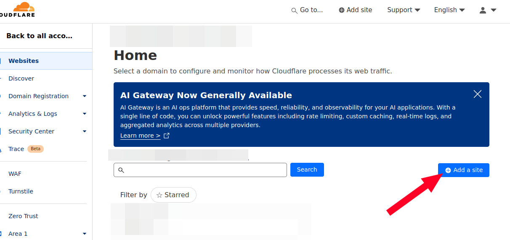
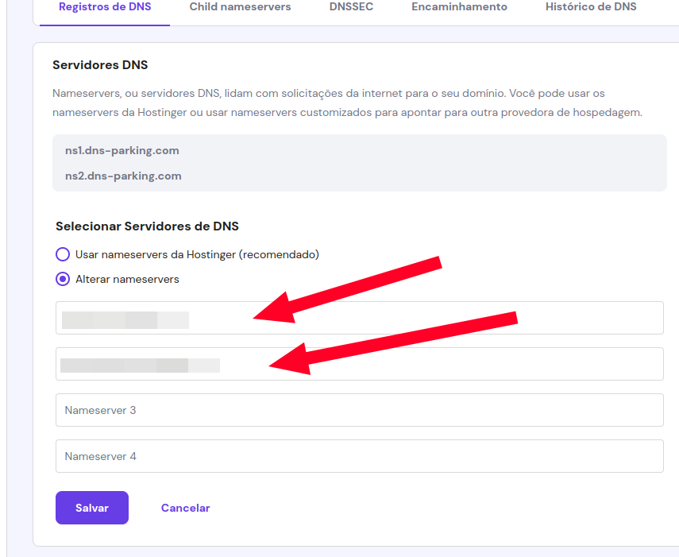
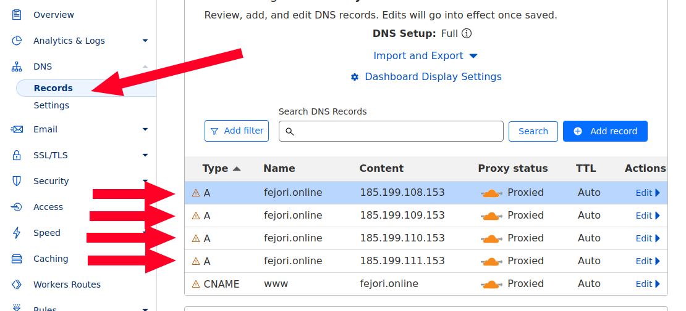
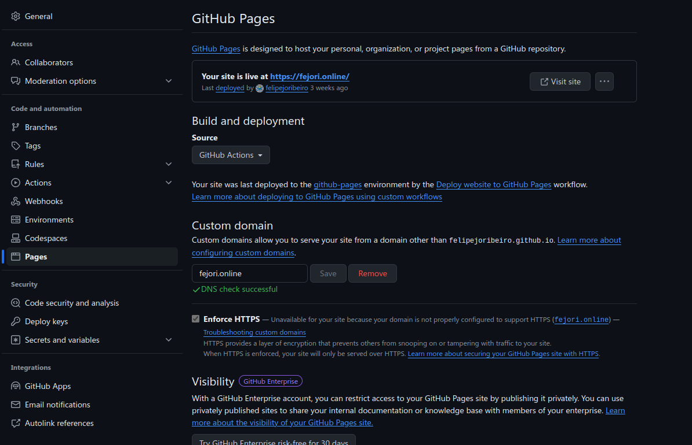
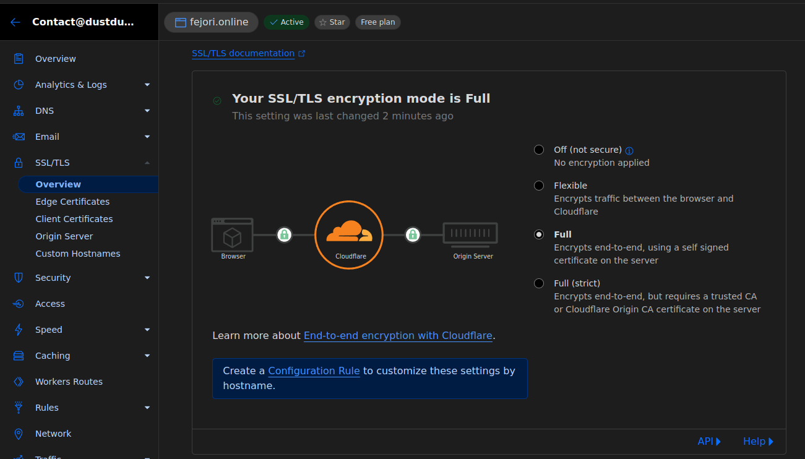

# Github pages plus cloudflare hosting

<span style="text-align: center; width: 100%; font-size: 0.75em">
    
  Hosting pages in **github pages** with custom domain and **HTTPS** provided by **Cloudflare** is a great way to host static pages. Here is a step by step guide on how to do it.

</span>


This solution is amazing, as it is free and has great performance due to the **CDN** provided by **Cloudflare**. Besides that, on **Github Pages** you will have access to the **CI/CD** pipeline with github actions, which is great for deploying your pages. Making this minimal setup a great solution for its simplicity and performance.

## 📑 Configuring the domain

First, press to add a new website in cloudflare, pressing the followig button:



You will, then, select the **free plan**, or the plan that you want to use, depending on your needs. Scan you domain **DNS records** and follow all instructions given, specially the ones related to the **name servers**.

Then, you will need to configure your domain provider to use the **Cloudflare** name servers. This is done in the domain provider dashboard. You will need to change the **name servers** to the ones provided by **Cloudflare**.

> In my case, I use **Hostinger** as my domain provider. The process is very simple, and can be achieved changing these values:
>
> 

After changing the **name servers**, you will need to wait for the **DNS** to propagate. This can take up to 24 hours, but usually it is done in a few minutes.

Now that your domain is pointing to **Cloudflare**, you must configure the **DNS records** in **Cloudflare** to point to your **Github Page**. For that, you must add the following records:



## 📦 Configuring Github pages

In the repository where your static website is hosted, in **Github**, you must click in "settings", and then go to the "pages" section. There you will configure the **custom domain** that you want to use:



After choosing **GitHub actions** to deploy your page, you will have to have an actions file in your repository. This file will be responsible for deploying your page. Here is an example of a **YAML** file that you can use for an **SVELTE** application:

```yaml
name: Deploy website to GitHub Pages

on:
  push:
    branches: "master"

jobs:
  build_site:
    runs-on: ubuntu-latest
    steps:
      - name: Checkout
        uses: actions/checkout@v3

      - name: Install Node.js
        uses: actions/setup-node@v3
        with:
          node-version: 18
          cache: npm

      - name: Install dependencies
        run: npm install

      - name: build
        env:
          BASE_PATH: "fejori.online"
        run: |
          npm run build
          touch build/.nojekyll

      - name: Upload Artifacts
        uses: actions/upload-pages-artifact@v1
        with:
          path: "build/"

  deploy:
    needs: build_site
    runs-on: ubuntu-latest

    permissions:
      pages: write
      id-token: write

    environment:
      name: github-pages
      url: ${{ steps.deployment.outputs.page_url }}

    steps:
      - name: Deploy
        id: deployment
        uses: actions/deploy-pages@v1
```

You must add a **CNAME** file in the root of your repository with the domain that you want to use. This file must contain only the domain name, like this:

```txt
fejori.online
```

Then, you must commit and push your changes to the repository. This will trigger the **Github Actions** to deploy your website.

After the deployment process it's possible that the website is not working properly. This is because the **HTTPS** is not configured yet.

## 🔒 Configuring HTTPS

To configure **HTTPS** in your website, you must go to the **SSL/TLS** section in **Cloudflare** and configure the **SSL** to **Full**. This will make the **Cloudflare** **CDN** to use **HTTPS** to communicate with your website:



## 🎉 Conclusion

that's it! Now you have a static website hosted in **Github Pages** with a custom domain and **HTTPS** provided by **Cloudflare**. This is a great solution for hosting static websites, as it is free and has great performance. Besides that, you have access to the **CI/CD** pipeline with **Github Actions**, which is great for deploying your pages.
