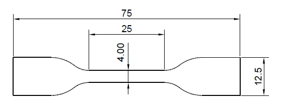
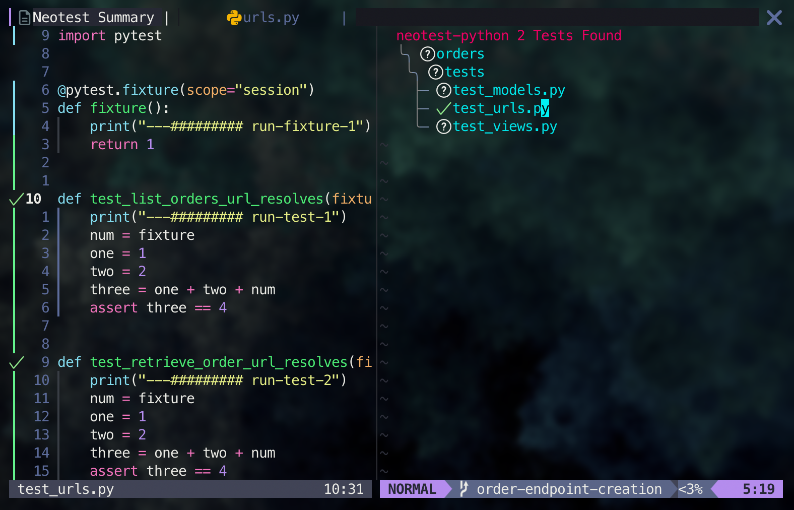

# python-pytets



## Introduction

Unit tests are a fundamental part of developing software. An extensive unit test suite can avoid bugs and enforce good programming practices like writing modular and testable code. In Python, the most popular testing library is `pytest`. It is simple and powerfull and we will cover all it's features in this article.

## Installation

You can install `pytest` using `pip`:

```bash
python -m pip install pytest
```

It's advise to not install it globally, but within a project's [virtualenv](1716862221-python-version-package-management-poetry-pyenv#python-package-and-version-management#virtualenv). You can use poetry or pipenv to manage your project's dependencies localy.

you can also can create the `pytest.ini` file in the root of your project with the following content:

```ini
[pytest]
python_files = test_*.py
addopts = --verbose
```

Here are to options as examples of configuration. The `python_files` option will tell `pytest` to look for files that start with `test_` and end with `.py` to run the tests. The `addopts` option will tell `pytest` to run the tests in verbose mode.

> If you are creating a `django` project, don't forget to install the `pytest-django` package as well. and add the followint line to your `pytest.ini` file:
> ` DJANGO_SETTINGS_MODULE = my_project.settings`

## Deffinition

`pytest` is a testing framework for python which simplifies writing unit tests. Unit tests are functions that test specific parts of your code. They are used to ensure that the behavior of your code is as intended.

## First steps

To create your first test, create a file with the code bellow:

```python
# test_sample.py
def test_sample():
    assert 1 == 1
```

The assert statement is used to validate presumptions in the code. If the expression isn't true, an `AssertionError` will be raised. And that is how `pytest` knows if the test passed or not.

To run the test, you just need to run the following command in the root of your project:

```bash
python -m pytest # vanilla pytest
python -m pytest -s # to show the print statements
python -m pytest -v # to show the verbose output
python -m pytest -k test_sample # to run only the test_sample test
python -m pytest -x # to stop the tests after the first failure
```

It will run all the tests in the project, which is only one in this case.

## Marks

Marks are used to tag tests. They can distinguish tests based on their most important characteristics. Here is an example of how to use marks:

```python
# test_sample.py
import pytest

@pytest.mark.smoke
def test_sample():
    assert 1 == 1

@pytest.mark.regression
def test_sample2():
    assert 2 == 2
```

You can run the tests based on their marks using the `-m` option:

```bash
python -m pytest -m smoke
python -m pytest -m regression
```

There are some built-in marks in `pytest` with various purposes:

- `skip`: skips the test.
- `skipif`: skips the test if a condition is met.
- `xfail`: marks the test as expected to fail.
- `parametrize`: runs the test with different parameters.

## Fixtures

Fixtures are functions that run before and after tests. They are used to setup the environment where the tests will run. If you are working in a `django` project, for example, you can use fixtures to setup the database before running the tests.

Here is an example of simple fixture extending the last given example:

```python
# test_sample.py
import pytest

@pytest.fixture
def setup():
    print("Setup")
    yield 1
    print("Teardown")

def test_sample(setup):
    assert 1 == setup

def test_sample2(setup):
    assert 2 == 2 * setup
```

The `setup` fixture will run before the test and the `teardown` will run after the test. The `yield` keyword is used to separate the setup from the teardown. It will be executed once for each test that is present in the same file. you can use the `scope` parameter to chamge this behavior:

```python
@pytest.fixture(scope="module")
def setup():
    print("Setup")
    yield
    print("Teardown")
```

The `scope` parameter can be set to `function`, `class`, `module` or `session`. The default value is `function`.

- `function`: the fixture will run once for each test in the file.
- `class`: the fixture will run once for each class in the file.
- `module`: the fixture will run once for each file.
- `session`: the fixture will run once for the entire test session.

It's important to note that the `setup` fixture must be referenced as a parameter in the test functions, for it to be available.

## Specialized Tags for django

If you are working with `django`, you can use the `django_db` fixture to setup the database for the tests. Here is an example:

```python
# test_sample.py
import pytest
from my_app.models import MyModel

@pytest.mark.django_db
def test_sample():
    MyModel.objects.create(name="test")
    assert MyModel.objects.count() == 1
```

Here we use the `django_db` fixture to setup a database to be used in the tests. The `MyModel` model is created as defined in the `my_app` app. The `assert` statement checks if the row was created correctly.

You can also setup the database using a fixture:

```python
# test_sample.py
import pytest
from my_app.models import MyModel

@pytest.fixture()
def tmp_user(db):
    user = MyModel.objects.create_user("test")
    return user

def test_sample(tmp_user):
    assert tmp_user.user_name == "test"
```

Interestingly enough, the `db` fixture can't be used in `session` scope, or it will raise an error. For each test the database will be recreated.

## The `conftest.py` file

The `conftest.py` file is used to define fixtures that can be used in multiple test files. It must be in the root of the project. Here is an example:

```python
# conftest.py
import pytest
from my_app.models import MyModel

@pytest.fixture()
def tmp_user(db):
    user = MyModel.objects.create_user("test")
    return user
```

Then it can be accessed in any test file. The pattern tha tis very common in this case is the `factory` pattern. You can create one to initialize a row in the database in various ways, to be used in various tests.

## Better usage

It's important to integrate `pytest` with your code editor for a more streamlined development experience. Most code editors have plugins that can run these tests interactively, showing the results alongside the code itself.



In the exemple above the result of the test can be seen alongside each individual test, and a summary can be seen on the right. Tests can be run individually with a shortcut and the result is shown in the corner. Tests can be run with the debugger as well.
