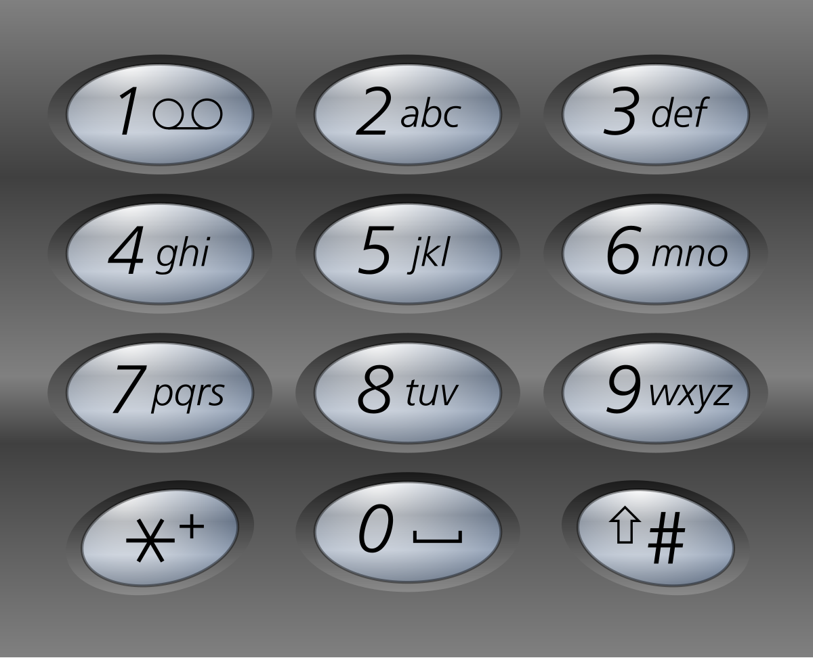

## Problem's summary:

Given a string containing digits from 2-9 inclusive, return all possible letter combinations that the number could represent. Return the answer in any order.

A mapping of digits to letters (just like on the telephone buttons) is given below. Note that 1 does not map to any letters.



Example 1:

Input: digits = "23"
Output: ["ad","ae","af","bd","be","bf","cd","ce","cf"]
Example 2:

Input: digits = ""
Output: []
Example 3:

Input: digits = "2"
Output: ["a","b","c"]

Constraints:

0 <= digits.length <= 4
digits[i] is a digit in the range ['2', '9'].

### My authoral response:

```python
class Solution:
    def letterCombinations(self, digits: str) -> List[str]:
        map = { '2': "abc", '3': "def", '4': "ghi", '5': "jkl", '6': "mno", '7': "pqrs", '8': "tuv", '9': "wxyz" }
        result = []
        for i in range(len(digits) - 1, -1, -1):
            if len(result) == 0:
                [result.append(l) for l in map[digits[i]]]
            else:
                new_result = []
                for l in map[digits[i]]:
                    [new_result.append(l + r) for r in result]
                result = new_result.copy()
        return result
```

- Liked my response more than the ones using recursive functions;

### Other responses:

```python
class Solution:
    def letterCombinations(self, digits: str) -> List[str]:
        res = []
        num_to_letters = {"2":"abc", "3":"def", "4":"ghi", "5":"jkl", "6":"mno", "7":"pqrs", "8":"tuv", "9":"wxyz"}

        def backtrack(i, curStr):
            if len(curStr) == len(digits):
                res.append(curStr)
                return

            for c in num_to_letters[digits[i]]:
                backtrack(i + 1, curStr + c)

        if digits:
            backtrack(0, "")

        return res
```

```python
class Solution:
    def letterCombinations(self, digits: str) -> List[str]:

        if not digits:
            return []

        n = len(digits)

        vals = { '2': 'abc', '3': 'def', '4': 'ghi', '5': 'jkl', '6': 'mno', '7': 'pqrs', '8': 'tuv', '9': 'wxyz'}

        res : list[str] = []

        def dfs(start_index: int, path: list[str]):

            if start_index==n:
                res.append("".join(path))
                return


            for letter in vals[digits[start_index]]:
                path.append(letter)
                dfs(start_index+1,path)
                path.pop()

        dfs(0,[])
        return res

```
