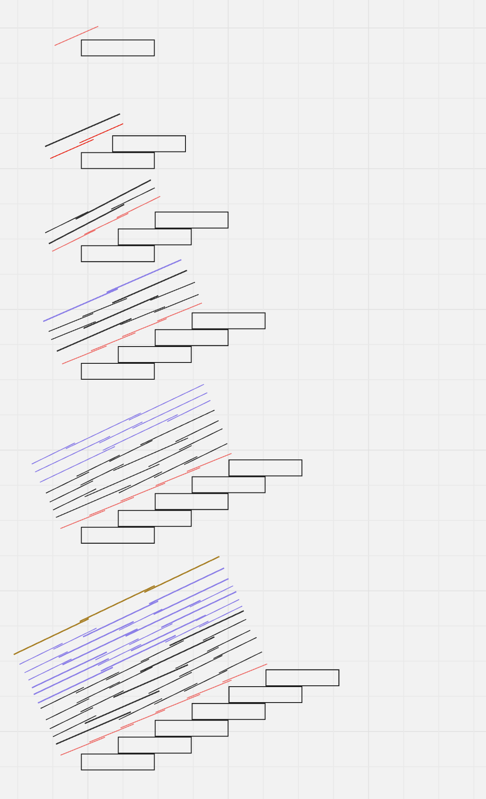

## Problem's summary:

You are climbing a staircase. It takes n steps to reach the top.

Each time you can either climb 1 or 2 steps. In how many distinct ways can you climb to the top?

Example 1:

Input: n = 2
Output: 2
Explanation: There are two ways to climb to the top.

1. 1 step + 1 step
2. 2 steps
   Example 2:

Input: n = 3
Output: 3
Explanation: There are three ways to climb to the top.

1. 1 step + 1 step + 1 step
2. 1 step + 2 steps
3. 2 steps + 1 step

- [ ] Constraints:

1 <= n <= 45

- [ ]

### My authoral response:

Analysing the structure i found that it follows a fribonati pattern:



I'm not sure why though. I grouped the examples by number of two step operations, and i thing that this desuaded me from the real core of the issue. Probably the best approach was to group by route type from the start. I understood the numeric relationship but did not get the logic behind it. I can't consider this problem solved until I understand the numeric behavior.

FINALY found the reason. The reason is that we already calculated all the possible ways of getting to the last step in the last iteration, and we already calculated all the possible ways of getting to the step before it in the iteration before the last. And only ther is one way of getting from those states to the newly introduced step, one step plus all calculated in the last iteration, and a two step operation from the calculated in the iteration before the last. So sum both and you have all possible routes for the current iteration, a two step from the before the last and a one step from the last. That can be applyied to any eteration and it describes the fribonati sequence. Now what is the most efficient way of calculating the fribonati sequence?

```python
class Solution:
    def climbStairs(self, n: int) -> int:
        current = before_last = 0
        last = 1
        for i in range(n):
            current = last + before_last
            before_last = last
            last = current
        return current
```
