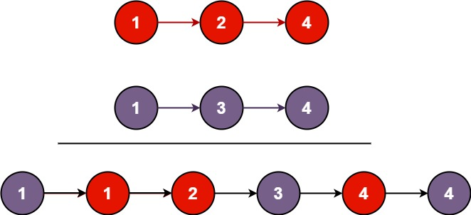

## Problem's summary:

You are given the heads of two sorted linked lists list1 and list2.

Merge the two lists into one sorted list. The list should be made by splicing together the nodes of the first two lists.

Return the head of the merged linked list.

Example 1:



Input: list1 = [1,2,4], list2 = [1,3,4]
Output: [1,1,2,3,4,4]
Example 2:

Input: list1 = [], list2 = []
Output: []
Example 3:

Input: list1 = [], list2 = [0]
Output: [0]

Constraints:

The number of nodes in both lists is in the range [0, 50].
-100 <= Node.val <= 100
Both list1 and list2 are sorted in non-decreasing order.

### My authoral response:

```python
class Solution:
    def appendToLList(self, LList, value):
        if LList.val is None or LList.val == 0:
            LList.val = value
            return LList
        else:
            LList.next = ListNode(
                val=value,
                next=None,
            )
        return LList.next

    def mergeTwoLists(
        self, list1: Optional[ListNode], list2: Optional[ListNode]
    ) -> Optional[ListNode]:
        if list1 is None or list1.val is None:
            return list2
        elif list2 is None or list2.val is None:
            return list1

        response = ListNode()
        cursor = response
        while True:
            if list1 is None and list2 is None:
                return response
            elif list1 is None:
                cursor = self.appendToLList(cursor, list2.val)
                list2 = list2.next
            elif list2 is None:
                cursor = self.appendToLList(cursor, list1.val)
                list1 = list1.next
            elif list1.val >= list2.val:
                cursor = self.appendToLList(cursor, list2.val)
                list2 = list2.next
            else:
                cursor = self.appendToLList(cursor, list1.val)
                list1 = list1.next
```

Great observations from reading other solutions:

- We can change input variable names. Changed from list1 to l1 and list2 to l2;
- We can avoid the null check if we insert the `l1 and l2` in the while condition instead of `True`;
- The condition allows for the first check deletion as well in the start of the while loop;
- Dealing directly with the references without creating new objects is the best approach;
- using tuples to only have one equality operation is interesting;
- memory and speed readings were strange again. Probably due to small testing input samples;

### Best timing solution

```python
class Solution:
    def mergeTwoLists(self, l1: Optional[ListNode], l2: Optional[ListNode]) -> Optional[ListNode]:
        dummy = tail = ListNode(0)
        while l1 and l2:
            if l1.val < l2.val:
                tail.next, l1 = l1, l1.next
            else:
                tail.next, l2 = l2, l2.next
            tail = tail.next
        tail.next = l1 or l2
        return dummy.next
```

### Best memory solution

```python
class Solution:
    def mergeTwoLists(self, list1: Optional[ListNode], list2: Optional[ListNode]) -> Optional[ListNode]:

        head = ListNode()
        current = head

        while list1 and list2:
            if list1.val < list2.val:
                current.next = list1
                current = current.next
                list1 = list1.next
            else:
                current.next = list2
                current = current.next
                list2 = list2.next

        if list1:
            current.next = list1
        elif list2:
            current.next = list2

        return head.next
```
