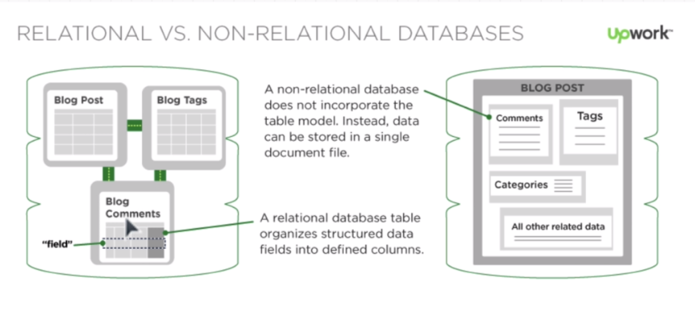

# Introduction to data bases
Every company store data. In order to story the data, common practice is to use a database.
It's very difficult to work with lists and arrays, because you need to iterate to find stuff.
In a database we can organise data in a way that it's usefull for us. For that it was created the Database management system, or DBMS for short. it is a collection of programs that allows access and control of databases and work with data. Also allows controling access of data to certain users.

A DBMS has the objective to allows the server ro read, write, delete or change elements of the database. There is an entire industry of engineers that only work with databases.

There are two types of DBMS that are really popular right now. These two types are **PostgreSQL** and **MongoDB**.

## Relational Databases
They consist of two or more tables with columns and rows. Each row represents a entry and each column represents a specific data. Examples of relational Databases are Oracle, Microsoft SQLserver, PostgreSQL, Teradata, MySQL, sybase, access, apache derby, DB2 IBM, Hive, hypersql, sqllite and sybase. And they all function in a similar manner.

The relation between tables is called schema. The schema must be clearly deffined before any information is added.
If we had twitter wi would have a users table, a tweets table and a following table. There are keys that can identify the elements in a database like primary keys and foreign keys.

SQL is a protocol used to communicate with the database.

## Non Relational Database (NoSQL)
A non relational database let's you create an aplication without defining a schema first. Than you can create tables as you go. Examples are redis, riak, cassandra, couchDB, apache hbase, mongoDB, hypertable. But this creates diversity as there isn't standards. So each one of these have unique ways of accessing data.

The flexibility of NoSQL databases make this category the best for projects which the data requirements are not well known.

MongoDB is document oriented. That is, there is folders that stores tables of information. Each table represents a central entity. So, for example, in twitter, each table would be a user. And the information in it would be the twits, followers and other stuff while the relational database would have just one table with each row as a user, and other tables for twits.

For communicating, there is the MongoDB query language, in contrast to the WQL protocol.

