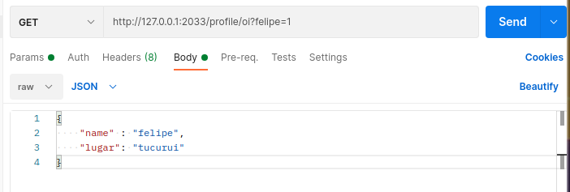

# The RESTful APIs
A `RESTful` API is a web archtectural style. It conssists in a set of rules that determine how the server must react to input http requests attending to some standards. So, when we are talking about communication between servers there is much more flexibilitty than a web client. But those things can be applied in the browser aswell. In this sense the standards are verry important to preserve compatibilitty in the API ecossistem.

It uses these commands to interact with clients:
- `get()` : Receive a resource.
- `put()` : Change the state or update a resource.
- `post()`: Create a resource.
- `delete()`: Delete a resource.

The `url` parameters must make sense. That is, if we call for the url `\profile` with a `delete()` function, we will delete a profile. Other characteristic is that it is stateless in a sense that one call doesn't depend on another. Each call is a independent entity with a end on itself that execute an action. A server doens't need to memorise things, just acess to the database and the rules. 

We can have some informations from the request, as follows:

```Javascript
const express = require('express');

const app = express();

app.use(urlencoded({extended: false}));
app.use(json());

app.get('/profile/:id', (req,res) => {

  console.log(req.query);
  console.log(req.body);
  console.log(req.params);
  console.log(req.headers);

  res.send('Getting root');
})

app.listen(2033);
```

- `req.query` Respond when we do a query command, that goes in the `url`. Like http://127.0.0.1:2033/profile?felipe=1. It returns `{felipr:'1'}`. So it gives access to the query string.
- `req.body` It responds with with data sent in the body of the request, like raw data like `json` or urlencoded.
- `req.headers` Respond with the headers information. You can add information to the header in postman fairly easy.
- `req.params` With this we can see the parameters that are arriving with the url. This is very interesting. One example, if we call `http://127.0.0.1:2033/profile/ola`, this function will return `ola`. And you can have many parameters as you want.

Let's se a request example using `Postman`:


The console outputs the following information:

```
{ felipe: '1' }
{ name: 'felipe', lugar: 'tucurui' }
{ id: 'oi' }
{
  'content-type': 'application/json',
  'user-agent': 'PostmanRuntime/7.26.10',
  accept: '*/*',
  'postman-token': 'a3958c53-5319-408f-b63d-f4def93d6c38',
  host: '127.0.0.1:2033',
  'accept-encoding': 'gzip, deflate, br',
  connection: 'keep-alive',
  'content-length': '49'
}
```
You can control the response status too. This can be done with `res.status(404).send("some text, like not found ")`. So the response will be given with the `404` status of not found and the browser will see that there was an error.

