<div style="text-align:center"> 

```plantuml
!define DARKBLUE
!includeurl https://raw.githubusercontent.com/Drakemor/RedDress-PlantUML/master/style.puml
skinparam {
ArrowColor white

ParticipantFontname Times
ParticipantBorderColor white
ParticipantBackgroundColor #282A36
ParticipantFontSize 12

classFontColor white
classFontName Times
classFontSize 16

ArrowFontName Times
ArrowFontSize 14

ActorBackgroundColor #282A36
ActorBorderColor white
ActorFontColor white
ActorFontSize 16
ActorFontName Times

backgroundColor null
}

actor User
participant "First Class" as A
participant "Second Class" as B
participant "Last Class" as C

User -> A: DoWork
activate A

A -> B: Create Request
activate B

B -> C: DoWork
activate C
C --> B: WorkDone
destroy C

B --> A: Request Created
deactivate B

A --> User: Done
deactivate A


```
</div>

Aqui temos algum UML básico.

<div style="text-align:center">

```plantuml
@startuml
!define DARKBLUE
!includeurl https://raw.githubusercontent.com/Drakemor/RedDress-PlantUML/master/style.puml
skinparam {
ArrowColor white

ParticipantFontname Times
ParticipantBorderColor white
ParticipantBackgroundColor #282A36
ParticipantFontSize 12

classFontColor white
classFontName Times
classFontSize 16

ArrowFontName Times
ArrowFontSize 14

ActorBackgroundColor #282A36
ActorBorderColor white
ActorFontColor white
ActorFontSize 16
ActorFontName Times

backgroundColor null
}

class vishe {
    - int eita;
    + float baner;
    # string aloha;
    ~ private foo();
    public bash();
}

note left: mensage with\ngreat information

class eita {
    int credo;
    float ola;
    mycon();
    figma();
}

class ola {
    int credo;
    float aloo;
    hello();
    putin();
}

class epa {
    int favor;
    float noite;
    hello();
    putin();
}

ola <- eita
vishe <- ola
vishe <.. epa

@enduml

```
</div>

Aqui podemos ver balões com informações sobre os atores envolvidos.

<div style="text-align:center" >

```plantuml
@startuml
!define DARKBLUE
!includeurl https://raw.githubusercontent.com/Drakemor/RedDress-PlantUML/master/style.puml
skinparam {
ArrowColor white

ParticipantFontname Times
ParticipantBorderColor white
ParticipantBackgroundColor #282A36
ParticipantFontSize 12

classFontColor white
classFontName Times
classFontSize 16

ArrowFontName Times
ArrowFontSize 14

ActorBackgroundColor #282A36
ActorBorderColor white
ActorFontColor white
ActorFontSize 16
ActorFontName Times

backgroundColor null
}

User << Human >>
:Main Database: as MySql << Application >>
(Start) << One Shot >>
(Use the application) as (Use) << Main >>

User -> (Start)
User --> (Use)

MySql --> (Use)
@enduml

```
</div>

Aqui está um diagrama de mapa mental.

<div style="text-align:center" >

```plantuml

@startmindmap

!define DARKBLUE
!includeurl https://raw.githubusercontent.com/Drakemor/RedDress-PlantUML/master/style.puml
skinparam {
ArrowColor white

ParticipantFontname Times
ParticipantBorderColor white
ParticipantBackgroundColor #282A36
ParticipantFontSize 12

classFontColor white
classFontName Times
classFontSize 16

ArrowFontName Times
ArrowFontSize 14

ActorBackgroundColor #282A36
ActorBorderColor white
ActorFontColor white
ActorFontSize 16
ActorFontName Times

backgroundColor null
}

* Debian
** Ubuntu
*** Linux Mint
*** Kubuntu
*** Lubuntu
*** KDE Neon
*** Paula
** LMDE
** SolydXK
** SteamOS
** Raspbian with a very long name
*** <s>Raspmbc</s> => OSMC
*** <s>Raspyfi</s> => Volumio
@endmindmap

```
</div>

Gráfico de tempo:


<div style='text-align:center'>

```plantuml

@startuml

!define DARKBLUE
!includeurl https://raw.githubusercontent.com/Drakemor/RedDress-PlantUML/master/style.puml
skinparam {
ArrowColor white

ParticipantFontname Times
ParticipantBorderColor white
ParticipantBackgroundColor #282A36
ParticipantFontSize 12

classFontColor white
classFontName Times
classFontSize 16

ArrowFontName Times
ArrowFontSize 14

ActorBackgroundColor #282A36
ActorBorderColor white
ActorFontColor white
ActorFontSize 16
ActorFontName Times

backgroundColor null
}

robust "Web Browser" as WB
concise "Web User" as WU

@0
WU is Idle
WB is Idle

@100
WU is Waiting
WB is Processing

@300
WB is Waiting
@enduml

```
</div>

Gráfico de tempo:


<div style='text-align:center'>


</div>

```plantuml

@startuml

!define DARKBLUE
!includeurl https://raw.githubusercontent.com/Drakemor/RedDress-PlantUML/master/style.puml
skinparam {
ArrowColor white

ParticipantFontname Times
ParticipantBorderColor white
ParticipantBackgroundColor #282A36
ParticipantFontSize 12

classFontColor white
classFontName Times
classFontSize 16

ArrowFontName Times
ArrowFontSize 14

ActorBackgroundColor #282A36
ActorBorderColor white
ActorFontColor white
ActorFontSize 16
ActorFontName Times

backgroundColor null
}

@startgantt
-- test01 --
[task01] lasts 1 days
note bottom
'note left
memo1 ...
memo2 ...
explanations1 ...
explanations2 ...
end note
[task02] lasts 1 days
[task01] -> [task02]
note bottom
'note left
memo1 ...
memo2 ...
explanations1 ...
explanations2 ...
end note
-- test02 --
[task03] as [t3] lasts 7 days
[t3] -> [t4]
@endgantt


@enduml

```

Mais uma de tempo


<div style='text-align:center'>

```plantuml

@startuml

!define DARKBLUE
!includeurl https://raw.githubusercontent.com/Drakemor/RedDress-PlantUML/master/style.puml
skinparam {
ArrowColor white

ParticipantFontname Times
ParticipantBorderColor white
ParticipantBackgroundColor #282A36
ParticipantFontSize 12

classFontColor white
classFontName Times
classFontSize 16

ArrowFontName Times
ArrowFontSize 14

ActorBackgroundColor #282A36
ActorBorderColor white
ActorFontColor white
ActorFontSize 16
ActorFontName Times

backgroundColor null
}

|#Lavender|RM ACOSS|
start
fork
:KICKOFF RM ACOSS;

fork again
|#AliceBlue|CP ou délégataire|
:KICKOFF CP;

fork again
|#Gainsboro|DEV CDS|
:KICKOFF CDS;
end fork


Stop
@enduml

```
</div>
