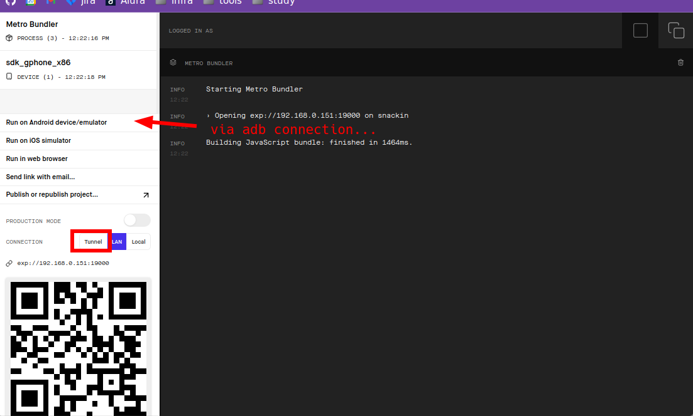
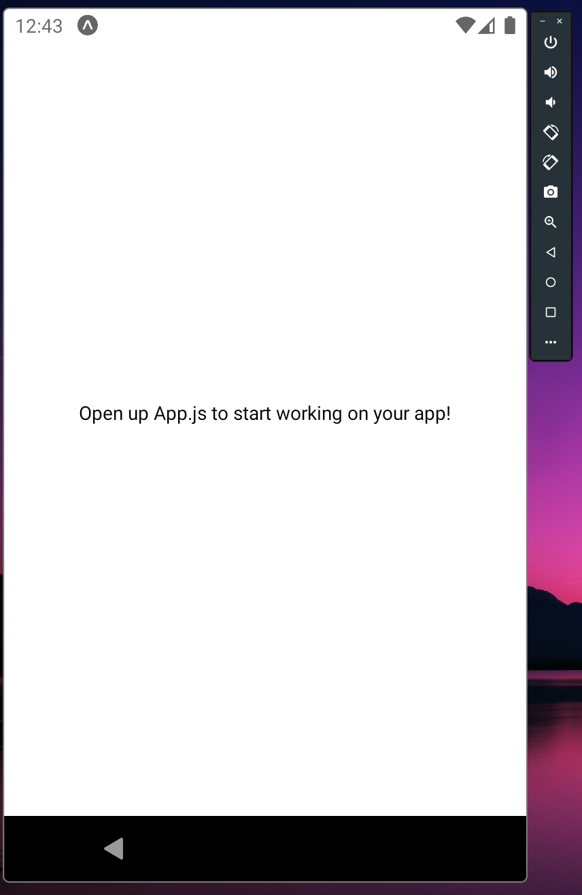

# React Native from scratch
Here we will learn **React native** development from scratch. This technology enables the developer to create mobile **apps** for **android** and **IOS** without having a **MAC** or running the slow and heavy **Android Studio** or **Xcode**.

## React Native history
Applications are created to run in a specific operating system. In this regard, **react-native** inovates by being able to evelop for both simultaneously. Apple asks for the developer to program on **Object-C** and android asks for **java** for development. Then apple came with a new proposition, the **Swift** programming language and android came with **Kotlin**.

Then, the idea came along about using the browser to create web apps capable of running on both plataforms, like project **Cordova** and **Ionic** which use **WebView** which is a browser page on your phone that looks like an app. The problem with this is that the smartphone is optimized to run well with native code, so the browser ones were slowerr. Besides the fact that a bunch of resources ar laking.

Last but not least, we had the **Native-like** options. What it does is converting high level code to compiled native code. **React-native** is based on this idea, which is based on **javascript**. Flutter is another option that was developed by google.

## Why react native?
- It has a big community: It has a big community of towsants of developers. With great library availability of libraries and tutorials. The comunity ends up being a great language resource.
- Bit companies are using it: Facebook, Uber eats, discord, instagran and skype. So this technology is greatly employable and present in the industry.
- Cross Platform: And this is the game changer bit brought by **react-native**. It is perfectly extensible so you can develop in **java** and **swift** if you need deeply performant code.

## Building blocks of mobile development
The most basic building block of native mobile development are views. You can put one view inside another and they can be images, rectangles or text. In **React Native** the core components are translated to views as well. Some basic options are `Text`, `View`, `Image`, `ScrollView` and `TextInput`. And React native convert these to native view groups (Android) and ui groups (ios) or div (web). So this is the workflow for **React-Native**, creating code that will be translated in native code. The **React-native** lib gives you these basic components plus API's, like the `Dimensions` which gives the dimension of the celphone screen.

**React** is important as well, so that we can use the state, props, components and all that stuff like **jsx**.

## How things are runned in react native
There are two parts of a running app, the `view` parte which is aesthetic and the logic part. When the user takes an action inside the app there is logic that is runned inside the phone. The visual bit is convertied to native counterparts, but the logic is runned inside a javascript virtual machine which is called javascript engine. This engine is responsible to make the comunication between your javascript code and the phone operating system.

This reveals an ugly side of react native. It will never be as lean and performant as a pure native solution as it must be shipped with it's virtual machine and the logic must pass through an abstraction layer to reach the operating system.

There are ways to optimize this behavior. **Hermes** is an android optimized runtime. You can use it in place of javascript core.

Interestling enough there isn't **css** for mobile, which is a web language. **React-native** styles are implemented with javascript. They try to emulate the behavior of **css** but they aren't nothing like it. All dimensions in react-native are dimensionless. They represent dpi-independent pixels. So it tries to figure it alt the best way of showing things based on the screen dimensions and the dpi. It uses flex-box by default as well.

## It's important to know React before learning react-native
It's important to have the component concept fresh in your mind. These self contained visual and logic apparatus are the core idea behind modern UI development. Is the separation of concerns down to the back button arrow.

React was a great way of dealing with DOM in a more comprehensive way. The virtual DOM is a godsent feature which buries forever jquery...

## Installing the development environment
Looking at the documentation of **React Native** we can see that there are two options for building the project, **react native CLI** or **Expo CLI**.

- **React Native CLI**: Depends on other native developing tools to build the project.
- **Expo CLI**: Don't depend on other tools for building the project. Expo enables updating an app without the necessity of downloading a new version.

Here we will learn how to use expo to build our projects.

### Installing EXPO CLI
To install the tool the developer will need **Node** installed on his machine. for that he can access the official website or download through official repositories:

https://nodejs.org/

On linux:

```
sudo apt install nodejs=14.17.2-deb-1nodesource1
```

The version used on this course was **14.17.2**. You can check yours with the `node --version` command. You can update node with npm too with the `npm install -g node@14.17.2` command.

To install expo you can issue the following command:

```
npm install --global expo-cli@4.7.2
```

You must install the **expo app** in your phone as well. Here are some links:

- https://play.google.com/store/apps/details?id=host.exp.exponent
- https://apps.apple.com/br/app/expo-go/id982107779

You can install emulators as well but you can use your celphone without worries.

### Expo limitations
There are some features that expo doesn't support yet. You can check a little list bellow:

- The bluetooth APIs, WebRTC and sales integrated with playStore and App Store wasn't implemented yet.
- Audio playing in the background when the application is closed isn't supported yet.
- Extremely lean applications must be native, as **expo** introduces heavy code into the project.
- Some proprietary and native libs that ain't used too much aren't available on **EXPO** to avoid too heavy apps.
- Push notification services, with exception to **EXPO notification service** would need mor manual and complex implementations.
- The minimum supported **SDK** are Android 5 and iOS 10.
- The free version can generate queue when building for production.
- The maximum size that can be updated through **OTA** is 50 MiB.
- Native alterations are necessary to publish to target audiences younger than 13 years.

You can check more in depth information on the following link:
https://docs.expo.io/introduction/why-not-expo/

### Creating a new project.
To create a new project with **Expo** you can issue the following command:

```
expo init <project-name>
```

A prompt will appear asking about what template to use, you can chose the blank or even start your project with **typescript** just navigate the menu that appears.

The interesting thing about **expo** is that if there are other people that uses the expo client, they can access your app wile you create it without the need of creating binaries. This is awesome for testing purposes. But the cost is that expo becomes a coupling layer between your app and **android** or **IOS**. So it's kind like **electron**. The way that works is by expo exposing a complete **API** and exposing this api to your javascript code. 
At any time you can make the project native again with the following command:

```
expo run:android
```

This way you will create a normal react-native app. If you build your app with **Expo** you will notice that there isn't an **Android** directory, for example. Very strange indeed. But with the code snippet above these directories are created.

### Running your project
Now that you have a functional development environment, and a project created, now we will run our project. You can do this with the following command:

```
yarn start
```

If you check your `project.json` file you will see that the command that is runned is `expo start` as configured by the `expo init` command. It will prompt an browser page with various options and the same thing will appear in your terminal. You can run the program in an simulation or you can scan the **qrcode** with your expo app and see it in your app. Even without being in the same **LAN** choosing the **Tunnel** connection option.



It will open in your emulator after that:



## Components and adding content
First, let's analyse the `app.js` file that was created by expo with the `expo init` command: 

```jsx
export default function App() {
  return (
    <View style={styles.container}>
      <Text>Hello there</Text>
      <StatusBar style="auto" />
    </View>
  );
}
```

Notice the `<StatusBar style="auto" />` component. That was imported from `expo-status-bar` so expo exposes some components for us to use.

On **React Native** we use **Jsx** that is javascript with **html** tags, for short. To use those we must `import React from 'react';` as usual in **React** web development.

Notice the `export default function App(){}`. That allows the developer, when importing the component. Not having to do something like `import { componente } from 'file';`, because, with the **default** you can use just `import component from 'file';`

This is a **function** component. In **React** web development you can use **classes** as well, but this isn't advised as it makes it impossible to use some modern **react-native** features. But it's still possible to use then. You can check more about this in the documentatino:

https://reactnative.dev/docs/getting-started#function-components-and-class-components

### Children and arguments of component
React exposes the children of a component to us when calling the function and other parameters. We can take this content with the following code:

```Javascript

<Texto {} style={text:{}, textBold:{}} >Hello there</Texto>

export default function Texto({ children, style , object1, object2}) {
	let defaultStyle = styles.text;

	if (style?.fontWeight === 'bold'){
		defaultStyle = styles.textBold;
	}

	return <Text style={[style, defaultStyle]}>{children}</Text>
}
```

Notice that the style aims to take the `style={<object>}` object. So we can analyse what comes in it and react accordingly.

Notice that `?` in `style?.fontWeight`... It is important so that if `style` doesn't exist it will not give an error, it will simply return null. So it first checks if style exist to only then search for the `fontWeight` key.

The **children** object comes with the elements inside the component.

With the right knowledge of components it is possible to organize your code very well by dividing responsibilities in an orderly and structured manner.

Interesting info about `mocks`: they are objects created to substitute functions or `API` calls. So they substitute real data and are used mostly on automated testing...

## Styles and making things pretty
Different from **css** **html** styles, to mobile **react-native** we use style objects that are translated to css afterwards. This approach is interesting as it enables a component to have its own styles independent from the global context. Which differentiates it from importing **CSS** which is always global.

For more details check the following link:
https://blog.logrocket.com/styling-in-react-4-ways-style-react-app/

Here is an example of style:

```javascript
const estyles = StyleSheet.create({
	topo: {
		width: "100%",
		height: 578 / 768 * width,
	},
	title: {
		width: "100%",
		position: "absolute",
		textAlign: "center",
		fontSize: 16,
		lineHeight: 26,
		color: "white",
		fontWeight: "bold",
		padding: 16
	}
});
```

To use these styles one must reference it from within the file or by importing from another one (a `styles` files for sure). And to use the style on a component the developer must reference the object as follows:

```Jsx
<Text style={estyles.title}>Detalhes da cesta</Text>
```
It's important to know that **react-native** uses `display: flex` by default in all the document.

You can install fonts very easily with **expo** by issuing the following command:

```bash
expo install expo-font @expo-google-fonts/montserrat 
```

So, by doing this command you will install **montserrat** font.

Then you must load the font, by doing this in `App.js` inside the `App` function, after importing it with `import { useFonts, Montserrat_400Regular, Montserrat_700Bold } from '@expo-google-fonts/montserrat';`:

```Javascript
const [fontCarregada] = useFonts({
	"MontserratRegular": Montserrat_400Regular,
	"MontserratBold": Montserrat_700Bold,
});

if (!fontCarregada) {
	return <View />
}
```
In this case it will wait to the font to load to print the screen. Then you can just use the `fontFamily: "MontserratRegular"` inside an style object to use it.

## Some React components
Here we will see some components that comes with **React Native**. You can access them by importing from `import {...} from 'react-native';`.

- **Button**: Very limited. It uses the default layout from **iOS** or **Android** and doesn't allow too much customization. A better alternative is to use `TouchableOpacity`. the best way of handling this is by creating a custom `button` component with this one:

```Javascript
<Button title="me aperte"/>

<TouchableOpacity onPress={() => {console.log("hey")}}>
	<Texto>{ botao }</Texto>
</TouchableOpacity>
```

- **Text**: Very important component, as, in react native, the developer can't leave bare text within the `Jsx` without being surrounded by a `Text` component.

- **ScrollView**: It's a view type that enables scroll by dragging the finger on the screen.

- **FlatList**: Component optimized for lists. That can handle big numbers of elements. This component can't be inside a ScrollView.


